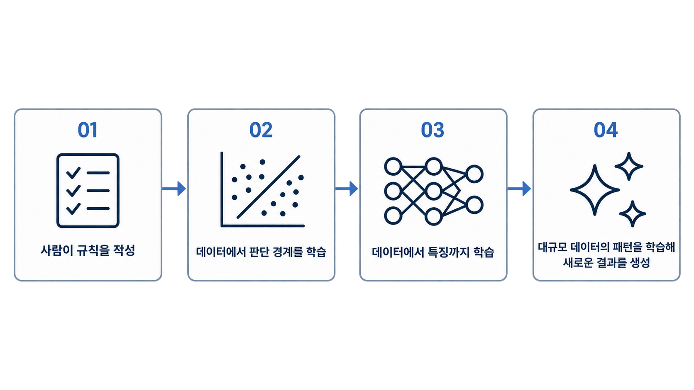
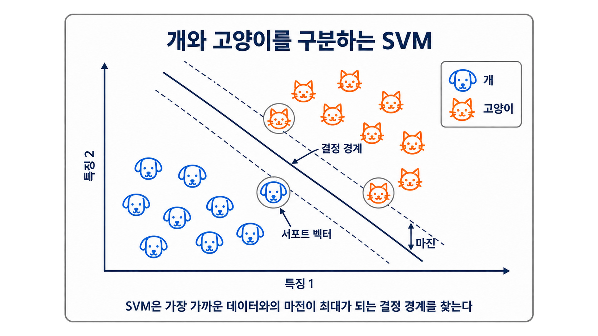
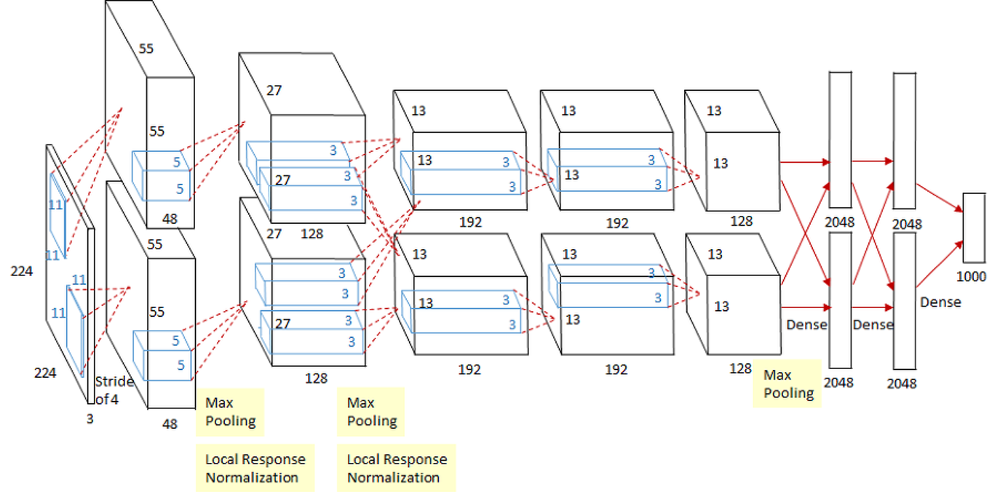
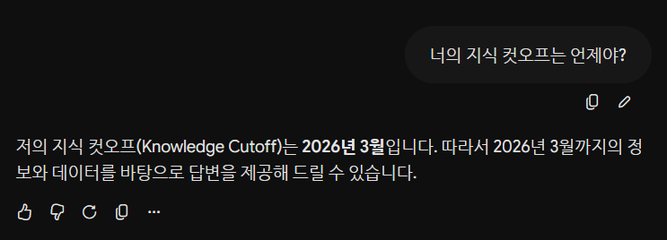
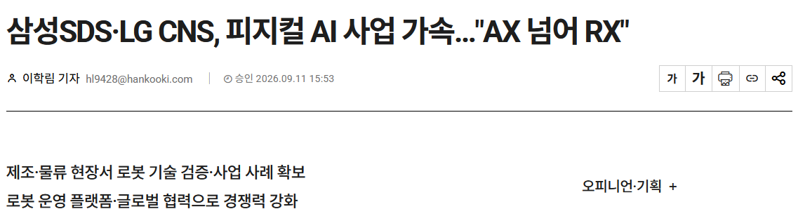

# 들어가며

2026년 현재 AI는 질문에 답하고, 코드를 작성하고, 이미지를 만들며, 여러 도구를 연결해 사용자가 원하는 작업을 무리 없이 수행합니다. 불과 몇 년 전까지만 해도 아직 AI는 갈 길이 멀다고 했던 사람들도 AI가 없으면 일을 할 수 없는 상황이 놓이게 되었는데요. 이처럼 생성형 AI는 어느 날 갑자기 등장한 것이 아닙니다.

사람의 규칙을 실행하던 프로그램에서 데이터의 특징 자체를 학습하는 딥러닝에 이르기까지 수년 간의 발전을 거듭한 끝에 탄생한 결과물입니다.

이 글에서는 AI의 발전 과정에서 주요했던 사건을 기점으로 발전 흐름을 살펴볼 예정입니다. (어려운 수식과 용어는 최대한 제외하고 말이죠.) 이어서 생성형 AI와 대규모 언어 모델(Large Language Model, LLM)이 어떻게 동작하고 무엇을 잘하며 어디에서 실패하는지 설명할 것입니다. 마지막에는 생성형 AI에서 더 나아간 피지컬 AI와 이러한 변화 속에서 프롬프트가 갖는 의미를 정리하겠습니다.

# 규칙 기반에서 생성까지

AI의 역사를 하나의 이미지로 압축하면 다음과 같이 표현할 수 있습니다.



이 흐름이 의미하는 것은 이전 기술이 사라지고 새 기술로 완전히 대체됐다는 뜻은 아닙니다. 규칙 기반 시스템, 지도 학습, 딥러닝, 생성형 모델은 지금도 해결하고자 하는 문제에 따라 함께 사용되고 있습니다. 달라진 것은 사람이 모델에 직접 지정해야 하는 정보의 범위와 모델이 처리할 수 있는 문제의 폭으로 변화하였습니다.

## ELIZA

가장 먼저 만들어진 AI는 무엇일까요? 이는 1964년으로 거슬러 올라갑니다. 당시 Joseph Weizenbaum이 발표한 `ELIZA`는 최초의 자연어 대화 프로그램이었습니다. 미리 정의한 분해 및 재구성 규칙에 따라 문장을 변환해 응답했는데, 유명한 `DOCTOR` 스크립트는 실제 상담가처럼 환자의 말을 되묻는 방식으로 대화를 이끌어 갔습니다.

하지만 문장의 의미나 환자의 감정을 학습하는 것은 아니었기 때문에 어떤 입력 패턴에 어떤 출력 패턴을 연결할지 미리 설계되었던 것이죠. 이러한 `ELIZA`의 의미는 성능보다는 상호작용에 있었습니다. 단순한 패턴 매칭만으로도 사용자가 시스템에 이해와 의도를 부여할 수 있다는 점을 시사했거든요. 자세한 동작 방식은 Weizenbaum의 [1966년 원 논문](https://doi.org/10.1145/365153.365168)에서 확인할 수 있습니다.

## SVM

앞선 `ELIZA`의 사례에서는 규칙 기반 시스템으로 개발자가 판단 조건을 직접 작성했었습니다. 이 방식의 문제점은 모든 사례를 정의할 수도 없고 처리할 수도 없다는 것입니다. 그래서 `지도 학습`을 통해 정답이 표시된 데이터로부터 입력과 출력의 관계를 학습하기 시작합니다. 1990년대부터 널리 알려진 `Support Vector Machine(SVM)`이 이러한 변화를 보여주는 대표 알고리즘입니다.

먼저 두 종류의 데이터를 분류한다고 가정해 봅시다. `SVM`은 두 집단 사이를 선 하나 긋고 분류하는 것이 아닌 결정 경계와 가장 가까운 데이터, 즉 서포트 벡터와의 여유인 마진(margin)을 크게 만드는 경계를 찾는 알고리즘이었습니다.



무슨 소리인지 모르시겠나요? 😅. 중요한 것은 서포트 벡터와 결정 경계 그리고 마진입니다. 두 집단을 분류할 때 한쪽으로 결정 경계가 쏠린다면 데이터가 조금만 움직여도 분류 결과가 바뀌겠죠? 그래서 마진이 넓게 두어 약간의 변화에도 경계를 넘지 않아 더욱 안전한 분류를 할 수 있게 됩니다. 사실 중요하게 봐야 할 데이터는 경계 근처에 있는 데이터들입니다. 이를 서포트 벡터라고 하는데 이를 기준으로 마진의 폭을 결정하게 됩니다. 비선형 문제에서는 커널을 사용하거나 평면을 통해 입력을 더 높은 차원 공간에서 다루기도 하는데, 오늘은 여기까지만 설명하겠습니다.

`SVM`의 핵심은 사람이 모든 분류 규칙을 열거하지 않아도 된다는 점입니다. 대신 사람은 입력할 데이터의 특징과 정답 레이블을 준비해야 합니다. 기계가 분류 경계를 학습하지만, 이때까지도 여전히 사람의 설계에 크게 의존하는 형태였습니다. 기본 아이디어와 일반화 특성은 [Cortes와 Vapnik의 논문](https://doi.org/10.1007/BF00994018)에 정리돼 있습니다.


## AlexNet

이미지 분류에서는 오랫동안 윤곽선, 모서리, 질감처럼 유용할 것으로 예상되는 특징을 사람이 입력했습니다. 2012년 발표된 `AlexNet`은 대규모 이미지 데이터와 GPU를 활용해 깊은 합성곱 신경망(Convolutional Neural Network, CNN)을 학습함으로써 관행처럼 이어져 오던 방식을 바꾸게 됩니다.

`AlexNet`은 약 120만 장의 고해상도 이미지를 1,000개의 클래스로 분류하도록 학습됐습니다. 합성곱 계층이 저수준의 시각 패턴부터 더 복잡한 형태까지 계층적으로 표현하고, 마지막 계층이 이를 분류에 사용합니다. 연구진은 두 개의 GPU를 사용해 모델을 학습했고, ReLU, 데이터 증강, 드롭아웃 등을 조합해 구현하게 됩니다. 



이는 대규모 데이터, 충분한 연산량, 신경망의 조합이 특징 공학의 상당 부분을 학습에 옮길 수 있음을 보여주게 되었고 해당 분야는 급속도로 발전하게 됩니다. 구체적인 구조와 실험 결과는 [AlexNet 논문](https://papers.nips.cc/paper/4824-imagenet-classification-with-deep-convolutional-networks.pdf)에서 볼 수 있습니다.

## 생성형 AI

이전까지는 전통적인 지도 학습 모델을 살펴보았습니다. 지도 학습은 특정 입력에 대해 정답을 예측합니다. 스팸 여부, 이미지 분류, 이탈 가능성처럼 출력될 내용이 명확하다는 것입니다. 이 방식의 문제점은 무엇일까요? 모델을 다른 문제에 적용하기 위해서는 새로운 데이터와 별도의 학습 과정이 필요하다는 것입니다.

생성형 모델은 데이터의 분포를 학습하고 그 분포에 속할 법한 새로운 샘플을 만듭니다. 언어 모델의 경우 앞에 놓인 `토큰(처리할 문자 단위)`을 바탕으로 다음 토큰의 확률 분포를 예측합니다. 이 단순해 보이는 과정을 방대한 텍스트에 적용하면 요약, 번역, 질의응답, 코드 생성처럼 다양한 작업을 하나의 모델로 처리할 수 있게 됩니다.

이처럼 생성형 AI는 대규모 사전 학습을 중심으로 여러 학습 방법을 조합한 결과입니다. GPT-3 연구는 하나의 자기회귀 언어 모델이 별도의 가중치 업데이트 없이 프롬프트에 포함된 예시만으로 여러 작업을 수행하는 Few-shot 특성을 체계적으로 보여줍니다. 이 연구가 시사하는 바는 지도 학습이 필요 없는 것이 아닌 충분히 큰 사전 학습 모델은 프롬프트 속 예시만으로 새로운 작업 형식을 어느 정도 즉석에서 따라 할 수 있다는 점을 입증하게 되었습니다. 관련 실험은 [GPT-3 논문](https://papers.neurips.cc/paper/2020/hash/1457c0d6bfcb4967418bfb8ac142f64a-Abstract.html)에서 확인할 수 있습니다.

# LLM

LLM은 수많은 파라미터를 가진 언어 모델입니다. 모델마다 세부 구조와 학습 방법은 다르지만, 현대 LLM의 다수는 2017년 제안된 `Transformer` 계열 구조를 기반으로 합니다. Transformer는 순환 구조 없이 Attention을 중심으로 시퀀스를 처리해 병렬 학습에 유리한 구조를 제시합니다. 해당 구조와 실험은 [Attention Is All You Need](https://papers.nips.cc/paper/7181-attention-is-all-you-need.pdf)에 설명되어 있습니다.

## LLM 구조

자세한 내용은 시리즈의 다른 글로 작성할 예정입니다. 지금은 짧게 소개해 보도록 하겠습니다.

### 1. 토큰화

모델은 문장을 그대로 읽지 않습니다. 텍스트를 단어, 단어 조각, 문자 등 모델에서 설정한 토큰으로 나누게 됩니다. 각 토큰은 정수 ID 값으로 변환됩니다.

### 2. 임베딩과 위치 정보

정수 ID 값은 의미 관계를 계산할 수 있는 고차원 벡터로 만드는 임베딩 과정을 거치게 됩니다. 같은 단어라도 문장 내 위치에 따라 역할이 달라질 수 있기 때문에 위치 정보도 함께 반영합니다.

### 3. Self-Attention

현재 토큰을 해석할 때 문맥 안의 다른 토큰을 얼마나 참고할지 계산합니다. 각 토큰에서는 Query, Key, Value를 이용해 관련도를 구하게 되고, 관련도가 높은 정보에 더 많은 가중치를 부여하게 됩니다. 자세한 내용은 이후 게시글에서 설명하도록 하겠습니다.

### 4. Transformer Block

어텐션의 결과는 Feed Foward Network를 통과하고, 잔차 연결과 정규화가 적용되는데 이러한 블록을 여러 층 쌓으면 모델은 복합전인 표현이 가능해집니다. 무슨 소리인지 모르겠죠? 나중에 다시 설명하겠습니다.

### 5. 토큰 예측

이렇게 만들어진 어휘 집합 전체에 대한 확률 분포가 만들어지게 됩니다. 모델은 여기에서 다음 토큰을 선택하게 되는데 중요한 점은 문맥상 이어질 토큰을 예측하는 것입니다. 즉, 해당 토큰이 사실인지는 보장되지 않는다는 것입니다.

## LLM 한계

LLM은 범용성이 높지만, 구조적인 한계도 가집니다. 실제 서비스에서는 모델의 결함이 아닌 시스템 설계 조건으로 다루는 것이 맞습니다.

### 환각

LLM은 다음 토큰을 관련도가 높은 순으로 배치한다고 했습니다. 그러므로 문법적으로 자연스럽고 단정적인 오답을 만들 수 있습니다. 우리가 AI가 답변을 이상하게 한다는 느낌을 받는 것은 바로 여기서 오는 것입니다. 이와 관련되어 OpenAI 역시 GPT-4의 환각과 추론 오류를 명시했습니다. [GPT-4 Technical Report](https://cdn.openai.com/papers/gpt-4.pdf)

### 지식 컷오프



모델의 파라미터에 저장된 지식은 사전 학습 데이터의 범위와 시점에 제한됩니다. 실시간으로 모든 데이터를 학습할 수 없기 때문입니다. 따라서 최신 정책, 가격, 라이브러리 버전처럼 자주 변하는 정보는 모델 내부 지식만으로 답하면 예전 데이터를 기준으로 답변할 가능성이 올라갑니다.

### 컨텍스트 윈도우

Context Window는 한 번의 요청에서 모델이 참고할 수 있는 토큰 범위입니다. 윈도우가 커지면 더 많은 문서를 입력할 수 있지만, 모든 정보를 같은 정확도로 활용한다는 뜻은 아닙니다. [Lost in the Middle](https://aclanthology.org/2024.tacl-1.9/) 해당 연구를 보면 관련 정보의 위치에 따라 검색, 질의응답 성능이 달라질 수 있다고 합니다. 긴 문서를 무작정 붙이는 것보다 필요한 내용을 검색해 제공하고, 지시, 근거, 출력 형식을 구분해 핵심 조건을 명확하게 하는 것이 효과적입니다.

# Prompt

AI에게 무엇을 질문할 것인지 정확히 아는 것은 매우 중요합니다. 앞의 LLM 한계에서 살펴본 내용을 바탕으로 우리가 어떤 목표를 달성해야 하는지 어떤 정보를 근거로 삼고 어떤 제약을 지켜야 하는지를 AI에게 말해주어야 합니다. 이를 `프롬프트 엔지니어링(Prompt Engineering)`이라고 합니다.

좋은 프롬프트는 보통 다음 요소를 명시합니다.

1. 목표: 무엇을 만들어야 하는가
2. 컨텍스트: 판단에 필요한 배경과 입력 데이터는 무엇인가
3. 제약: 사용하면 안되는 정보나 반드시 지켜야 하는 조건은 무엇인가
4. 출력 형식: 결과를 어떤 구조로 반환해야 하는가
5. 검증 기준: 좋은 결과인지 어떻게 판단할 것인가

우리가 자주 사용하는 "다음 코드를 리뷰해줘"보다는 다음과 같은 형식으로 요청하면 더 일관된 결과를 만듭니다.

```text
아래 TypeScript 코드를 리뷰해 줘.

목표:
- 런타임 오류와 데이터 손실 가능성을 찾는다.

컨텍스트:
- Node.js 22 환경에서 실행된다.
- 입력은 외부 API에서 오므로 null일 수 있다.

출력:
- 문제 위치, 영향, 수정안을 표로 작성한다.
- 스타일 취향은 제외하고 실제 결함만 보고한다.
- 확실하지 않은 내용은 가정이라고 표시한다.
```

두 프롬프트의 차이는 길이가 아니라 `모호성`의 크기입니다. 모델은 사용자의 숨은 의도를 직접할 수 없기 때문에 결과를 바꾸는 조건을 컨텍스트에 포함해야 합니다. 반대로 관련 없는 자료를 과도하게 넣어도 핵심 근거가 묻힐 수 있기 때문에 주의해야 합니다.

# Next, Physical AI

생성형 AI가 텍스트와 이미지 같은 디지털 결과를 만드는 데 집중했다면, `피지컬 AI`는 센서로 현실을 인식하고 물리적 환경에서 행동하는 시스템을 가리킵니다. 자율주행차, 물류 로봇, 산업용 로봇, 휴머노이드 등이 대표적인 피지컬 AI라고 할 수 있습니다.



LLM은 다음 토큰을 잘못 생성하더라도 큰 문제는 없지만, 로봇의 잘못된 행동은 실제 충돌이나 설비 손상으로 이어질 수 있기 때문에 주의가 필요합니다. 현실의 데이터를 충분히 수집하기 어렵고 실패 비용도 크기 때문에 실제 물리 기반 시뮬레이션과 합성 데이터가 중요 학습 수단으로 활용됩니다. NVIDIA 역시 피지컬AI의 물리 세계를 인식하고 이해하며 행동하는 자율 시스템의 관점을 설명하고 안전하고 통제된 학습 환경으로 물리 기반 시뮬레이션을 강조합니다. [NVIDIA Physical AI 개요](https://www.nvidia.com/en-gb/glossary/generative-physical-ai/)

하지만 피지컬AI가 생성형 AI의 뒤를 잇는 단일하고 확정적인 산업 단계라고 단정하기는 힘듭니다. 그래도 현재로서는 생성 모델, 월드 모델, 시뮬레이션, 로보틱스가 결합하는 유력한 발전 방향으로 보는 것은 확실합니다.

# 마무리

`ELIZA`는 사람이 작성한 규칙만으로도 대화의 인상을 만들 수 있었습니다. SVM을 통해 규칙 기반에서 데이터 기반으로 발전했고 AlexNet은 특징 추출까지 딥러닝 영역으로 옮겨갔습니다. 이후 Transformer와 대규모 자기지도 학습은 하나의 모델이 자연어 지시를 통해 여러 생성 작업을 할 수 있는 기반을 만들었습니다.

하지만 LLM의 본질은 여전히 문맥에 따른 확률적 예측입니다. 유창함은 정확성의 증거가 아니며, 완벽한 기억을 보장하지 못합니다. 그래서 우리가 하는 질문은 정확해야합니다. 앞으로 AI가 발전하여 물리 세계로 확장될 수록 이 원칙은 더욱 더 중요해질 것입니다.

## 참고 자료

- Joseph Weizenbaum, [ELIZA—A Computer Program for the Study of Natural Language Communication Between Man and Machine](https://doi.org/10.1145/365153.365168), 1966.
- Corinna Cortes, Vladimir Vapnik, [Support-Vector Networks](https://doi.org/10.1007/BF00994018), 1995.
- Alex Krizhevsky, Ilya Sutskever, Geoffrey E. Hinton, [ImageNet Classification with Deep Convolutional Neural Networks](https://papers.nips.cc/paper/4824-imagenet-classification-with-deep-convolutional-networks.pdf), 2012.
- Ashish Vaswani et al., [Attention Is All You Need](https://papers.nips.cc/paper/7181-attention-is-all-you-need.pdf), 2017.
- Tom B. Brown et al., [Language Models are Few-Shot Learners](https://papers.neurips.cc/paper/2020/hash/1457c0d6bfcb4967418bfb8ac142f64a-Abstract.html), 2020.
- OpenAI, [GPT-4 Technical Report](https://cdn.openai.com/papers/gpt-4.pdf), 2023.
- Nelson F. Liu et al., [Lost in the Middle: How Language Models Use Long Contexts](https://aclanthology.org/2024.tacl-1.9/), 2024.
- NVIDIA, [What Is Physical AI?](https://www.nvidia.com/en-gb/glossary/generative-physical-ai/).