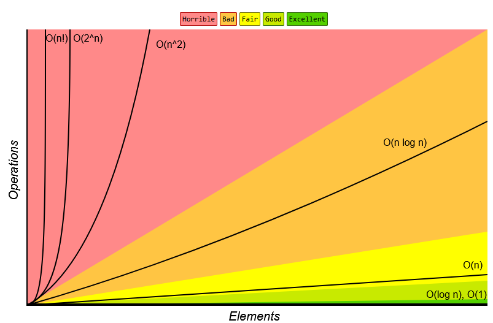

# 들어가며

이 게시글을 시작으로 "알고리즘 풀자" 시리즈 (이하 알고풀자)를 적어보자 합니다.

저는 그냥 프로그래머 1에 지나지 않는 보통 사람입니다만, 다른 누군가에게 도움이 될 수 있겠죠?

게시글을 보시면서 오류가 있거나 이상한 부분이 있다면 언제든 알려주세요. (매너있는 지적 환영)

시작하겠습니다.

---

# 1. 알고리즘이란?

알고리즘은 어떠한 문제가 주어졌을 때, 그 문제를 해결하는 일련의 과정을 의미합니다.

예를 들어, 

> 민수는 여자친구와의 데이트 약속에 늦어서 최대한 빨리 약속 장소에 도착해야 합니다. 
>
> 다음 3가지 방법으로 이동해야 합니다.
>
> 1. 버스 + 지하철
> 2. 버스 + 도보
> 3. 도보 + 지하철
>
> 각 방법마다 소요시간이 주어질 때, 최대한 빨리 도착하는 방법을 선택하세요.

어떠신가요? 코드가 떠오르시나요? 중요한 점이 모든 케이스에 대한 코드는 같은 과정을 통해 정확한 답을 내야한다는 것입니다.

# 2. 알고리즘의 성능 표기 방법

만약 우리가 작성한 알고리즘 코드가 결과를 도출하는데 24시간이 걸린다면 문제가 있을겁니다. 이는 알고리즘 실행시간을 고려하지 않았기 때문인데요.

컴퓨터의 자원은 한정적이고 처리속도 역시 (언어, 컴파일러, 사양) 등 여러가지 요소에 의해 결정되기 때문입니다.

알고리즘이 한 줄씩 실행될 때마다 결과를 출력하기 위해 몇 번의 연산이 이루어지나, 즉 성장률이 나옵니다.

이러한 성장률을 `점근적 표기법(Asymptotic Notation)` 이라고 부릅니다.

점근적 표기법은 다음 세가지로 구분합니다.

1. 최상의 경우 : 빅오메가 표기법 (Big-Ω)
2. 평균의 경우 : 빅세타 표기법 (Big-θ)
3. 최악의 경우 : 빅오 표기법 (Big-Ο)

평균으로 표기하면 가장 정확하고 좋겠지만, 평가하기가 까다롭습니다. 그래서 최악의 경우인 빅오를 사용하는데, 이는 알고리즘의 최악의 경우만 판단하여 평균과 가까운 성능으로 예측하기 쉽기때문입니다.

# 3. 빅오 표기법(Big-O)

빅오 표기법에는 시간 복잡도와 공간 복잡도가 있는데, 특수한 경우를 빼곤 시간 복잡도만 고려하면 됩니다.

> 현대의 메모리 발전에 따라 공간 복잡도의 중요도는 낮아졌습니다.



## 시간 복잡도

시간 복잡도는 다른 말로 알고리즘의 성능입니다. 시간 복잡도가 상수 1에 가까울 수록 성능이 좋다는 의미이죠. 그렇다면 이 시간은 프로그램이 시작되고 종료될 때까지의 실행시간을 의미할까요?

아닙니다. 정확히는 알고리즘을 수행하기 위해 프로세스가 수행해야하는 연산을 수치화 한 것인데요. 이는 앞서 말했던 여러가지 변수(언어, 컴파일러, 사양)에 따라 편차가 달라지므로 명령어 수행횟수만 고려한답니다.

시간 복잡도를 볼 때 중요하게 보는 것은 N의 단위입니다. (N을 표기할 때는 계수와 상수 부분을 제외시킵니다.)

1. O(1) : 상수 시간
2. O(logN) : 로그 시간
3. O(N) : 선형 시간
4. O(N * LogN) : 선형 로그 시간
5. O(N^2) : 제곱 시간
6. O(2^N) : 지수 시간
7. O(N!) : 팩토리얼 시간
8. O(V+E) : 그래프 시간(특수)

이렇게 8가지로 나눌 수 있습니다.

그런데 실제 코딩 테스트 문제를 보면, 제한시간 1초 혹은 2초 이런식으로 표현되어 있는데, 이는 최대 데이터 수를 대입했을 때 연산이 1억번 이하로 마치게 되어야합니다.

> 왜 1억번이냐면 대부분의 현대 컴퓨터는 1초에 1억번의 연산 능력을 가지고 있습니다.

## 시간 복잡도 계산

제가 알고리즘에 대해 공부하면서 가장 신기했던게 __'이건 로그N 만큼 걸리네'__ , __'이건 N만큼 걸리겠어'__ 를 코드만 보고 바로 판단하는 부분이었습니다. 

그래서 그 부분에 대해서 조금 팁을 드리고자 합니다. 물론 정확한건 계산을 해야되겠지만, 어느정도 유추할 수 있는 방법입니다.

### O(1)

핵심 아이디어: 한 번의 실행으로 결과가 도출되는 알고리즘

상수 시간은 매우 쉬운 편입니다. 반복적으로 계산이 이루어지는 부분이 없다고 보시면 됩니다.

__대표적인 예제:__

```cpp
int Sum(int a, int b)
{
    return a + b;
}

```

### O(N)

핵심 아이디어: 인덱스 0 부터 N-1까지의 반복 한 번으로 결과가 도출되는 알고리즘

선형 시간은 범위가 주어지고 그 범위를 한 번만 순회해서 결과를 출력하는 방식입니다.

__대표적인 예제:__

```cpp

int Solution(vector<int> Arr)
{
    int Sum = 0;
    for (int i = 0; i < Arr.size(); ++i) { // 인덱스 0부터 N-1까지 순회한다.
        Sum += Arr[i]; // Arr의 Index 값을 더해준다.
    }
    return Sum;
}
```

### O(logN)

핵심 아이디어: 한 번 실행마다 탐색해야 할 범위가 절반(또는 일정한 비율)으로 줄어드는 알고리즘

로그 시간은 순회마다 범위가 절반으로 줄어드는 방식입니다.

__대표적인 예제:__

```cpp
bool BinarySearch(const vector<int>& arr, int target)
{
    int left = 0;
    int right = arr.size() - 1;

    while (left <= right) {
        int mid = left + (right - left) / 2; // 중간 지점
        if (arr[mid] == target) {
            return true;
        }
        
        // 중간값이 타겟보다 작으면, 왼쪽 절반을 버린다.
        if (arr[mid] < target) {
            left = mid + 1;
        } 
        // 중간값이 타겟보다 크면, 오른쪽 절반을 버린다.
        else {
            right = mid - 1;
        }
    }
    // while 루프가 한 번 돌 때마다 탐색 범위가 절반으로 줄어듭니다.
    // N개의 원소를 전부 탐색하는 게 아니라, log₂(N)번 만에 탐색이 끝납니다.
    return false;
}
```

### O(N * LogN)

핵심 아이디어: O(N)번 반복하는데, 반복문 안에서 O(logN)의 작업을 수행하는 알고리즘

선형 로그 시간은 선형 시간과 로그 시간을 합친 알고리즘으로, N명의 학생을 키 순서대로 줄 세운다고 했을 때 이미 정렬된 줄의 어디에 들어가야 할지 빠르게 찾아야 합니다. 이 '빠르게 찾는 과정'이 앞 선 이진 탐색과 비슷한 O(logN) 이고, N명의 학생에 대해 반복하므로 O(N * LogN)이 걸립니다.

```cpp
void Sort(vector<int>& arr)
{
    for (int i = 0; i < n; ++i)
    {
        BinarySearch(...);
    }
}
```

### O(2^n)

핵심 아이디어: 입력 N개에 대해 각각의 요소가 두 가지(혹은 그 이상) 선택지를 가지고 있고, 가능한 모든 조합을 탐색하는 알고리즘

지수 시간은 N개의 재료가 있을 때, 만들 수 있는 모든 피자 조합을 구하는 것과 같습니다. 각 재료마다 '넣는다' 또는 '안넣는다' 2가지 선택지가 있죠. 재료가 N개면 총 2 x  2 x ... x 2 (N번) 2^N 가지 조합이 나옵니다.

```cpp
// 집합의 모든 부분집합을 구하는 재귀 함수
// n개의 원소가 있을 때, 각 원소를 포함하거나/포함하지 않거나 2가지 선택이 존재합니다.
void generateSubsets(int k, int n, vector<int>& current_subset) 
{
    if (k == n) {
        // 하나의 부분집합 완성
        return;
    }

    // 1. k번째 원소를 포함하지 않는 경우
    generateSubsets(k + 1, n, current_subset);

    // 2. k번째 원소를 포함하는 경우
    current_subset.push_back(k);
    generateSubsets(k + 1, n, current_subset);
    current_subset.pop_back();
}
```

### O(V+E)

핵심 아이디어: V(정점) 와 E(간선)로 이루어진 그래프 자료구조를 탐색할 때 사용되는 알고리즘

그래프 시간은 모든 정점을 한 번씩 방문하고, 모든 간선을 한 번씩 검사하는 방법입니다.

```cpp
// 인접 리스트로 그래프가 주어졌을 때의 BFS
void bfs(int start_node, int V, const vector<vector<int>>& adj) 
{
    vector<bool> visited(V + 1, false);
    queue<int> q;

    q.push(start_node);
    visited[start_node] = true;

    // 큐가 빌 때까지 반복 -> 모든 정점은 최대 한 번만 큐에 들어갑니다. (V번)
    while (!q.empty()) {
        int u = q.front();
        q.pop();

        // 현재 정점과 연결된 모든 간선을 검사합니다.
        // 이 for문은 알고리즘 전체를 통틀어 모든 간선의 수(E)만큼 실행됩니다.
        for (int v : adj[u]) {
            if (!visited[v]) {
                visited[v] = true;
                q.push(v);
            }
        }
    }
}
```

---

# 마무리

이렇게 첫 시리즈 게시물이 끝났습니다. 시간 복잡도에 대해 조금 알게되셨나요? 마지막 계산 부분에서 다루지 않은 시간 복잡도 역시 개인적으로 찾아보셨으면 좋겠습니다. 감사합니다.