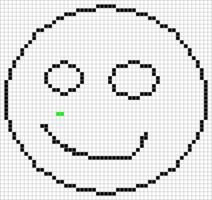
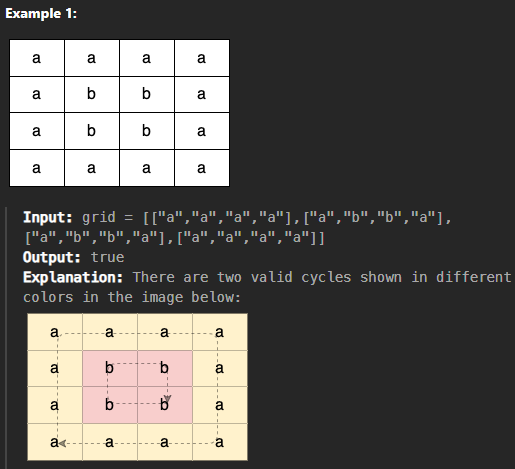
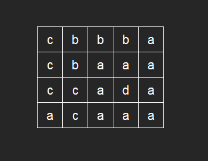

# 들어가며

알고리즘 풀자 시리즈를 계획하고 거의 몇 개월이 흘러버렸습니다. 한창 코테 준비하면서 정리해놨던 개념들이 포트폴리오 제작하면서 점점 희미해져가네요. 그래서 오랜만에 준비했습니다. 알고풀자 2번째 게시글 Flood-Fill 알고리즘입니다.

---

# 1. Flood-Fill 이란?

`Flood-Fill(플러드 필)` 알고리즘은 우리가 흔히 그림판의 **페인트통(채우기)** 기능을 구현할 때 사용하는 대표적인 알고리즘입니다.

주어진 시작점에서 출발하여, 연결된 같은 색상의 영역을 모두 새로운 색상으로 칠하거나 탐색하는 방식입니다. 주로 2차원 배열 상에서 상하좌우 4방향 또는 대각선을 포함한 8방향으로 퍼져나가며 동작하게 됩니다.



인터넷에 해당 알고리즘을 찾아보시면 대게 DFS와 BFS, 2가지 방법으로 설명하고 있습니다. 2가지 모두 알아보도록 하겠습니다.

---

# 2. 알고리즘

## 기본 원리

알고리즘의 기본 원리는 다음과 같습니다.

1. 시작점: 탐색을 시작할 좌표
2. 탐색 색상: 현재 시작점의 색상. 이 색상과 같은 칸만 탐색합니다.
3. 변경할 색상: 새롭게 칠할 색상. (탐색 색상 != 변경할 색상)
4. 방향 배열: 상하좌우로 이동하기 위한 좌표의 변화량

위의 기본 원리를 바탕으로 직접 코드로 구현해보도록 하겠습니다.

## DFS

DFS는 아시다시피 재귀 함수를 사용하여 한 방향으로 끝까지 간 다음, 더 이상 갈 곳이 없으면 돌아와 다른 방향으로 탐색하는 방식입니다.

```cpp
// 상, 하, 좌, 우 이동을 위한 배열
int dx[4] = {-1, 1, 0, 0};
int dy[4] = {0, 0, -1, 1};

void dfs(vector<vector<int>>& grid, int x, int y, int targetColor, int newColor) {
    int rows = grid.size();
    int cols = grid[0].size();

    // 1. 현재 칸의 색상을 새 색상으로 변경
    grid[x][y] = newColor;

    // 2. 상하좌우 4방향 탐색
    for (int i = 0; i < 4; i++) {
        int nx = x + dx[i];
        int ny = y + dy[i];

        // 3. 배열 범위를 벗어나지 않는지 확인
        if (nx >= 0 && nx < rows && ny >= 0 && ny < cols) {
            // 4. 다음 칸의 색상이 대상 색상과 같다면 재귀 호출
            if (grid[nx][ny] == targetColor) {
                dfs(grid, nx, ny, targetColor, newColor);
            }
        }
    }
}

void floodFillDFS(vector<vector<int>>& grid, int startX, int startY, int newColor) {
    int targetColor = grid[startX][startY];
    
    // 시작 색상과 바꿀 색상이 같다면 불필요한 연산 방지 (무한루프 방지)
    if (targetColor != newColor) {
        dfs(grid, startX, startY, targetColor, newColor);
    }
}
```

구현이 직관적이고 코드 길이가 짧습니다. 그러나 만약 영역의 크기가 너무 클 경우 Stack Overflow가 발생할 경우가 있기 때문에, 코딩 테스트 시에는 주의가 필요합니다. 저는 보통 (500x500) 사이즈로 잡고 하는데 이보다 큰 크기는 BFS를 사용합니다.

## BFS

BFS는 `Queue`를 사용하여 시작점에서 가까운 곳부터 파도가 퍼져나가듯 층별로 탐색하는 방식입니다.

```cpp
// 상, 하, 좌, 우 이동을 위한 배열
int dx[4] = {-1, 1, 0, 0};
int dy[4] = {0, 0, -1, 1};

void floodFillBFS(vector<vector<int>>& grid, int startX, int startY, int newColor) {
    int rows = grid.size();
    int cols = grid[0].size();
    int targetColor = grid[startX][startY];

    // 시작 색상과 바꿀 색상이 같다면 종료
    if (targetColor == newColor) return;

    // BFS를 위한 큐 생성 (좌표를 담기 위해 pair 사용)
    queue<pair<int, int>> q;
    
    // 시작점 세팅
    q.push({startX, startY});
    grid[startX][startY] = newColor; // 큐에 넣을 때 방문 처리(색상 변경)를 해야 중복 큐 삽입을 막음

    while (!q.empty()) {
        // 큐에서 현재 좌표를 꺼냄
        int cx = q.front().first;
        int cy = q.front().second;
        q.pop();

        // 4방향 탐색
        for (int i = 0; i < 4; i++) {
            int nx = cx + dx[i];
            int ny = cy + dy[i];

            // 범위를 벗어나지 않고, 대상 색상과 일치한다면
            if (nx >= 0 && nx < rows && ny >= 0 && ny < cols) {
                if (grid[nx][ny] == targetColor) {
                    grid[nx][ny] = newColor; // 색상을 변경하고
                    q.push({nx, ny});        // 큐에 삽입
                }
            }
        }
    }
}
```

안정적으로 넓은 영역을 칠할 수 있어서 DFS보다 더 선호됩니다. 보통 DFS보다 BFS를 자주 사용합니다.

---

# 3. 심화 알고리즘

가장 기본적인 Flood-Fill 알고리즘은 DFS 혹은 BFS를 제대로 이해만 하고 있다면 어려운 문제가 아닙니다. 코딩 테스트에 있어서 어려운 점이 심화적인 부분인데요, 이번에는 **사이클(순환)** 상태인 Flood-Fill을 어떻게 처리 해야하는 지 알아보도록 하겠습니다.

## Cycle Flood-Fill



사이클 플러드 필에서 기억해야 할 점은 **현재 이동한 노드의 이전 노드를 기억하는 것**입니다. 즉, Parent Node가 누구인지 알고 있어야 합니다.

사이클이 생기는 상황은 **탐색 중 이미 방문한 노드를 만났는데 그 노드가 직전에 방문한 노드가 아닌 경우**이기 때문입니다.

예를 들면 `A -> B -> C -> D` 노드 순으로 탐색 중이라고 해봅시다.
- 마지막 D 지점에서 상하좌우 탐색을 진행일 때: 
    - `노드 C`가 탐색됨: D의 직전 노드이므로 `노드 D` 가 출발한 곳임.
    - `노드 A`가 탐색됨: D의 직전 노드가 아니므로 사이클이 생성됨.



코드를 통해 살펴보겠습니다.

```cpp
class Solution {
    // 4방향 탐색을 위한 배열
    int dx[4] = {1, -1, 0, 0};
    int dy[4] = {0, 0, 1, -1};
    
    // DFS 함수 (현재 좌표 x, y / 직전 좌표 px, py / 찾아야 할 글자 target)
    bool dfs(vector<vector<char>>& grid, vector<vector<bool>>& visited, int x, int y, int px, int py, char target) {
        // 현재 노드 방문 처리
        visited[x][y] = true;
        
        // 4방향 탐색
        for (int i = 0; i < 4; i++) {
            int nx = x + dx[i];
            int ny = y + dy[i];
            
            // 그리드 범위를 벗어나지 않고
            if (nx >= 0 && nx < grid.size() && ny >= 0 && ny < grid[0].size()) {
                
                // 같은 글자(target)인 경우에만 이동
                if (grid[nx][ny] == target) {
                    
                    // 경우 A: 아직 방문하지 않은 노드라면 깊이 탐색 계속 진행
                    if (!visited[nx][ny]) {
                        // 다음 탐색 시 직전 노드(px, py) 자리에 현재 노드(x, y)를 넘겨줌
                        if (dfs(grid, visited, nx, ny, x, y, target)) {
                            return true; // 안쪽에서 사이클을 찾았다면 즉시 true 반환
                        }
                    } 
                    // 경우 B: 이미 방문한 노드인데, 직전 노드(px, py)가 아니라면? -> 사이클 발견!
                    else if (nx != px || ny != py) {
                        return true;
                    }
                }
            }
        }
        
        return false; // 이 경로에서는 사이클을 찾지 못함
    }
    
public:
    bool containsCycle(vector<vector<char>>& grid) {
        int m = grid.size();
        int n = grid[0].size();
        
        // 방문 여부 체크 배열
        vector<vector<bool>> visited(m, vector<bool>(n, false));
        
        // 그리드의 모든 노드를 시작점으로 검사
        for (int i = 0; i < m; i++) {
            for (int j = 0; j < n; j++) {
                
                // 아직 방문하지 않은 노드에 대해서만 DFS 시작
                if (!visited[i][j]) {
                    
                    // 맨 처음 시작점은 '직전 노드'가 없으므로 px=-1, py=-1 로 넘김
                    if (dfs(grid, visited, i, j, -1, -1, grid[i][j])) {
                        return true; // 하나라도 사이클이 있으면 최종 정답은 true
                    }
                }
            }
        }
        
        return false; // 모든 곳을 뒤졌으나 사이클이 없음
    }
};
```

---

# 마무리

이렇게 Flood-Fill에 대해서 알아보았습니다. 가장 기본적인 구조는 DFS와 BFS를 그대로 계승한 것이기 때문에 어려운 것이 없는데, 심화부분을 제대로 들어가면 어떻게 알고리즘을 구성해야 할 지 머리가 아픕니다. 그래도 한 번 이렇게 정리를 하면 다음에는 좀 더 빠르게 떠올릴 수 있겠죠? 감사합니다.