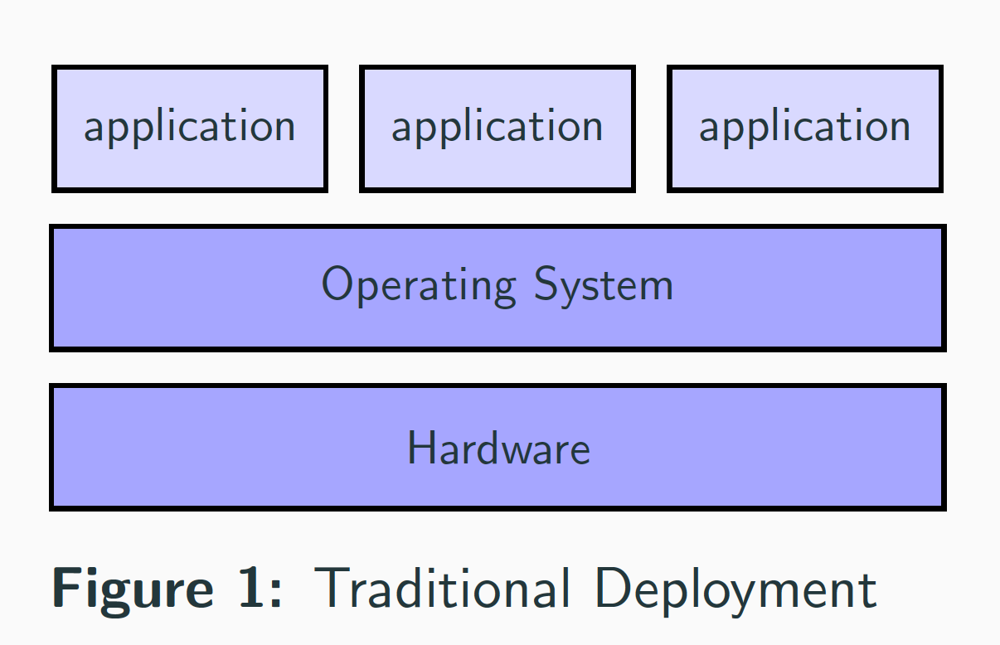
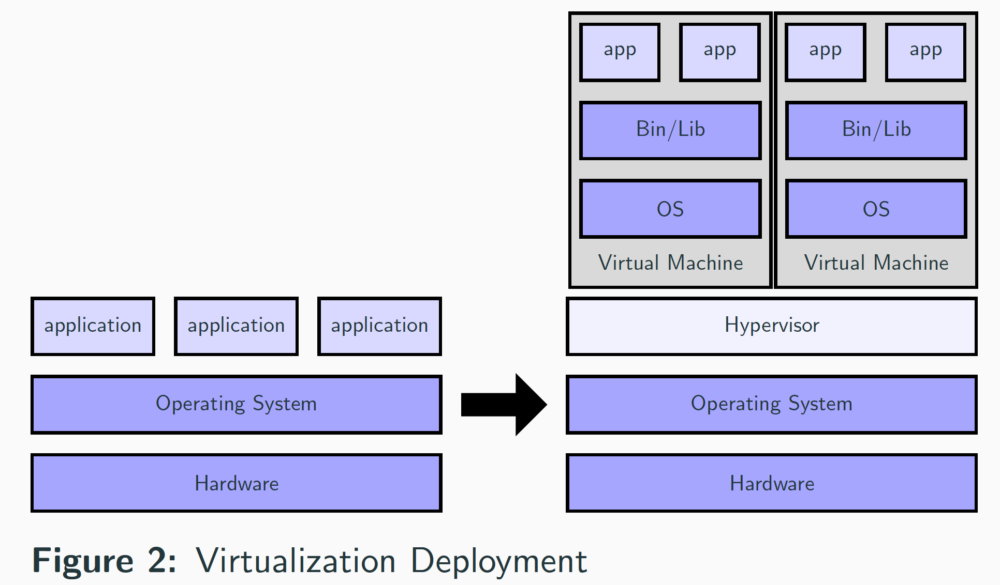
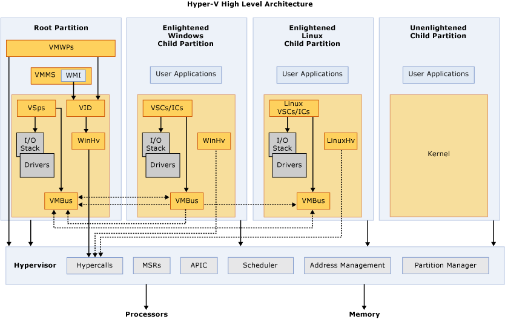
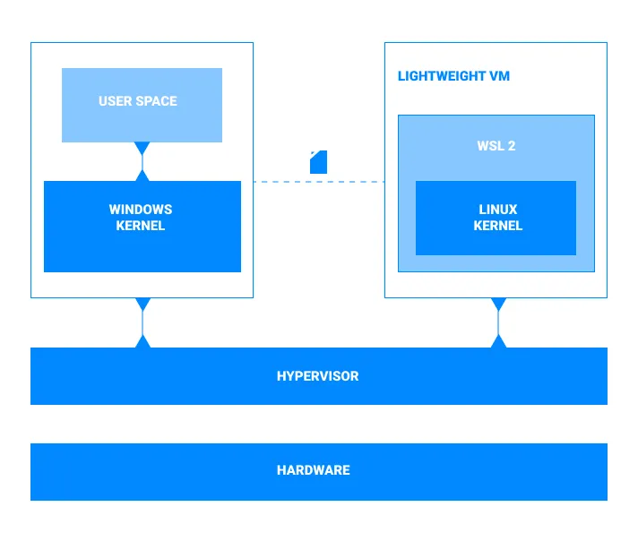

# 배포의 변화

애플리케이션 배포 방식은 물리 서버에 직접 실행하는 방식에서 가상 머신을 거쳐 컨테이너를 사용하는 방식으로 발전해 왔습니다.

세 방식의 핵심적인 차이는 애플리케이션을 어떤 단위로 격리하고, 운영체제와 하드웨어 자원을 어떻게 공유하는지에 따라 달라집니다.

## 전통적인 배포 방식

전통적인 배포 방식에서는 하나의 물리 서버에 여러 애플리케이션을 직접 설치해 실행합니다.

애플리케이션들이 같은 운영체제와 서버 자원을 공유하기 때문에 구조는 단순하지만 서로 영향을 주기 쉽습니다.

예를 들어, 애플리케이션 A가 CPU나 메모리를 과도하게 사용하면 같은 서버에서 실행 중인 애플리케이션 B와 C의 성능도 저하
될 수 있습니다. 또 애플리케이션마다 요구하는 라이브러리 버전이 다르면 의존성 충돌이 발생할 수도 있죠.

문제를 피하기 위해 애플리케이션별로 물리 서버를 할당할 수 있지만, 이 경우 사용하지 않는 서버 자원이 늘어나고 서버 관리 비용도 커지는 단점이 있습니다.

## 가상 머신 배포 방식

가상 머신(Virtual Machine, VM)은 하이퍼바이저를 사용해 하나의 물리 서버를 여러 개의 가상 컴퓨터로 나누는 개념입니다.

각 가상 머신은 자신만의 게스트 운영체제를 가지고 독립적으로 실행됩니다. 따라서 애플리케이션마다 서로 다른 운영체제와 라이브러리를 사용할 수 있으며, 전통적인 배포 방식보다 자원과 실행 환경을 명확하게 분리할 수 있다는 장점이 있습니다.

하지만 각 가상 머신이 별도의 운영체제를 포함하므로 이미지 크기가 크고, 부팅과 운영에 필요한 자원도 상대적으로 많아집니다. 따라서, 애플리케이션 수가 증가하면 게스트 운영체제까지 함께 관리해야 한다는 부담도 생깁니다.

### HyperVisor

가상 머신은 하이퍼바이저 기술을 사용합니다. 하이퍼바이저는 프로세서, 메모리, 스토리지와 같은 컴퓨팅 리소스를 풀링하여 가상 머신에 재할당하는 소프트웨어입니다. 이 기술을 통해 여러 가상 머신을 생성하여 단일 물리 머신에서 실행하는 가상화가 실현됩니다.

각 가상 머신에 할당된 리소스를 제공하고 물리적 리소스에 대한 가상 머신 리소스의 스케줄링을 관리하게 됩니다. 다양한 운영 체제가 나란히 실행되고 가상화된 동일한 하드웨어 리소스를 하이퍼바이저와 공유할 수 있습니다. 이것이 가상화의 주요 장점입니다.

가장 중요한 점은 하이퍼바이저라는 개념은 OS에 종속된 것이 아닙니다. 예를 들어, Windows 환경에서 사용하는 `Hyper-V` 라는 것은 이 하이퍼바이저를 윈도우에 맞게 구현한 구현체라는 것입니다.

리눅스에서는 `KVM`, `Xen`이 있고, Mac에서는 `Apple Virtualization Framework` 등이 있습니다. 하이퍼바이저는 2가지의 유형이 있는데 Type1은 하드웨어 위에서 직접 동작하는 것이고, Type2는 기존 OS 위에 프로그램처럼 설치하는 방식입니다. 이 점을 알고 가시면 뒤에 나올 컨테이너에 대해 조금 더 쉽게 이해할 수 있습니다.

## 컨테이너 배포 방식

컨테이너는 애플리케이션과 실행에 필요한 라이브러리 및 설정을 하나의 이미지로 묶습니다. 가상 머신과 달리 컨테이너마다 별도의 운영체제 커널을 실행하지 않고, 호스트 운영체제의 커널을 공유하게 됩니다.

각 컨테이너는 프로세스, 파일 시스템, 네트워크 등의 실행 환경이 논리적으로 격리됩니다. 동시에 호스트 커널을 공유하므로 일반적으로 가상 머신보다 이미지가 작고 시작이 빠르게 사용할 수 있습니다.

또한 동일한 컨테이너 이미지를 개발, 테스트, 운영 환경에서 사용할 수 있어 환경 차이로 발생하는 문제를 줄이는데 도움이 됩니다.

다만 컨테이너는 가상 머신과 격리 방식이 다릅니다. 가상 머신은 각자 독립된 커널을 사용하지만, 컨테이너는 호스트 커널을 공유합니다.

따라서 두 방식을 단순히 성능 차이로만 비교하기보다 필요한 격리 수준, 운영체제 요구사항, 보안 정책을 함께 고려해야 합니다.

### WSL2

컨테이너는 호스트 커널을 공유한다고 설명했습니다. 그러면 지금 사용중인 PC가 Windows라는 윈도우 커널일까요? `Docker`를 가지고 설명해보겠습니다. Docker는 리눅스 커널 기반 이미지를 사용합니다. 우리의 PC는 윈도우인데 리눅스 커널은 어떻게 사용할 수 있을까요? 방법은 WSL2를 사용하는 것입니다.

하이퍼바이저를 설명할 때, 타입이 2가지 있다고 했습니다. Type2는 기반 OS위에서 실행되는 소프트웨어형태라고 했었습니다. WSL2는 윈도우에서 제공하고 있는 하이퍼바이저입니다. 그래서 Docker 윈도우 설치 설명서를 보면 WSL2를 먼저 설치하라고 안내하고 있습니다. 이는 WSL2에 리눅스 커널을 올리고 가상화 환경에서 Docker가 돌아가는 것을 파악할 수 있습니다.

## 세 가지 배포 방식 비교

| 구분          | 전통적인 배포            | 가상 머신 배포             | 컨테이너 배포               |
| ------------- | ------------------------ | -------------------------- | --------------------------- |
| 실행 단위     | 프로세스                 | 가상 머신                  | 컨테이너                    |
| 운영체제      | 하나의 OS 공유           | VM마다 게스트 OS 실행      | 호스트 커널 공유            |
| 격리 경계     | 애플리케이션 간 제한적   | 하드웨어를 가상화하여 분리 | OS 수준에서 프로세스 격리   |
| 시작 속도     | 애플리케이션에 따라 다름 | 게스트 OS 부팅 필요        | 일반적으로 VM보다 작음      |
| 자원 오버헤드 | 낮지만 충돌 가능         | 상대적으로 큼              | 일반적으로 VM보다 작음      |
| 배포 일관성   | 환경에 영향을 받기 쉬움  | VM 이미지로 관리 가능      | 컨테이너 이미지로 관리 가능 |

## 오늘 배운 내용

배포 방식의 변화는 단순히 실행 속도를 개선하기 위한 것이 아니라, 애플리케이션의 실행 환경과 자원을 더 효과적으로 격리하고 관리하기 위한 과정이었습니다.

-   전통적인 배포는 구조가 단순하지만 애플리케이션이 운영체제와 자원을 직접 공유한다.
-   가상 머신은 애플리케이션마다 독립된 운영체제를 제공해 격리 수준을 높인다.
-   컨테이너는 호스트 커널을 공유하면서 애플리케이션과 의존성을 격리된 실행 단위로 패키징한다.
-   하이퍼바이저라는 가상화 기술을 통해 운영체제들은 가상화를 지원한다.

결국 가상 머신과 컨테이너의 가장 중요한 차이는 별도의 게스트 운영체제를 포함하는지, 호스트 운영체제의 커널을 공유하는지에 있습니다.

## Ref.

[Traditional Deployment VS Virtualization VS Container](https://www.linkedin.com/pulse/traditional-deployment-vs-virtualization-container-shazly-abozeid/)

[What is a docker](https://www.docker.com/resources/what-container/)

[Hyper-V 아키텍처](https://learn.microsoft.com/ko-kr/windows-server/virtualization/hyper-v/architecture)

[From Windows to Linux With WSL: How WSL Really Works](https://medium.com/@vkeodt/from-windows-to-linux-with-wsl-how-wsl-really-works-54bcf5162b8e)

[하이퍼바이저(Hypervisor)란?](https://www.redhat.com/ko/topics/virtualization/what-is-a-hypervisor)
