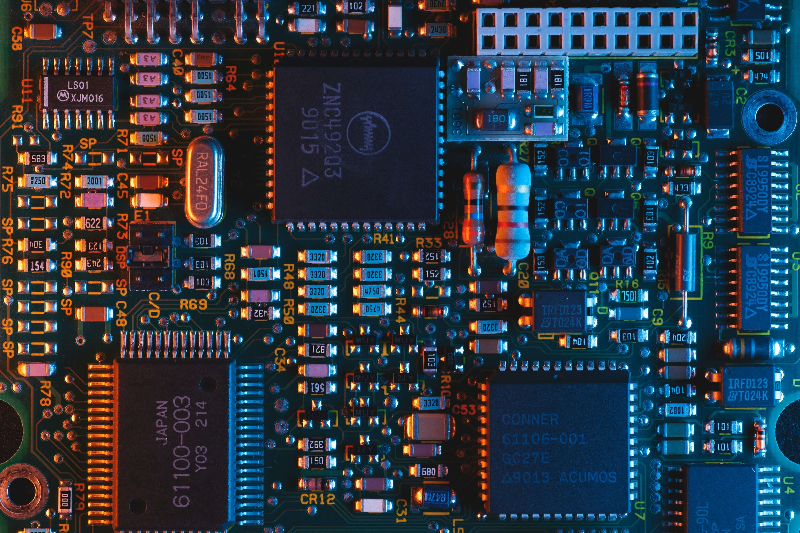

# 들어가며

C++ 프로그래밍 언어는 개발자가 직접 메모리를 관리하는 방식으로 설계되어 있습니다. 이는 코드를 어떻게 작성하느냐에 따라 단점이 될 수도, 장점이 될 수도 있습니다. 수십 년을 걸쳐 항상 언급되는 것이, 프로그램의 메모리 관리 방법입니다. 만약 5만큼의 메모리를 할당했으면, 사용이 끝난 뒤에는 다시 5만큼을 돌려주어야 하죠. 하지만 사람이기 때문에 프로젝트의 규모가 커지면 메모리를 제대로 해제하지 못하거나, 해제한 메모리를 참조하게 되는 상황이 생길 수 있습니다.



이러한 경우를 최대한 줄이고자, `스마트 포인터(Smart Pointer)`라는 개념을 도입하게 됩니다. 자동으로 메모리 관리를 하자는게 목표였죠. `원시 포인터(Raw Pointer)`를 한 번 감싸 스스로 자신의 수명을 관리할 수 있게 하는 것입니다. 오늘은 이 스마트 포인터 중 `공유 포인터(Shared Pointer)`와 `순환 참조 문제`에 대해 알아보도록 하겠습니다.

---
# 공유포인터

## shared_ptr

공유 포인터는 `공유 소유권(Shared Ownership)` 이라는 특징을 가집니다. 이는 하나의 객체를 여러 스마트 포인터가 동시에 소유하는 개념입니다. 내부적으로 참조 카운트 변수를 통해 현재 객체가 얼마나 공유되고 있는지 숫자를 셉니다. 이 변수가 0이 되는 순간 객체는 메모리에서 해제가 됩니다.

짧은 예시를 들어볼까요? 회의를 하기 위해 회의실을 사용한다고 생각해보겠습니다.

1. 비어있는 회의실에 한 명이 들어가서 불을 킵니다.(생성, 카운트 1이 올라감)
2. 회의 참여자들이 들어오고 회의를 시작합니다. (카운트 업)
3. 회의 도중 인원 몇 명이 회의실을 나가게 됩니다.(카운트 다운)
4. 회의가 끝나고 마지막으로 나가는 한 명은 불을 끄고 문을 잠급니다.(소멸, 카운트가 0이 됨)

위 예시로 회의실(객체)를 공유하는 회의자들(공유 포인터)이 있고, 회의자들이 사라지면 회의실을 빈 상태가 됩니다.(카운트 0, 소멸)

## MySharedPtr

스마트 포인터를 직접 구현해보면 다음과 같습니다.
```cpp
#ifndef MY_SMART_POINTER_SHAREDPOINTER_H
#define MY_SMART_POINTER_SHAREDPOINTER_H
#include <atomic>

class RefCountable
{
public:
    RefCountable() : RefCount(0) {}
    virtual ~RefCountable() = default;

    [[nodiscard]] int GetRefCount() const { return RefCount.load(std::memory_order_relaxed); }
    int AddRef() { return RefCount.fetch_add(1, std::memory_order_relaxed) + 1; }
    int ReleaseRef()
    {
        const int CurrentRef = RefCount.fetch_sub(1, std::memory_order_acq_rel) - 1;
        if (RefCount == 0)
        {
            delete this;
        }
        return CurrentRef;
    }

protected:
    std::atomic<int> RefCount;
};

template <typename T>
class MySharedPtr
{
    // 상속 구조의 생성자를 위한 friend 지정
    template <typename U> friend class MySharedPtr;
public:
    MySharedPtr() : Ptr(nullptr) {}
    MySharedPtr(T* ptr) { Set(ptr); }
    ~MySharedPtr() { Release(); }

    // copy constructor
    MySharedPtr(const MySharedPtr& rhs) { Set(rhs.Ptr); }

    // move constructor
    MySharedPtr(MySharedPtr&& rhs) noexcept : Ptr(rhs.Ptr) { rhs.Ptr = nullptr; }

    // cast constructor
    template <typename U>
    explicit MySharedPtr(const MySharedPtr<U>& rhs) { Set(static_cast<T*>(rhs.Ptr)); }

    // copy assignment
    MySharedPtr& operator=(const MySharedPtr& rhs)
    {
        if (Ptr != rhs.Ptr)
        {
            T* OldPtr = Ptr;
            Set(rhs.Ptr);
            if (OldPtr) OldPtr->ReleaseRef();
        }
        return *this;
    }

    // move assignment
    MySharedPtr& operator=(MySharedPtr&& rhs) noexcept
    {
        if (this != rhs)
        {
            Release();
            Ptr = rhs.Ptr;
            rhs.Ptr = nullptr;
        }
        return *this;
    }

    bool operator==(const MySharedPtr& rhs) const { return Ptr == rhs.Ptr; }
    bool operator!=(const MySharedPtr& rhs) const { return Ptr != rhs.Ptr; }
    bool operator==(T *ptr) const { return Ptr == ptr; }
    bool operator!=(T *ptr) const { return Ptr != ptr; }

    // nullptr check
    explicit operator bool() const { return Ptr != nullptr; }

    T* operator->() const { return Ptr; }

    T& operator*() const { return *Ptr; }

    T* Get() const { return Ptr; }

    [[nodiscard]] bool IsNull() const { return Ptr == nullptr; }

private:
    void Set(T* ptr)
    {
        Ptr = ptr;
        if (ptr)
        {
            Ptr->AddRef();
        }
    }

    void Release()
    {
        if (Ptr)
        {
            Ptr->ReleaseRef();
            Ptr = nullptr;
        }
    }

private:
    T* Ptr = nullptr;
};

#endif //MY_SMART_POINTER_SHAREDPOINTER_H
```

직접 구현한 공유 포인터나 표준 공유 포인터나 모두 순환 참조(Circular Reference)문제가 있습니다. 가장 많은 예시로 등장하는 형태는 아마 다음과 같을 거에요.

```cpp
#include <iostream>
#include "SharedPointer.h"

using namespace std;

class SharedB;

class SharedA : public RefCountable
{
public:
    MySharedPtr<SharedB> PtrB;

    ~SharedA() override { cout << "SharedA 소멸 \n"; }
};

class SharedB : public RefCountable
{
public:
    MySharedPtr<SharedA> PtrA;

    ~SharedB() override { cout << "SharedB 소멸 \n"; }
};

int main() {
    std::cout << "---Shared Ptr---" << std::endl;

    {
        const MySharedPtr<SharedA> NewA(new SharedA()); // 참조 카운트 (0 -> 1)
        const MySharedPtr<SharedB> NewB(new SharedB()); // 참조 카운트 (0 -> 1)

        NewA->PtrB = NewB; // B 참조 카운트(1 -> 2)
        NewB->PtrA = NewA; // A 참조 카운트(1 -> 2)
        // 순환 참조 발생!

        cout << "스코프 종료\n";
        cout << "NewA Count: " << NewA->GetRefCount() << endl;
        cout << "NewB Count: " << NewB->GetRefCount() << endl;
    }

    cout << "---테스트 종료---";

    return 0;
}
```

해당 코드의 결과는 다음과 같습니다.
```text
---Shared Ptr---
스코프 종료
NewA Count: 2
NewB Count: 2
---테스트 종료---
```

결과를 보다시피, 객체들의 소멸자가 호출되지 않은 것을 볼 수 있습니다. 즉, 서로가 서로를 참조하는 형태이기 때문에 메모리가 해제되지 않고 아직 남아있는 것입니다.

그러나 이렇게 단순하게 발생하는 순환 참조는 실제 프로젝트에서는 보기 힘듭니다. 보통 컴포넌트 패턴에서 어떤 클래스가 다른 클래스를 포함하는 경우 자주 발생하게 됩니다.

컴포넌트 패턴의 예시는 다음과 같습니다.
```cpp
#include <iostream>
#include <string>
#include <vector>
#include "SharedPointer.h"

using namespace std;

class Actor;

class Component : public RefCountable
{
public:
    explicit Component(const string &InName) : Name(InName) {}
    ~Component() override { cout << "Component 소멸" << Name << endl; }

    MySharedPtr<Actor> Owner;

    void SetOwner(const MySharedPtr<Actor> &InOwner) { Owner = InOwner; }

    void Tick() const
    {
        if (!Owner.IsNull())
        {
            cout << Name << ": ticking." << endl;
        }
    }

private:
    string Name;
};

class Actor : public RefCountable
{
public:
    explicit Actor(const string& InName) : Name(InName) {}
    ~Actor() override { cout << "Actor 소멸" << Name << endl; }

    vector<MySharedPtr<Component>> Components;

    void AddComponent(const MySharedPtr<Component> &InComponent) { Components.push_back(InComponent); }

private:
    string Name;
};

int main() {
    cout << "---게임 로직 테스트---" << endl;

    {
        // 플레이어 액터 생성 (RefCount 1)
        const MySharedPtr<Actor> Player = MySharedPtr<Actor>(new Actor("Player"));

        // 무기 컴포넌트 생성 (RefCount 1)
        const MySharedPtr<Component> Weapon = MySharedPtr<Component>(new Component("Rifle"));

        // Actor가 Component 소유 (컴포넌트 RefCount 1 -> 2)
        Player->AddComponent(Weapon);

        // Component가 Actor를 소유 (Actor RefCount 1 -> 2)
        Weapon->SetOwner(Player);

        Weapon->Tick();

        cout << "Current Actor RefCount: " << Player->GetRefCount() << endl;
        cout << "Current Weapon Component RefCount: " << Weapon->GetRefCount() << endl;
    }

    cout << "---게임 로직 테스트 종료---";

    return 0;
}
```

```text
---게임 로직 테스트---
Rifle: ticking.
Current Actor RefCount: 2
Current Weapon Component RefCount: 2
---게임 로직 테스트 종료---
```

결과를 보면 이전에 봤던 예시와 같은 결과를 보여주고 있습니다. 즉, 액터와 컴포넌트가 서로를 참조하는 순환 참조가 발생하게 됩니다. 

그렇다면 순환 참조를 끊기 위해서는 어떻게 해야 할까요? 현재 코드는 약한 참조 기능이 없으므로, 가장 쉬운 방법은 원시 포인터를 사용하는 것입니다. 

공유가 아닌 해당 객체 자체를 가지고 있는 것이죠. 코드는 다음과 같습니다.

```cpp
#include <iostream>
#include <string>
#include <vector>
#include "SharedPointer.h"

using namespace std;

class Actor;

class Component : public RefCountable
{
public:
    explicit Component(const string &InName) : Name(InName) {}
    ~Component() override { cout << "Component 소멸 " << Name << endl; }

    Actor* Owner; // 원시 포인터를 가진다.

    void SetOwner(const MySharedPtr<Actor> &InOwner) { Owner = InOwner.Get(); }

    void Tick() const
    {
        if (!Owner)
        {
            cout << Name << ": ticking." << endl;
        }
    }

private:
    string Name;
};

class Actor : public RefCountable
{
public:
    explicit Actor(const string& InName) : Name(InName) {}
    ~Actor() override { cout << "Actor 소멸 " << Name << endl; }

    vector<MySharedPtr<Component>> Components;

    void AddComponent(const MySharedPtr<Component> &InComponent) { Components.push_back(InComponent); }

private:
    string Name;
};

int main() {
    cout << "---게임 로직 테스트---" << endl;

    {
        // 플레이어 액터 생성 (RefCount 1)
        const MySharedPtr<Actor> Player = MySharedPtr<Actor>(new Actor("Player"));

        // 무기 컴포넌트 생성 (RefCount 1)
        const MySharedPtr<Component> Weapon = MySharedPtr<Component>(new Component("Rifle"));

        // Actor가 Component 소유 (컴포넌트 RefCount 1 -> 2)
        Player->AddComponent(Weapon);

        // 원시 포인터로 소유
        Weapon->SetOwner(Player);

        Weapon->Tick();

        cout << "Current Actor RefCount: " << Player->GetRefCount() << endl;
        cout << "Current Weapon Component RefCount: " << Weapon->GetRefCount() << endl;
    }

    cout << "---게임 로직 테스트 종료---";

    return 0;
}
```

```text
---게임 로직 테스트---
Current Actor RefCount: 1
Current Weapon Component RefCount: 2
Actor 소멸 Player
Component 소멸 Rifle
---게임 로직 테스트 종료---
```

어떤가요? 이전과는 다르게 객체의 소멸자 제대로 호출되고 있습니다. 물론 원시 포인터를 가지고 있는 만큼, `댕글링 포인터(Dangling Pointer)`가 되지 않도록 주의해서 사용해야 합니다.

## 표준 shared_ptr

제가 구현한 공유 포인터는 반드시 RefCountable을 상속받아야하는 형식으로 처리하고 있습니다. 그러나 표준에서는 그렇게 하면 큰일나겠죠? 그래서 내부 구현 형식은 다르게 되어있습니다.

표준 shared_ptr을 한번 보겠습니다.

```cpp
//shared_ptr.h
class __shared_ptr
{

private:
    element_type*	   _M_ptr;         // Contained pointer.
    __shared_count<_Lp>  _M_refcount;    // Reference counter.
}
```

여기서 `_M_ptr`은 객체 타입, `_M_refcount`는 제어 블록을 의미합니다. 제어 블럭은 다음 2가지를 관리하게 됩니다.

```cpp
//shared_ptr_base.h
class __shared_count
{

private:
    _Sp_counted_base<_Lp>* _M_pi; // _Sp_counted_base 를 가리키는 포인터
    
}

// ...

class _Sp_counted_base
: public _Mutex_base<_Lp>
{
public:
  _Sp_counted_base() noexcept
  : _M_use_count(1), _M_weak_count(1) { }
  
  // ... 생략 ...

private:
    _Sp_counted_base(_Sp_counted_base const&) = delete;
    _Sp_counted_base& operator=(_Sp_counted_base const&) = delete;
    
    _Atomic_word  _M_use_count;     // #shared
    _Atomic_word  _M_weak_count;    // #weak + (#shared != 0)
};
```
제어 블럭은 `use_count`와 `weak_count`로 나누어져 있습니다. 이는 다음을 의미합니다.
- use_count: shared_ptr의 레퍼런스 카운트
- weak_count: weak_ptr의 레퍼런스 카운트 + shared_ptr가 하나라도 살아있다면 제어 블록이 메모리에서 해제되지 않도록 막아줌.

:::note
__weak_ptr__

하나 이상의 shared_ptr 인스턴스가 소유하는 객체에 대한 접근 권한을 제공하지만, 소유권은 가지지 않는 스마트 포인터입니다. 참조 카운팅에는 영향을 주지않고, 소유권을 양도받아 객체에 접근할 수 있게 도와주는 포인터라고 할 수 있습니다.
:::

표준에서는 weak_ptr가 객체의 수명(use count)을 확인하고, 이미 해제된 메모리에 접근하는 것을 막기 위해서 shared_ptr와 동일한 제어 블록을 이용하고 있습니다.

예를 들어,

```cpp
shared_ptr<Actor> sharedActor = make_shared<Actor>();
weak_ptr<Actor> weakActor = sharedActor;
```

위 형태는 내부적으로 풀어보면 `[Actor][RefCountingBlock(user_count, weak_count)]`와 같은 형태가 될 것입니다. 만약 Actor를 참조하는 shared_ptr의 Count가 0이면 Actor의 메모리가 해제되어도 weak_ptr의 Count가 0이 아니면 RefCountingBlock은 계속 살아있게 됩니다.

아마 `[][RefCountingBlock(user_count, weak_count)]` 이런식으로 말이죠.
따라서, weak_ptr은 shared_ptr의 메모리가 해제되었는지 확인하는 과정이 필요하게 됩니다.

```cpp
1. 해당 shared_ptr의 유효성 체크
bool expired = weakActor.expired();

2. 다시 shared_ptr로 캐스팅하여 null 체크
shared_ptr<Actor> sharedActor_copy = weakActor.lock();
```

표준 shared_ptr은 순환 참조 문제를 예방하기 위해서 weak_ptr이라는 포인터를 제공하고 있습니다. 코드와 같이 레퍼런스 카운트와는 다르게 작동하기 때문이죠. 

그러나 막상 사용하기 위해서는 위의 1, 2번과 같이 확인하는 과정을 거쳐야합니다. 또한, 효율성 측면에서도 weak_ptr 자체는 가볍지만, 실제 객체를 사용하기 위해 `lock()`을 호출하는 순간 새로운 shared_ptr를 생성하는 비용이 발생합니다. 

따라서 실제 개발에서는 사용해야할 상황과 아닌 상황을 구별하거나, 자체 shared_ptr을 만들어 사용하는 것이 좋은 방법이 될 수 있겠습니다.

---

# 마무리

오늘은 순환 참조 문제에 대해 알아보았습니다. 스마트 포인터는 메모리 릭이나 댕글링 포인터 문제에서 개발자에게 도움을 주는 유용한 클래스라고 볼 수 있겠습니다. 그러나 제대로된 사용법을 모른다면 순환 참조 문제와 같이 눈치채기 힘든 상황이 펼쳐질 수도 있습니다.

---
# Ref.

[msdn](https://learn.microsoft.com/ko-kr/cpp/standard-library/shared-ptr-class?view=msvc-170)

[Coding Note](https://codetip.tistory.com/entry/%EC%8A%A4%EB%A7%88%ED%8A%B8-%ED%8F%AC%EC%9D%B8%ED%84%B0-%EB%AC%B8%EC%A0%9C-%EC%88%9C%ED%99%98-%EC%B0%B8%EC%A1%B0#%EA%B-%--%EB%-B%A-%ED%--%-C%--%EC%--%-C%ED%--%--%--%EC%B-%B-%EC%A-%B-%--%EC%--%--%EC%A-%-C)

[간판이 안 만들어진 공방](https://milleatelier.tistory.com/61)