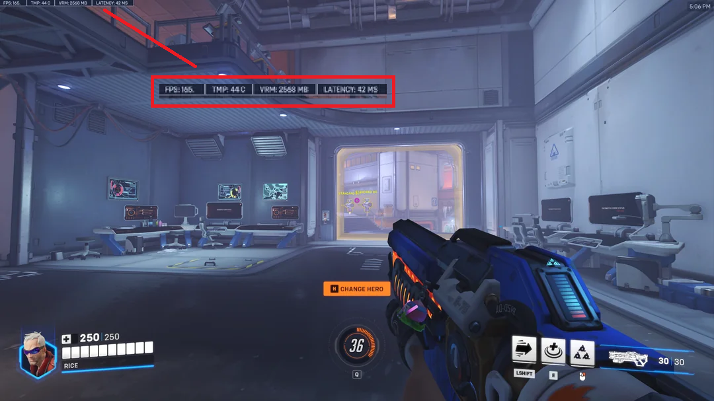

# 들어가며

")

게임을 만들 때 가장 쉽게 재미요소를 넣는 방법이 무엇일까요? 바로 `경쟁` 입니다. AI가 아닌 실제 사람과의 대결은 적당한 난이도, 적당한 긴장감을 유발하기 때문에 그저그런 게임도 경쟁요소가 있다면 사람들을 모을 수가 있는 것이죠. 이를 멀티플레이 게임이라고 부릅니다. 예전 오락실에서 한 기계에 2명씩 같이하는 것 역시 멀티플레이 게임라고 할 수 있습니다. 그렇다면 오늘 날 PC나 콘솔에서 멀리 떨어진 사람들과 같이 게임할 수 있는 방법은 무엇일까요? 그 방법에 대해 알아보도록 하겠습니다.

---

# 1. 네트워크

")

현 시대의 멀티플레이 게임은 필연적으로 지연(Latency)가 발생할 수 밖에 없습니다. 이는 물리적인 거리, 데이터 전송 속도등 여러 요인이 있기 때문이죠. 이러한 레이턴시는 유저의 일관성과 반응성을 떨어트려 부정적인 경험을 주게됩니다. 따라서 부정적 경험을 줄일 수 있는 여러 보상 테크닉이 존재합니다. 먼저, 게임에서 사용하는 네트워크 통신 방법에 대해 알아보고 보상 테크닉에 대해 자세히 알아보도록 하겠습니다.

## P2P

:::note
서버의 개입없이 플레이어들이 직접통신하는 구조
:::

")

같은 통신 네트워크 안에 있다면 누구나 함께 멀티플레이가 가능하다는 장점이 있습니다. 그러나 네트워크 성능이 낮은 플레이어에게 전체 플레이어가 연결됩니다. 실시간 전략 시뮬레이션(RTS) 게임이나 격투 게임에 가장 잘 어울리는 방식으로 스타크래프트, 철권, 킹오파 등 서버 개입이 필요없는 게임에서 많이 사용되고 있습니다.

## Dedicated Server

:::note
클라이언트-서버 통신하는 구조
:::

게임 로직을 서버가 담당하고 클라이언트에게 호스틍하는 방식입니다. 이는 매칭이 있는 게임(배틀그라운드, 발로란트)등 해당 판마다 서버가 상태 동기화를 책임지게 됩니다. 이러한 방식의 장점은 매 판마다 서버가 분리되어 있기 때문에 한 서버의 문제가 다른 게임 진행에 방해를 하지 않는다는 것입니다. 그러나 쾌적한 플레이 환경을 제공하기 위해서는 CPU, 메모리, 네트워크 대역폭등 풍부하게 제공해야한다는 점이 있습니다.

## Listen Server

:::note
클라이언트 중 한 명이 서버가 되는 클라이언트-서버 구조
:::

플레이어 한 명(보통 방장)이 서버 역할을 책임지면서 플레이하는 방식으로, 별도의 서버 유지비가 없다는 게 가장 큰 장점입니다. 가장 큰 단점이 있는데, 호스트(서버 역할 유저)가 다른 유저보다 항상 빠르게 움직인다는 것입니다. 자기 자신이 서버이기 때문에 레이턴시가 없습니다. 그래서 랭크게임처럼 경쟁이 중요한 경우 사용하기 어렵습니다.

그 외에도 MMORPG 처럼 대규모의 인원이 하나의 월드에 접속하는 방식이 있는데, 이 역시 클라이언트-서버 구조로 작동하게 됩니다. 대부분의 게임은 위의 네트워크 모델 중 하나를 선택하거나, 경우에 따라 혼합해서 사용하기도 합니다.

---

# 2. 서버 동기화

내가 하고 있는 게임이 멀티플레이라는 것을 느끼게 하려면 어떤게 중요할까요? 바로 나의 행동이 상대방에 화면에서도 똑같이 행동하고, 상대방의 행동 역시 나의 화면에서 똑같이 행동하고 있어야 합니다. 그러기 위해서는 매 순간 게임 상태가 동기화되어야 합니다.

동기화 과정에서 레이턴시가 발생하게 되는데, 이런 동기화 이슈를 업계에서는 `Netcode(넷코드)`라고 부릅니다. 넷코드 이슈를 줄이기 위해 적절한 동기화 전략이 필요합니다.

## 상태 vs 입력

먼저, 멀티플레이 게임에서 어떤 데이터를 주고 받아야 할까요? 다음 두 가지 접근 방식을 생각해볼 수 있습니다.

- 상태를 전송
- 입력을 전송

다음 두 상황을 통해 데이터 전송 방식의 차이점을 알아보겠습니다.

__시나리오 1(상태)__
- 플레이어 A가 `권한있는 노드(서버)`에 `MoveTo(1,2)` 명령을 보냄
- 권한있는 노드가 요청을 수신하고 모든 플레이어에게 플레이어 A가 현재 (1,2)에 있다고 알림
- 플레이어 A는 응답을 받고 (1,2)로 이동, 다른 플레이어 모두 동일한 정보를 받고 플레이어 A를 (1,2)로 이동

__시나리오 2(입력)__
- 플레이어 A는 `모든 플레이어`에게 `MoveTo(1,2)` 명령을 보냄
- A는 모든 플레이어로부터 승인을 받고 (1,2)로 이동
- 다른 플레이어의 화면에서 플레이어 A는 (1,2)로 이동

두 개의 시나리오의 큰 차이점은 A의 게임 상태(위치)를 보내느냐, A의 입력(이동)을 보내느냐 입니다.

상태 전송은 호스트 또는 서버가 모든 플레이어 명령에 대해 책임을 지며 다른 플레이어들은 그것을 무조건적인 사실이라고 받아들입니다.

하지만, 입력 전송은 모든 플레이어가 들어온 입력에 대해 각자 수행하기 때문에, 모든 플레이어가 동일한 화면을 보기 위해서는 게임 로직이 `Deterministic`이어야 합니다. 이를 Deterministic Lockstep 이라고도 부르는데, Lockstep 기법과 함께 사용되기도 해서 혼동될 수 있지만, Deterministic은 단계를 잠그지(Lock-step) 않아도 됩니다.

:::tip
Deterministic은 동일한 입력 시퀀스가 주어지면, 모든 머신에서 동일한 게임 상태를 만든다는 의미입니다. 게임 시스템에서 같은 상태를 만든다는 것은 다음 사항을 고려해야 합니다.

- 부동 소수점
- 랜덤시드
- 데이터 정렬 구조
- 실행 순서
- 물리(Physics)
:::

## Lock-Step Protocol

이전 입력 전송에서 설명한 Lock-Step 방식입니다. 이 방식은 가장 단순한 게임 동기화 모델로서 각 행위에 대해 증명을 다른 모든 플레이어에게 전파하고 모두 이에 동의하면 플레이어의 행위가 공개되고 동기화를 진행합니다.

")

Fig 4와 같이 각 플레이어는 자신의 행위에 대한 증명을 만들고(makeHash) 다른 플레이어에게 전파합니다. 모든 플레이어가 이에 동의하면 행위(Data)를 공개하고 동기화를 진행합니다. 다른 플레이어들은 받은 Data가 이전에 들어온 Hash와 같은지 검사를 하고 다르다면 동기화는 취소가 됩니다.

이 단계를 Lock-Step 개념을 도입하여 한 라운드마다 반복하며 동기화가 이루어집니다. 단점으로는 레이턴시가 가장 느린 플레이어에게 모든 플레이어의 게임 품질이 연결되기 때문에 반응성이 높은 게임일 경우 플레이어의 부정적인 경험이 높아질 수 있습니다. 또한 매 라운드 검증이 필요하기 때문에 게임 참가자의 인원이 제한될 수도 있습니다.

## Server-Authoritative

서버 권위형 방식은 서버가 플레이어의 모든 작업을 서버에서 시뮬레이션하고 검증한 뒤 전파하는 방식으로 서버의 게임 상태가 해당 게임 버전의 유일하고 진실인 상태입니다.

")

서버가 먼저 게임의 상태를 전이하고, 클라이언트가 서버를 따라가면서 렌더링을 진행합니다. 이 점에서 알 수 있는 것은 클라이언트는 항상 서버보다 느리다는 것입니다. 만약 클라이언트의 캐릭터가 서버의 캐릭터 위치보다 매우 멀리 떨어져있다면 서버는 이벤트를 거부하고 클라이언트의 캐릭터 위치를 되돌릴 것입니다.

### TickRate & UpdateRate

`TickRate`는 서버가 게임 상태를 업데이트하는 빈도를 측정하는 기준입니다. 서버가 tick을 더 빨리 돌수록 클라이언트는 업데이트된 게임 상태를 더 빨리 수신할 수 있습니다.

")

TickRate는 `헤르츠(Hz)`로 측정됩니다. 예를 들어, 60Hz의 TickRate는 서버가 게임 상태를 초당 60회 업데이트 한다는 의미입니다. 마찬가지로 30Hz의 TickRate는 초당 30회만 게임 상태를 업데이트한다는 것을 의미합니다. TickRate가 높을수록 게임 환경에 더 빠르게 반응하지만, 서버의 부하는 그만큼 증가하게 됩니다.

")

TickRate와 함께 중요하게 보는 것이 `UpdateRate`입니다. 이는 보통 클라이언트가 서버와 데이터를 주고받는 빈도를 측정하는 단위인데, 마찬가지로 헤르츠(Hz)로 측정되며, 속도가 높을수록 게임의 반응 속도가 빨라지지만, 클라이언트와 서버의 처리량과 네트워크 부하가 증가합니다.

UpdateRate가 낮은 속도로 진행되면 처리 지연 시간이 늘어나는 것 이외에도 여러 업데이트가 함께 묶여 동시에 도착하는 문제가 발생할 수 있습니다. 이를 가장 쉽게 표현한 문제가 바로 `슈퍼 불릿`입니다.

게임 내 총기가 클라이언트가 업데이트할 수 있는 것보다 초당 더 많은 횟수를 발사할 수 있다면, 어떤 시점에 여러 발의 총알에 대한 피해량이 함께 묶여 업데이트에 반영됩니다. 

")

예를 들어, UpdateRate(10Hz)와 UpdateRate(60Hz)가 있을 경우, 10Hz에서는 초당 10번씩 서버에 업데이트를 전송합니다. 분당 600발, 초당 10번 발사하는 총기는 업데이트당 탄환을 하나만 전송합니다. 그런데 문제가 되는 것은 600RPM 보다 높은 속도로 발사하는 총기입니다. 만약 새로운 총기가 750RPM으로 발사된다고 하면 10Hz에서는 어느 한 시점에서 여러 발의 총알 데미지가 들어가게 됩니다.

---

# 3. 레이턴시 보상

이전 챕터까지는 네트워크 종류와 동기화 모델에 대해 알아보았습니다. 이번 챕터는 레이턴시가 게임에 미치는 영향과 이를 숨기는 유저에게서 숨기는 레이턴시 보상 기술에 대해 몇가지 알아보겠습니다.

## 보상 개념

레이턴시는 게임 플레이의 `반응성(Responsiveness)`와 `일관성(Consistency)`에 영향을 미칩니다. 

")

클라이언트 위치 업데이트에서 레이턴시가 발생할 경우 서로 바라보고 있는 대상의 위치가 달라지게 됩니다. 이는 플레이어의 위치가 중요한 FPS 게임 혹은 랭크 대전의 경우 플레이 경험에 크게 영향을 끼칩니다. 위 Fig 9은 발로란트의 피커스 어드벤티지에 대해 설명하고 있습니다. 레이턴시로 인해 공격자가 항상 상대방을 먼저 보게되는 상태에 놓이게 됩니다.

이러한 플레이 환경 불일치를 해결하기 위해 `레이턴시 보상(Latency Compensation)`이라는 테크닉을 도입하게 됩니다. 이는 레이턴시에 따른 부정적 경험을 줄이기 위해 사용자의 입력, 게임의 상태값을 조정하게 됩니다.

## 레이턴시 노출

가장 쉽게 적용해볼 수 있는 테크닉은 바로 `레이턴시 노출`입니다. 말그대로 유저에게 클라이언트-서버간 레이턴시를 시각적 정보로 제공하는 것을 말합니다. 게임 상단 혹은 하단 모서리에 시간을 작게 표기해줍니다.

간단한 방법이지만, 레이턴시를 노출시키면 플레이어는 스스로 다음 동작을 예측하면서 대처하기 때문에 더나은 플레이가 가능하다고 합니다.

## 셀프 예측
`셀프 예측`은 클라이언트가 먼저 유저의 입력을 처리하고 서버에 행위에 대한 메세지를 보내는 기술입니다. 이 기술의 목적은 조작에 대한 반응성을 확보하여, 플레이어가 입력 장치를 누르는 시점과 화면상에 행동이 반영되는 시점 사이의 간격을 지연없이 처리할 수 있습니다. 

만약 클라이언트가 예측한 상태와 서버가 실제 계산한 값이 다를 경우 재조정이 일어나며 클라이언트의 행위는 폐기되고 서버의 값으로 즉시 동기화가 이루어집니다. 이러한 경우 유저는 캐릭터가 순간적으로 과거 위치로 튕겨 나가는 `Rubber-banding` 현상이 나타나게 됩니다. 

")

결론은, 일단 저지르고 나중에 수습하는 것이 이 테크닉의 본질입니다.

## 데드레커닝
`데드레코닝`은 신호가 오지 않는 동안의 행동을 클라이언트에서 추측하여 상태를 갱신하는 기술입니다. 예를 들어, A 플레이어가 앞으로 1초 동안 이동하고, 1초 후에 오른쪽으로 방향을 바꾸어 이동한다고 가정해봅시다. (60프레임 기준)

### 매 프레임 통신 시

- 클라이언트에서는 서버로 앞으로 가는 키를 누르고 있다는 메시지를 120번(60프레임 * 2sec)보내고 중간에 방향을 바꿀 때 방향을 바꾼다는 메시지 1번을 보내 총 121번의 메시지를 보냅니다.
- 서버 또한 클라이언트가 보낸 메시지를 기반으로 매 프레임 클라이언트의 위치값을 갱신하여 메시지를 120번(60프레임 * 2) + α번 보내야 합니다.

### 데드레커닝 적용 시

- 클라이언트는 앞으로 가는 키를 눌렀을 때 1번, 중간에 방향을 바꾸는 키를 눌렀을 때 1번, 앞으로 가는 키를 땠을 때 1번 총 3번의 메시지만 서버로 전송합니다.

- 서버는 이동을 시작했을 때의 클라이언트의 위치값과 이동방향을 클라이언트로 보내고, 방향이 바꾸었을 시점에 클라이언트의 위치값과 아동방향을 다시 1번 보내고, 이동이 멈추었을 때 클라이언트의 위치값을 한 번 보내 3번의 메시지만 클라이언트로 전송합니다.

- 클라이언트와 서버 모두 동일한 이동속도 값을 가지고 있으면, 해당 이동속도와 방향을 근거로 각 플레이어의 위치를 연산할 수 있고, 상태가 바뀌었다는 메시지에 대해 응답하여 서버에서 연산한 현재 클라이언트 위치값을 보내 클라이언트와 서버의 동기화가 이루어집니다.

")

즉 서버와 클라이언트가 동시에 연산을 수행하되 서버에서 연산한 결괏값을 정기적으로 혹은 클라이언트에서 현재 상태와 다른 변화가 일어날 때마다 동기화를 시켜주는 방법입니다.

## 서버사이드 리와인드(백트래킹)

타임워프 혹은 백트래킹으로 불리는 `Server-Side Rewind` 입니다. 이름에서 알 수 있듯이 시간을 되돌려서 행위를 검사하는 테크닉입니다. 앞 선 예측들은 유저의 반응성에 중점을 두었다면 리와인드는 일관성에 중점을 두게됩니다.

")

서버와 클라이언트 간의 레이턴시가 무조건 있을 수 밖에 없기 때문에 둘이 인식하는 세상은 다릅니다. 서버는 클라이언트의 입력이 발생한 시간까지 자신의 세상을 되돌려보고 입력이 발생한 시점의 물체가 피격이 되었는지 판정을 내리게 됩니다.

")

그래서 서버는 매 프레임마다 모든 플레이어의 위치와 히트박스 정보를 `History Buffer`에 저장하게 됩니다. 보통 최근 1초(1000ms) 분량을 저장하게 됩니다. 클라이언트는 총을 쏘면 타임스탬프가 담긴 정보 패킷을 서버로 보내고 서버는 타임스탬프를 보고 모든 오브젝트의 위치를 되돌리게 됩니다. 이후 총알 궤적을 그어본 뒤, 플레이어가 맞았다면 판정을 하게됩니다.

이와 같은 방식의 문제점이 하나있습니다. 바로 피격 판정을 하면서도 클라이언트의 화면은 계속 갱신되고 있다는 점입니다. 이게 왜 문제가 되나면, 피격자 입장에서는 자신의 화면에서는 이미 안전한 벽뒤로 숨었지만, 데미지를 입는 상황이 발생하게 됩니다. 이러한 문제를 `Shot around the corner`라고 부르는데요. 

")

Fig 15와 같이 이미 플레이어는 벽 뒤에 있는 상황이지만 데미지가 들어오는 모습을 확인할 수 있습니다. 이러한 부작용을 막기 위해 모든 게임은 `되감기 제한(Rewind Cap)`을 둡니다. 유명한 오버워치는 최대 250ms까지만 시간을 되돌리고, 공격자의 핑이 500ms라서 0.5초 전 과거를 쏘겠다 요청하면 서버는 이를 거절합니다.

---

# 마무리

오늘은 게임 네트워크 종료와 레이턴시 보상에 대해 알아보았습니다. 제가 설명한 것 이외에도 더 심화내용도 있기 때문에 레퍼런스의 자료들을 참고하시면 좋을 것 같습니다. 다음에는 더 좋은 게시글로 돌아오겠습니다. 감사합니다.

---

# 레퍼런스

[멀티-플레이어 게임 서버와 레이턴시 보상 테크닉](https://medium.com/rate-labs/%EB%A9%80%ED%8B%B0-%ED%94%8C%EB%A0%88%EC%9D%B4%EC%96%B4-%EA%B2%8C%EC%9E%84-%EC%84%9C%EB%B2%84-%EB%AA%A8%EB%8D%B8-%EA%B0%9C%EC%9A%94-%EA%B7%B8%EB%A6%AC%EA%B3%A0-%EB%A0%88%EC%9D%B4%ED%84%B4%EC%8B%9C-%EB%B3%B4%EC%83%81-%ED%85%8C%ED%81%AC%EB%8B%89-253640eb57d6)

[Peeking into VALORANT's Netcode ](https://technology.riotgames.com/news/peeking-valorants-netcode)

[VALORANT's 128-Tick Servers](https://technology.riotgames.com/news/valorants-128-tick-servers)

[Game Networking Demystified](https://ruoyusun.com/2019/04/06/game-networking-3.html)

[데드레커닝 기법](https://docs.backnd.com/sdk-docs/backend/match/note/dead-reckoning/)

[GDC-Overwatch Netcode](https://www.youtube.com/watch?v=W3aieHjyNvw)

[Overwatch Developer Update](https://www.youtube.com/watch?v=vTH2ZPgYujQ)