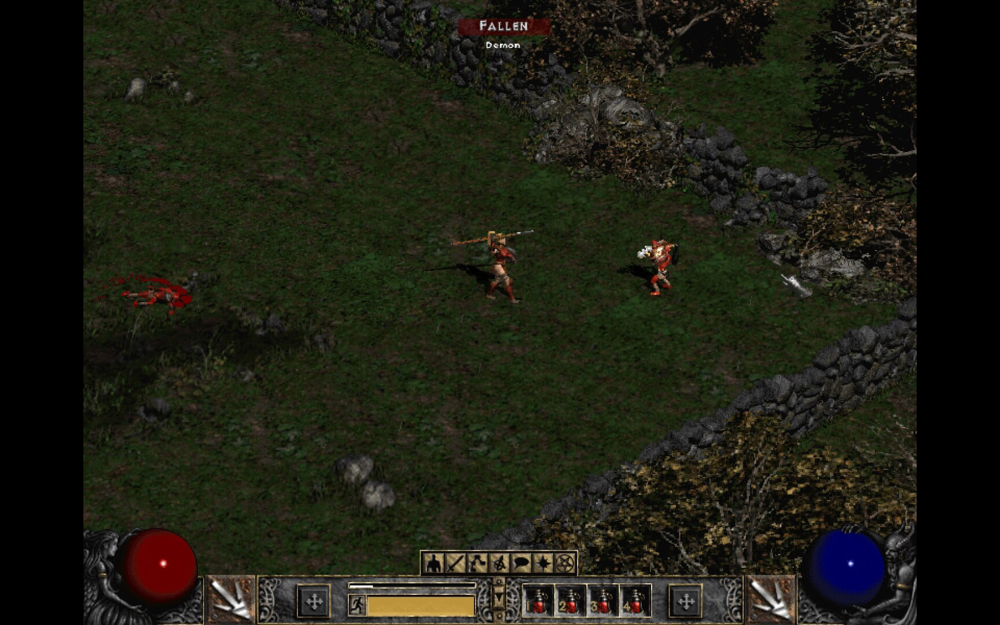
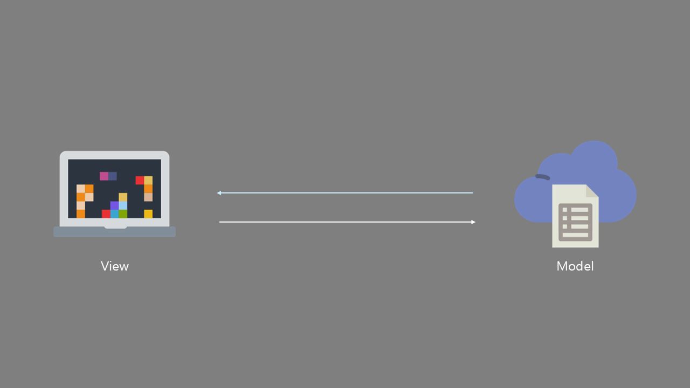
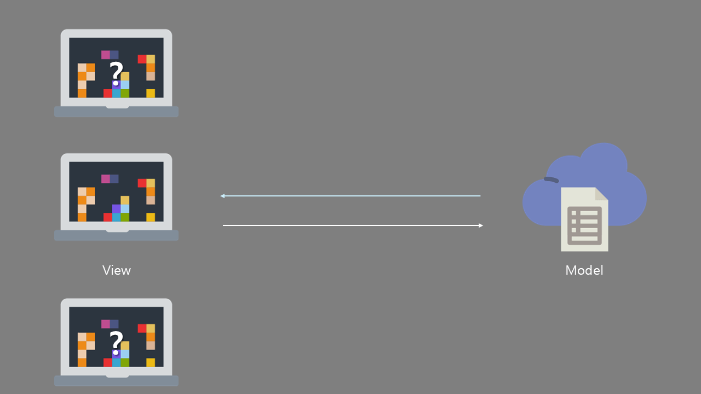
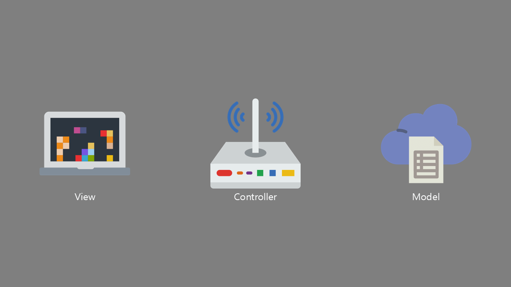
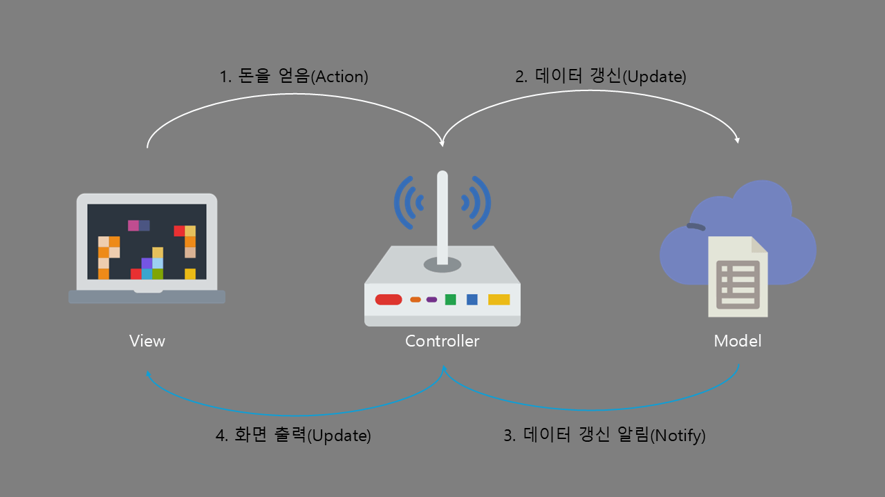

# 목표

게임에서의 UI 갱신과 데이터 관리에 대한 방법을 알아보자.

## 들어가며
안녕하세요. 여러분. 즐거운 개발하고 계시나요?

오늘은 UI에 대한 이야기를 해볼까 합니다.

여러분들은 UI를 어떻게 갱신하고 있으신가요? 데이터와 UI 갱신을 한 클래스에서 다 처리하시나요?

만약 위와 같은 방법을 사용하고 계신다면 한 번쯤 읽어볼 만할 내용이라고 생각됩니다.

## 1. 유저의 반응

일단 `우리의 게임`을 생각해 보겠습니다. 유저의 플레이 화면에는 지금 체력, 마나, 돈이 표시되고 있습니다.

처음 게임을 접속하고 보이는 데이터는 초깃값이겠죠?

그러면 이 데이터를 갱신하는 시점은 언제일까요? 만약 매 프레임마다 갱신한다고 생각해봅시다. 그러면 1프레임 기준 한 화면에 보이는 UI는 체력, 마나, 돈 3개가 전부입니다. 그런데 이 정보가 더 늘어나서 1프레임 기준 100개의 UI가 보인다고 가정해봅시다. 그러면 매 프레임 100개의 데이터를 갱신하게 됩니다. 아마 게임 성능에 영향을 미칠거에요.

이때 사용할 것이 바로 유저의 반응, 즉 `액션(Action)`입니다.

### 액션

여기서 액션은 캐릭터가 대미지를 입으면 체력이 잃고 또 스킬을 사용하면 마나가 닳을 것입니다. 혹은 몬스터가 드롭한 돈을 습득하면 돈이 오를 거예요. 그러면 액션은 다음과 같습니다.

- 체력을 잃음
- 마나가 닳음
- 돈을 얻음

이러한 액션에 대한 결과로 데이터가 생기게 됩니다. 또한 해당 결과만 UI에 업데이트 할 수도 있죠.

그래서 우리는 그림과 같이 데이터를 토대로 화면을 구성하는 것을 `View`라고 부르기로 했어요.

## 2. 데이터

> _View 가 어떻게 구성되는지는 알겠어요. 이제 데이터를 얻어오고 싶어요!_

이제는 데이터를 들여다볼 차례입니다. 우리가 가정한 게임이 가지고 있어야 할 데이터는 무엇일까요?

아마 `체력`, `최대 체력`, `마나`, `최대 마나`, `돈`, `최대 보유 가능한 돈` 등이 있을거예요.

이를 처리하기 위해 데이터 캡슐화 과정을 거쳐요. 이 과정에서 남은 결과물을 `Model`이라고 불러요.

## 3. 뷰와 모델

위의 이미지처럼 뷰에서 모델에 직접적으로 데이터를 요청하는 것은 올바른 방법일까요?

물론 특정한 상황 혹은 설계를 일부러 의도했다면 올바른 방법일 거예요.

하지만 일반적인 상황에서는 그렇게 좋은 방법은 아닙니다. OOP에 따르면 하나의 클래스는 하나의 책임을 가져야 한다. 아시죠?

만약 프로젝트의 규모가 커져서 다음과 같은 상황이 있다고 해볼까요?

뷰는 여러 곳에서 하나의 모델만을 참조하고 있습니다. 의존성이 모델 하나에게 집중되는 것이죠.

이는 뷰에서 사용자의 액션에 따라 직접 처리하기 위해 모델 데이터에 접근해서 수정을 해야합니다. 그 결과 뷰가 모델의 존재와 내부 구조를 직접적으로 의존하게 만들겠죠? 뷰가 3개면 3개 모두 직접적으로 모델에 의존하는 상황이 생기게 됩니다. 생각만 해도 꼬이는게 느껴지시나요?

그래서 등장한 것이 이를 연결시킬 징검다리입니다.

## 4. 컨트롤러

`View` 와 `Model` 을 이어주는 징검다리인 `Controller`에요.

컨트롤러는 뷰의 요청을 모델에게 전달하고 처리한 데이터를 모델이 넘겨주면 다시 뷰에게 전송해 주는 역할을 해요.

여기서 컨트롤러가 부여받은 임무는 어떻게 데이터를 잘 전달하냐입니다.

내부적으로 알맞은 뷰와 모델을 찾는 게 중요하답니다.

## 5. MVC

위 이미지는 앞의 상황을 정리해 봤습니다. 이해가 되시나요? 이를 `MVC(Model-View-Controller)` 패턴이라고 합니다.

단점으로는 뷰와 컨트롤러의 의존성이 높다는 점인데 게임 UI에서는 장르에 따라 심각한 단점으로 다가오지 않습니다.

이를 개선한 다른 방법도 있으니 한번 찾아보시는 것도 추천드립니다.

---

# 마무리

오늘은 UI 갱신 방법에 대해 알아봤습니다. 되도록 짧게 설명하고 싶었습니다. 나중에 실제 적용하는 방법에 대한 게시글에서 조금 더 살펴보겠습니다.

더 자세히 알고 싶으시다면 다른 블로거분들이 설명을 해놓았으니 찾아보시면 좋을 것 같아요.

또 MVC 패턴이라고 말하고 있지만 조금만 생각해 보면 데이터와 뷰를 분리하고 컨트롤러로 다루는 방법은

패턴을 모르고 계신 분들도 본능적으로 사용하실 정도로 흔한 패턴이기 때문에 거창하게 생각할 필요가 없다고 생각합니다.