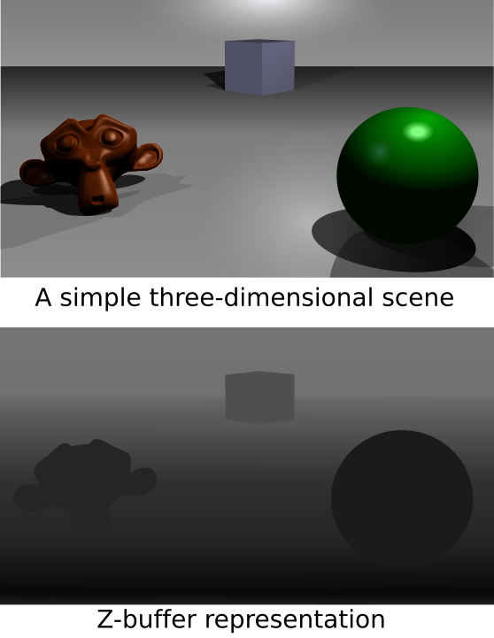
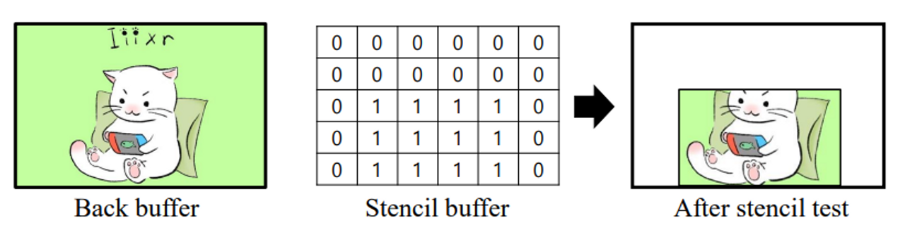

# 목표

DirectX11의 Depth/Stencil Buffer를 이해하기

## 들어가며

오늘은 DirectX11의 Depth/Stencil에 대해 이야기 해보려고 합니다.

원래 렌더링 파이프라인의 과정에 따라 게시글을 작성하고 싶었는데요... 앞의 과정을 아직 정리하지 못해서 정리된 것부터 바로 올리려고 합니다.

저의 게시글 모토가 5분안에 다 읽을 수 있는 것이기 때문에 최대한 줄이는게 목표입니다. 그럼 바로 시작하겠습니다.

## Depth/Stencil이란

:::important
화면 상의 픽셀들이 올바른 순서로 그려지도록 도와주는 과정
:::

먼저, Depth/Stencil은 Output-Merger 단계에서 처리하게 됩니다. 즉, 렌더링의 마지막 과정에서 적용하게 됩니다. 따라서:

- 다양한 효과 및 최적화 기법에 활용
- 렌더링 파이프 라인의 핵심 구성 요소

가 주된 내용입니다.

### Depth Buffer (깊이 버퍼)

- 이름에서도 알 수 있듯이 각 `픽셀의 깊이 정보`를 저장하는 버퍼입니다.
- 카메라에 대해 얼마나 떨어져 있는 지를 나타내며, 이는 픽셀의 `가시성(Occlusion)` 여부를 결정하게 됩니다.
- 이를 통해 가까운 객체가 멀리 있는 객체를 가리는 등의 `깊이 테스트(Depth Test)`를 수행하게 됩니다.

> Detail

- 32비트의 부동 소수점 값으로 구성합니다.
- DX11에서는 `DXGI_FORMAT_D24_UNORM_S8_UINT` 플래그를 통해 24비트의 깊이버퍼와 8비트의 스텐실 정보를 동시에 저장하는 방식을 사용합니다.
- Depth Test는 두 픽셀의 깊이 값을 비교하는데 `LESS`, `LESS_EQUAL`
 과 같은 비교 함수를 사용해서 두 픽셀의 깊이를 비교합니다.
- 대표적인 예시: `오클루전 컬링`, `그림자 및 반사 효과`

### Stencil Buffer (스텐실 버퍼)

- 각 픽셀에 대해 추가적인 마스킹 정보를 저장하여 특정 픽셀에 대한 렌더링 조건을 제어하게 됩니다.
- 이러한 제어를 통해 복잡한 효과를 구현이 가능합니다.

> Detail

- 깊이 버퍼와 같이 사용합니다.
- 픽셀마다 스텐실 값을 읽어와, 스텐실 연산을 적용 -> Stencil Test
- 이를 통해 특정 영역에만 렌더링을 허용하거나 금지가 가능합니다.
- 대표적인 예시: `스텐실 쉐도잉`, `후처리`, `데칼 및 특수효과`

## DirectX11 사용 방법
- `ID3D11DepthStencilState` 인터페이스를 사용하여 Depth & Stencil Test에 관한 설정을 정의합니다.
- D3D11_DEPTH_STENCIL_DESC 구조체를 통해 깊이 테스트의 활성화 여부, 비교함수, 스텐실 테스트 설정등을 지정할 수 있습니다.
- 이렇게 생성된 Depth/Stencil 객체는 파이프라인에 바인딩 됨, 이후 렌더링 호출에서 해당 `State`를 사용합니다.
- DSV(Depth/Stencil View)를 통해 실제 렌더링 타깃으로 사용할 Depth/Stencil 버퍼에 접근하며, GPU가 픽셀 단위로 깊이와 스텐실 값을 읽고 쓸 수 있게 됩니다.