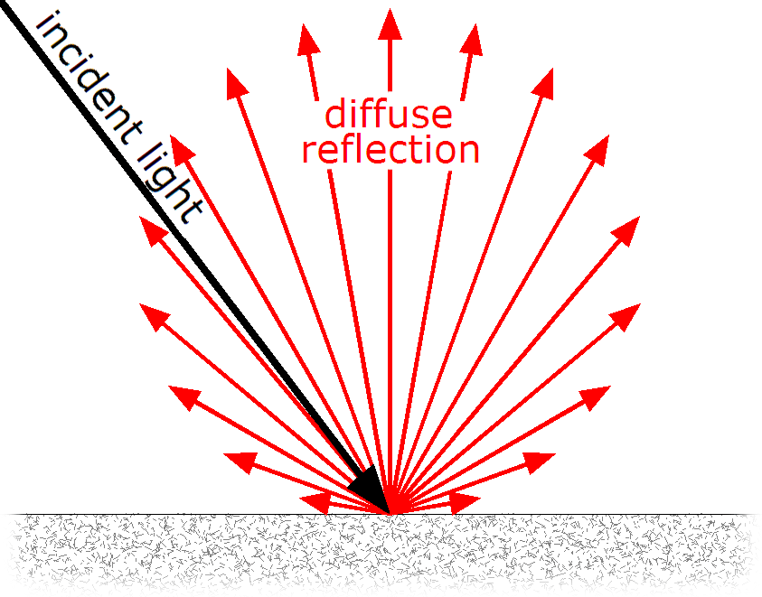
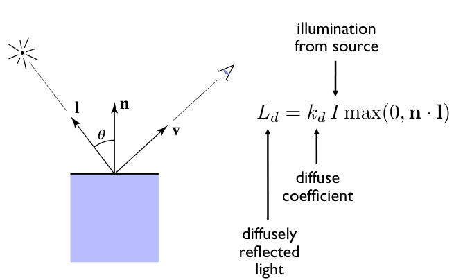
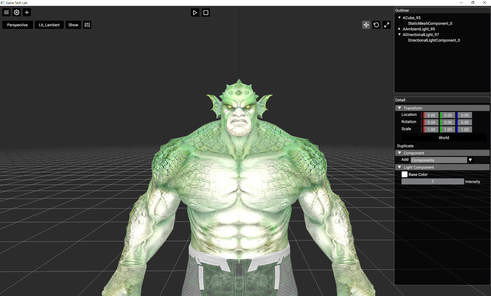
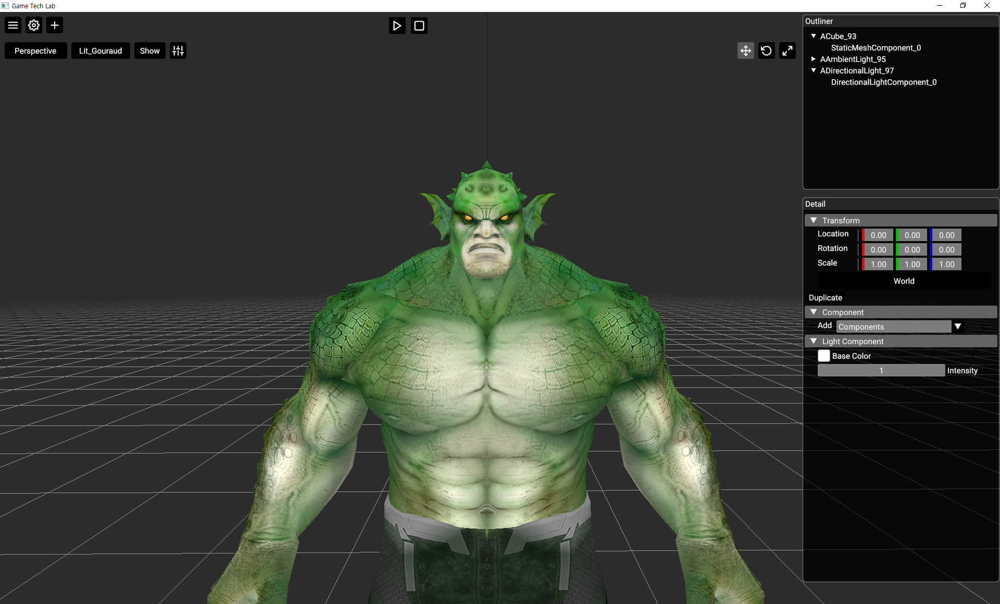
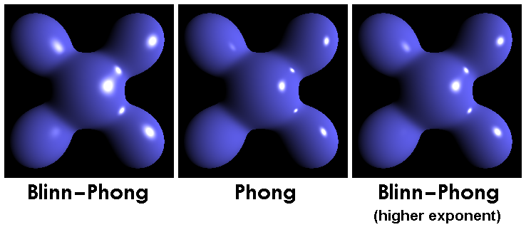
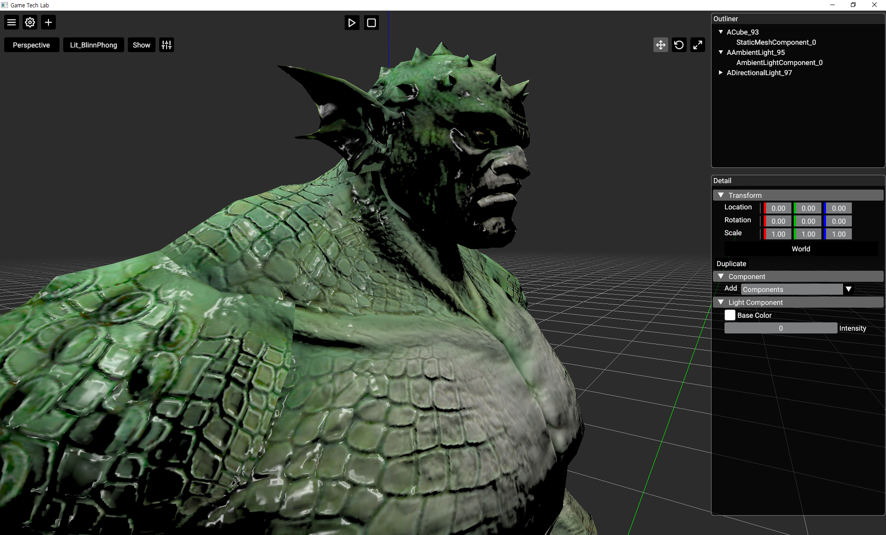

# 들어가며

게임에서는 플레이어에게 최대한 현실과 비슷한 느낌을 주려고 합니다. 이러한 느낌을 살리기 위해 빛은 아주 중요한 요소입니다. 그렇다면 물체가 빛을 표현하려면 어떻게 해야할까요?

먼저 빛을 받아드려야 합니다. 이때 받아드리는 빛의 시작점을 광원 이라고 표현합니다.

이렇게 광원에서 출발한 빛이 물체의 표현에 닿아 밝게 빛이 나게 됩니다.

빛을 받은 물체는 어떻게 생겼을까요? 물체의 모든 부분이 밝게 빛나면 아마 이상할 것입니다. 예를 들어 태양 빛을 받은 달이 뒷면까지 밝게 빛나고 있다면 이상하게 보입니다.

이와 마찬가지로, 물체 내에서도 빛을 많이 받는 영역, 적게 받는 영역으로 나눠집니다.

이러한 영역을 알기 위해서는 법선 벡터와 광원 벡터가 이루는 각을 봐야합니다.

## 법선과 광원

- __법선 벡터(Normal Vector)__ : 특정 표면(폴리곤)이 바라보는 방향을 나타내는 벡터입니다. 즉, 표면에 수직인 방향을 말합니다.

- __광원 벡터(Light Vector)__ : 표면의 한 점에서 광원으로 향하는 벡터입니다.
 
그렇다면 빛을 가장 많이 받을 때는 언제일까요? 바로 빛을 정면으로 받을 때입니다. 이를 벡터로 표현하면, 표면에 빛이 수직으로 내리쬐어 법선 벡터와 광원 벡터의 방향이 정확히 일치할 때 빛의 세기가 최대가 됩니다.

## Lambert

이처럼 두 벡터가 정확히 일치한다면 __두 벡터가 이루는 각은 0도__ 일 것입니다. 우리는 두 개의 벡터가 서로 얼마나 닮았는지 알 수 있습니다. 바로 __내적(Dot)__ 을 통해서 말이죠.
 
내적을 통해 빛을 계산하는 조명 모델이 바로 __Lambert__ 입니다.

정식 명칭은 램버트 반사 모델이라고 말하며, __조명과 표면의 법선 벡터의 각도에 따라 밝기율__이 결정하는 조명 모델입니다.

수식으로는 다음과 같이 표현이 됩니다. 여기서 추가적으로 설명하자면 kd(재질의 난반사 계수) 와 max(0, n · l) 부분인데 보통 재질의 난반사 계수는 (Albedo)라고  표현합니다. 이는 셰이더 코드에서 해당 물체 표면의 고유 색상으로 표현됩니다. max 클램핑을 하여 내적한 값이 음수가 넣어가는 경우를 방지합니다.

해당 이미지는 직접 구현해본 Lambert 조명입니다. 전체적으로 빛을 받는 부분이 밝아진 것을 볼 수 있습니다. Lambert 조명 모델은 단독으로 사용되는 경우는 거의 없고, 다른 조명 모델과 결합하여 사용하게 됩니다.

다음에 알아볼 조명 모델은 고러드(Goraud) 조명 모델입니다.

## Goraud

고러드는 어찌보면 특이한 모델입니다. 삼각형의 각 정점 사이의 픽셀들이 받는 조명을 선형적으로 보간해서 빛을 표현합니다.

그로 인해 계산 비용이 엄청 낮아지는 효과가 있습니다. 이는 옛날 하드웨어에서 사용하기 아주 좋은 방법이었습니다.

장점이 있으면 단점도 있기 마련, 결국 픽셀 단위의 조명 정확도는 낮을 수 밖에 없고, 하이라이트 표현이 정점을 정확히 만나는게 아니라면 제대로 표현이 안된다는 단점이 존재했습니다.

이 조명 모델을 구현할 때 보간해서 빛을 표현한다는게 이해가 안갔습니다. 픽셀 셰이더에서 하나의 픽셀마다 빛 색상을 넣어주는게 아닌가? 의문이 들었습니다. 

애초에 색상 처리 자체를 버텍스 셰이더에서 하고, 버텍스 셰이더에서 처리된 색상 값은 결국 래스터라이저 단계에서 보간 처리되어 따로 손을 보지 않아도 선형적으로 출력되는 것이었죠.

그렇게 구현해본 고러드 조명 모델입니다. (Ambient + Diffuse + Specular)

## Phong & Blinn-Phong

고러드 셰이딩의 가장 큰 단점은 바로 하이라이트 표현이었습니다. 정점에서 계산된 색상을 보간하다 보니, 폴리곤 중앙에 생겨야 할 반짝이는 하이라이트가 뭉개지거나 아예 사라져 버렸죠. "이럴 거면 그냥 모든 픽셀마다 따로 계산하면 되잖아?" 라는 아주 직관적인 아이디어에서 출발한 것이 바로 __퐁 셰이딩(Phong Shading)__ 입니다.

퐁 조명 모델의 핵심은 `정반사(Specular)` 입니다. 우리가 흔히 '반짝임', '윤기'라고 부르는 현상이죠. 매끈한 물체 표면에서 광원이 거울처럼 반사되어 우리 눈에 강하게 들어오는 빛을 모델링한 것입니다.

이를 계산하기 위해 새로운 벡터가 필요합니다.

- __시선 벡터(View Vector)__ : 표면의 한 점에서 카메라를 향하는 벡터입니다.
- __반사 벡터(Reflection Vector)__ : 광원 벡터가 표면에 부딪혀 반사되어 나가는 방향의 벡터입니다.

퐁 모델의 아이디어는 간단합니다. "빛의 반사 방향(Reflection Vector)과 우리 눈의 방향(View Vector)이 가까울수록 더 강한 반짝임을 보여주자!" 이 둘이 얼마나 가까운지는 역시 __내적(Dot)__ 으로 알 수 있습니다.

하지만 이 방식은 매 픽셀마다 반사 벡터를 계산해야 해서 연산 부담이 있었습니다. 바로 이때, 물리학자 James F. Blinn이 더 똑똑하고 효율적인 방법을 제안합니다. 이것이 바로 블린-퐁(Blinn-Phong) 모델입니다.

블린-퐁은 굳이 무거운 반사 벡터를 계산하지 않습니다. 대신 광원 벡터와 시선 벡터의 딱 중간을 가리키는 하프 벡터(Half Vector) 라는 것을 사용하죠.

하프 벡터는 두 벡터를 더해서 정규화(Normalize)만 하면 되므로, 반사 벡터를 구하는 것보다 계산이 훨씬 빠릅니다. 성능은 향상되면서도 시각적으로는 더 부드럽고 자연스러운 하이라이트를 만들어주는 경우가 많아 금세 업계 표준으로 자리 잡게 됩니다.

보시는 것처럼 이제는 정점의 위치와 상관없이 폴리곤 위 어디에서든 매끄러운 하이라이트가 표현됩니다.

이러한 효율성과 준수한 품질 덕분에, Lambert의 난반사와 Blinn-Phong의 정반사를 조합한 방식은 이후 물리 기반 렌더링(PBR)이 대중화되기 전까지 오랫동안 실시간 3D 그래픽에서 사용되었습니다.

---

# 마무리

컴퓨터 그래픽스에서 조명 모델은 화면을 더 풍부하게 만들어 줍니다. 오늘 알려드린 조명 모델 외에도 PBR 같은 물리 기반 렌더링이 적용된 조명 모델도 있습니다.