# 들어가며

2025년은 리그오브레전드가 16주년 되는 해입니다. 게시글 작성 기준 이틀 전에 T1이 챔피언십 우승을 했네요. 이 오래된 게임은 어떤 과정을 거쳐서 모니터 세상에 그려지고 있을까요? 오늘은 2017년 라이엇게임즈가 직접 밝힌 게시글을 통해 소환사의 협곡이 탄생하는 과정을 알아보겠습니다.

> 원문 - [A TRIP DOWN THE LOL GRAPHICS PIPELINE](https://technology.riotgames.com/news/trip-down-lol-graphics-pipeline)

---

# 1. 렌더링 악몽

## 기술의 제약

2017년 당시 리그오브레전드(이하 LOL)을 Window XP로 플레이하는 유저의 수가 전체 OS 중 네 번째로 많았습니다. 해당 OS에서는 한 달에 천만 건 이상의 게임이 진행되었는데요. 광범위의 유저 기반을 지원하기 위해 LOL은 필연적으로 `DirectX9`을 지원해야했습니다.

DirectX9 지원은 단순히 __오래된 기술 사용__ 을 넘어, 렌더링 파이프라인의 모든 구조적 결정을 지배하는 핵심 요인이 되었습니다. 현대적인 그래픽 API인 `DirectX12` 또는 `Vulkan`과 달리, DirectX9은 `드로우콜(GPU에 그리기 명령을 내리는 행위)`를 발생시킬 때마다 막대한 양의 CPU 오버헤드를 유발합니다. 이러한 점 때문에 LOL 렌더 엔진 개발팀은 드로우 콜의 총 횟수를 줄이는데 집중해야 했습니다.

## DirectX9

DirectX9은 Compute Shader와 같이 GPU를 활용하는 기능이 매우 제한적입니다. 따라서 아웃라인 혹은 포스트 프로세싱 같은 효과를 표현하기 위해 전통적인 방법인 멀티패스(Multi-pass)기법을 통해 씬을 구현하게 됩니다. 여기서 멀티패스란 화면을 여러 번 덧그리는 방식으로 한 단계의 화면이 지날 때마다 씬이 풍부해집니다. 이러한 과정은 복잡한 장면을 작은 작업으로 나누기 때문에 성능을 향상시킵니다.

Window XP의 지원은 많은 유저의 접근성 확보에는 성공했지만, 동시에 `렌더링 리팩토링`을 필수적으로 만들게 된 원인이 됩니다.

## 렌더링 초심자를 위한 기본 개념

대부분의 컴퓨터는 두 종류의 프로세서를 사용합니다.

:::note
1. CPU(중앙 처리 장치): 게임 로직, 플레이어 입력, 물리 계산, 애니메이션 등의 게임의 전반적인 처리를 담당합니다.
2. GPU(그래픽스 처리 장치): CPU로부터 트라이앵글(3D 모델의 기본 단위)과 텍스처(모델에 입히는 이미지) 데이터를 받아, 화면상의 하나의 픽셀로 변환하는 역할을 합니다.
:::

픽셀로의 변환 과정에서 `픽셀 셰이더(Pixel Shader)`라는 작은 GPU 프로그램을 통해 거의 모든 시각적 결과물을 제어하게 됩니다. LOL의 렌더링 파이프라인은 이 픽셀 셰이더 연산에 크게 의존하는 `포워드 렌더링(Forward Rendering)`방식입니다.

## 더블 버퍼링

")

이 처리 과정은 화면에 즉각 나타나는 것이 아닌 백버퍼에 순서대로 그려지게 됩니다. 모든 렌더링 단계가 완료되면 현재 출력하는 화면을 백버퍼로 보내고 완성된 백버퍼가 현재 출력 버퍼로 표시됩니다. 이러한 기법을 통해 화면이 깜박이거나 찢기는 현상없이 부드러운 화면을 보장하게 됩니다.

---

# 2. LOL 그래픽 파이프라인

2017년도 기준으로 LOL은 총 13단계를 거쳐서 하나의 프레임을 완성하게 됩니다. 하나씩 살펴보겠습니다.

## A. Fog Of War

본격적인 씬 렌더링에 앞서, 게임 플레이의 핵심 요소 `전장 안개`를 준비합니다.

우선, CPU는 게임플레이에 필요한 시야 정보를 128x128 크기의 거친 그리드(Grid)로 유지합니다. 좀 더 쉽게 설명하자면, 소환사의 협곡을 가로 128 세로 128의 체스판으로 생각하여 하나의 지점이 보이는지 않보이는지에 대한 시야 정보를 유지하고 있습니다. 이 저해상도 데이터는 CPU 연산에서 매우 효율적(0과 1로 표현 가능)이지만 화면에 그대로 표시하면 픽셀이 깨져 보이게 됩니다.

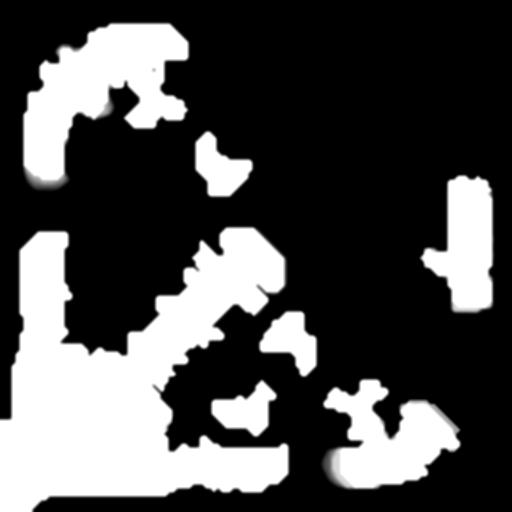

따라서 128x128를 512x512 해상도의 텍스처로 업스케일링을 합니다. 그러면 좀 더 촘촘해지겠죠? 그 후, 이 텍스처에 흐림(Blur)효과 처리를 적용하여 위 이미지처럼 부드러운 안개 효과를 만들어냅니다.

이 흐릿한 텍스처는 이후 렌더링 단계에서 지형이나 미니맵을 어둡게 만드는데 사용됩니다.

## B. Shadows

그림자는 3D 장면의 필수적인 부분입니다. 그림자가 없다면 물체들이 떠다니는 것처럼 보일 것입니다. 그림자를 만들기 위해서는 Scene에 있는 모든 물체를 광원 관점에서 렌더링을 해야합니다. LOL은 움직이는 물체에 대해서만 그림자를 동적으로 계산하고 있습니다. 이때 광원으로부터 그림자를 드리우는 오브젝트(Shadow Caster)까지의 거리(Depth)를 픽셀의 RGB 채널에 저장하게 됩니다. 알파 채널은 0으로 비워둡니다.

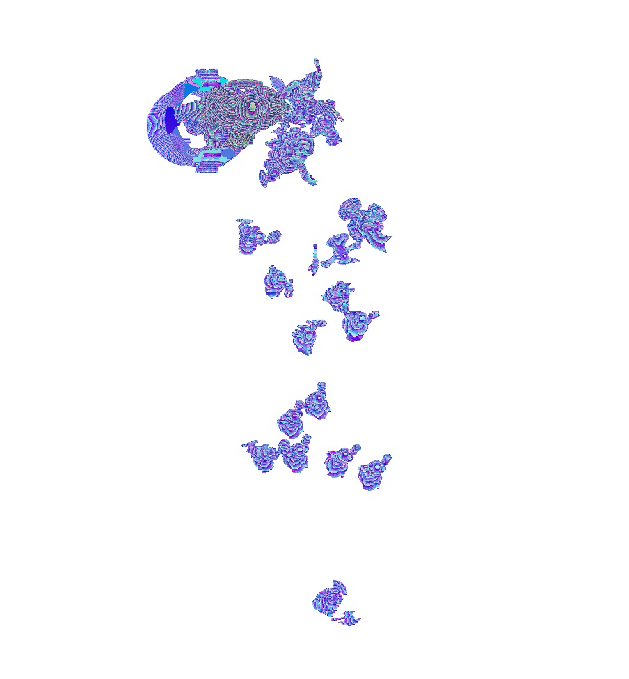

Fig 4는 RGB에 거리가 저장된 Height Field입니다. 타워, 미니언, 챔피언의 그림자를 볼 수 있습니다.

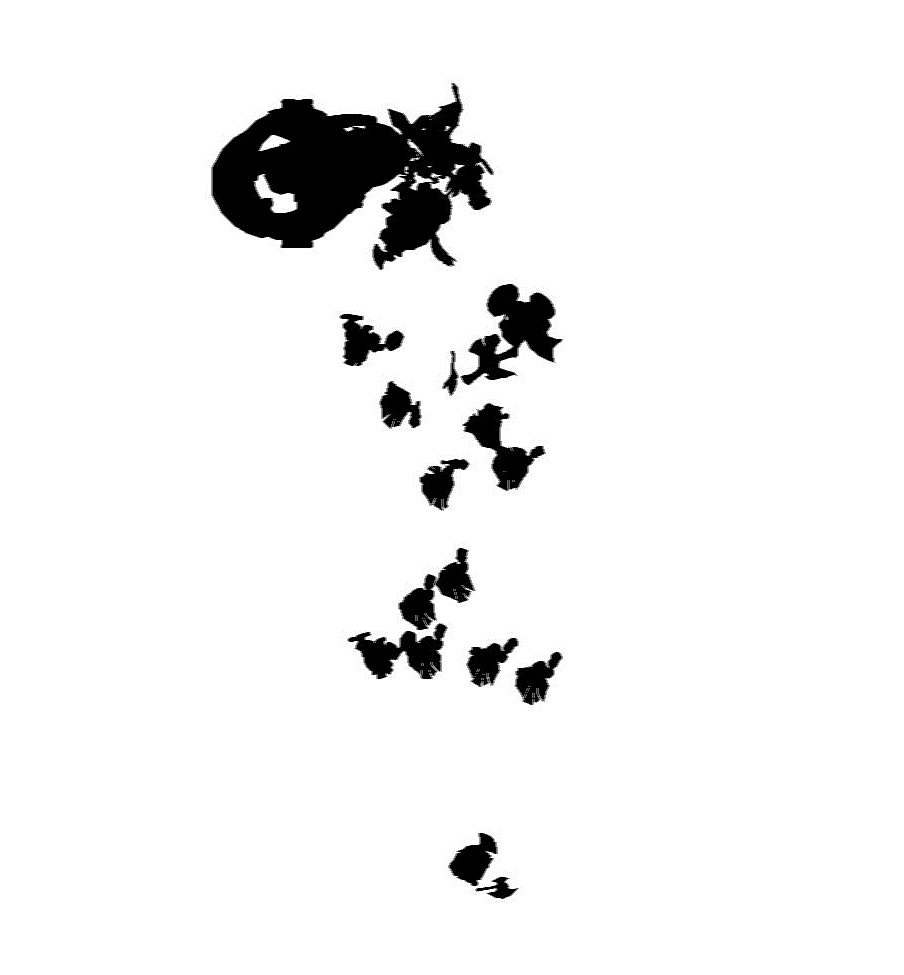

Fig 5는 비어있는 알파 채널입니다.

이렇게 생성된 ShadowMap은 부드러운 가장자리를 표현하기 위해 흐림(Blur)처리를 합니다. 이렇게 생성된 텍스쳐는 정적 지오메트리 위에 layer처럼 얹혀 그림자 효과를 구현하게 됩니다.

## C. Static Geometry

앞선 A와 B 과정이 끝나면, 애니메이션이 없는 지형과 구조물을 렌더링하게 됩니다. 이 과정에서 PixelShader는 여러 텍스처를 동시에 샘플링하여 최종 색상을 조합하는 `멀티 텍스처링(Multi-texturing)`을 수행합니다. 하나의 픽셀을 그리기 위해 다음 정보들을 결합하게 됩니다.

1. 지형 기본 텍스처 (예: 흙, 돌)
2. 사전 베이킹된(Pre-baked) 그림자 텍스처
3. B 과정에서 생성된 동적 그림자 맵
4. A 과정에서 생성된 FogOfWar 텍스처

2번의 사전 베이킹된 그림자 텍스처는 정적 지오메트리에 대한 것입니다. 소환사의 협곡은 정적 지오메트리 오브젝트에 대해 동적 그림자를 생성하지 않습니다. 아티스트가 미리 텍스처를 구워놓고 사용하게 됩니다. 이는 아티스트가 맵의 외형을 더 세밀하게 제어할 수 있게 하고, 성능을 크게 향상시킵니다.

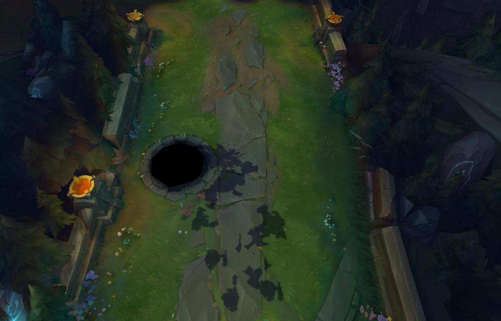

결과적으로 LOL에서 실시간 동적 그림자는 챔피언, 미니언, 타워뿐입니다. Fig 6을 보면 정적 지형의 그림자는 모두 그려져있으며, 미니언의 동적 그림자와 가장자리의 안개가 적용된 것을 볼 수 있습니다.

## D. Skinned Meshes

이제 지형과 그림자를 가지고 있으므로, 그 위에 실제로 움직이는 오브젝트를 넣을 수 있습니다. 먼저 챔피언, 미니언, 타워가 있습니다. 이 3가지 오브젝트는 `스키닝된 메시(Skinned Meshes)` 라고 할 수 있습니다.

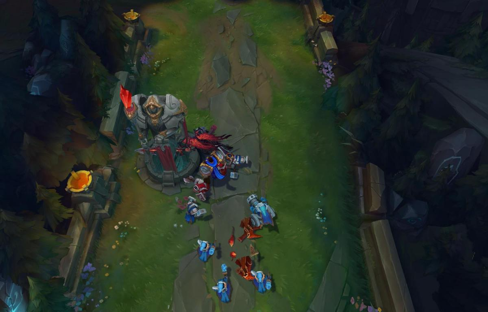

이 오브젝트들은 관절이 구부러지는 등 사실적인 움직임이 필요합니다. 이는 `스켈레탈 애니메이션(Skeletal Animation)` 기법을 통해 움직임을 구현합니다. 

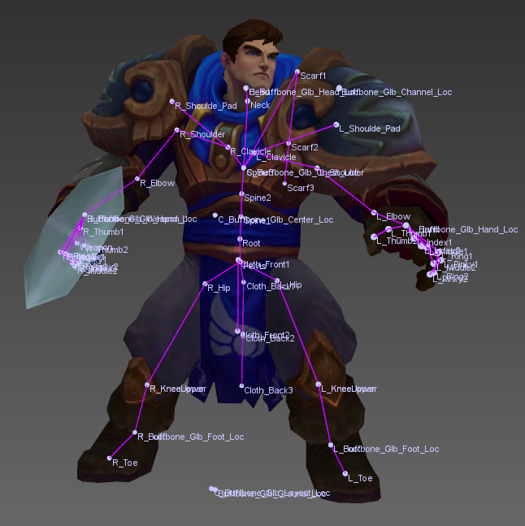

각 메시는 `스켈레톤(Skeleton)` 이라는 계층적 구조의 뼈대를 가지며, 모델을 구성하는 삼각형의 각 버텍스는 자신에게 영향을 주는 1개에서 4개의 뼈에 가중치가 할당됩니다. 뼈가 움직이면 가중치에 따라 버텍스들이 자연스럽게 따라 움직이기 때문에 스키닝 메시라고 불립니다.

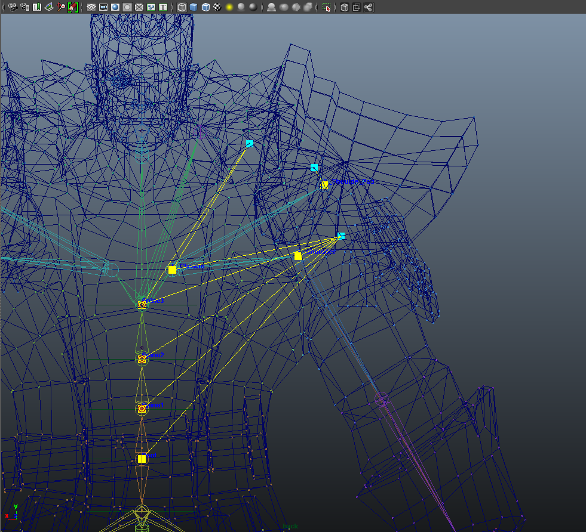

이 단계에서 Shader는 매우 복잡한 작업을 수행합니다. 모델을 프레임 버퍼에 그릴 뿐만 아니라, `프레넬(Fresnel, 물체 가장자리가 밝아지는 현상)` 및 발광(Emissive) 조명, Reflect 계산, FogOfWar에 따른 조명 변조 등을 처리하게 됩니다.

하지만 가장 핵심작업은 Scaled Depth를 다른 버퍼에 렌더링 한다는 점입니다. 이는 LOL 렌더러 엔진은 `MRT(Multiple Render Targets)`을 사용하고 있음을 시사합니다. 즉 GPU는 한 번의 드로우 콜로

- 버퍼 1: 화면 색상
- 버퍼 2: 뎁스 정보

를 동시에 출력합니다. 여기서 생성된 뎁스 버퍼는 다음 단계에서 사용하게 됩니다. MRT 방식은 씬을 두 번 그릴 필요없이(Z-Prepass 불필요), 한 번의 패스에서 효율적으로 다음 단계의 재료를 준비하는 최적화된 접근 방식이라 할 수 있습니다.

## E. Outline(INKING)

기본적으로 LOL은 Skinned Mesh들에 잉크 같은 윤곽선을 활성화되어 있습니다. 이것은 배경, 특히 저조도 영역에서 스킨 메쉬를 시인성을 높이는데 도움이됩니다.

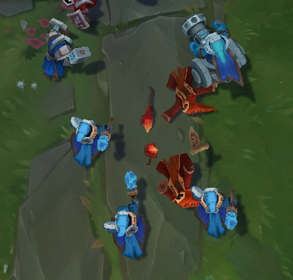

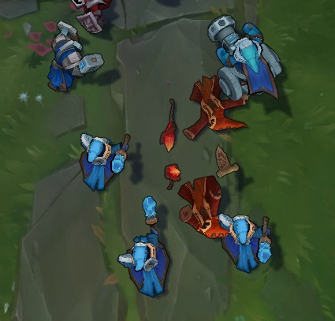

MRT를 통해 별도로 저장해 둔 뎁스 버퍼를 가져와 [`소벨 필터(Sobel filter)`](https://en.wikipedia.org/wiki/Sobel_operator) 라는 이미지 처리 기법을 적용합니다. 짧게 설명하자면, 소벨 필터는 특정 픽셀과 그 주변 픽셀 간의 뎁스 값 차이를 감지합니다. 뎁스 값이 급격하게 변하는 곳, 즉 모델의 가장자리나 꺾이는 부분을 감지하여 그곳에 선을 그리는 포스트 프로세싱 기법입니다.

그런데 WindowXP를 사용하는 구형 GPU에서는 MRT 기법을 지원하지 않습니다. 이에 LOL 렌더러 엔진을 Fallback 방식을 통해 구형 GPU에서는 스텐실 버퍼를 통해 아웃라인 처리를 하고 있습니다.

스텐실 버퍼를 이용한 고전적인 아웃라인 기법은 다음과 같습니다.

1. 오브젝트를 살짝 크게 만든 뒤, 뒤쪽 면(back-face)만 검은색으로 렌더링합니다.
2. 그 위에 앞쪽 면(front-face)을 정상적으로 렌더링합니다.
3. 결과적으로 크게 만든 뒤쪽 면이 테두리처럼 보이게 됩니다.

## F. Grass

지형과 캐릭터가 그려진 후, 환경을 풍부하게 만드는 잔디가 렌더링됩니다. LOL에서 잔디는 단순 텍스처나 정적 메시가 아닌 스키닝 메시로 처리되고 있습니다.

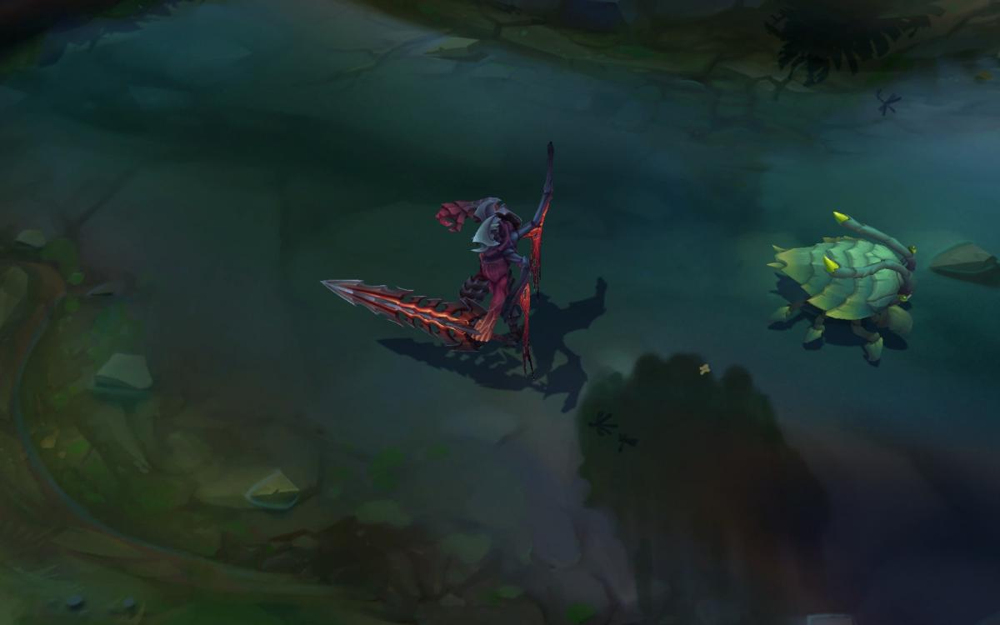

이는 매우 창의적이지만 동시에 연산 비용이 비싼 접근 방식입니다. 보통의 게임에서 잔디는 VertexShader에서 간단한 노이즈 함수로 바람에 흔들리는 효과를 줍니다. 그러나 LOL 에서는 잔디에 뼈대를 심어 스키닝을 하는데, 이는 바람에 흔들리는 효과뿐만 아니라 플레이어가 그 위를 지나갈 때, '물리적으로 상호작용하는'듯한 애니메이션까지 구현할 수 있습니다.

Fig 12을 보면 잔디 자체의 그림자는 미리 구워진 상태입니다.

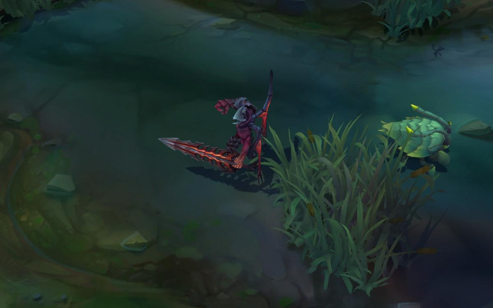

## G. Water

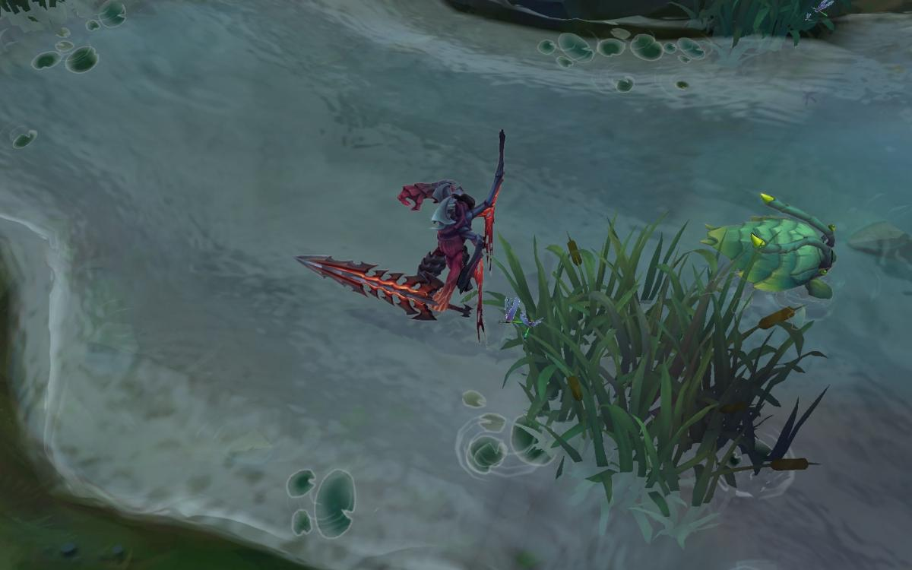

다음은 강을 채우는 물입니다. 물은 `알파 블랜딩(Alpha Blending)`이 필요한 반투명 오브젝트입니다. 그래픽스 파이프라인에서 반투명 오브젝트는 항상 모든 불투명 오브젝트가 그려진 후에 렌더링되어야 올바른 깊이와 혼합을 표현할 수 있습니다.

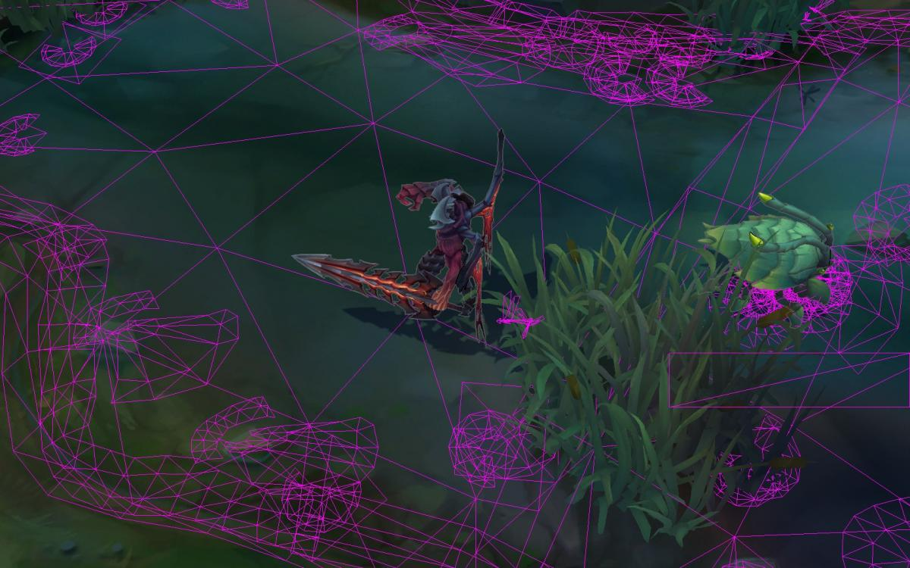

물은 미묘하게 움직이는 웨이브 텍스처가 적용된 반투명 메시로 렌더링됩니다. 여기에 생동감을 더하기 위해 수련잎, 바위나 강가 주변의 잔물결, 그리고 작은 곤충들이 추가되며, 이들 모두 애니메이션됩니다.

## H. Decal

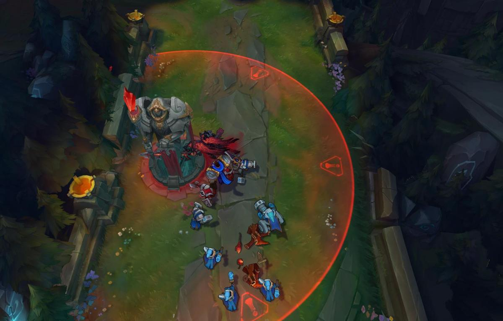

물과 잔디 위에 `데칼(Decals)`이 추가됩니다. 데칼은 지형 위에 겹쳐지는 단순하고 평평한 텍스처 지오메트리입니다. 가장 대표적인 예가 바로 타워 사거리 표시기입니다.

## I. Special Outlines

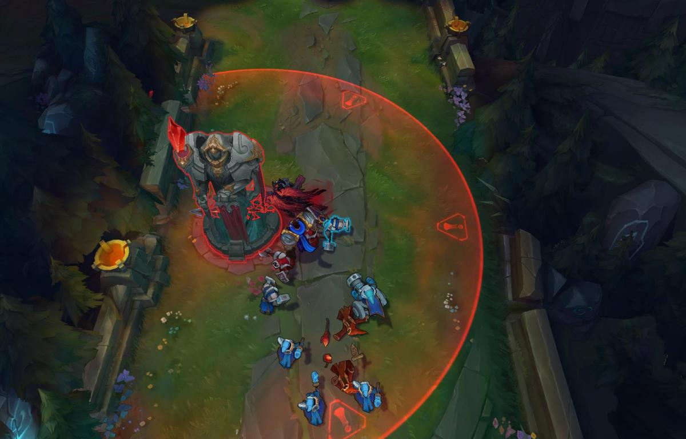

다음은 특정 상황에서만 발생하는 특수 아웃라인입니다. 예를 들어 챔피언이 타워에 마우스 오버 상태가 되거나, 타워가 피격 상태에 들어가면 발생하는 더 두꺼운 외곽선입니다.

처리 방식은 Inking과 유사하지만, 아웃라인을 더 두껍게 만들기 위해 추가적인 블러 처리가 들어가게 됩니다. 이 아웃라인은 물과 데칼 위에도 그려져야 할 수 있으므로, 해당 요소들보다 나중에 렌더링됩니다.

## J. Particles

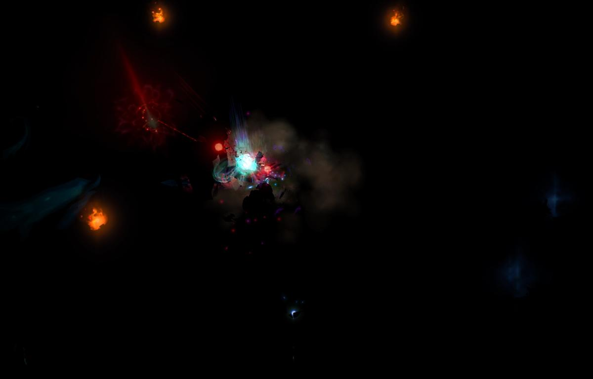

LOL 렌더링 파이프라인에서 가장 중요하고 성능에 큰 영향을 미치는 단계 중 하나가 바로 `파티클(Particle)`입니다. 게임 내 모든 주문, 버프, 효과는 전부 애니메이션되고 업데이트되어야 하는 파티클 시스템입니다.

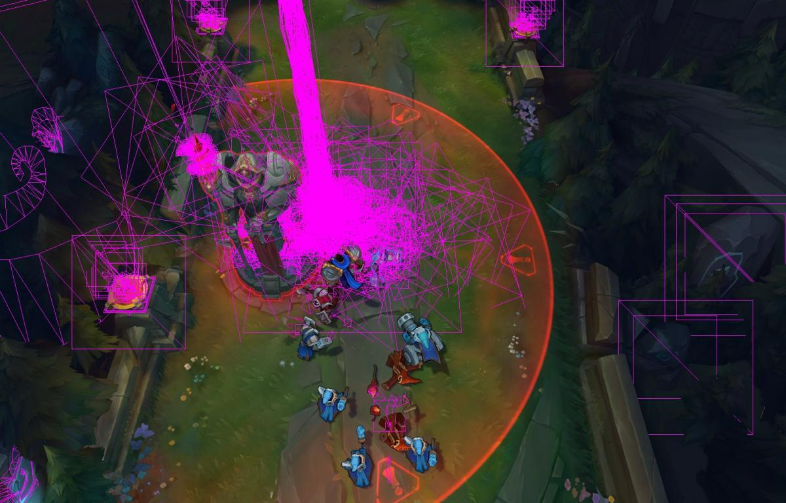

Fig 19의 와이어프레임 이미지에서 보듯이, 파티클은 단순한 평면(Quad)나 간단한 지오메트리로 구성됩니다. 이 평면들에 텍스처를 입히고 반투명하게 겹겹이 그려 스킬 이펙트를 표현합니다.

이 단계가 성능의 핵심 병목인 이유는 전체 트라이앵글 중 9만 개(전체의 45%)가 오직 파티클 렌더링하는데 사용됩니다. 이는 5vs5 대규모 팀 전투가 벌어질 때 왜 프레임이 급격히 떨어지는지 알 수 있는 부분입니다. 10명의 챔피언이 동시에 스킬을 사용하면, 9만 개의 트라이앵글은 순식간에 두 배, 새 배로 폭증할 수 있습니다.

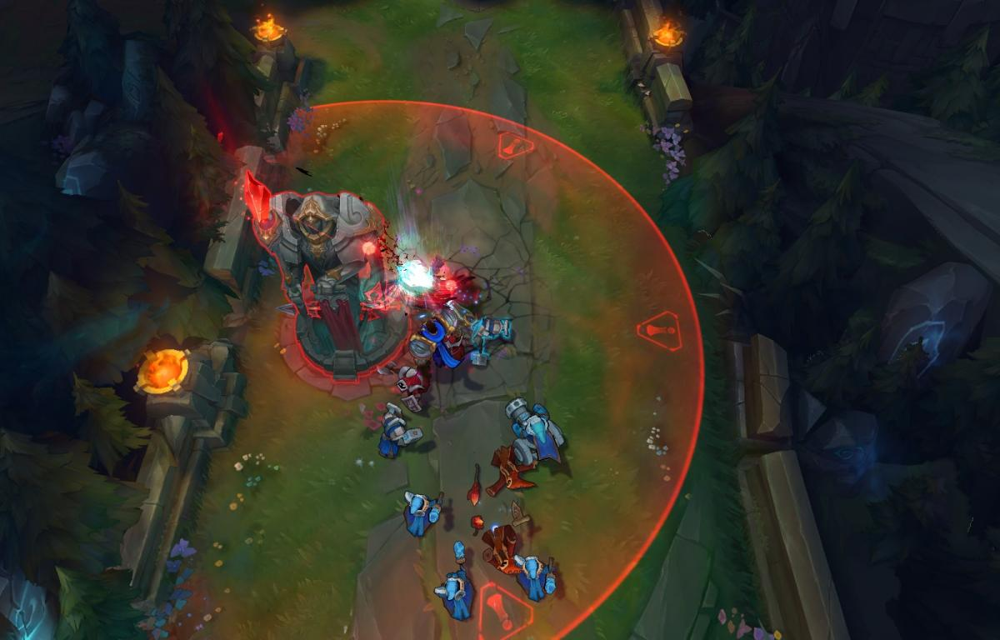

## K. Post-process Effects

이제 거의 모든 렌더링 단계가 끝났습니다. 이 단계에서는 렌더링된 프레임 버퍼 전체를 다듬는 과정이 진행됩니다. 후처리 과정이라도 불리는데 두 단계로 수행됩니다.

1. 안티앨리어싱(AA): 'FXAA(Fast-Approximate Anti-Aliasing)' 알고리즘을 사용하여 이미지의 들쭉날쭉한 가장자리를 부드럽게 처리합니다.

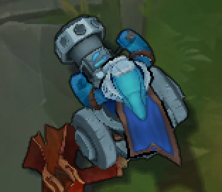

Fig 21에서 보듯이, FXAA 적용 후 미니언의 외곽선이 부드러워지며, 고대비 가장자리가 움직일 때 발생하는 `Pixel Shimmer`를 제거하여 전반적인 더 깔끔한 이미지를 만듭니다. FXAA는 씬을 여러 번 렌더링하는 MSAA와 달리, 이미 완성된 이미지를 처리하는 가성비 기술입니다.

2. 감마 보정(Gamma Correction): 씬의 전반적인 밝기(Brightness)를 조절합니다.

2017년 당시 이 감마 보정에서 매우 영리한 최적화가 진행되었습니다. 바로 '사망 정보 화면'의 채도 감소 효과를 감마 보정 패스에 통합한 것입니다.

")

")

이전의 비효율적인 방식은 챔피언이 죽었을 때, 지형, 캐릭터, 잔디 등의 모든 메시 셰이더를 '채도 감소용 셰이더'로 교체하고 씬을 다시 렌더링하는 방식이었습니다. 이는 수백 개의 추가 드로우 콜을 유발했는데요. 새로운 최적화 방식은 어치피 모든 픽셀이 이 감마 보정 셰이더를 통과한다는 점을 이용합니다. 챔피언이 사망하면 이 감마 보정 셰이더에 "만약 죽음 상태 플래그가 켜져 있다면, 채도를 낮춰" 라는 간단한 if문 추가만으로 대체하였습니다.

## L. Damage & Health Bars

체력 바, 데미지 텍스트, 화면 상의 텍스트 및 피격 효과와 스킬 사거리 표시기가 렌더링 됩니다.

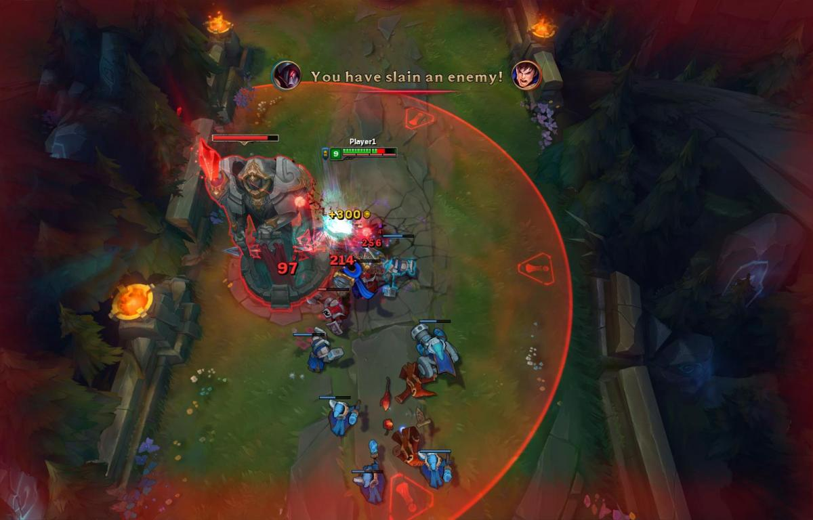

## M. HUD

마지막으로 사용자 인터페이스가 렌더링됩니다. 텍스트, 스킬 아이콘, 아이템 등의 이미지처럼 씬의 가장 위에 겹쳐지는 개별 텍스처로 그려집니다. 이 분석 예제에서 HUD에는 1,000개의 트라이앵글이 사용되었고 미니맵에 300개, 나머지에 700개가 사용되었습니다.

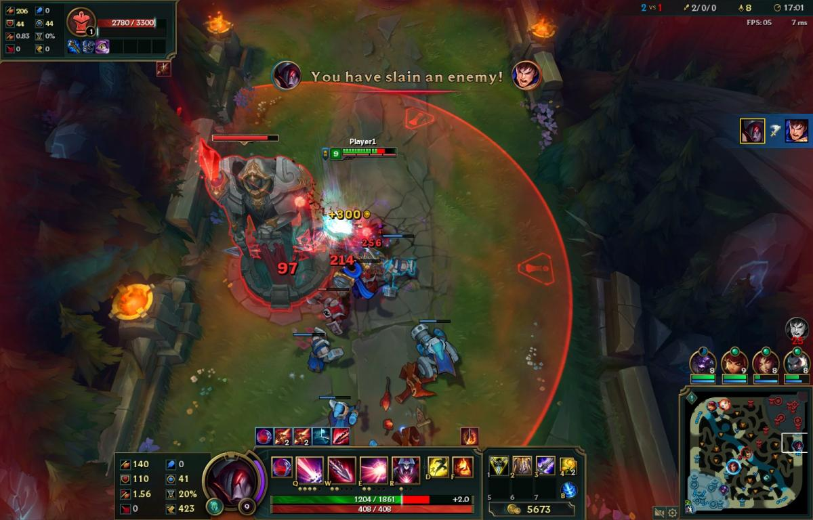

# 3. 한 프레임의 완성

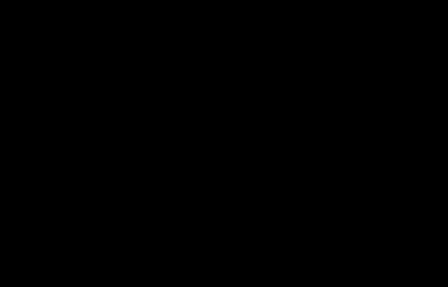

이 13단계를 거쳐 Fig 28과 같은 최종 프레임이 완성됩니다. 통계로 알아보면,
- 총 트라이앵글: 약 200,000개
    - 파티클: 90,000 개
- 드로우 콜: 695개
- 렌더링된 픽셀: 28,000,000개

이 모든 작업은 게임이 플레이 가능하다라고 느껴지도록 극도로 빠른 시간 안에 처리되어야 합니다. 만약

- 초당 60프레임 목표: GPU는 이 모든 렌더링 작업을 16.66ms 미만으로 완료해야 합니다.
- 초당 300프레임 목표: 하이엔드 및 프로게이머를 위한 목표로 모든 작업은 3.3ms 미만에 완료되어야 합니다.

여기서 중요한 점이 이 시간 예산이 GPU에게만 주어지는게 아닌 CPU 역시 3.3ms 안에 게임 로직, 입력 처리, 충돌 계산, 파티클 처리, 애니메이션 업데이트, GPU에게 렌더링 명령 제출까지 모두 완료해야합니다. 이 통계에서 중요한 점은 3.3ms 안에 695개의 드로우 콜을 준비해야하는 CPU입니다.

다시 돌아와서 DX9는 드로우 콜 당 CPU 오버헤드가 매우 크며, 여러 CPU 코어에 효율적으로 분배하지 못합니다. 따라서 LOL이 CPU의 단일 코어 성능이 중요한 게임이라고 불린 이유이기도 합니다.

# 4. 렌더링 리팩토링

LOL 렌더링 엔진은 수년간의 서비스 기간 동안 끊임없이 진화하고 변경되어 왔습니다. 그 결과 코드베이스에는 몇 가지의 다른 버전의 렌더링 코드가 공존하고 있던 상태였습니다. 또 가장 큰 문제는 맵마다 렌더링 방식이 미묘하게 다르다는 것입니다.

소환사의 협곡과 칼바람 나락은 약간 다른 방식으로 렌더링됩니다. 코드베이스에 오래된 버전의 렌더러에서 남긴 잔해나,완성되지 못한 기능의 흔적들이 남아있습니다. 이러한 점들은 개발 속도를 저해하고 버그를 유발하는 주된 원인이었죠.

따라서 `LOL 렌더 스트라이크 팀`의 목표는 `모든 렌더링 코드는 정확히 동일한 인터페이스를 통해 일어나도록 리팩토링하는 것`입니다. 원문에서 성공의 기준을 매우 겸손하게 제시하는데 "유저들이 아무런 차이를 눈치채지 못하고 기껏해야 여기저기서 약간의 속도 향상만을 느끼게 될 것"이라고 말합니다. 이 리팩토링에 진정한 목표는 당장의 그래픽 개선이나 성능 향상이 아닌 미래를 위한 준비였습니다.

---

# 5. 마무리

2017년 LOL에서는 대규모의 렌더러 엔진 수정이 있으면서 해당 아티클을 공유했습니다. 그리고 25년 현재 점점 업데이트하여 [Direct11 까지 렌더러 엔진 업데이트](https://support-leagueoflegends.riotgames.com/hc/ko/articles/201752654-%EC%B5%9C%EC%86%8C-%EB%B0%8F-%EA%B6%8C%EC%9E%A5-%EC%8B%9C%EC%8A%A4%ED%85%9C-%EC%82%AC%EC%96%91-%EB%A6%AC%EA%B7%B8-%EC%98%A4%EB%B8%8C-%EB%A0%88%EC%A0%84%EB%93%9C)가 진행되었습니다. 2017년의 당시의 바람대로 유저들은 느끼지 못했지만, 롤은 점점 더 향상되었다는 것을 알 수 있었네요. 이 글이 게임 개발자 여러분에게 도움이 되었으면 좋겠습니다.
