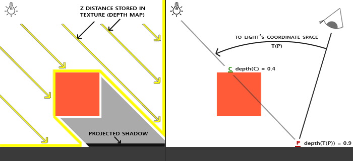
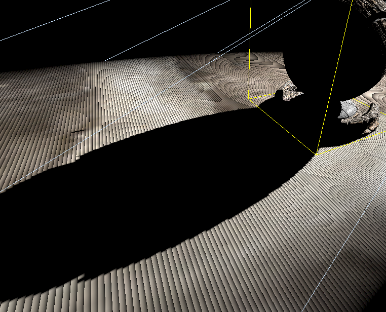
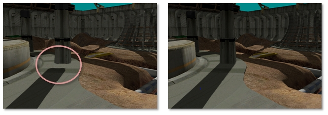
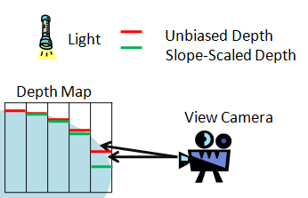

# 들어가며

빛이 있으면 그림자도 있는 법입니다. 이전 게시글에서는 게임에서 빛을 사용하는 조명 모델에 대해 알아보았습니다.

이번 시간에는 빛을 받은 물체의 그림자를 표현하는 방법에 대해 알아보겠습니다.

## 그림자 맵(Shadow Map)

그림자 맵은 1978년에 처음 소개된 기술입니다. 물론 발표가 되고 나서도 한참 동안 하드웨어의 성능 문제로 인해 동적으로 그림자를 보여준다는 건 어려웠습니다.

")

이후, 시간이 지나 하드웨어 성능과 소프트웨어가 발전하면서 실시간 그림자 구현은 게임에 필수 요소로 자리잡게 됩니다.

## 멀티 패스 렌더링

그림자 맵은 2개의 렌더링 패스로 구현하게 됩니다. 

- __Pass 1__ : 라이트 공간에서 깊이(Depth) 정보만을 가진 텍스쳐를 생성합니다.
- __Pass 2__ : 카메라 시점에서 씬을 렌더링하고, 각 픽셀을 그릴 때마다 이전에 생성된 깊이 텍스처를 참조하여 해당 픽셀이 가려지는지 판별합니다.

그림으로 보시면 더 이해가 잘 되실텐데, 오른쪽에 C 와 P를 보시면 됩니다. P는 카메라 시점에서 빛의 시점으로 변환하고 바라본 한 정점의 위치입니다. 그 정점은 현재 (0.9)의 깊이 값을 가지고 있네요. 다음으로 C를 봅시다. C는 미리 빛의 시점으로 바라본 텍스처에 저장된 깊이 값입니다. (0.4)의 깊이 값을 가지고 있네요. 즉, 현재 내가 바라보고 있는 정점은 빛에서 바라 보았을 때, 그림자 지고있는 부분입니다.

이런 식으로 2단계의 렌더링 패스를 거쳐서 그림자 유무를 판별하게 됩니다.

## 아티팩트

이렇게 깊이 정보를 비교하다 보니 비교가 잘못되거나 뷰 공간 픽셀과 그림자 맵 텍셀 간의 매핑이 1:1이 아닌 상황이 발생합니다. 이러한 경우를 `그림자 아트팩트` 라고 부르는데요. 몇 가지만 소개하겠습니다.

### 아크네 & 셀프 섀도잉

해당 현상은 텍셀 단위로 깊이가 정량화가 진행되고 셰이더가 실제 깊이를 비교할 때 잘못된 셀프 섀도우를 생성해서 만들어지는 현상입니다.

그림처럼 바닥에 줄이 그어진 모습이 보이시죠? 이게 아크네라고 부르는 형상인데 실제로는 앞에 아무것도 없지만 자기 자신이 빛을 가리고 있다고 생각하여 그림자가 생성된 모습입니다.

이를 해결하기 위해선 기울기 기반 bias를 추가하거나 라이트 시야의 근, 원 평면 바운드를 최대한 타이트하게 조절해야합니다.

### 피터 패닝

피터 패닝은 그림자가 물체에서 분리되어 공중에 떠있는 것처럼 보이는 현상입니다.

이 역시도 깊이 오프셋 값과 근, 원 평면을 조정해서 완화해야 합니다.

### 개선 방법

이러한 아트팩트를 개선하기 위해서는 

- 기본적인 그림자 구현
- 프러스텀과 근, 원 평면을 타이트하게 설정
- 기울기 기반 바이어스를 적용하는 등 기본 계산 최적화
- 더 높은 품질을 위한 추가 알고리즘 선택

등을 활용해보면 좋을 것 같습니다.

그 중 가장 기본적이면서, 효과가 좋은 `Slope-Scale Depth Bias` 를 소개해드리겠습니다.

해당 기법은 Z-Fighting 현상을 해결하는 기법입니다. 쉽게 말해, 거의 같은 깊이(혹은 거리)에 있는 두 개의 면이 서로 누가 앞에 있는지 싸우면서 깜빡거리거나 깨져 보이는 현상을 막기 위해, 특정 폴리곤의 깊이 값에 __의도적으로 약간의 오차(bias)__ 를 더해주는 기술입니다.

카메라를 정면으로 바라보는 평평한 면은 기울기가 작고, 비스듬히 보는 가파른 면은 기울기가 큽니다. 이에 비례하여 오차 값을 적용하는 것이 바로 Slope-Scale 입니다.

# 마무리

지금까지 그림자 맵의 기본 원리부터 렌더링 과정, 그리고 그림자 아티팩트를 해결하기 위한 노력까지 살펴보았습니다. 광원의 시점에서 깊이 맵을 미리 그려본다는 기발한 아이디어에서 출발한 그림자 맵은, 오늘날 실시간 렌더링에서 빼놓을 수 없는 핵심 기술로 자리 잡았습니다.

완벽한 그림자를 만들기 위해서는 수많은 아티팩트와의 싸움이 필요하지만, 그만큼 그림자는 씬의 깊이와 현실감을 더해주는 가장 강력한 요소 중 하나입니다. 이 글을 통해 그림자가 우리 화면에 어떻게 그려지는지에 대한 이해에 도움이 되셨기를 바랍니다.