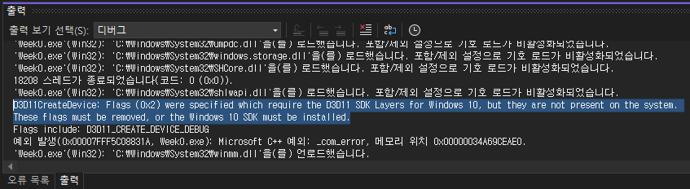
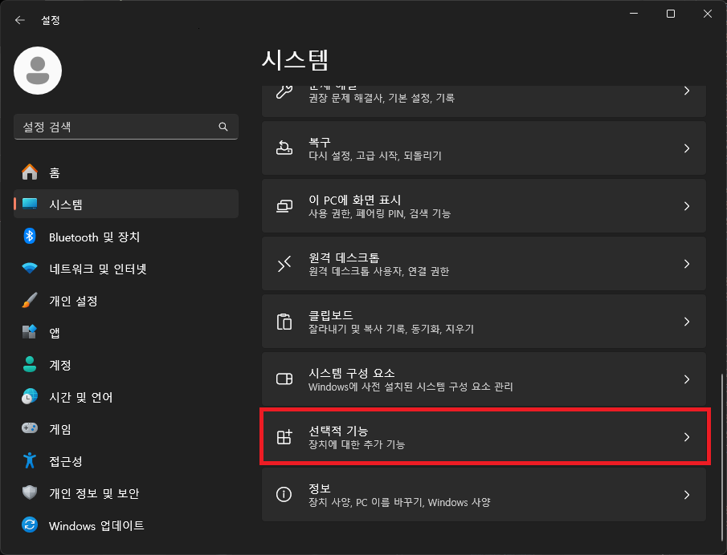

# 목표

DirectX11의 CreateDeviceAndSwapChain 함수의 실패의 원인을 찾고 해결하기

# 들어가며

오늘은 DirectX11 튜토리얼 도중 만난 오류 해결 과정에 대해 이야기 해보려고 합니다.

튜토리얼을 따라가던 도중 Device 와 SwapChain이 초기화가 안되는 문제를 만나게 됩니다.

다음과 같은 오류를 발생하면서 말이죠.

위 내용을 해석하면 다음과 같습니다.

> Windows 10용 D3D11 SDK Layers가 필요한 플래그가 지정되었지만, 시스템에 해당 SDK가 설치되어 있지 않습니다. 이러한 플래그를 제거하거나 Windows 10 SDK를 설치해야 합니다.

그런데 저는 SDK가 설치되어 있었고, 따로 설정을 건드리지 않았어서 해당 오류를 좀 더 찾아보았습니다.

# 해결

결과적으로 윈도우의 __그래픽 도구__ 를 활성화 시켜야 합니다.

다음은 윈도우10 & 윈도우11 에서 그래픽 도구를 활성화 하는 방법입니다.

1. 설정 열기

2. 시스템 탭 이동

3. 선택적 기능 선택

4. 선택적 기능 추가 및 그래픽 도구 검색

5. 그래픽 도구 추가

> 설치 시 `0x80070005` 오류가 발생한다면 __Windows 업데이트 기능을 활성화__ 해주셔야 합니다.
>
> 알 수 없는 오류가 발생되었다고 하면 그냥 다시 한 번 진행하시면 됩니다.