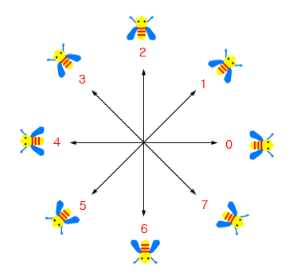

# 구현 목표
벡터의 내적과 외적을 이용해서 캐릭터의 진행 방향 알아보기

# 구현 과정

:::github{repo="Xerlocked/LightSwitchPlugin"}

## 1. 캐릭터의 방향



먼저, 캐릭터의 방향입니다.

캐릭터의 방향은 2D 공간에서는 상하좌우(4방향), 3D 공간에서는 상하좌우 4방향 + 대각 4방향으로 총 8방향입니다.

이러한 방향의 각도는 `-180도 ~ 180도` 사이의 값으로 모두 표현이 가능하답니다.

## 2. 두 벡터 정하기


위 이미지의 파란선은 캐릭터의 `ForwardVector`, 빨간선은 `VelocityVector` 입니다.

이미지에서는 진행 방향에 따른 애니메이션이 재생하고 있지만 저희는 `앞으로 가는 애니메이션`만 있다고 가정해보죠.

여기서 중요하게 봐야하는 것은 `VelocityVector`입니다. 캐릭터가 어느 쪽으로 힘(속도)를 내고 있는지 알려주고 있어요. 설정 값에 따라 달라지겠지만 지금은 기본 속도인 600으로 움직이네요.

그러면 이러한 의문이 들 수 있습니다.
> _진행방향은 VelocityVector만 구하면 되는거 아닌가요?_

맞습니다. 물리에서 벡터는 방향을 가진 스칼라 값이죠. 하지만 우리는 애니메이션을 사용합니다. 그러면 애니메이션을 볼까요?

언리얼 애니메이션 블랜드 스페이스는 float의 입력값을 가지고  상태를 변경합니다. 그래서 위의 Vector형태로는 입력할 수 없어요.

그래서 이를 `실수값`으로 바꿔주는 겁니다.

다시 두 벡터로 돌아와서, 그러면 왜 하필 `ForwardVector` 와 `VelocityVector` 일까요?

이는 앞서 설명한 `-180도 ~ 180도` 사이의 각도를 표현할 수 있기 때문입니다. 위 이미지를 다시 보시면 두 벡터의 각도가 이 사이의 값인 걸 볼 수 있을거에요.

## 3. 벡터의 내적

일반적으로 두 벡터 사이의 각도를 계산하기 위해서는 내적을 사용합니다.

언리얼에서는 FMath의 `DotProduct` 함수를 사용하시면 됩니다.

내적 공식은 다음과 같습니다.

$$\mathbf{A} \cdot \mathbf{B} = \Vert\mathbf{A}\Vert \Vert\mathbf{B}\Vert \cos(\theta)$$

내적을 통해 최종 값은 알아내었는데, 각도는 아직이죠. 각도는 아크 코사인을 통해 알아낼 수 있습니다.
언리얼에서는 `Acos` 함수를 사용하면 됩니다.


위 이미지의 왼쪽 상단을 보시면 방향에 맞는 각도가 출력되고 있어요. (잘 안보이네요)

`W: 0 / S: 180 / A: 90 / D: 90`

그런데 좌우의 값이 똑같습니다. 이렇게 된다면 우리가 왼쪽으로 움직이는지 오른쪽으로 움직이는지 알 수가 없습니다.
이러한 경우 어떻게 해야 될까요?

## 4. 벡터의 외적

이전까지 두 벡터의 각도의 값을 구해보았습니다. 이제 남은 문제는 각도의 부호를 결정하는 것이네요.
각도의 부호를 결정하려면 외적을 사용하면 됩니다.

이 역시 언리얼에서 함수를 제공하고 있어요. FMath의 `CrossProduct`가 그것인데요.
여기서 중요한 점은 외적을 통해 두 벡터의 방향을 결정할 수 있다는 것입니다.

외적을 이용하면 최종적으로 두 벡터에 대해 수직인 벡터를 구할 수 있습니다.

:::note
언리얼 엔진은 왼손 좌표계를 이용합니다.
:::


위 이미지의 왼쪽 상단을 보시면 부호있는 값이 출력되고 있어요.

`W: 0 / S: 0 / A: -1 / D: 1`

## 5. 적용

이제 앞 선 과정들을 적용하는 단계만 남았습니다. 내적의 값과 외적의 값을 곱하자니 W,S 에서는 0이 나오게 됩니다.
부호만 따로 가져올 수 없을까요?

언리얼에서는 이 기능 역시 제공합니다. FMath의 `Sign` 함수인데요. 이 함수를 사용하면 해당 값의 부호를 가져올 수 있습니다.

다음은 위 과정을 언리얼 코드로 변환한 것입니다.
``` cpp
float AHeroCharacter::GetMovementDirection() const
{
    if(GetVelocity().IsZero()) return 0.0f;

    // Velocity의 노멀벡터
    const auto VelocityNormal = GetVelocity().GetSafeNormal();

    // 아크 코사인을 통해 두 벡터 사이의 각도 구하기
    const auto AngleBetween = FMath::Acos(FVector::DotProduct(GetActorForwardVector(), VelocityNormal)); 

    // 외적을 통한 부호 가져오기
    const auto CrossProduct = FVector::CrossProduct(GetActorForwardVector(), VelocityNormal);

    // 최종 값 반환 -180 ~ 180
    return FMath::RadiansToDegrees(AngleBetween) * FMath::Sign(CrossProduct.Z);
}
```

---

# 마무리

오늘 게시글에서는 내적과 외적을 이용한 두 벡터의 진행 방향을 알아보았습니다.