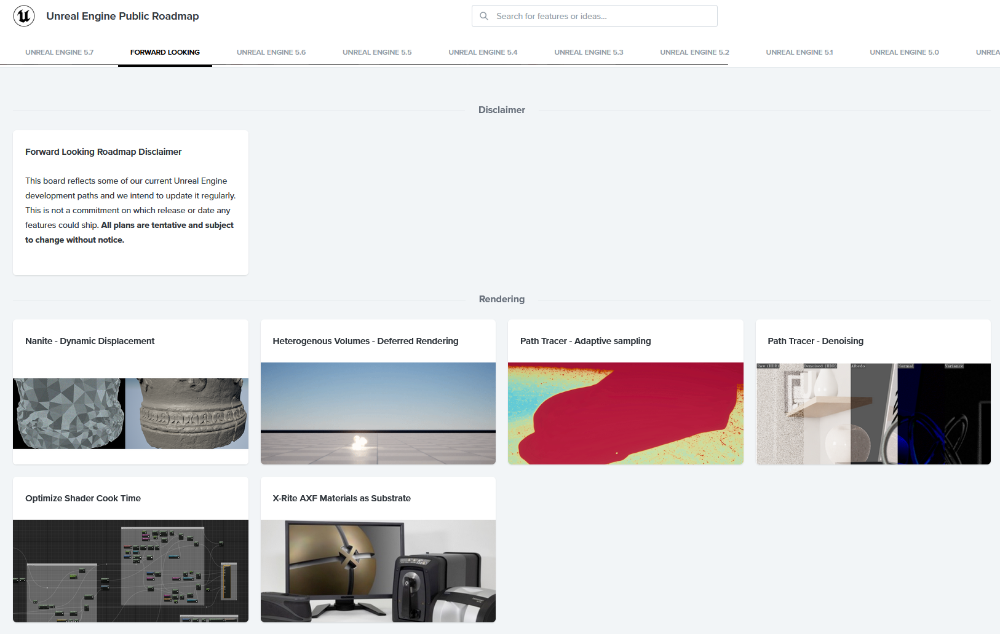

# 들어가며

언리얼에서는 캐릭터 하나를 움직이게 하기 위해 AnimBP를 생성하고, Blend Space를 연결하고, CMC(CharacterMovementComponent)를 통해 이동 관련 처리를 했습니다. 그게 지금까지의 언리얼 엔진의 방식이었습니다. 그리고 이 방식은 꽤 오랫동안 유지되어 왔습니다.

그런데 요즘 언리얼 릴리즈 노트를 보면 낯선 이름들이 보입니다. **Motion Matching**, **Chooser**, **State Tree**, **Mover**, **GameplayCamera** 등 이러한 신규 기술들은 공식 문서는 얇거나 없으며, 레퍼런스는 드물고, 튜토리얼은 거의 없습니다. 물론 샘플 프로젝트를 제공하고 있어서 직접 하나씩 찾아보면 배울 수 있습니다.

하지만, 앞으로 언리얼 엔진이 기술 전환을 예고하고 있는 만큼, "일단 쓰던 거 쓰지 뭐" 라고 넘기기에는 무시 못할 전환 속도라는 겁니다.
그래서 저는 `Next Unreal` 이라는 이름의 시리즈를 작성하려고 합니다.

---

# 왜 지금인가?

언리얼 5는 단순한 버전 업이 아니었습니다. `Nanaite`, `Lumen`처럼 렌더링 기술만 바뀐 게 아니라, 게임플레이를 구성하는 방식 자체가 바뀌고 있습니다.

> 미래에 **애님 블루프린트를 대체할** 언리얼 애니메이션 프레임워크(Unreal Animation Framework, UAF)를 향해 나아가면서, 컨트롤 릭과 UAF의 보다 깊은 통합을 위한 기반을 마련하기 위해 일부 프로시저럴 노드를 컨트롤 릭으로 이전하고 있습니다. 
>
>__- 출처: [언리얼 엔진 기술 블로그](https://www.unrealengine.com/tech-blog/explore-the-updates-to-the-game-animation-sample-project-in-ue-5-7?lang=ko)__

|기존 방식|새로운 방식|
|---|---|
|Anim Blueprint + State Machine|Motion Matching + UAF|
|Behavior Tree + Blackboard|State Tree|
|Camera Component + Spring Component|Gameplay Camera System|
|Character Movement Component|Mover|

이게 단순한 기능 추가가 아니라, 에픽이 기존 시스템의 구조적 한계를 인정하고, 새로운 패러다임으로 대체하고 있습니다. AnimBP의 스파게티 노트, BT의 확장성 한계, CMC의 네트워크 복잡성, 실무에서 맞닥뜨렸던 불편함들이 새로운 시스템들의 설계 배경이라고 할 수 있습니다.

---

# 이 시리즈에서 다루는 것

현재는 총 6개의 주제로, 11편의 글 구성으로 생각하고 있습니다.

- **Vol.1 - Chooser**
    - 데이터 기반으로 분기를 처리하는 새로운 선택 시스템
- **Vol.2 - Pose History**
    - Motion Matching에서 과거 자세와 궤적을 기억하는 방식
- **Vol.3 - Motion Matching + UAF**
    - AnimBP를 대체하는 새로운 애니메이션 시스템
- **Vol.4 - Mover**
    - 모듈형 이동 시스템
- **Vol.5 - Gameplay Camera System**
    - 상황별 카메라 전환을 유연하게 설계하는 방법
- **Vol.6 - State Tree**
    - 계층형 상태 머신, AI 행동을 데이터 중심으로 설계

---

# 시리즈를 읽는 방법

순서대로 읽는 걸 권장합니다. 특히 Chooser와 Pose History는 이후 시리즈에서 전제 지식처럼 등장합니다. 처음부터 따라오면 흐름이 자연스럽게 연결됩니다.

각 글은 이론보다는 언리얼에서 제공하는 샘플 프로젝트를 바탕으로 작성했습니다. 개념을 이해한 뒤 자신의 프로젝트에 적용해볼 수 있도록 구성해보겠습니다.

---

# 마지막으로

새로운 시스템은 언제나 낯설고, 처음엔 이전 방식이 더 편하게 느껴집니다. 그 감각은 지극히 자연스럽습니다.

하지만 한 가지는 분명합니다. 에픽 게임즈가 거대한 파도를 일으키고 있다면, 우리는 그 파도에 휩쓸려 가는 것이 아니라 가장 높은 곳에서 파도를 타는 서퍼가 되어야 합니다. 변화의 물결이 모두에게 닿기 전, 우리가 먼저 그 흐름을 타고 정상으로 나아갑시다

**잘 부탁드리겠습니다.**