# 들어가며

AnimBlueprint 안에서 `Speed`, `Direction`, `IsJump` 와 같은 변수들을 통해 StateMachine의 애니메이션을 변경하다 보면 어느 순간 노드가 스파게티가 됩니다. State Machine 안에 State가 늘어날수록, 각 Transition 조건은 점점 복잡해지고 유지보수는 점점 어려워집니다.

Chooser는 이 문제를 해결하기 위한 아이디어에서 시작하였습니다. **"어떤 애니메이션을 재생할지"를 Blueprint가 아닌 데이터 테이블로 결정**하게 만드는 것입니다. 조건을 노드로 연결하는 대신, 스프레드시트처럼 행과 열로 관리하는 것이죠.

이 글에서는 Chooser Table이 어떤 구조로 동작하는지, 그리고 실제로 어떻게 AnimBP와 연결하는지를 다룹니다.

---

# Chooser란 무엇인가

Chooser는 **입력 파라미터(조건)를 기반으로 Output(에셋)을 선택하는 데이터 테이블**입니다. 에픽에서 정의하기를 
> [_Data table used to choose an asset based on input parameters_](https://dev.epicgames.com/documentation/en-us/unreal-engine/python-api/class/ChooserTable?application_version=5.6)
>
> 입력 매개변수 기반으로 에셋을 선택하는데 사용되는 데이터 테이블

데이터 테이블이기 때문에 핵심 구조는 단순하다고 볼 수 있습니다.

**[Input Parameters] → [Chooser Table] → [Output Asset]**

기존 AnimBP에서 우리가 하던 일(각 State별로 조건을 직접 연결하고, Transition Rule을 작성하는 것)을 Chooser는 테이블 하나로 대체 가능합니다.

Chooser Table에는 세 가지 타입이 있습니다.

| 타입 | 설명 |
|------|------|
| **Animation Chooser** | 특정 AnimBP 클래스와 연동, ABP의 프로퍼티를 직접 바인딩 |
| **Generic Chooser** | ABP 의존 없이 파라미터를 직접 정의, 범용 사용 가능 |
| **No Primary Result Chooser** | 결과 없이 조건만 평가, 부가 로직 처리용 |

가장 많이 쓰게 될 타입은 **Animation Chooser**와 **Generic Chooser** 두 가지입니다.

---

## Chooser Table 만들기

Content Browser에서 우클릭 → `Animation` → `Chooser Table`을 선택합니다.

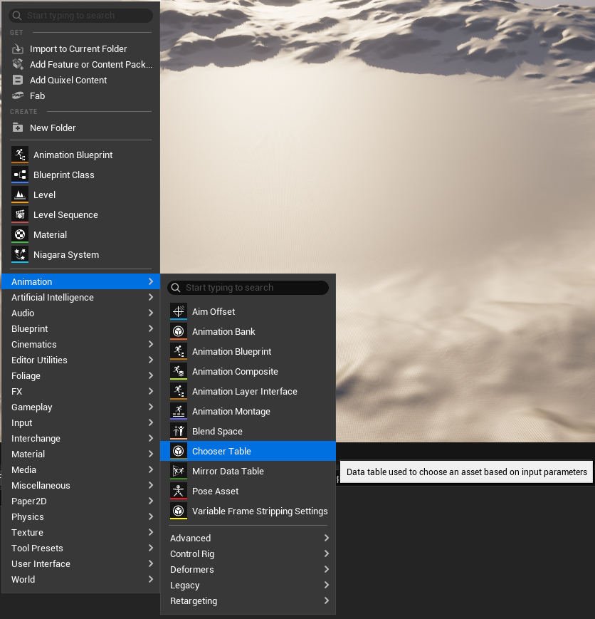

생성 다이얼로그에서 Chooser Type을 선택합니다. AnimBP와 연동할 예정이라 **Animation Chooser**를 고르고, 연결할 Anim Class를 지정합니다.

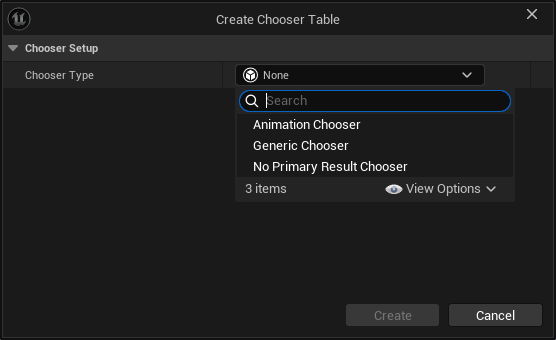

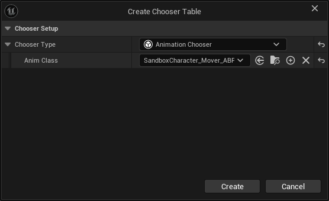

> Animation Chooser를 선택하면 이후 컬럼 바인딩 시 원하는 ABP의 프로퍼티 목록이 선택합니다.

---

## Chooser Table 구조 이해하기

테이블을 열면 처음엔 아무것도 없을텐데, 여기서 Result 항목 각 행에 반환할 Animation Asset(또는 다른 Chooser)을 추가합니다. (드래그&드롭)

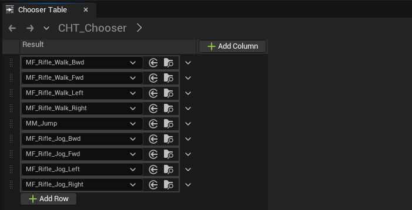

이제 조건 컬럼을 추가합니다. `+ Add Column`을 누르면 Evaluator 타입을 선택할 수 있습니다. 자주 쓰는 타입은 다음과 같습니다.

| Evaluator 타입 | 설명 |
|----------------|------|
| **Float Range** | 특정 범위 안의 값인지 평가 (Speed: 100~300 등) |
| **Bool** | true / false 조건 |
| **Enum** | 열거형 값 비교 |
| **Tag Query** | Gameplay Tag 기반 조건 |

컬럼을 추가하고 나면, 각 컬럼의 헤더에서 **Bind** 버튼으로 ABP 프로퍼티와 연결합니다.

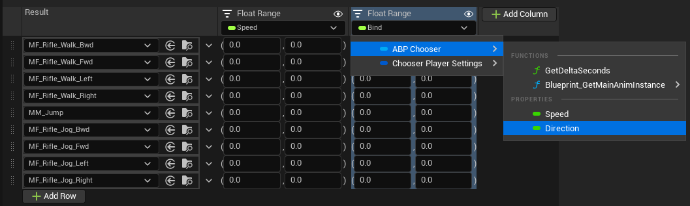

Speed, Direction, IsJump 컬럼을 모두 바인딩하고 각 행에 범위 값을 입력하면 아래처럼 완성된 테이블이 만들어집니다.

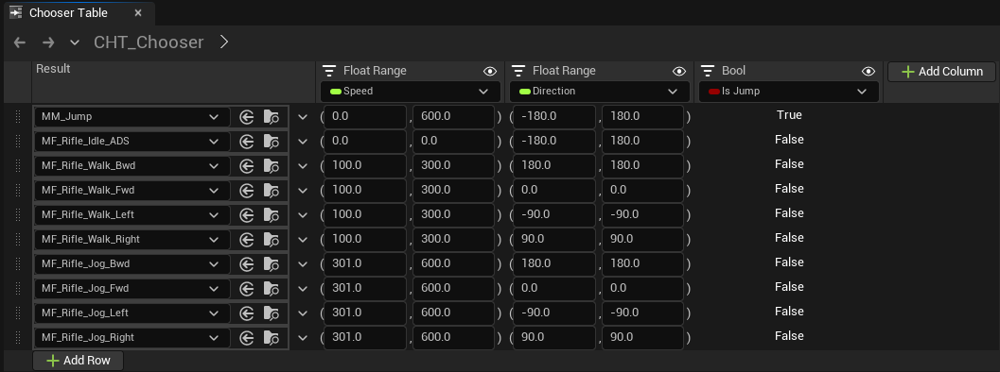

Chooser는 테이블을 **위에서 아래로 순서대로 평가**하고, 모든 컬럼 조건을 만족하는 **첫 번째 행**을 반환합니다. 보통 우선순위가 높은 조건(예: Jump)을 위쪽에 두는 것이 기본 패턴입니다.

:::note
만약 우선순위로 반환이 아닌 가중치 랜덤으로 반환하길 원하는 경우 `+Add Column`에서 `Randomize` 조건을 추가합니다.
:::

---

## AnimBP에 Chooser 연결하기

Chooser Table을 만들었다면 AnimBP에서 이를 사용해야 합니다.

AnimGraph에서 State Machine 안의 State 하나를 열고, 노드 팔레트에서 **Chooser Player** 노드를 배치합니다. Details 패널에서 방금 만든 Chooser Table을 연결하면 끝입니다.

:::tip
만약 Chooser Player 노드가 보이지 않는다면, Plugin에서 Chooser를 활성화해줍니다.
:::

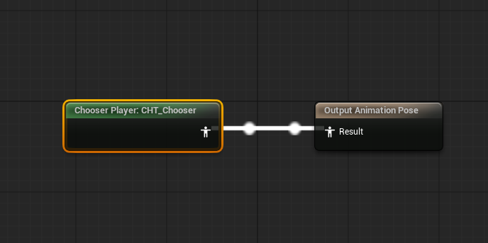

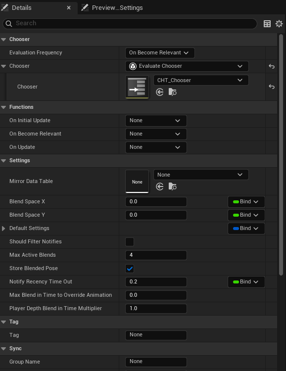

Details 패널의 주요 항목은 다음과 같습니다.

| 항목 | 내용 |
| --- | --- |
|Evaluation Frequency | 얼마나 자주 평가할지 (On Become Relevant 권장) |
| Chooser | 연결할 Chooser Table |
| Max Active Blends | 동시에 블렌딩할 최대 애니메이션 수 |
| Store Blended Pose | 블렌딩 결과를 캐싱할지 여부 |


`Evaluation Frequency`를 `On Become Relevant`로 설정하면 State가 활성화될 때만 평가합니다. 매 틱마다 평가가 필요하다면 `Loop` 혹은 `Update`로 변경하시면 됩니다.

전체 AnimBP 구조는 이렇게 단순해집니다. 복잡한 Transition 노드 없이 Chooser Player 하나가 State 전체를 담당하게 되는 것이죠.

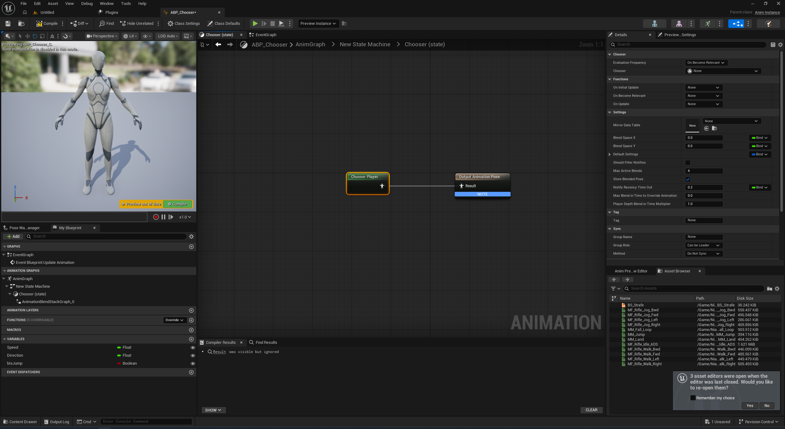

---

## 추가: Generic Chooser

애니메이션이 아닌 경우엔 **Generic Chooser**를 사용합니다. 이 경우 파라미터를 직접 정의해야 합니다.

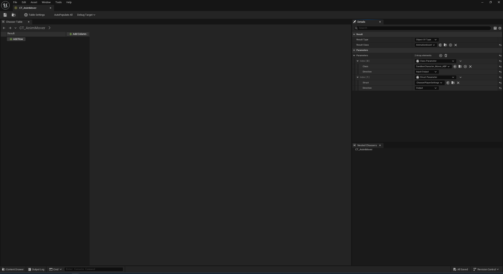

파라미터 설정에서 `Class Parameter`와 `Struct Parameter`를 조합해 Input/Output 방향을 정의합니다.

만약 C++에서 사용할 경우 다음과 같은 예시를 통해 사용하시면 됩니다. 그러나 Chooser는 BP에서 사용하는 것을 매우매우 추천드립니다.
```cpp
// C++에서 Chooser를 평가하는 예시
#include "Chooser/ChooserFunctionLibrary.h"

// Chooser 파라미터 컨텍스트 구성
FChooserEvaluationContext Context;
Context.AddObjectParam(MyAnimInstance);           // Class Parameter
Context.AddStructParam(MyChooserPlayerSettings);  // Struct Parameter

// Chooser 평가 후 결과 에셋 가져오기
UObject* Result = UChooserFunctionLibrary::EvaluateChooser(
    this,
    ChooserTable,
    Context
);
```

---

# 예제로 살펴보기

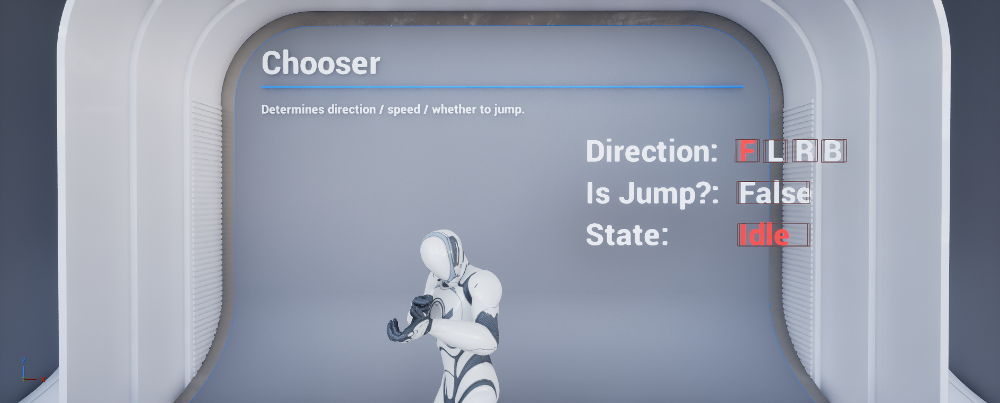

Direction, IsJump, State 값이 실시간으로 바뀌면서 Chooser가 적절한 애니메이션을 선택하는 것을 확인해봅시다.

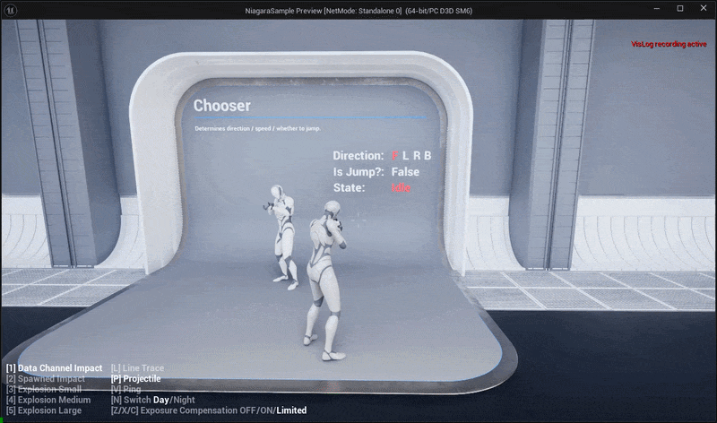

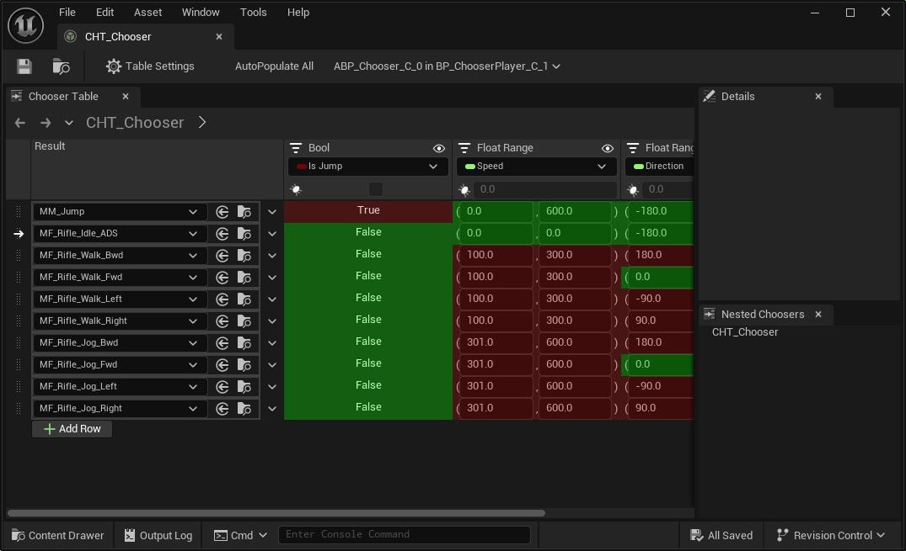

---

# 마무리

최종적으로 정리를 해보도록 하겠습니다.

- Chooser Table은 **입력 파라미터 → 에셋 선택**을 데이터로 관리하는 시스템입니다.
- AnimBP와 연동할 땐 **Animation Chooser**, 범용으로 쓸 땐 **Generic Chooser**를 선택합니다.
- 조건 컬럼은 Float Range / Bool / Enum / Tag Query 등으로 구성하고, ABP 프로퍼티와 바인딩합니다.
- 테이블은 **위에서 아래로 첫 번째 매칭**을 반환하므로 행 순서가 곧 우선순위다. (Randomize을 통해 변경 가능)
- AnimBP에서는 **Chooser Player 노드** 하나로 State 전체의 애니메이션 선택을 위임합니다.

오늘은 간단하게 Chooser에 대해 다뤄봤습니다. 이 글을 적으면서 분량을 어떻게 해야할 지 막막했는데, 결국 대부분의 분량을 덜어내고, 아주 핵심부분만 알고 가자는 느낌으로 적어보았습니다.

다음 글에서는 Motion Matching이 과거 자세와 궤적을 어떻게 기억하는지, **Pose History**를 다뤄보겠습니다.

---

# 추가 자료

**언리얼 공식문서에서 제공하는 Chooser Table 활용 방법**
- [언리얼 엔진의 다이내믹 에셋 선택](https://dev.epicgames.com/documentation/unreal-engine/dynamic-asset-selection-in-unreal-engine?application_version=5.5&lang=ko)

**UE5 Chooser 기능 요약**
- [UE55 Chooser Functionality](https://mike.gold/notes/x-bookmarks/unreal/ue55-chooser-functionality)

**UE5의 Chooser 사용 경험에 대한 Ostap Leonov의 Medium 게시글**
- [Thoughts on Chooser plugin in UE5](https://bigm227.medium.com/thouhgts-on-chooser-plugin-in-ue5-8665b921c0df)

**Chooser Table 이슈에 관한 트러블 슈팅**
- [Unreal Engine Forum](https://forums.unrealengine.com/t/cant-find-the-function-binding-from-chooser-table-chooser-table-plugin-ue-5-4-2/1907086)