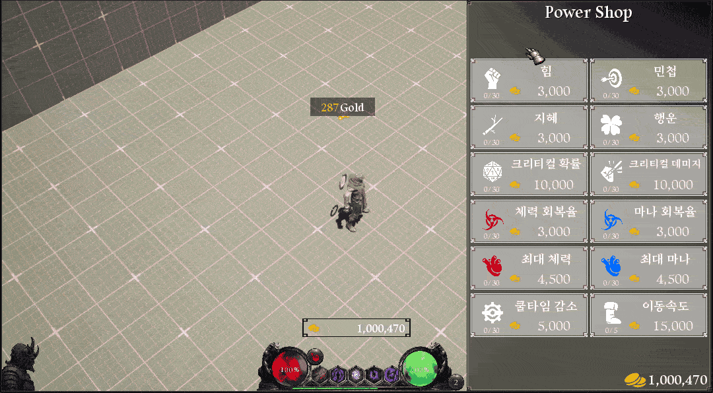
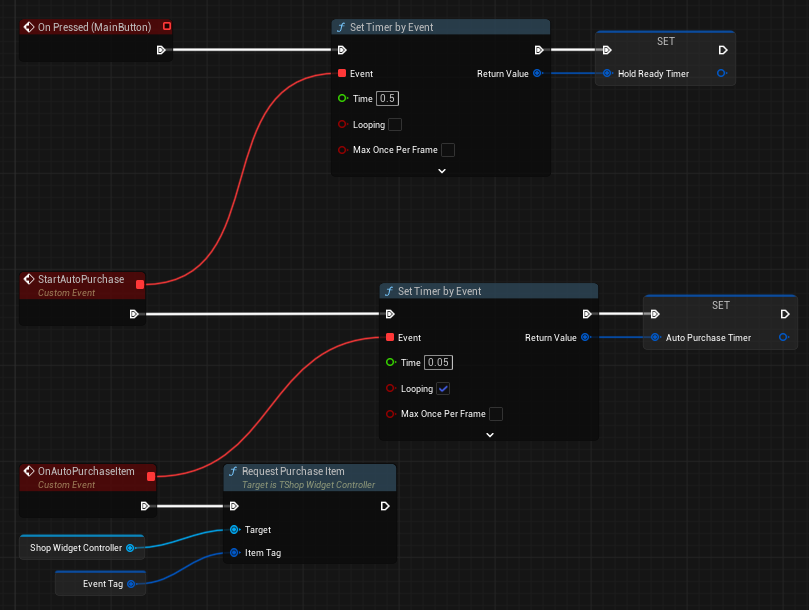
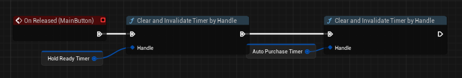
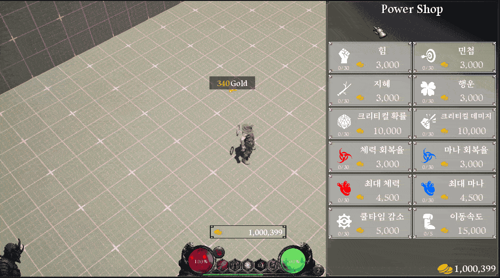

# 들어가며

오늘은 UMG Button의 Hold 기능을 구현하는 방법을 정리해보겠습니다.
기본 버튼 위젯은 Clicked, Pressed, Released 세 가지 이벤트만 제공합니다. 버튼을 꾹 누르고 있는 동안 반복적으로 동작을 실행하는 기능은 기본 제공되지 않기 때문에, 직접 구현이 필요합니다.

# 문제 상황

Fig1처럼 현재는 단일 클릭만 작동하고, 버튼을 누르고 있어도 아무 이벤트가 발생하지 않습니다. 이를 해결하는 방법은 간단합니다. 타이머 2개로 충분합니다.

# 구현

## Pressed

1. 딜레이 타이머 — Time을 0.5초, Looping은 해제합니다. 사용자가 버튼을 0.5초 이상 누르고 있을 경우 두 번째 타이머를 발동시키는 역할입니다.
2. 반복 타이머 — Time을 0.05초, Looping을 체크합니다. 0.05초마다 원하는 이벤트를 반복 실행합니다.

## Released

마우스를 떼는 순간, 앞서 생성한 타이머 핸들을 모두 Clear Timer로 정리해줍니다.

## 결과

# 마무리

타이머 2개만으로 간단하게 Hold 기능을 구현할 수 있었습니다. 짧은 메모 성격의 글이지만 누군가에게 도움이 됐으면 좋겠습니다. 감사합니다.