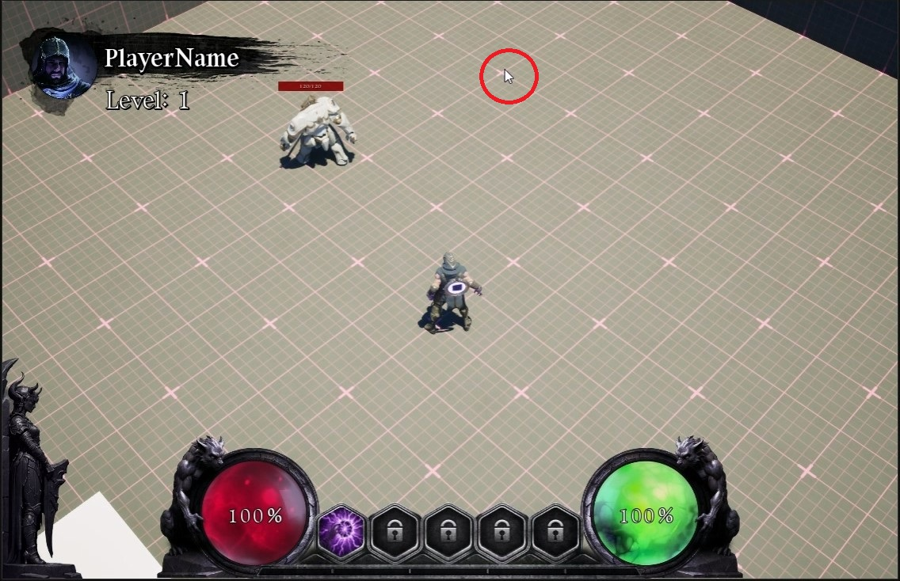
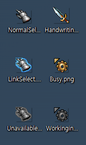
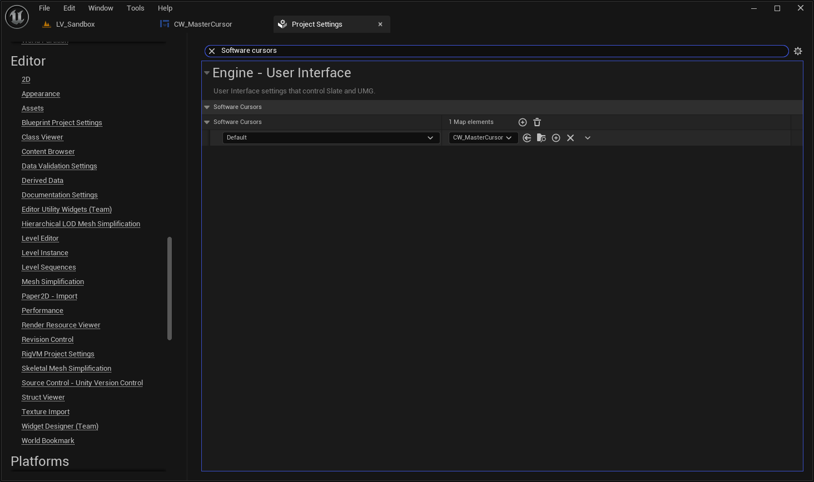
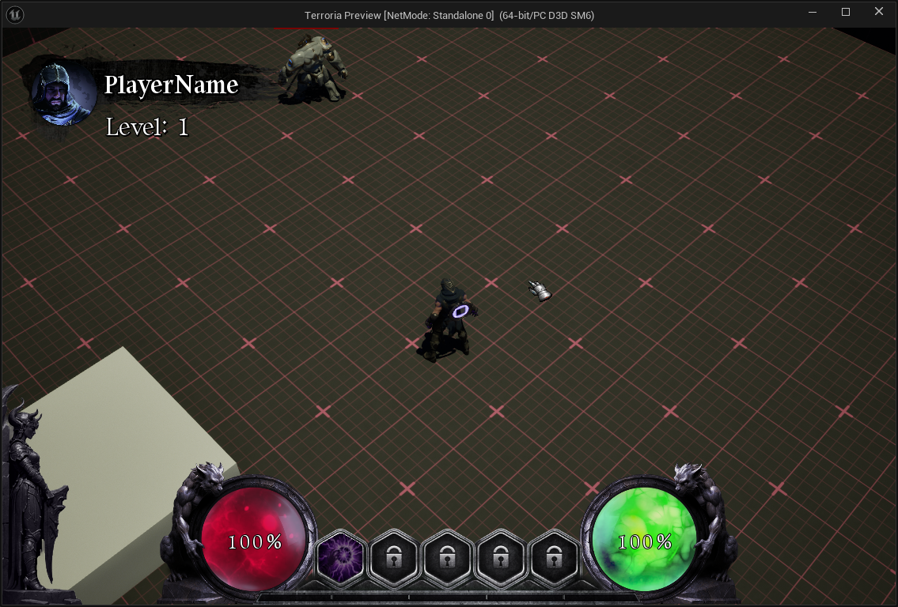
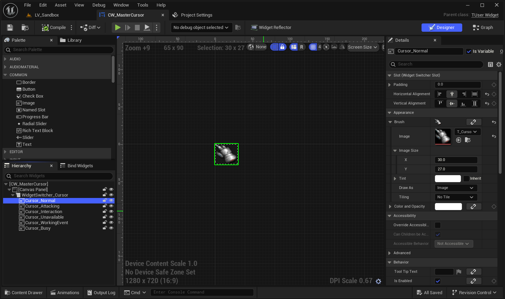
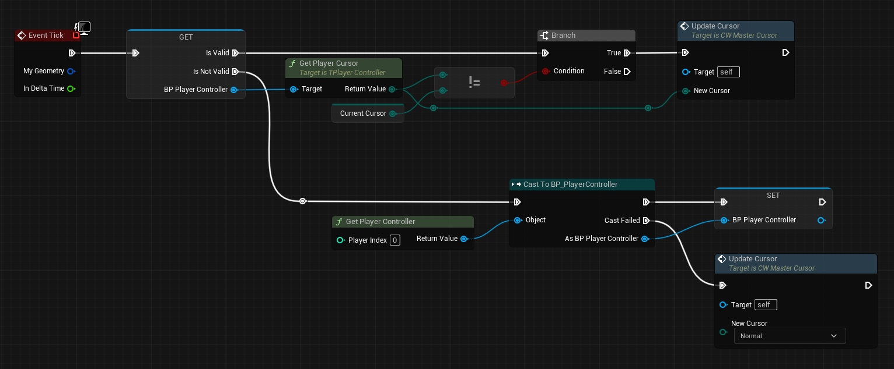
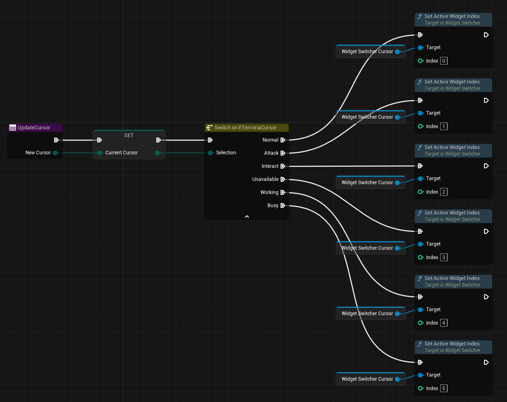
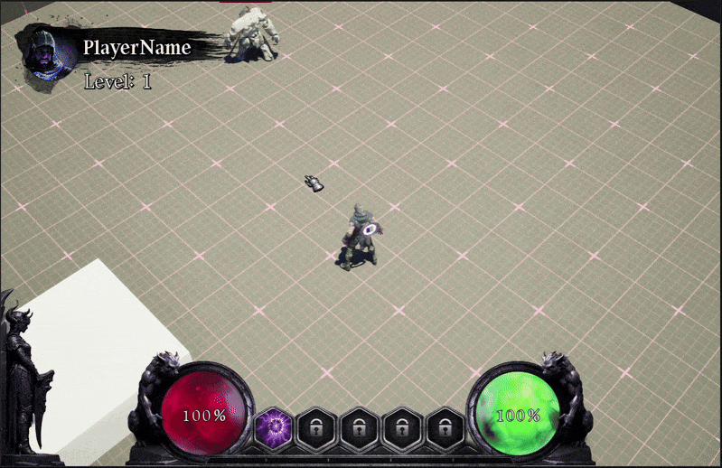

# 들어가며

민수는 자신이 만든 게임을 출시하기 위해 열심히 캐릭터도 만들고, 배경도 배치하고, 라이팅도 구웠습니다. "이제 좀 게임 같네!" 하고 플레이 버튼을 눌렀는데... 어라?



Fig 1의 저 녀석이 시선을 강탈합니다. 네, 바로 `기본 마우스 커서`입니다. 아무리 그래픽이 좋아도 저 기본 커서 하나 때문에 게임이 순식간에 일반 응용 프로그램처럼 보이는 상황이 펼쳐집니다.

오늘 포스트에서는 위젯(Widget)을 활용해 아주 간단하게 이 옥에 티를 제거하고, RPG 게임의 감성을 한 스푼 더해 보도록 하겠습니다.

---

## ProjectSettings



오늘 제가 사용할 커서 목록들입니다. 모두 png 파일로 저장되어있습니다. 아마 인터넷에서 구할 수 있는 커서파일은 `.ani` 혹은 `.cur` 파일일 텐데 모두 `.png`로 변환해주세요. _언리얼 엔진은 마우스 커서 확장자 파일을 읽을 수가 없습니다._

:::tip
추천 변환 사이트

[ani to png](https://ezgif.com/ani-to-apng)

[cur to png](https://convertio.co/kr/cur-png/)
:::

다음으로, UserWidget을 하나 생성해줍니다. 이름은 `CW_MasterCursor`로 변경합니다. 이후 에디터의 `ProjectSettings` 에서 `Software Cursors` 라고 검색하면 커서를 변경할 수 있습니다.



목록을 살펴보면 윈도우가 지원하고 있는 마우스 커서 리스트 별로 설정을 할 수 있습니다. 일단 Default를 선택하고 방금 만든 Widget을 선택해주세요.

## Cursor Widget

위젯을 열고, `CanvasPanel`을 하나 만들어주세요. 그 후 `Image`를 하나 추가하고, 아까 준비한 커서 이미지를 넣어주세요. 그러면 끝났습니다. 실행해볼까요?



마우스가 변경된 상태로 나오고 있습니다. 여기서 끝나면 아쉽겠죠? 기본적으로 손 모양의 커서가 나오다가 몬스터 위에 마우스 커서가 있다면 칼 모양으로 변경하는 로직을 추가해보겠습니다.

## WidgetSwitcher

기존에 만든 CanvasPanel에 `WidgetSwitcher`를 추가해주세요. WidgetSwitcher는 Active Widget Index 값을 기준으로 현재 활성화할 위젯을 표시해줍니다. 이제 준비한 마우스 커서 모양만큼 Switcher 하위에 Image를 추가해줍니다.



그러면 이제 코드를 어떻게 작성할지 계획을 세워봅시다.

1. 현재 마우스 커서의 상태를 구별합니다.
2. 마우스를 추적하여 현재 마우스 아래에 있는 액터가 무엇인지 판별합니다.
3. 마우스 커서 상태가 바뀌었다면 ActiveWidgetIndex의 값을 해당 상태에 맞게 변경합니다.

## Dynamic Cursor

마우스 커서 상태는 열거형으로 구별하도록 하겠습니다.
```cpp
UENUM(BlueprintType)
enum class ETerroriaCursor : uint8
{
    Normal,
    Attack,
    Interact,
    Unavailable,
    Working,
    Busy
};
```

이제 '어디에서 마우스 커서 상태를 관리할 것인가' 정해야합니다. 보통 마우스 추적 코드가 작성된 클래스와 같이 있는게 좋습니다. 아마 그런 코드는 캐릭터 컨트롤러에 있겠죠? 그렇다면 캐릭터 컨트롤러가 가장 적합하게 보입니다.

```cpp
// TPlayerController.h

public:
    UFUNCTION(BlueprintCallable)
    ETerroriaCursor GetPlayerCursor() const { return PlayerCursorType; }

    UFUNCTION(BlueprintCallable)
    void SetPlayerCursor(ETerroriaCursor NewType) { PlayerCursorType = NewType; }


protected:
    UPROPERTY(VisibleAnywhere, Category="Game|Cursor")
    ETerroriaCursor PlayerCursorType;
```

그 다음은 현재 마우스를 추적하여 마우스 아래에 있는 액터가 어떤 마우스 커서를 나타낼 건지 정해야 합니다. 다행히도 언리얼에서는 이 기능을 제공하고 있습니다.

APlayerController의 메서드 중`GetHitResultUnderCursor`가 있습니다. 이건 현재 마우스 위치 아래로 Ray를 쏴서 맞은 물체를 검사할 수 있는 메서드입니다. 이걸 이용해서 현재 맞은 액터를 가져오고, 해당 액터가 어떤 타입인지 검사해서 커서 모양을 변경하면 됩니다.

아직 저는 액터 타입을 다 나누지 못했기 때문에 테스트 용도로 몬스터랑 일반 상태일 때 변화만 주도록 하겠습니다.

```cpp
void ATPlayerController::TraceCursor()
{
    GetHitResultUnderCursor(ECC_Visibility, false, CursorTraceHit);

    if (!CursorTraceHit.bBlockingHit)
    {
        SetPlayerCursor(ETerroriaCursor::Normal);
        return;
    }
    
    LastActor = CurrentActor;
    CurrentActor = CursorTraceHit.GetActor();

    if (LastActor != CurrentActor)
    {
        if (LastActor)
        {
            LastActor->DeactiveHighlightActor();
            SetPlayerCursor(ETerroriaCursor::Normal);
        }

        if (CurrentActor)
        {
            CurrentActor->ActiveHighlightActor();
            SetPlayerCursor(ETerroriaCursor::Attack);
        }
    }
}
```

이게 현재 저의 코드입니다. 원래는 캐릭터 테두리 하이라이트만 처리하고 있었는데, 여기에 커서 변경 코드를 추가했습니다.

이제는 UI 차례입니다. 커서 변경 로직은 PlayerController에서 이루어지고 있습니다. UI에서는 PlayerController에 접근해 타입에 따른 마우스를 표시해주면 될 것 같습니다.



블루프린트 코드라 보기 불편하지만 하나씩 살펴봅시다. 먼저 PlayerController가 Valid, 즉 유효한 값이 있다면 현재 마우스 커서를 가져오고, 현재 캐싱된 마우스 커서와 타입이 다르다면 `UpdateCursor` 함수를 실행합니다.

만약 Not Valid, 유효한 값이 아니라면 캐스팅을 시도하고 캐스팅에 성공하면 해당 Controller를 캐싱하고, 실패 시 일반 커서 모양을 유지합니다.

Tick에서 코드가 실행되기 때문에 최대한 Cast 호출을 사용하지 않는 구조로 작성해봤습니다. 캐스팅이 계속 실패할 수도 있는데, 그건 시작화면이라, 성능에 큰 영향이 없다고 판단했기 때문에 그대로 진행했습니다.



UpdateCursor 함수는 현재 커서 타입을 갱신하고 타입에 맞게 ActiveWidgetIndex 값을 변경하고 있습니다.

## 결과



일반 상태에서는 손 모양이, 몬스터 위에서는 칼 모양이 제대로 출력되고 있는 것을 볼 수 있습니다.

---

# 마무리

오늘은 마우스 커서 모양을 변경하는 방법에 대해 알아보았습니다. 맨 처음 커서 변경에 대한 내용을 검색했는데, 1차 결과물(단순 커서 변경)까지의 내용만 있어서 당황했던 기억이 있습니다.

그래서 동적으로 액터에 맞는 마우스 커서로 변경하는 방법을 포스트 해보았습니다. 도움이 되었으면 좋겠습니다. 감사합니다.