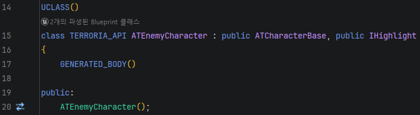

# 들어가며

제가 언리얼 엔진에 관심을 갖기 시작한지 벌써 5년이라는 시간이 흘렀습니다. 아직도 `UE5.0` 공개 당시 루멘과 나나이트로 구현한 테크 데모 영상을 돌려보곤 합니다. 이렇게 관심을 가지고 살펴보지만 정작 언리얼 엔진의 기본에 대해 정리한 내용이 하나도 없었습니다. 그래서 다시 공부하고 알아보자는 마음으로 이 시리즈를 기획하게 되었습니다. 거창한 내용은 아닐텐데 누구한테는 도움이 될 수 있겠죠? 그러면 시작해보겠습니다.

# UObject

언리얼 엔진은 게임 오브젝트를 처리하기 위해 `UObject` 라는 베이스 클래스를 사용합니다. `Level`에 올라가는 것은 모두 UObject를 상속받았다고 볼 수 있습니다. _(보통 Actor를 기준으로 설명합니다.)_ 

> _UObject는 모든 타입의 함수 또는 멤버 변수를 가질 수 있습니다._

이 말은 네이티브 C++ 타입과 함수를 가질 수 있다는 말입니다. 어찌보면 당연하죠? C++ 클래스이니까요.
그러나 엔진이 함수와 변수를 인식하고 조작하기 위해서는 특수 매크로로 표시하고 특정 타입 표준을 준수해야 합니다. 이를 `UPROPERTY` 와 `UFUNCTION` 으로 표시하는데요, 이는 추후 다른 파트에서 설명드리겠습니다.

## 오브젝트 생성

UObject 생성 시 알아야하는 몇 가지 규칙이 있습니다.

1. 모든 C++ UObject는 엔진 시작 시 초기화되며, 디폴트 생성자를 호출합니다. 만약 디폴트 생성자가 없다면 컴파일 오류가 발생합니다.
2. UObject의 생성자는 가벼워야 하며, 기본값과 서브오브젝트를 구성하는데 사용되어야 합니다.
3. 런타임 생성 시 `NewObject`를 사용하거나 생성자 안이라면 `CreateDefaultSubobject`를 사용해서 생성합니다.

:::note
UObject는 절대 `new 연산자`로 사용하면 안됩니다. 모든 UObject는 언리얼 엔진으로 관리되는 메모리이며 가비지 컬렉션됩니다. new 또는 delete를 사용하여 메모리를 수동으로 관리하면 메모리 손상이 발생할 수 있습니다.
:::

UObject의 특징 중 하나가 생성자의 실행인자를 지원하지 않습니다. 즉, 디폴트 생성자만을 사용할 수 있는데요. 그러면 이렇게 질문할 수 있습니다.

> 제가 봤던 예제 코드에서는 아래와 같이 생성자에 값을 받고 있던데요? 이건 실행인자 아닌가요?
```cpp
UAIGraph::UAIGraph(const FObjectInitializer& ObjectInitializer) : Super(ObjectInitializer)
```

결론부터 말씀드리면, `FObjectInitalizer`는 데이터를 넘기기 위한 인자가 아닌 엔진 객체의 내부 구조를 조립하기 위해 사용하는 클래스입니다. 위에서 실행인자를 지원하지 않는다의 정확한 뜻은 `사용자 정의 데이터(int32, FString)` 등을 넣을 수 없다는 의미가 되겠습니다.

## FObjectInitializer

생성자를 호출할 때 FObjectInitializer는 해당 객체를 만들 때 필요한 구성 정보를 넘겨주는 역할을 합니다. 예를 들어, 언리얼의 Actor는 여러 컴포넌트를 가질 수 있습니다. 부모 클래스에서 정의된 컴포넌트를 자식에서 사용하고 싶지 않을 경우 혹은 다른 것으로 바꾸고 싶은 경우 FObjectInitalizer를 사용하여 원하는대로 변경할 수 있습니다.

```cpp
// 예시: 부모가 만든 MovementComponent를 나는 안 쓰고 싶을 때
UMyCharacter::UMyCharacter(const FObjectInitializer& ObjectInitializer)
    : Super(ObjectInitializer.DoNotCreateDefaultSubobject(TEXT("MovementComp")))
{ }
```

위의 작업은 C++ 생성자가 호출된 이후, UObject 생성을 마무리하는 과정에서 이루어집니다. 코드를 보면서 어떻게 처리되는지 알아보겠습니다.


```cpp

class FObjectInitalizer
{
    ...
    /**  object to initialize, from static allocate object, after construction **/
    UObject* Obj;
    /**  object to copy properties from **/
    UObject* ObjectArchetype;
    ...
    /**  List of component classes to override from derived classes **/
    mutable FOverrides SubobjectOverrides;
    /**  List of component classes to initialize after the C++ constructors **/
    mutable FSubobjectsToInit ComponentInits;
    ...
    /**  Previously constructed object in the callstack */
    UObject* LastConstructedObject = nullptr;
}

...


FObjectInitializer::FObjectInitializer(UObject* InObj, UObject* InObjectArchetype, EObjectInitializerOptions InOptions, struct FObjectInstancingGraph* InInstanceGraph)
    : Obj(InObj)
    , ObjectArchetype(InObjectArchetype)
      // if the SubobjectRoot NULL, then we want to copy the transients from the template, otherwise we are doing a duplicate and we want to copy the transients from the class defaults
    , bCopyTransientsFromClassDefaults(!!(InOptions & EObjectInitializerOptions::CopyTransientsFromClassDefaults))
    , bShouldInitializePropsFromArchetype(!!(InOptions & EObjectInitializerOptions::InitializeProperties))
    , bShouldSkipPostConstructInit(!!(InOptions & EObjectInitializerOptions::SkipPostConstructInit))
    , InstanceGraph(InInstanceGraph)
    , PropertyInitCallback([](){})
{
    Construct_Internal();
}

void FObjectInitializer::Construct_Internal()
{
    FUObjectThreadContext& ThreadContext = FUObjectThreadContext::Get();
    // Always write to FUObjectThreadContext from the open, as writing to a 
    // memory location in both the open and closed within the same transaction
    // can lead to state corruption.
    UE_AUTORTFM_OPEN
    {
        // Mark we're in the constructor now.
        ThreadContext.IsInConstructor++;
        LastConstructedObject = ThreadContext.ConstructedObject;
        ThreadContext.ConstructedObject = Obj;
        ThreadContext.PushInitializer(this);
    };
    AutoRTFM::PushOnAbortHandler(&ThreadContext.IsInConstructor, [this]
    { 
        FUObjectThreadContext& ThreadContext = FUObjectThreadContext::Get();
        ThreadContext.IsInConstructor--;
        check(ThreadContext.IsInConstructor >= 0);
        ThreadContext.ConstructedObject = LastConstructedObject;
    });
    AutoRTFM::PushOnAbortHandler(this, [this]
    { 
        FUObjectThreadContext& ThreadContext = FUObjectThreadContext::Get();
        check(ThreadContext.TopInitializer() == this);
        ThreadContext.PopInitializer();
    });

    if (Obj && GetAllowNativeComponentClassOverrides())
    {
        Obj->GetClass()->SetupObjectInitializer(*this);
    }

    ...
}
```

위 소스코드에서 유추할 수 있는 것은, 다음과 같습니다.

- 현재 스레드에서 생성되고 있는 객체(Obj)를 `FUObjectThreadContext`에 등록
- 생성자가 끝나거나 중단될 때, 등록했던 정보를 안전하게 순서대로 돌려놓음

이는 `Construct_Internal()` 함수를 보면 어떻게 동작하고 있는지 알 수 있습니다. 조금 더 쉽게 예를 들자면, 몬스터를 만들기 위해 생성자 안에서 무기를 `CreateDefaultSubobject()` 로 생성한다고 가정해봅시다.

1. __몬스터 생성자 진입__: ThreadContext의 `ConstructedObject` 가 몬스터로 설정됩니다.
2. __몬스터 생성자 안의 무기 생성 요청__: CreateDefaultSubobject가 호출됩니다. 이때 ThreadContext의 ConstructedObject값이 무기의 `Outer`가 됩니다.
3. __무기 생성자 진입__: 무기 객체 생성 시 기존의 몬스터 ConstructedObject 값은 `LastConstructedObject`에 백업하고, ConstructedObject는 무기로 설정됩니다. (만약 무기 생성자 안에서도 생성 호출이 일어날 경우 위 행위를 반복합니다.)
4. __복구__: 무기 생성이 완료될 경우 백업해둔 LastConstructedObject를 다시 ConstructedObject로 설정합니다.

즉, C++의 함수 호출 스택(Call Stack)에 맞춰 FObjectInitializer도 스택처럼 동작하며, 이를 통해 명시적으로 this를 넘기지 않아도 부모-자식 간의 계층 구조가 올바르게 형성되는 것입니다. 2번 설명 과정에서 Outer 개념이 나왔는데 이 역시 나중에 자세히 설명드리겠습니다. 지금은 현재 나를 부르고 있는 객체가 누구인지 나타낸다고 생각해주세요.

---

# UCLASS

`UCLASS` 매크로는 언리얼 기반 타입을 설명하는 UClass(이후 나오는 UCLASS는 매크로를, UClass는 클래스를 칭함) 에 대한 레퍼런스를 UObject에 제공하는 역할을 합니다. 각 UClass는 하나의 `CDO(Class Default Object)`를 가지고 있습니다. 이 CDO는 기본적으로 클래스 생성자에 의해 생성되고, 이후 절대 수정되지 않은 `Default Template Object` 입니다.

보통 UClass와 CDO는 읽기 전용으로 간주되어야 합니다. 하지만, 주어진 오브젝트 인스턴스에 대한 UClass는 `GetClass()` 함수를 통해 언제든지 액세스할 수 있습니다. CDO 역시 `GetDefaultObject()` 함수를 통해 액세스할 수 있습니다.

```cpp
/** Returns the UClass that defines the fields of this object */
FORCEINLINE UClass* GetClass() const
{
    return ClassPrivate;
}

/**
* Get the default object from the class
* @param	bCreateIfNeeded if true (default) then the CDO is created if it is null
* @return		the CDO for this class
*/
UObject* GetDefaultObject(bool bCreateIfNeeded = true) const
{
    PRAGMA_DISABLE_DEPRECATION_WARNINGS
    if (ClassDefaultObject == nullptr && bCreateIfNeeded)
    {
        InternalCreateDefaultObjectWrapper();
    }

    return ClassDefaultObject;
    PRAGMA_ENABLE_DEPRECATION_WARNINGS
}
```

## 리플렉션

이러한 UCLASS 매크로와 같이 언리얼 엔진은 `리플렉션 시스템(Reflection System)`을 통해 엔진 및 에디터 함수 기능을 제공하는 다양한 매크로로 클래스를 캡슐화하고 있습니다. 추후 게시글에서 제대로 설명하도록 하고 오늘은 UCLASS 매크로를 통한 UObject 처리 시스템에 대해서 살펴보겠습니다.

```cpp
UCLASS()
class MYPROJECT_API UMyObject : public UObject
{		
    GENERATED_BODY()
    
};
```

이 코드에서 `UCLASS()` 매크로는 정말 큰 역할을 하고 있습니다. CDO가 변경되면, 엔진은 그 클래스의 모든 인스턴스 로드시 알아서 변경사항을 적용하려 시도합니다. 주어진 오브젝트 인스턴스에 대해, 업데이트된 변수 값이 이전 CDO 값과 일치한다면, 새로운 CDO에 저장된 값으로 업데이트합니다. 변수 값이 다른 경우, 그 변수가 의도적으로 설정되었다  가정하여 그 변경사항을 보존합니다.


UObject는 항상 자신이 무슨 UClass 인지 알고 있습니다. 이를 통해 실시간으로 형변환이 가능해집니다.

네이트비트 코드에서 모든 UObject 클래스에는 그 부모 클래스로 설정된 `Super`가 있어, 덮어쓰기 행위 대한 제어가 쉽습니다. 예를 들어:

```cpp
class AEnemy : public ACharacter
{
    virtual void Speak()
    {
        Say("Time to fight!");
    }
};

class AMegaBoss : public AEnemy
{
    virtual void Speak()
    {
        Say("Powering up! ");
        Super::Speak();
    }
};
```
`Speak()`를 호출하면 MegaBoss가 "Powering up! Time to fight!"라고 말하게 됩니다. 또한, 템플릿 Cast함숫를 사용해서 베이스 클래스에서의 오브젝트를 좀더 파생된 클래스로 안전하게 형변환하거나, `IsA()`를 사용해서 오브젝트가 특정 클래스의 것인지 질의할 수 있습니다.

# UHT

이러한 리플렉션 시스템, 가비지 컬렉션, 블루트린트 연동과 UObject의 파생 타입이 제공하는 기능을 활용하기 위해서는 컴파일러가 작동하기 전 전처리 단계를 실행하여 필요한 정보를 대조해야 합니다. 언리얼 엔진은 이를 `UHT(UnrealHeaderTool)`이라는 독립형 프로그램이 수행하고 있습니다.

표준 C++ 컴파일러는 코드를 기계어로 번역하면 기존의 프로그래머가 작성했던 변수 이름을 메모리 주소로 바꾸고 이름은 버립니다. 변수 이름과 같은 메타데이터는 사실 프로그램 실행하는 과정에서는 필요가 없습니다. 그러나, 언리얼 엔진은 블루프린트 기능을 제공하고 있으며, 이는 항상 변수를 검색하고 읽고 쓸 수 있어야합니다. 그래서 UHT는 별도의 C++ 코드를 기록하고 있습니다.

그리고 가장 중요한 일인 파생 클래스 타입이 제공하는 기능을 활용하기 위해 코드 생성을 진행하게 됩니다.
이 과정을 위해 UObject 파생 타입 클래스는 준수해야하는 특정 구조가 있습니다.
가장 기본적인 UObject 클래스를 생성하면 기본 헤더 파일은 다음과 같습니다.

```cpp
#pragma once

#include 'Object.h'
#include 'MyObject.generated.h'

UCLASS()
class MYPROJECT_API UMyObject : public UObject
{		
    GENERATED_BODY()
    
};
```

```cpp
#include 'MyObject.generated.h'
```
파일 헤더 선언 부분의 마지막은 항상 `.generated.h` 지시문으로 끝나야 합니다. 만약 다른 헤더 파일을 호출 해야할 경우 지시문 위에 작성하거나, 전방 선언을 통해 처리해야합니다.

```cpp
UCLASS()
```
UCLASS 매크로는 언리얼 엔진에 UMyObject가 추적되도록 합니다. [매크로 지정자](https://dev.epicgames.com/documentation/ko-kr/unreal-engine/class-specifiers?application_version=5.6)를 지원하고 있어 어떤 기능을 키고 끌지 결정할 수 있습니다.

```cpp
class MYPROJECT_API UMyObject : public UObject
```
MyProject가 UMyObject 클래스를 다른 모듈에 노출시키기 원한다면 `MYPROJECT_API` 를 지정해야 합니다. 이는 게임 프로젝트에 포함될 모듈이나 플러그인에 가장 유용합니다. 이를 통해 여러 프로젝트에 이식을 유용하게 합니다.

```cpp
GENERATED_BODY()
```
엔진에 필요한 모든 인프라 코드를 생성합니다. 모든 UClass, UStruct에 필요한 지정 매크로입니다.

## GENERATED_BODY

그러면 GENREATED_BODY는 어떤 값을 나타내고 있을까요? 그 과정을 한 번 따라가보겠습니다.

```cpp
// ObjectMacros.h

// This pair of macros is used to help implement GENERATED_BODY() and GENERATED_USTRUCT_BODY()
#define BODY_MACRO_COMBINE_INNER(A,B,C,D) A##B##C##D
#define BODY_MACRO_COMBINE(A,B,C,D) BODY_MACRO_COMBINE_INNER(A,B,C,D)

// Include a redundant semicolon at the end of the generated code block, so that intellisense parsers can start parsing
// a new declaration if the line number/generated code is out of date.
#define GENERATED_BODY(...) BODY_MACRO_COMBINE(CURRENT_FILE_ID,_,__LINE__,_GENERATED_BODY);
```

3개 매크로를 통해 GENERATED_BODY를 변환하고 있습니다. `A##B##C##D` 이 형식은 결과적으로 4개의 입력 값을 받아 하나의 값을 반환합니다. 하나씩 분리해보면 다음과 같습니다.


1. CURRENT_FILE_ID : 현재 파일의 고유 ID
2. _ : 언더바
3. \_\_LINE\_\_ : 해당 매크로 구문이 적힌 헤더 파일의 줄
4. _GENERATED_BODY : 텍스트



여기서 CURRENT_FILE_ID는 어디에 있는 걸까요? 바로 `.generated.h` 파일에서 가져옵니다. 해당 파일을 열어보면 파일 아래 부분에 다음과 같이 적혀있습니다.

```cpp
#undef CURRENT_FILE_ID
#define CURRENT_FILE_ID FID_Terroria_Source_Terroria_Public_Character_TEnemyCharacter_h
```

이제 모든 퍼즐의 조각이 맞춰졌습니다. 다 합쳐보면 다음과 같은 구문이 됩니다.


> FID_Terroria_Source_Terroria_Public_Character_TEnemyCharacter_h_17_GENERATED_BODY

해당 구문을 똑같이 .generated.h 에서 찾아서 따라가보면 엔진이 자동으로 만들어 놓은 `Boilerplate Code` 가 보이게 됩니다.

```cpp
#define FID_Terroria_Source_Terroria_Public_Character_TEnemyCharacter_h_17_INCLASS_NO_PURE_DECLS \
private: \
    static void StaticRegisterNativesATEnemyCharacter(); \
    friend struct Z_Construct_UClass_ATEnemyCharacter_Statics; \
    static UClass* GetPrivateStaticClass(); \
    friend TERRORIA_API UClass* Z_Construct_UClass_ATEnemyCharacter_NoRegister(); \
public: \
    DECLARE_CLASS2(ATEnemyCharacter, ATCharacterBase, COMPILED_IN_FLAGS(0 | CLASS_Config), CASTCLASS_None, TEXT("/Script/Terroria"), Z_Construct_UClass_ATEnemyCharacter_NoRegister) \
    DECLARE_SERIALIZER(ATEnemyCharacter) \
    virtual UObject* _getUObject() const override { return const_cast<ATEnemyCharacter*>(this); }


#define FID_Terroria_Source_Terroria_Public_Character_TEnemyCharacter_h_17_ENHANCED_CONSTRUCTORS \
    /** Deleted move- and copy-constructors, should never be used */ \
    ATEnemyCharacter(ATEnemyCharacter&&) = delete; \
    ATEnemyCharacter(const ATEnemyCharacter&) = delete; \
    DECLARE_VTABLE_PTR_HELPER_CTOR(NO_API, ATEnemyCharacter); \
    DEFINE_VTABLE_PTR_HELPER_CTOR_CALLER(ATEnemyCharacter); \
    DEFINE_DEFAULT_CONSTRUCTOR_CALL(ATEnemyCharacter) \
    NO_API virtual ~ATEnemyCharacter();
```

이러한 코드가 빌드 시 변환되어 클래스에 들어가게 되고, 리플렉션 시스템, 언리얼 표준 함수 사용, 복제, 직렬화등 다양한 기능을 추가해주게 됩니다.

결국 GENERATED_BODY는 엔진 필수 코드를 UHT가 대신 작성할 수 있도록 한 줄로 압축해 놓은 매크로 정의입니다.

---

# 마무리

생각보다 1편의 양이 많아지게 된 것 같은데, 아직도 다 설명을 못한게 많이 있네요. UObject 하나만으로 이야기 할게 너무 많은 것 같아요. 아직 내용이 더 남은게... 차근차근 적어보도록 하겠습니다. 감사합니다.