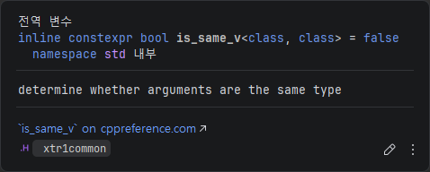
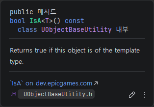

# 들어가며
게임 개발을 하다 보면 "이 객체가 플레이어인가? 몬스터인가? 아니면 파괴 가능한 상자인가?"를 확인해야 하는 순간이 반드시 찾아옵니다. 이때 우리가 하는 것이 바로 **형변환(Casting)** 입니다.

특히 언리얼 엔진(Unreal Engine)은 자체적인 리플렉션(Reflection) 시스템과 가비지 컬렉션(GC) 환경을 갖추고 있어, 표준 C++의 캐스팅과는 조금 다른 독자적인 Cast<T> 템플릿 함수를 제공합니다. 이번 글에서는 일반적인 캐스팅의 개념부터 시작해, 언리얼 엔진 내부에서 Cast<T>가 어떻게 컴파일 타임 최적화를 이루어내는지, 그리고 이를 객체 지향적으로 어떻게 활용해야 하는지 깊이 있게 파헤쳐 보겠습니다.

---

# Cast
언리얼의 독자적인 시스템을 이해하기 전에, 먼저 객체 지향 프로그래밍에서 형변환이 가지는 본질적인 의미를 짚고 넘어갈 필요가 있습니다.

## 업캐스팅
업캐스팅은 **자식 클래스의 포인터를 부모 클래스의 포인터로 변환**하는 것을 말합니다.

- 자식은 부모의 모든 특성을 상속받았기 때문에, 이 변환은 언제나 메모리상에서 안전합니다.
- 암시적(Implicit) 형변환이 가능하며, 변환 과정에서 부모 클래스 위치에 자식 클래스가 들어가도 아무런 문제 없이 작동합니다.

## 다운캐스팅
문제는 다운캐스팅입니다. 다운캐스팅은 **부모 클래스의 포인터를 자식 클래스의 포인터로 변환**하는 것입니다.

- 부모 포인터가 실제로 가리키고 있는 메모리의 본체가 무엇인지 컴파일 타임에는 확신할 수 없습니다.
- 명시적(Explicit) 형변환이 필수이며, 변환 과정에서 수 많은 자식 클래스 중에서 해당 객체가 어떤 타입인지 명시하지 않는다면 메모리 침범이 발생하여 에러를 발생시킬 수 있습니다.

## STD C++ 캐스팅 (dynamic, static)
표준 C++에서는 다운캐스팅을 위해 주로 두 가지 방식이 사용됩니다.

1. `static_cast`: 컴파일 타임에 형변화을 강제합니다. 속도는 빠르지만, 런타임에 실제 객체 타입을 검사하지 않습니다.
2. `dynamic_cast`: 런타임 타입 정보(RTTI)를 활용해 안전한 다운캐스팅을 보장합니다. 변환 불가능 시 `nullptr`을 반환하지만, 매번 RTTI를 조회하는 비용이 비싸므로, 1초에 수십 번씩 프레임이 갱신되는 게임 엔진에서는 성능 저하를 일으킬 수 있습니다.

바로 이러한 점때문에 언리얼 엔진은 자체 캐스팅 시스템을 만들게 됩니다.

---

# Cast\<T\>
언리얼 엔진의 `Cast<T>`는 C++17의 `if constexpr`을 활용한 템플릿 메타프로그래밍과 엔진 고유의 리플렉션 시스템을 결합하여, C++ 캐스팅보다 빠른 속도를 자랑합니다.

:::note
constexpr은 **컴파일 시간 상수**를 만드는 키워드입니다.<br>
런타임시점이 아닌 컴파일 시점에 계산을 미리 끝내버리고 성능을 최적화합니다. [C++ Reference](https://en.cppreference.com/w/cpp/language/constexpr.html)
:::

특히 대상이 구체적인 클래스인지, 혹은 인터페이스인지에 따라 내부 동작이 완전히 달라집니다.<br>코드를 보면서 좀 더 알아보겠습니다.

```cpp
// Cast.h
// Dynamically cast an object type-safely.
template <typename To, typename From>
FORCEINLINE TCopyQualifiersFromTo_T<From, To>* Cast(From* Src)
{
    static_assert(sizeof(From) > 0 && sizeof(To) > 0, "Attempting to cast between incomplete types");

    if (Src)
    {
        if constexpr (TIsIInterface<From>::Value)
        {
            if (UObject* Obj = Src->_getUObject())
            {
                if constexpr (TIsIInterface<To>::Value)
                {
                    return (To*)Obj->GetInterfaceAddress(To::UClassType::StaticClass());
                }
                else
                {
                    if constexpr (std::is_same_v<To, UObject>)
                    {
                        return Obj;
                    }
                    else
                    {
                        if (Obj->IsA<To>())
                        {
                            return (To*)Obj;
                        }
                    }
                }
            }
        }
        else
        {
            static_assert(std::is_base_of_v<UObjectBase, From>, "Attempting to use Cast<> on a type that is not a UObject or an Interface");

            if constexpr (UE_USE_CAST_FLAGS && UE::CoreUObject::Private::TCastFlags_V<To> != CASTCLASS_None)
            {
                if constexpr (std::is_base_of_v<To, From>)
                {
                    return (To*)Src;
                }
                else
                {
#if UE_ENABLE_UNRELATED_CAST_WARNINGS
                    UE_STATIC_ASSERT_WARN((std::is_base_of_v<From, To>), "Attempting to use Cast<> on types that are not related");
#endif
                    if (((const UObject*)Src)->GetClass()->HasAnyCastFlag(UE::CoreUObject::Private::TCastFlags_V<To>))
                    {
                        return (To*)Src;
                    }
                }
            }
            else
            {
                if constexpr (TIsIInterface<To>::Value)
                {
                    return (To*)((UObject*)Src)->GetInterfaceAddress(To::UClassType::StaticClass());
                }
                else if constexpr (std::is_base_of_v<To, From>)
                {
                    return Src;
                }
                else
                {
#if UE_ENABLE_UNRELATED_CAST_WARNINGS
                    UE_STATIC_ASSERT_WARN((std::is_base_of_v<From, To>), "Attempting to use Cast<> on types that are not related");
#endif
                    if (((const UObject*)Src)->IsA<To>())
                    {
                        return (To*)Src;
                    }
                }
            }
        }
    }

    return nullptr;
}
```

함수를 살펴보면, 가장 먼저 마주치는 분기문이 있습니다. 원본 객체(From)가 인터페이스일 때 처리하는 로직입니다.
```cpp
if constexpr (TIsIInterface<From>::Value)
```
이 코드가 어떻게 런타임 오버헤드 없이 컴파일 타임에 인터페이스 여부를 판별하는지 살펴보겠습니다.

## TISIInterface
당연한 이야기지만, C++ 표준에는 특정 클래스가 언리얼의 인터페이스인지 판별하는 기능이 없습니다. 그래서 언리얼 엔진은 템플릿 메타프로그래밍의 **SFINAE(Substitution Failure Is Not An Error)** 기법을 활용하여 해결합니다.

```cpp
//Cast.h
/**
 * Metafunction which detects whether or not a class is an IInterface.  Rules:
 *
 * 1. A UObject is not an IInterface.
 * 2. A type without a UClassType typedef member is not an IInterface.
 * 3. A type whose UClassType::StaticClassFlags does not have CLASS_Interface set is not an IInterface.
 *
 * Otherwise, assume it's an IInterface.
 */
template <typename T, bool bIsAUObject_IMPL = std::is_convertible_v<T*, const volatile UObject*>>
struct TIsIInterface
{
    enum { Value = false };
};

template <typename T>
struct TIsIInterface<T, false>
{
    template <typename U> static char (&Resolve(typename U::UClassType*))[(U::UClassType::StaticClassFlags & CLASS_Interface) ? 2 : 1];
    template <typename U> static char (&Resolve(...))[1];

    enum { Value = sizeof(Resolve<T>(0)) - 1 };
};
```

위 코드는 다음과 같은 논리 구조를 가집니다.

1. 1차 필터링: 일반 UObject로 변환이 가능한 타입이라면, 첫 번째 템플릿에 매칭되어 `Value = false`가 됩니다.
2. 2차 필터링(SFINAE): UObject가 아닌 타입들은 두 번째 특수화 템플릿을 실행하게 됩니다. 여기서는 UClassType이라는 내부 타입이 존재하는지, 그리고 그 클래스의 StaticClassFlags에 CLASS_Interface 플래그가 켜져 있는지 확인합니다.
3. 조건이 맞다면 반환 타입의 크기가 **2**인 첫 번째 Resolve 함수가 선택되어 최종 Value는 1(true)가 되고, 실패하면 0(false)이 됩니다.

## UInterface & IInterface
그렇다면 `TIsIInterface`가 찾는 저 조건들은 어디에 정의되어 있을까요? 엔진의 인터페이스 클래스를 보면 명확해집니다.

```cpp
// Interface.h
/**
 * Base class for all interfaces
 *
 */

class UInterface : public UObject
{
    DECLARE_CASTED_CLASS_INTRINSIC_WITH_API(UInterface, UObject, CLASS_Interface | CLASS_Abstract, TEXT("/Script/CoreUObject"), CASTCLASS_None, COREUOBJECT_API)
};

class IInterface
{
protected:

    virtual ~IInterface() {}

public:

    typedef UInterface UClassType;
};
```
언리얼 엔진에서 인터페이스 클래스를 만들면 항상 `U`와`I`클래스 쌍으로 선언되는 이유가 여기에 있습니다.
- UInterface 내부의 매크로를 통해 CLASS_Interface 플래그가 부여됩니다.
- 실제로 다루는 포인터인 IInterface에는 typedef를 통해 UClassType이 정의되어 있습니다.

이 구조를 통해 앞서 본 TIsIInterface의 템플릿 조건들이 만족하게 되며, 컴파일러는 캐스팅 분기를 진행하게 됩니다.

## 3가지 변환
이제 원본 객체(From)이 인터페이스임이 확실해졌을 때, 실제 캐스팅은 어떻게 이루어지는지 로직을 살펴보겠습니다. 3가지 상황을 가정합니다.
1. 인터페이스 -> 인터페이스
2. 인터페이스 -> UObject
3. 인터페이스 -> Actor(Class)

```cpp
if (UObject* Obj = Src->_getUObject())
```
당연한 말이지만, 모든 UObject 파생 클래스는 UObject를 상속받고 있습니다. 그리고 내부적으로 자신의 원본 주소를 반환하는 _getUObject() 가상함수를 가집니다. 이를 통해 원본 주소를 가지고 목적지(To)를 세 갈래로 나누게 됩니다.

### 인터페이스 -> 인터페이스
```cpp
if constexpr (TIsIInterface<To>::Value)
{
    return (To*)Obj->GetInterfaceAddress(To::UClassType::StaticClass());
}
```
목적지(To)도 인터페이스일 때, 그 메모리 오프셋 주소를 찾아냅니다.

### 인터페이스 -> UObject
```cpp
if constexpr (std::is_same_v<To, UObject>)
{
    return Obj;
}
```
목적지가 언리얼 최상위 베이스인 `UObject`를 가리킬 때, 어떠한 추가 검사없이 빠르고 깔끔하게 원본 주소를 반환합니다. 여기서 `is_same_v`는 표준 C++ std로 구현 내용은 다음과 같습니다.


### 인터페이스 -> Class
목적지가 `AActor`, `ACharacter` 등 구체적인 클래스일 때입니다. 객체가 해당 클래스 타입이 맞는지 런타임에 `IsA<To>()` 함수로 클래스 상속 계층도를 검증한 후 변환합니다.



:::note
사실 추상화된 인터페이스에서 다시 구체적인 클래스로 돌아가는 것은 `의존성 역전 원칙`을 위반할 위험이 있습니다. 불가피하게 객체의 공통 기능이 필요할 때만, 최소한의 베이스 클래스(AActor) 수준으로 제한하여 사용하는 것을 추천합니다.
:::

# Cast - UObject
이전 파트에서는 원본(From)이 인터페이스일 때를 살펴보았다면, 이번에는 가장 흔하게 마주치는 상황, 즉 원본이 일반 `UObject 파생 클래스`일 경우 어떻게 처리하는지 살펴보겠습니다.

## CastFlag
엔진의 코어 클래스(AActor, UActorComponent 등)를 향한 캐스팅은 다른 클래스들과 비교했을 때 매우 많이 발생합니다. 캐스팅 시 매번 상속 계층도를 뒤지는 비용을 없애기 위해서 핵심 클래스들에는 **비트 플래그**를 부여했고, 다음과 같이 확인을 합니다.

```cpp
if constexpr (UE_USE_CAST_FLAGS && UE::CoreUObject::Private::TCastFlags_V<To> != CASTCLASS_None)
```
미리 선언되어 있는 CastFlag는 엔진의 코어 클래스라면 무조건 가지고 있는 Flag라고 할 수 있습니다.
```cpp
// ObjectMacros.h
enum EClassCastFlags : uint64
{
    CASTCLASS_None = 0x0000000000000000,

    ...
    CASTCLASS_FObjectProperty				= 0x0000000000010000,
    CASTCLASS_FBoolProperty					= 0x0000000000020000,
    CASTCLASS_FUInt16Property				= 0x0000000000040000,
    CASTCLASS_UFunction						= 0x0000000000080000,
    CASTCLASS_FStructProperty				= 0x0000000000100000,
    CASTCLASS_FArrayProperty				= 0x0000000000200000,
    CASTCLASS_FInt64Property				= 0x0000000000400000,
    CASTCLASS_FDelegateProperty				= 0x0000000000800000,
    CASTCLASS_FNumericProperty				= 0x0000000001000000,
    CASTCLASS_FMulticastDelegateProperty	= 0x0000000002000000,
    CASTCLASS_FObjectPropertyBase			= 0x0000000004000000,
    CASTCLASS_FWeakObjectProperty			= 0x0000000008000000,
    CASTCLASS_FLazyObjectProperty			= 0x0000000010000000,
    CASTCLASS_FSoftObjectProperty			= 0x0000000020000000,
    CASTCLASS_FTextProperty					= 0x0000000040000000,
    CASTCLASS_FInt16Property				= 0x0000000080000000,
    CASTCLASS_FDoubleProperty				= 0x0000000100000000,
    CASTCLASS_FSoftClassProperty			= 0x0000000200000000,
    CASTCLASS_UPackage						= 0x0000000400000000,
    CASTCLASS_ULevel						= 0x0000000800000000,
    CASTCLASS_AActor						= 0x0000001000000000,
    CASTCLASS_APlayerController				= 0x0000002000000000,
    CASTCLASS_APawn							= 0x0000004000000000,
    ...
};
```

하나만 살펴볼까요? 위 코드에 마지막에 보이는 `APawn` 클래스를 확인해보겠습니다. 이 시리즈의 첫 번째 포스팅에서 언급했던 UHT의 `.generated.h` 방식이 기억나시나요? 일반적으로 Pawn.h 파일을 열어보면 어디에서도 `CASTCLASS_APawn` 이라는 단어를 볼 수가 없습니다. 이는 `.generated.h`에 들어가 있습니다.

```cpp
// Pawn.generated.h
// Line 84.
public: \
    DECLARE_CLASS2(APawn, AActor, COMPILED_IN_FLAGS(0 | CLASS_Config), CASTCLASS_APawn, TEXT("/Script/Engine"), Z_Construct_UClass_APawn_NoRegister) \
    DECLARE_SERIALIZER(APawn) \
```
해당 파일을 열어 84번째 줄을 보시면 `CASTCLASS_APawn` 이라고 명시하고 있습니다. 이처럼 코어 클래스들은 캐스팅을 더욱 빠르게 하기 위해 플래그로 관리되고 있는 모습니다.

:::tip
ACharacter는 캐스팅 플래그(CASTCLASS_None)가 없습니다. 만약 같은 기능을 사용한다면 ACharacter 대신 APawn으로 캐스팅하는 것이 조금 더 유리합니다.
:::

이후 코드를 보면 업캐스팅과 다운캐스팅을 나누었습니다.
```cpp
if constexpr (std::is_base_of_v<To, From>)
{
    return (To*)Src;
}
```
처음에 말했던 자식에서 부모로의 변환입니다. 메모리상 언제나 안전하므로, 즉시 포인터를 변환하여 반환합니다.

``` cpp
if (((const UObject*)Src)->GetClass()->HasAnyCastFlag(UE::CoreUObject::Private::TCastFlags_V<To>))
{
    return (To*)Src;
}
```
부모에서 자식으로의 변환입니다. 언리얼 엔진은 무거운 UClass 계층을 순회하는 대신, 원본 객체의 클래스가 대상 클래스의 비트 플래그를 가지고 있는지 `비트 연산`으로 확인합니다.

## 일반 클래스
이전까지 코어 클래스의 Cast를 확인해보았고, 이제는 사용자가 만든 클래스 및 인터페이스를 캐스팅하는 방법을 살펴보겠습니다.

```cpp
else
{
    if constexpr (TIsIInterface<To>::Value)
    {
        return (To*)((UObject*)Src)->GetInterfaceAddress(To::UClassType::StaticClass());
    }
    else if constexpr (std::is_base_of_v<To, From>)
    {
        return Src;
    }
    else
    {
#if UE_ENABLE_UNRELATED_CAST_WARNINGS
        UE_STATIC_ASSERT_WARN((std::is_base_of_v<From, To>), "Attempting to use Cast<> on types that are not related");
#endif
        if (((const UObject*)Src)->IsA<To>())
        {
            return (To*)Src;
        }
    }
}
```
여기서도 3가지의 분기를 보실 수 있습니다. 가장 먼저 인터페이스로의 변환입니다.

```cpp
if constexpr (TIsIInterface<To>::Value)
{
    return (To*)((UObject*)Src)->GetInterfaceAddress(To::UClassType::StaticClass());
}
```
목적지(To)가 인터페이스임을 확인되면, 해당 객체 메모리 내에서 인터페이스가 구현된 오프셋 주소를 찾아 반환합니다.

```cpp
else if constexpr (std::is_base_of_v<To, From>)
{
    return Src;
}
```
업캐스팅으로 넘어가겠습니다.

```cpp
if (((const UObject*)Src)->IsA<To>())
{
    return (To*)Src;
}
```
**Cast 로직에서 가장 무거운 작업입니다.** 플래그가 없는 클래스를 다운캐스팅하며, 원본 객체의 UClass를 가져와 부모 클래스 체인을 따라 올라가며 목적지(To) 클래스와 일치하는지 루프를 돌며 대조합니다.

---

# 그 외

## TCopyQualifiersFromTo_T
Cast 함수의 반환 타입은 `TCopyQualifiersFromTo_T`입니다. 이는 `const From*` 이 들어왔을 때 `const To*`를 반환하도록 const 한정자를 보존하는 역할을 합니다.

## CastChecked\<T\>
실무에서는 보통 CastChecked를 많이 사용합니다. 이는 캐스팅 실패 시 assert 크래시를 발생 시켜 개발에서 좀 더 안전한 프로그래밍이 가능합니다. 실패의 가능성을 없애는 방법으로 'null 체크가 필요없을 때', '무조건 이걸로 변환되어야할 때' CastChecked를 사용하면 좋습니다.

# 마무리

언리얼 엔진의 `Cast<T>`는 매우 강력한 기능입니다. 이는 성능과 안정성 두 마리 토끼를 모두 잡았다고 볼 수 있습니다. 하지만 아무리 훌륭하더라도, 코드 곳곳에 Cast를 남발하는 설계를 하고 있다면 자신의 코드를 점검해볼 필요가 있을 것 같습니다. 이번 포스팅도 읽어주셔서 감사합니다.