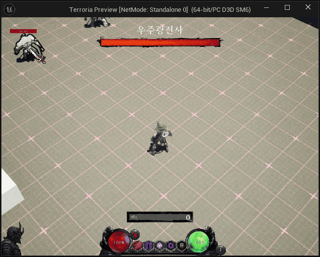
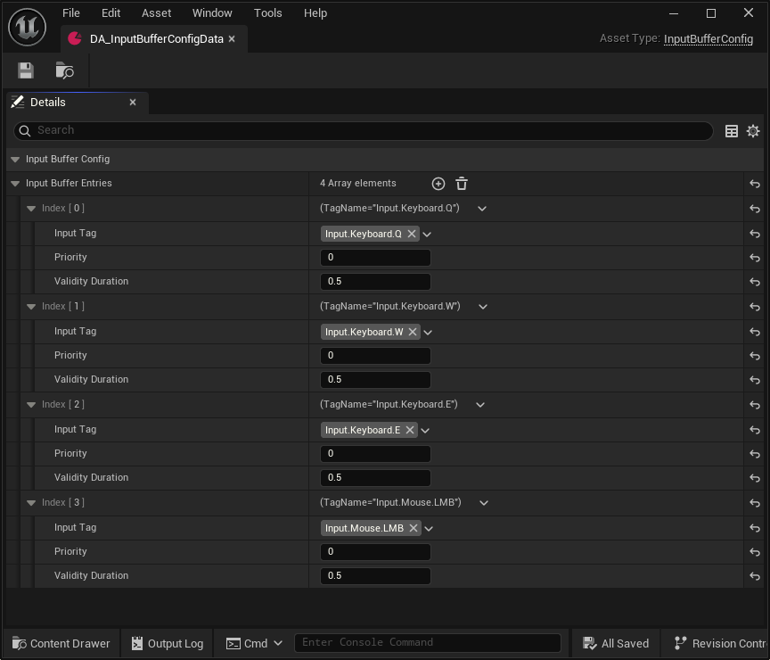
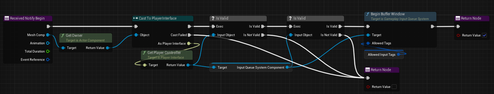
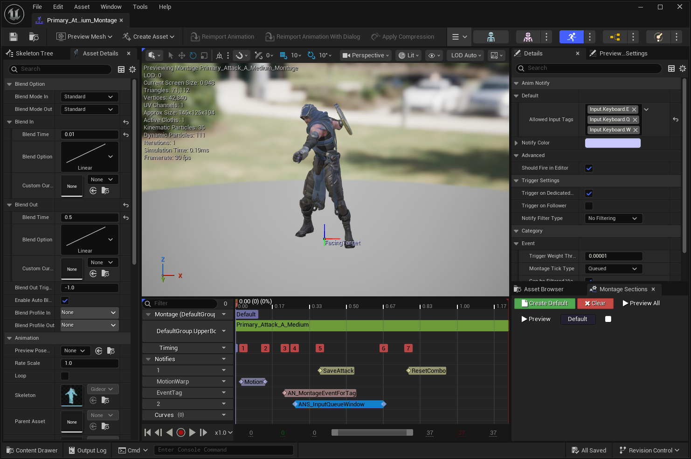
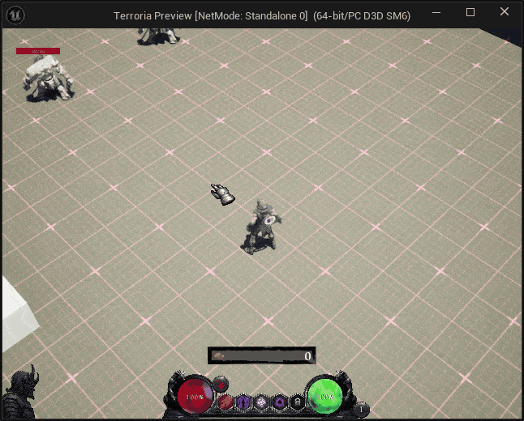
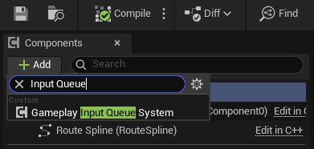
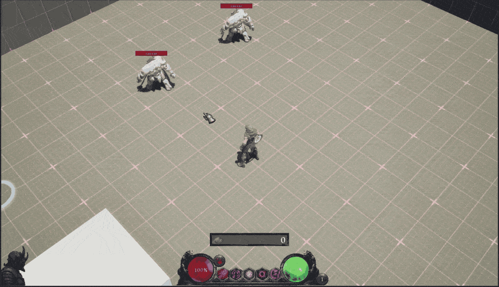
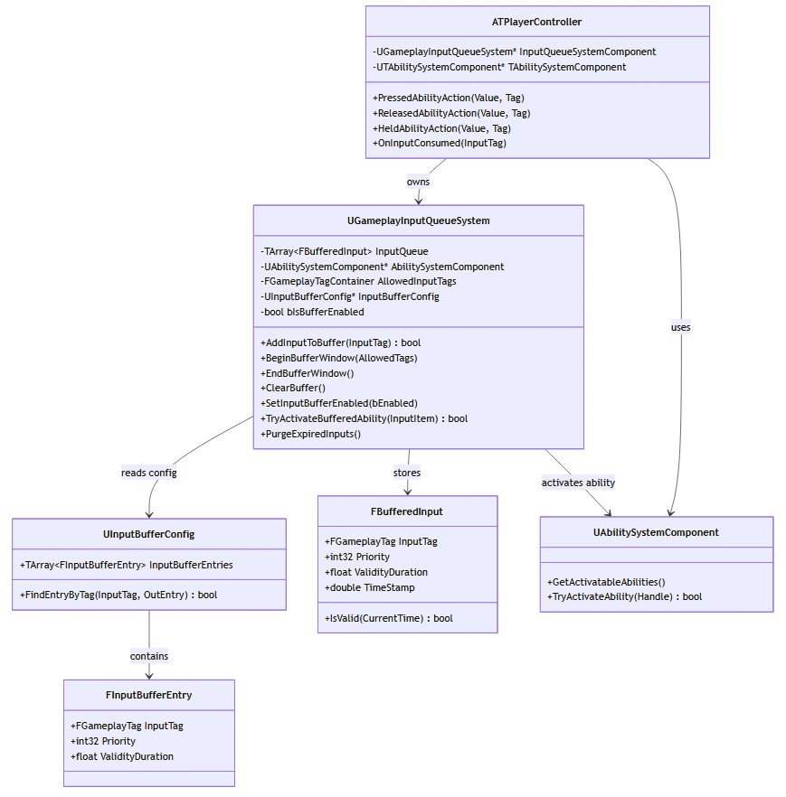
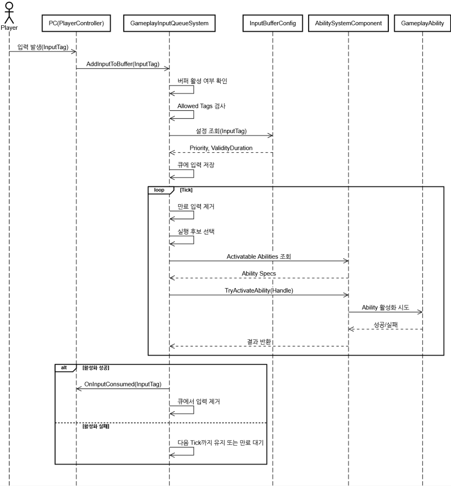

# 들어가며
액션 게임을 만들다 보면, 플레이어는 분명 버튼을 눌렀는데 게임은 그 입력을 놓쳐버리는 순간이 자주 생깁니다. 특히 공격, 회피, 스킬 연계처럼 타이밍이 중요한 게임에서는 이런 입력 손실이 곧 조작감 저하로 이어집니다.

이번 글에서는 제가 Gameplay Ability System(GAS) 을 확장해서 만든 Input Queue 시스템을 정리해보려고 합니다.

핵심 아이디어는 간단합니다.지금 당장 실행할 수 없는 입력을 잠시 저장해두고, 실행 가능한 시점이 오면 Ability를 활성화한다.

이 구조를 통해 다음과 같은 문제를 해결할 수 있습니다.
- 공격 중 다음 행동을 미리 넣는 선입력
- 콤보 타이밍을 자연스럽게 이어주는 입력 예약
- 특정 구간에서만 허용되는 버퍼 윈도우
- 입력별로 다르게 줄 수 있는 유효 시간 / 우선순위

:::note
이 시스템은 [Behind the Scenes of Mortal Shell | Inside Unreal](https://www.youtube.com/watch?v=8yLq7jlVCAY&t=6090s) 에서 영감을 얻어 제작하게 되었습니다.
:::

---

# GameplayInputQueueSystem

## 왜 Input Queue가 필요한가?
기본적인 입력 처리 흐름은 보통 아래와 같습니다.

1. 플레이어가 키를 누른다.
2. 컨트롤러가 입력을 받는다.
3. 즉시 Ability 실행을 시도한다.
4. 현재 상태상 실행할 수 없으면 입력은 사라진다.

이 방식은 단순하지만 액션 게임에는 한계가 있습니다. 예를 들어 플레이어가 공격 애니메이션이 끝나기 직전에 다음 공격 키를 눌렀다고 해보겠습니다.

플레이어는 “다음 공격을 예약했다”고 느끼지만, 시스템은 그 순간 Ability를 실행할 수 없으면 입력을 버립니다.

그 결과:
- 조작이 뻑뻑하게 느껴지고
- 콤보가 불안정해지며
- 플레이어 의도보다 시스템 타이밍이 더 우선하게 됩니다.



그래서 필요한 것이 Input Buffer / Input Queue 입니다.

## 목표

Input Queue 시스템의 목표는 다음과 같습니다.

- 입력을 일정 시간 동안 저장한다.
- 모든 입력이 아니라 허용된 입력만 저장한다.
- 오래된 입력은 자동으로 폐기한다.
- 실행 가능한 시점이 오면 GAS를 통해 Ability를 활성화한다.
- 입력별 유효 시간과 우선순위를 데이터로 조절할 수 있게 한다.

이 시스템은 단순히 입력을 늦게 처리하는 구조가 아닌, 플레이어의 의도를 유실하지 않도록 보존하는 구조에 가깝습니다.

## 전체 구조

시스템은 크게 네 가지 역할로 구별합니다.

- **PlayerController**: 플레이어 입력을 받음
- **GameplayInputQueueSystem**: 입력 저장, 만료 처리, 실행 시도를 담당하는 액터 컴포넌트
- **InputBufferConfig**: 입력별 우선순위와 유효시간을 관리하는 데이터
- **AbilitySystemComponent**: 실제 Ability 활성화를 수행하는 GAS 컴포넌트

---

# 핵심 분석

## 1. 입력 정책을 데이터로 분리하기

입력 큐 시스템에서 가장 필요한 것은 `어떤 입력을 얼마 동안 보관할지`에 대한 설정입니다. 이를 위해 입력별 설정 데이터를 별로 DataAsset으로 분리했습니다.

```cpp
USTRUCT(BlueprintType)
struct FInputBufferEntry
{
    GENERATED_BODY()

    UPROPERTY(EditAnywhere, BlueprintReadOnly)
    FGameplayTag InputTag = FGameplayTag();

    UPROPERTY(EditAnywhere, BlueprintReadOnly)
    int32 Priority = 0;

    UPROPERTY(EditAnywhere, BlueprintReadOnly)
    float ValidityDuration = 0.5f;
};
```
각 입력은 다음 속성을 가집니다.
- InputTag: 어떤 입력인지 식별
- Priority: 우선순위
- ValidityDuration: 입력이 유효한 시간

예를 들어 이런 식으로 설정할 수 있습니다.
- 가벼운 공격: 유효 시간 0.3초
- 회피: 유효 시간 0.15초, 우선순위 높에
- 강공격: 유효 시간 조금 더 길게

이런 값을 하드코딩하지 않고 데이터로 분리하면 전투 감각 튜닝이 훨씬 쉬워집니다. 이렇게 입력 설정의 구조체를 만들고 DataAsset 형태의 설정 오브젝트로 만듭니다.



```cpp
// InputBufferConfig.h
UCLASS(BlueprintType)
class TERRORIA_API UInputBufferConfig : public UDataAsset
{
    GENERATED_BODY()

public:
    UPROPERTY(EditDefaultsOnly, BlueprintReadOnly, meta = (TitleProperty = "InputTag"))
    TArray<FInputBufferEntry> InputBufferEntries;

    bool FindEntryByTag(const FGameplayTag& InputTag, FInputBufferEntry& OutEntry) const
    {
        for (const FInputBufferEntry& Entry : InputBufferEntries)
        {
            if (Entry.InputTag.MatchesTagExact(InputTag))
            {
                OutEntry = Entry;
                return true;
            }
        }
        return false;
    }
};
```
여기서 중요한 포인트는 `FindEntryByTag()`입니다. 입력이 들어오면 코드에서 직접 분기하지 않고, 태그 기반 데이터 조회를 통해 런타임 버퍼 항목을 처리하게 됩니다.

## 2. 런타임에서 입력을 저장하는 구조

데이터 테이블이 입력의 `정책`이라면, 실제 버퍼에 들어가는 항목은 `런타임 이벤트`입니다.

```cpp
// GameplayInputQueueSystem.h
USTRUCT(BlueprintType)
struct FBufferedInput
{
    GENERATED_BODY()

    FBufferedInput() = default;

    UPROPERTY(EditAnywhere, BlueprintReadWrite, Category = "Input")
    FGameplayTag InputTag = FGameplayTag();

    UPROPERTY(EditAnywhere, BlueprintReadWrite, Category = "Input")
    int32 Priority;

    UPROPERTY(EditAnywhere, BlueprintReadWrite, Category = "Input")
    float ValidityDuration;

    UPROPERTY(VisibleAnywhere, BlueprintReadOnly, Category = "Input")
    double TimeStamp;

    FBufferedInput(const FGameplayTag InInputTag, const double InTimeStamp, const int32 InPriority = 0,
                   const float InValidityDuration = 0.5f) :
        InputTag(InInputTag), Priority(InPriority), ValidityDuration(InValidityDuration), TimeStamp(InTimeStamp)
    {
    }

    bool IsValid(const double CurrentTime) const
    {
        return CurrentTime - TimeStamp <= ValidityDuration;
    }

    bool operator<(const FBufferedInput& Other) const
    {
        if (Priority != Other.Priority)
        {
            return Priority < Other.Priority;
        }
        return TimeStamp < Other.TimeStamp;
    }

    FString ToString() const
    {
        return FString::Printf(TEXT("[%s] Time: %.2f, Dur: %.2f, Pri: %d"),
                               *InputTag.ToString(), TimeStamp, ValidityDuration, Priority);
    }
};
```
이 구조체는 단순 데이터 저장용이지만, 몇 가지 중요한 의미가 있습니다.
- **TimeStamp**: 입력이 언제들어왔는지 기록합니다. 이를 통해 유효 시간을 계산합니다.
- **IsValid()**: 현재 시점 기준으로 유효한 입력인지 확인합니다.
- **Priority**: 향후 우선순위 기반 선택 정책으로 확장 가능성

## 3. 컴포넌트
실제 입력 저장과 실행은 `UGameplayInputQueueSystem`이 담당합니다. 이는 하나의 액터 컴포넌트로 코드는 다음과 같습니다.

```cpp
// GameplayInputQueueSystem.h
UCLASS(ClassGroup=(Custom), meta=(BlueprintSpawnableComponent))
class TERRORIA_API UGameplayInputQueueSystem : public UActorComponent
{
    GENERATED_BODY()

public:
    UGameplayInputQueueSystem();

protected:
    virtual void BeginPlay() override;

public:
    virtual void TickComponent(float DeltaTime, ELevelTick TickType,
                               FActorComponentTickFunction* ThisTickFunction) override;

    UFUNCTION(BlueprintCallable, Category = "Input")
    bool AddInputToBuffer(const FGameplayTag& InputTag);

    UFUNCTION(BlueprintCallable, Category = "Input")
    void ClearBuffer();

    UFUNCTION(BlueprintCallable, Category = "Input")
    void BeginBufferWindow(const FGameplayTagContainer& AllowedTags);

    UFUNCTION(BlueprintCallable, Category = "Input")
    void EndBufferWindow();

    UFUNCTION(BlueprintCallable, Category = "Input")
    void SetInputBufferEnabled(bool bEnabled);

    UFUNCTION(BlueprintCallable, Category = "Input")
    bool IsInputBufferEnabled() const { return bIsBufferEnabled; }

protected:
    bool TryActivateBufferedAbility(const FBufferedInput& InputItem);
    void PurgeExpiredInputs();
    void ShowDebug();

public:
    UPROPERTY(BlueprintAssignable, Category = "QueueSystem|Input")
    FInputQueueConsumedDelegate OnInputConsumed;

private:
    TArray<FBufferedInput> InputQueue;

    UPROPERTY()
    TObjectPtr<UAbilitySystemComponent> AbilitySystemComponent;

    FGameplayTagContainer AllowedInputTags;

    UPROPERTY(EditDefaultsOnly, Category = "QueueSystem")
    TObjectPtr<UInputBufferConfig> InputBufferConfig;

    UPROPERTY(EditDefaultsOnly, Category = "QueueSystem")
    bool bIsBufferEnabled;

    UPROPERTY(EditAnywhere, Category = "QueueSystem|Debug")
    bool bShowDebug;
};
```
이 클래스의 핵심 책임은 아래 다섯 가지입니다.

- 입력 저장
- 허용 태그 필터링
- 입력 만료 처리
- Ability 활성화 시도
- 소비 이벤트 브로드캐스트

입력을 저장하고, 관리하며, 실행히키는 관리자 역할을 하는 컴포넌트입니다.

## 4. 버퍼 윈도우

이 시스템에서 가장 중요한 설계 포인트 중 하나는 항상 입력을 받는 것이 아닌, 특정 시간에만 받도록 했습니다.



```cpp
// GameplayInputQueueSystem.h
void UGameplayInputQueueSystem::BeginBufferWindow(const FGameplayTagContainer& AllowedTags)
{
    AllowedInputTags = AllowedTags;
    bIsBufferEnabled = true;
}

void UGameplayInputQueueSystem::EndBufferWindow()
{
    bIsBufferEnabled = false;
    AllowedInputTags.Reset();
    ClearBuffer();
}
```
이 구조 덕분에 다음과 같은 설계가 가능해집니다.

- 공격 애니메이션 후반부에만 다음 공격 입력 허용
- 캐스팅 종료 직전에만 특정 스킬 입력 허용
- 특정 상태에서는 회피 입력만 예약 가능

그리고 `AllowedInputTags`를 함께 받아, 의도한 입력만 선택적으로 수용하게 됩니다.



## 5. 큐를 저장하는 방식
```cpp
// GameplayInputQueueSystem.h
bool UGameplayInputQueueSystem::AddInputToBuffer(const FGameplayTag& InputTag)
{
    if (!bIsBufferEnabled)
    {
        return false;
    }

    if (AllowedInputTags.Num() > 0 && !AllowedInputTags.HasTagExact(InputTag))
    {
        if (bShowDebug)
        {
            GEngine->AddOnScreenDebugMessage(-1, 2.0f, FColor::Green,
                                             FString::Printf(TEXT("Rejected (Not Allowed): %s"), *InputTag.ToString()));
        }
        return false;
    }

    int32 Priority = 0;
    float Duration = 0.5f;

    if (InputBufferConfig)
    {
        FInputBufferEntry Entry;
        if (InputBufferConfig->FindEntryByTag(InputTag, Entry))
        {
            Priority = Entry.Priority;
            Duration = Entry.ValidityDuration;
        }
    }

    const double CurrentTime = GetWorld()->GetTimeSeconds();
    const FBufferedInput NewInput(InputTag, CurrentTime, Priority, Duration);
    InputQueue.Add(NewInput);

    if (bShowDebug)
    {
        GEngine->AddOnScreenDebugMessage(-1, 2.0f, FColor::Green,
                                         FString::Printf(TEXT("Buffered: %s"), *InputTag.ToString()));
    }

    return true;
}
```
이 함수의 흐름은 명확합니다.
1. 버퍼가 열려 있는지 확인
2. 현재 허용된 태그인지 확인
3. 설정 데이터에서 우선순위 / 유효시간 조회
4. 현재 시각과 함께 버퍼 항목 생성
5. 큐에 저장

즉, 실행을 바로 시도하지 않고 먼저 입력 의도를 보존하게 됩니다.



## 6. 입력을 소비하는 방식
입력 큐는 매 프레임 실행 가능 여부를 확인합니다.
```cpp
// GameplayInputQueueSystem.h
void UGameplayInputQueueSystem::TickComponent(float DeltaTime, ELevelTick TickType,
                                              FActorComponentTickFunction* ThisTickFunction)
{
    Super::TickComponent(DeltaTime, TickType, ThisTickFunction);

    if (!bIsBufferEnabled || !AbilitySystemComponent || InputQueue.Num() == 0)
    {
        return;
    }

    PurgeExpiredInputs();
    if (InputQueue.Num() == 0)
    {
        return;
    }

    int32 CandidateIndex = InputQueue.Num() - 1;
    const FBufferedInput& CandidateInput = InputQueue[CandidateIndex];

    if (TryActivateBufferedAbility(CandidateInput))
    {
        OnInputConsumed.Broadcast(CandidateInput.InputTag);
        InputQueue.RemoveAt(CandidateIndex);

        if (bShowDebug)
        {
            GEngine->AddOnScreenDebugMessage(-1, 2.0f, FColor::Cyan,
                                             FString::Printf(
                                                 TEXT("Executed: %s"), *CandidateInput.InputTag.ToString()));
        }
    }
}
```
이 함수의 흐름은 다음과 같습니다.
1. 버퍼가 켜져 있는지 확인
2. ASC가 있는지 확인
3. 큐가 비어 있는지 확인
4. 오래된 입력 제거
5. 실행 후보 선택
6. Ability 활성화 시도
7. 성공 시 큐에서 제거 및 이벤트 브로드캐스트

현재 입력 처리 방식은 `최근 입력 우선` 방식으로 **가장 마지막에 들어온 입력**을 먼저 확인하고 있습니다. 추후 코드를 수정하여 우선순위가 높은 입력 먼저, 우선순위가 같으면 더 최근 입력 먼저와 같은 방식을 선택할 수 있도록 변경 할 예정입니다.

## 7. 만료된 입력 정리

버퍼는 입력을 영원히 저장하면 안됩니다. 너무 오래된 입력이 뒤늦게 실행되면 오히려 어색해지기 때문에 이를 처리하기 위해 `PurgeExpiredInputs()` 함수를 통해 오래된 입력을 정리합니다.

```cpp
// GameplayInputQueueSystem.h
void UGameplayInputQueueSystem::PurgeExpiredInputs()
{
    double CurrentTime = GetWorld()->GetTimeSeconds();

    InputQueue.RemoveAll([CurrentTime](const FBufferedInput& Item)
    {
        return !Item.IsValid(CurrentTime);
    });
}
```

## 8. GAS를 통한 Ability 활성화

버퍼에 저장된 입력은 GAS를 통해 Ability를 실행합니다.
```cpp
// GameplayInputQueueSystem.h
bool UGameplayInputQueueSystem::TryActivateBufferedAbility(const FBufferedInput& InputItem)
{
    if (!AbilitySystemComponent)
    {
        return false;
    }

    for (FGameplayAbilitySpec& AbilitySpec : AbilitySystemComponent->GetActivatableAbilities())
    {
        if (AbilitySpec.GetDynamicSpecSourceTags().HasTagExact(InputItem.InputTag))
        {
            if (!AbilitySpec.IsActive())
            {
                return AbilitySystemComponent->TryActivateAbility(AbilitySpec.Handle);
            }
        }
    }

    return false;
}
```
이 함수의 장점은 명확합니다.

- 입력 큐는 Ability의 내부 구현을 몰라도 된다.
- 입력 태그를 기준으로 활성화 가능한 Ability를 찾는다.
- 찾은 Ability에 대해 GAS의 표준 흐름으로 실행을 시도한다.

즉, 입력 계층과 Ability 계층이 태그 기반으로 느슨하게 연결됩니다.

## 9. 입력과 큐를 연결하기

실제 입력과 시스템을 연결시켜야 합니다. 여기서는 PlayerController에서 실제 입력이 일어납니다. 그래서 먼저 컨트롤러에 `GameplayInputQueueSystem` 컴포넌트를 부착합니다.



```cpp
// ATPlayerController.cpp
ATPlayerController::ATPlayerController()
{
    InputQueueSystemComponent = CreateDefaultSubobject<UGameplayInputQueueSystem>(TEXT("InputQueueSystemComponent"));
}
```

또한 입력 소비 이벤트를 연결할 수 있습니다.
```cpp
void ATPlayerController::BeginPlay()
{
    Super::BeginPlay();

    // ... existing code ...

    if (InputQueueSystemComponent)
    {
        InputQueueSystemComponent->OnInputConsumed.AddDynamic(this, &ATPlayerController::OnInputConsumed);
    }

    // ... existing code ...
}

void ATPlayerController::OnInputConsumed(FGameplayTag InputTag)
{
    // something
}
```
소비 이벤트는 현재 비워져있지만 이동 중단, UI 갱신, 디버깅등 다양한 후처리를 연결하기 좋은 방식을 제공하고 있습니다.

## 10. 실제 입력 처리 분기

현재 입력 처리는 다음과 같이 진행됩니다.

```cpp
void ATPlayerController::PressedAbilityAction(const FInputActionValue& Value, FGameplayTag Tag)
{
    if (Tag.MatchesTagExact(FTGameplayTags::Get().Input_Mouse_LMB))
    {
        GetTASC()->TargetConfirm();
    }

    if (Tag.MatchesTagExact(FTGameplayTags::Get().Input_Keyboard_P))
    {
        if (const ATHUD* HUD = Cast<ATHUD>(GetHUD()))
        {
            HUD->ToggleShopWidget();
        }
        return;
    }

    if (Tag.MatchesTagExact(FTGameplayTags::Get().Input_Keyboard_F))
    {
        if (IsValid(PossessedCharacter.Get()))
        {
            PossessedCharacter->ProcessInteraction();
        }
        return;
    }

    if (Tag.MatchesTagExact(FTGameplayTags::Get().Input_Mouse_RMB))
    {
        MousePressTime = 0.f;
        bIsTargeting = CurrentActor ? true : false;
        bMovingToDestination = false;
        GetTASC()->TargetCancel();
    }
    else
    {
        bool bBuffered = false;
        if (InputQueueSystemComponent && InputQueueSystemComponent->IsInputBufferEnabled())
        {
            bBuffered = InputQueueSystemComponent->AddInputToBuffer(Tag);
        }
        else if (GetTASC() && GetTASC()->HasMatchingGameplayTag(FTGameplayTags::Get().State_Attacking))
        {
            return;
        }

        if (!bBuffered && GetTASC())
        {
            GetTASC()->HeldAbilityInputTag(Tag);
        }
    }
}
```

### 즉시 입력 처리

일부 입력은 큐에 넣지 않고 바로 처리합니다.

- 좌클릭 확인
- UI 토글
- 상호작용
- 우클릭 취소 / 타겟 처리

### 버퍼링 대상 입력

나머지 입력은 버퍼 활성화 여부에 따라 판단합니다.

```cpp
if (InputQueueSystemComponent && InputQueueSystemComponent->IsInputBufferEnabled())
{
    bBuffered = InputQueueSystemComponent->AddInputToBuffer(Tag);
}
```

버퍼에 저장되지 않았다면 기존 입력 처리로 넘깁니다.

```cpp
if (!bBuffered && GetTASC())
{
    GetTASC()->HeldAbilityInputTag(Tag);
}
```

구현을 한 모습을 보면, Input Queue System을 추가하기 위해 새로운 입력 체계를 작성한 것이 아닌 기존의 GAS 입력 처리 앞단에 Input Queue 계층을 추가하여 컨트롤하고 있습니다.

---

# 그래서 장점이 뭔가요?



이 시스템의 장점은 네 가지로 요약할 수 있습니다.

1. **입력 씹힘을 줄일 수 있다.**
    - 가장 직접적인 장점으로, 플레이어가 아주 짧은 타이밍에 넣은 입력도 시스템이 잠시 보존해줍니다.
2. **콤보와 선입력 설계가 쉬워진다.**
    - 버퍼 윈도우와 허용 태그를 조합하면 콤보 구간 설계가 훨씬 자연스러워집니다.
3. **GAS 친화적**
    - 입력도 GameplayTag, 상태도 GameplayTag, Ability 연결도 GameplayTag 기반이라 시스템 언어가 통일됩니다.
4. **데이터 기반 튜닝이 가능하다.**
    - 입력별 유효 시간과 우선순위를 DataAsset으로 조정할 수 있어 전투 감각 개선이 쉽습니다.

---

# 개선 할 점은 뭔가요?

1. **우선순위 기반 처리**
    - 지금은 가장 마지막 입력을 소비하고 있지만, 앞으로는 Priority, TimeStamp 기준으로 후보를 정렬할 수도 있습니다.
2. **중복 입력 정책**
    - 같은 입력이 여러 번 들어왔을 때는 종복 허용, 같은 태그 하나만 유지, 최신 입력으로 갱신과 같은 정책을 통해 중복 입력 정책을 처리할 예정입니다.
3. **Ability 매칭 캐싱**
    - 현재는 Ability 목록을 순회하며 태그를 찾습니다. 추후 Ability 수가 많아진다면, 캐싱 구조를 고려해볼 예정입니다.
4. **디버깅 강화**
    - 입력 큐는 내부 상태가 안 보여서 디버깅이 어렵습니다. 시각 정보를 제공해볼 예정입니다.

---

# 마무리

이번에 구현한 `Gameplay Input Queue System`은 GAS 위에 입력 버퍼 계층을 추가해, 즉시 실행할 수 없는 입력을 잠시 보관하고 적절한 시점에 다시 실행할 수 있도록 만든 구조입니다. 이 구조의 핵심은 단순합니다. 입력 큐 시스템의 목적은 입력을 늦게 처리하는 것이 아니라, 플레이어의 의도를 잃지 않는 것이다.

액션 게임에서 조작감은 정말 작은 차이에서 크게 갈립니다. 입력 버퍼 시스템은 그 차이를 지켜주는 장치라고 생각합니다. 긴 글 읽어주셔서 감사합니다.

---

# 자료

#### 클래스 다이어그램


#### 시퀀스 다이어그램
