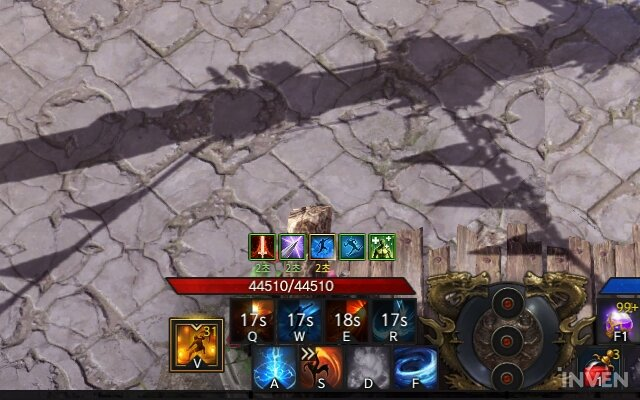
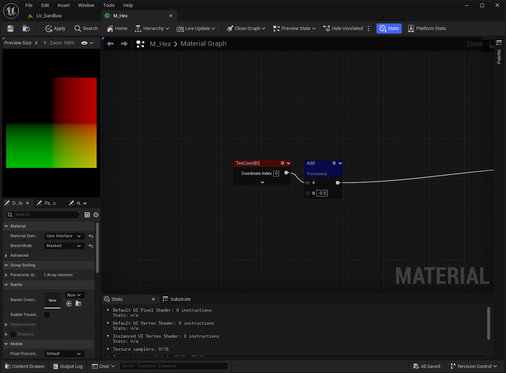
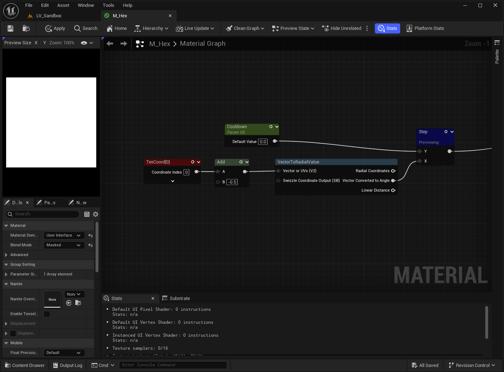
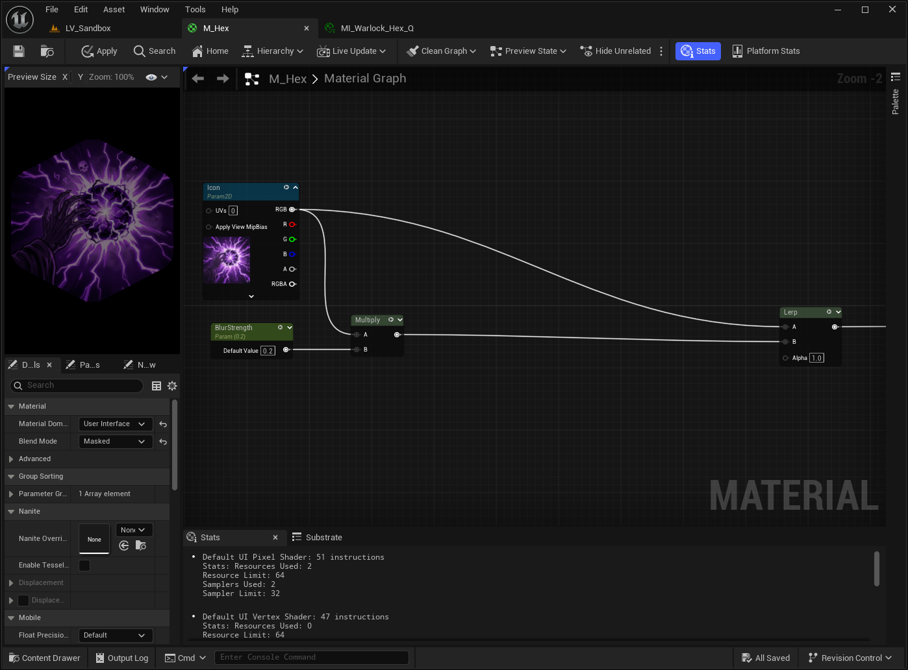
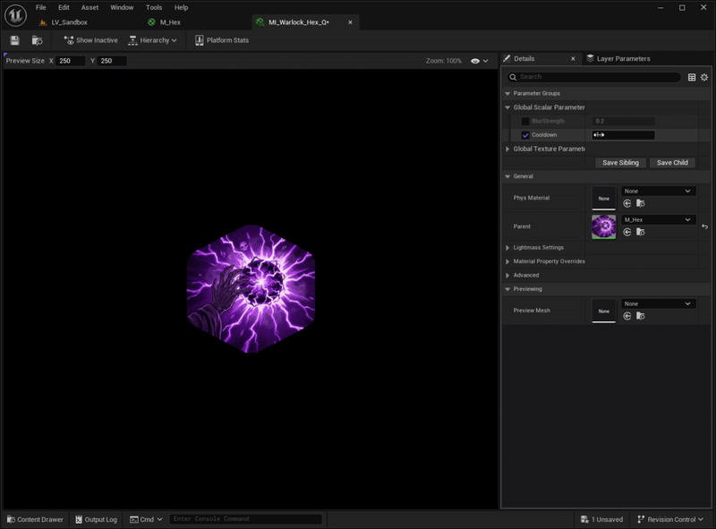
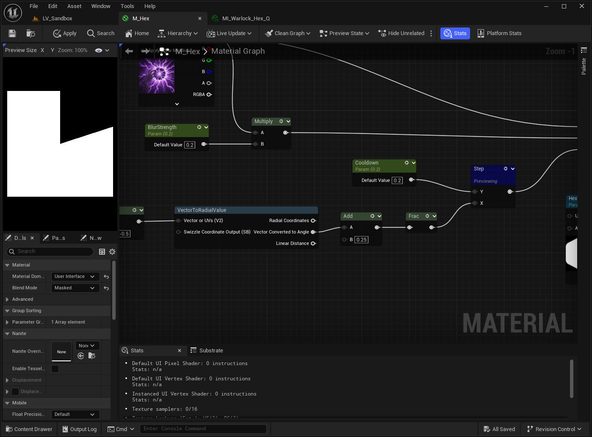
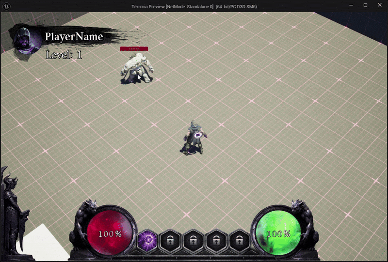

# 들어가며

스킬이 있는 게임에서 쿨타임 표시는 플레이어에게 가장 중요한 피드백 중 하나입니다.

Fig 1의 로스트아크 예시처럼, 스킬 아이콘 위에 반투명 부채꼴 모양의 그림자가 시계 방향으로 돌아가며 남은 시간을 시각화합니다. 단순히 이미지의 Tint 값만 조절하여 색상의 변화를 줄 수도 있지만, 좀 더 시각적으로 특색 있고, 차오르는 느낌을 주기에는 부족합니다.

이번 포스트에서는 언리얼 엔진의 `머티리얼(Material)`을 활용하여 가볍고 유연한 원형 쿨타임 UI를 만드는 방법에 대해 알아보겠습니다.

---

## Material 생성

먼저 머티리얼을 생성하고, 디테일 패널에서 다음과 같이 설정을 변경합니다.

- Material Domain: User Interface
- Blend Mode: Translucent 또는 Masked

## UV

그 다음 `TexCoord` 노드를 생성합니다. 이 노드를 이용해 텍스처 UV를 제어할 수 있습니다.
기본적으로 UV는 원점이 좌상단 (0,0) 이기 때문에 원점을 중심으로 옮기기 위해 Add 노드를 추가하고 -0.5를 더해줍니다. (Subtract로 0.5를 빼주셔도 됩니다.)

우리가 흔히 사용하는 텍스처 좌표(UV)는 X,Y 축으로 이루어진 직교 좌표계(Cartesian Coordinate System)입니다. 하지만 원형으로 돌아가는 효과를 만들기 위해서는 이를 각도와 거리(Radius)를 사용하는 극좌표계(Polar Coordinate System)로 변환해야 합니다.

언리얼 엔진 머티리얼에서는 위 연산을 직접 구현할 필요 없이, `VectorToRadialValue`라는 함수 노드를 제공하고 있어, 이 노드를 이용해 쉽게 변환할 수 있습니다.

## VectorToRadialValue

이 노드는 입력 받은 UV 좌표를 각도(0~1)로 변환합니다. _0 = 0도, 1 = 360도_

Add 연산이 끝난 UV를 연결하여 나온 3개의 결과 중 `Vector Converted to Angle` 결과를 사용하겠습니다. 예제 이미지는 없지만, Preview를 통해 해당 노드를 활성화하면 3시 방향부터 시계방향으로 그라데이션이 생기는 것을 볼 수 있습니다.

## Step

이제 이 그라데이션 값과 우리가 제어할 변수 "쿨타임 퍼센트"를 비교해야 합니다.

ScalarParameter 노드를 생성하고 이름을 `Cooldown`으로 짓습니다. (이 값은 0.0 ~ 1.0) 값을 가집니다. 그리고 `Step 노드`를 생성하고 Y에 Cooldown 값을 연결합니다.

VectorToRadialValue의 값을 가져와서 Step 노드에 연결합니다.(Y: 기준, X: 입력)

:::tip
Step 노드는 두 값을 비교해 다른 값에 대한 한 값의 에지를 지정하여 하나의 값에서 다른 값으로의 스텝을 생성하는 셰이더 함수입니다. 두 번째 컬러 값과 비교해 표시할 한 컬러 값의 정도를 결정하여 그레이디언트를 정의하는 데 사용할 수 있습니다.

(언리얼 공식문서)
:::

, 검은색(0)")

쉽게 말해, 전체 0에서 1의 값 중에서 Cooldown 값만큼 원본 스킬 이미지를 보여주고 있습니다. Cooldown 값이 0일 때는 흰색 영역이, 1일 때는 검은색 영역이 모두 차지하게 됩니다.

## Lerp

이제 스킬아이콘 텍스처를 가져옵니다. `Multiply 노드`를 생성하고 A에는 스킬아이콘 텍스처, B값은 0.2만큼 설정합니다. 그러면 텍스처 노드 1개와 Multiply 결과 노드 1개가 있겠죠?

`Lerp 노드`를 생성하고 각각 A,B에 하나씩 넣어줍니다. 그리고 **이전에 만들어 둔 Step 노드를 Alpha 값에 연결**하고 마지막으로 Lerp 결과를 `Final Color`에 연결합니다.

## 방향 수정

현재 3시 방향에서 시작해서 한 바퀴를 돌고 있습니다. 이를 12시 방향에서 시작해서 한 바퀴를 돌게 만들어주도록 하겠습니다.

이전에 만들었던 VectorToRadialValue의 결과값에 Add 노드를 통해 0.25를 더해주세요. 이렇게하면 시계 반대 방향으로 90도 회전하여 12시에서 시작하게 됩니다.

이후 Add 노드 결과를 `Frac 노드`에 연결합니다. 

:::tip
Frac 표현식은 값을 받아 그 값의 소수점 부분을 출력합니다. 즉, 입력값이 'X'이면 결과는 'X에서 X의 Floor를 뺀 값'이 됩니다. 출력값의 범위는 0~1로, 하한 값은 포함하지만 상한 값은 포함하지 않습니다. (언리얼 공식문서)
:::

예를 들어 1.2 -> 0.2로 만들어주는데, 1.0이 넘어가면 그라데이션이 끊기는데 이를 끊김 없이 360도 부드럽게 이어지게 만들어줍니다.

## 추가하기

현재 Cooldown 값이 1일 때 스킬 아이콘이 활성화된 상태이고, 0일 때 비활성된 상태입니다. 살짝 이상하죠? 쿨타임이 0일 때 스킬 아이콘이 활성화되어야 할텐데... 이건 여러분이 한번 도전해 보세요. 힌트를 드리면 `1-x 노드`입니다.

## 결과

---

# 마무리
이렇게 머티리얼 쉐이더를 활용하면 텍스처 낭비 없이 깔끔한 원형 쿨타임 효과를 만들 수 있습니다. 이를 활용하여 여러분도 멋진 스킬 쿨타임을 표현해보세요. 감사합니다. 

# Ref.

[언리얼 공식문서 - 수학 머티리얼 표현식](https://dev.epicgames.com/documentation/ko-kr/unreal-engine/math-material-expressions-in-unreal-engine)

[포트나이트 언리얼 에디터 머티리얼 노드 및 세팅](https://dev.epicgames.com/documentation/ko-kr/fortnite/material-nodes-and-settings-in-unreal-editor-for-fortnite#%EB%85%B8%EB%93%9C)