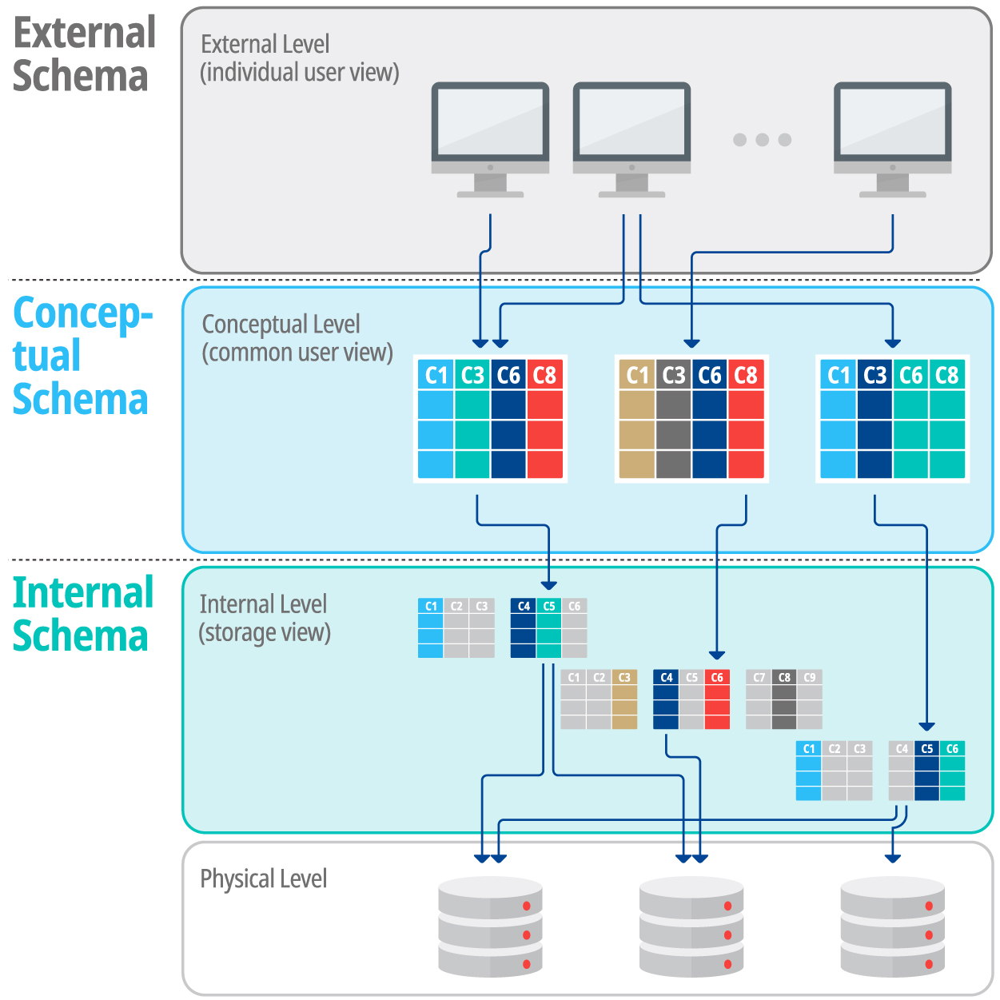

# 들어가며

언리얼 엔진 5.4에서 새로운 애니메이션 시스템이 소개되었습니다. 바로 모션 매칭을 통한 애니메이션 구현이었는데요.

<iframe width="560" height="315" src="https://www.youtube.com/embed/u9Z8CK561_Y?si=ZW5E9JxglpcnuGr_&amp;start=1872" title="YouTube video player" frameborder="0" allow="accelerometer; autoplay; clipboard-write; encrypted-media; gyroscope; picture-in-picture; web-share" referrerpolicy="strict-origin-when-cross-origin" allowfullscreen></iframe>

이 발표를 보고 느낀 것은 점점 언리얼 엔진이 데이터 기반(Data-driven)으로 시스템을 처리하고 있다는 것을 알 수 있었습니다. 이전의 `GAS(GameAbilitySystem)` 이나, `PCG(Procedural Content Generation)` 등을 보았을 때 말이죠.

개인적으로 좋은 방향이라고 생각합니다. 준비해야할 데이터가 늘어나긴 하지만 종속성이 사리지고, 오류나 수정이 필요한 경우 데이터만 교체하면 되니 좀 더 유연해졌다고 볼 수 있겠습니다.

개인적인 감상은 여기까지 하고 오늘은 차세대 언리얼 애니메이션 시스템 `모션매칭`에 대해 알아보도록 하겠습니다.

## 데이터 베이스

모션매칭 내용에 들어가기 전, 데이터베이스에 대해 짧게 설명하고 가겠습니다.



위 그림과 같이 데이터베이스는 3가지 스키마를 거쳐서 작동하게 됩니다. 즉 스키마는 일종의 필터라고 볼 수 있는데요. 이 필터를 걸쳐 데이터가 저장되어 있는 데이터베이스에 접근하게 됩니다. 쉽죠? 이 개념을 잘 기억해주세요. 애니메이션 포즈를 찾는 과정 자체가 이 개념에서 왔거든요.

## PoseSearchSchema

모션매칭 환경설정 및 쿼리 세팅을 저장하는 에셋입니다. 애니메이션 데이터베이스와 쿼리 시스템을 모션매칭 노드에 연결하기 위해 사용됩니다. 즉, **모션매칭 시스템의 작동 방식과 규칙을 정의하는 에셋**입니다.


내부적으로 채널을 사용해서 데이터를 정의합니다. 생성 시 기본적으로 궤적(Trajectory) 와 포즈(Pose) 채널이 생성됩니다.
물론 사용자 정의 채널도 생성 가능합니다.

채널은 공식 문서에서 자세히 설명하고 있습니다. [공식문서#채널](https://dev.epicgames.com/documentation/ko-kr/unreal-engine/motion-matching-in-unreal-engine#%EC%B1%84%EB%84%90)

자신에게 필요한 채널들을 추가해도 되고, 기본 채널만 사용해도 아무 문제가 없습니다.

## PoseSearchDatabase

애니메이션의 모음집으로, 모션매칭 시스템이 검색할 애니메이션 클립들의 목록과, 그 클립들을 어떻게 분석하고 검색할지에 대한 규칙을 담고 있는 핵심 데이터 에셋입니다.

데이터베이스는 다음과 같은 구성 요소를 가지고 있습니다.

1. 애니메이션 목록
2. 스키마
3. 검색 및 인덱스 설정
4. 정규화 세트
5. 파생 데이터

이 역시 공식 문서에서 자세히 설명하고 있습니다. [공식문서#PSD](https://dev.epicgames.com/documentation/ko-kr/unreal-engine/motion-matching-in-unreal-engine#%ED%8F%AC%EC%A6%88%EC%84%9C%EC%B9%98%EB%8D%B0%EC%9D%B4%ED%84%B0%EB%B2%A0%EC%9D%B4%EC%8A%A4%EC%97%90%EC%85%8B%EC%83%9D%EC%84%B1%ED%95%98%EA%B8%B0)

말 그대로 애니메이션을 모아놓은 하나 큰 데이터베이스입니다.

## PoseSearchNormalizationSet

이 에셋은 없어도 됩니다. 그러나 좀 더 빠른 검색, 퀄리티 높은 매칭결과를 얻기 위해서는 필요한 에셋입니다.

> This optional asset defines a list of databases you want to normalize together. Without it, it would be difficult to compare costs from separately normalized databases containing different types of animation,
> like only idles versus only runs animations, given that the range of movement would be dramatically different.

해당 에셋을 설명하는 구문입니다. NormalizationSet이 없으면, 서로 다른 유형의 애니메이션을 포함하는 개별적으로 정규화된 데이터베이스의 비용을 비교하기 어렵다고 하네요.

예를 들어, 대기 모션 애니메이션의 움직임은 거의 없기 때문에 Bone의 이동 값이 매우 작습니다. 그러나 달리기 애니메이션은 움직임이 크기 때문에 Bone의 이동 값이 매우 큽니다.
이를 데이터베이스에 따라 대기 모션 DB, 달리기 DB로 나눴다고 했을 때 캐릭터가 살짝 움직이기 시작하면, 대기와 달리기 애니메이션 데이터를 비교합니다. 이때 DB에 따라 가지고 있는 값이 서로 차이가 너무 크기 때문에 결국 달리기의 값이 최종 결과에 큰 영향을 미치게 될 것입니다. 그래서 필요한 것이 `NormalizationSet` 입니다.

### 코드로 살펴보기

이 정규화 과정을, 좀 더 코드를 통해 세부적으로 살펴보겠습니다.

먼저 `PoseNormalizationSet.h`를 보겠습니다.

```cpp PoseNormalizationSet.h
UCLASS(MinimalAPI, BlueprintType, Category = "Animation|Pose Search", meta = (DisplayName = "Pose Search Normalization Set"))
class UPoseSearchNormalizationSet : public UDataAsset
{
    GENERATED_BODY()
    
public:
    UPROPERTY(EditAnywhere, BlueprintReadOnly, Category = "NormalizationSet")
    TArray<TObjectPtr<const UPoseSearchDatabase>> Databases;

    UE_API void AddUniqueDatabases(TArray<const UPoseSearchDatabase*>& UniqueDatabases) const;
};
```
처음 봤을 때는 기존 설명이 잘못된건가 싶었습니다. 코드에서 알 수 있듯이 그냥 DataAsset일 뿐이었거든요.

정규화는 데이터베이스를 빌드(인덱싱)하는 과정에서 처리되고 있었습니다.

### 1. 정규화에 필요한 모든 데이터베이스 수집

> 한글 주석 부분을 보시면 됩니다.

```cpp PoseSearchDerivedData.cpp
void FPoseSearchDatabaseAsyncCacheTask::OnGetComplete(UE::DerivedData::FCacheGetResponse&& Response)
{

Owner.LaunchTask(TEXT("PoseSearchDatabaseBuild"), [this, FullIndexKey, bCompareSearchIndex]  
{  
       COOK_STAT(auto Timer = UsageStats.TimeSyncWork());  
  
       const UPoseSearchDatabase* MainDatabase = Database.Get();  
  
       // collecting all the databases that need to be built to gather their FSearchIndexBase  
       // the first one is always the main database (the one we're calculating the index on)       
       TArray<const UPoseSearchDatabase*> IndexBaseDatabases;  
       IndexBaseDatabases.Reserve(64);  
       IndexBaseDatabases.Add(MainDatabase);  

  
       if (MainDatabase->NormalizationSet)  
       {  
        // DB안의 정규화 세트 추가
        MainDatabase->NormalizationSet->AddUniqueDatabases(IndexBaseDatabases);  
       }
       
       // ...
}
```
- 해당 과정을 통해 모든 데이터베이스는 `IndexBaseDatabases` 안에 담겨있게 됩니다.
- 이 과정에서 NormalizationSet 안에 들어있는 모든 데이터베이스가 넘어가게 됩니다.

### 2. 수집된 DB에서 포즈 데이터 추출
```cpp PoseSearchDerivedData.cpp
// ...

// @todo: DDC or parallelize this code  
TArray<FSearchIndexBase> SearchIndexBases;  // 추출 데이터 저장 컨테이더
TArray<const UPoseSearchSchema*> Schemas;  
SearchIndexBases.AddDefaulted(IndexBaseDatabases.Num());  
Schemas.AddDefaulted(IndexBaseDatabases.Num());  
for (int32 IndexBaseIdx = 0; IndexBaseIdx < IndexBaseDatabases.Num(); ++IndexBaseIdx)  
{  
    const UPoseSearchDatabase* DependentDatabase = IndexBaseDatabases[IndexBaseIdx];  
    check(DependentDatabase);  
  
    const UPoseSearchSchema* DependentDatabaseSchema = bNormalizeWithCommonSchema ? MainDatabaseSchema : DependentDatabase->Schema.Get();  
    const FString DependentDatabaseName = DependentDatabase->GetName();  
  
    FSearchIndexBase& SearchIndexBase = SearchIndexBases[IndexBaseIdx];


// Building all the related FPoseSearchBaseIndex first  
if (!InitSearchIndexAssets(SearchIndexBase, DependentDatabase, DependentDatabaseSchema, DependentExcludeFromDatabaseParameters))  
{  
    UE_LOG(LogPoseSearch, Error, TEXT("%s - %s BuildIndex Failed becasue of invalid assets"), *LexToString(FullIndexKey.Hash), *MainDatabaseName);  
    ResetSearchIndex();  
    return;  
}  
  
if (Owner.IsCanceled())  
{  
    UE_LOG(LogPoseSearch, Log, TEXT("%s - %s BuildIndex Cancelled"), *LexToString(FullIndexKey.Hash), *MainDatabaseName);  
    ResetSearchIndex();  
    return;  
}  

// 실제 애니메이션 샘플링과 포즈 데이터 추출
if (!IndexDatabase(SearchIndexBase, DependentDatabase, DependentDatabaseSchema, DependentSamplingContext, DependentAdditionalExtrapolationTime, Owner))  
{  
    UE_LOG(LogPoseSearch, Log, TEXT("%s - %s BuildIndex Cancelled"), *LexToString(FullIndexKey.Hash), *MainDatabaseName);  
    ResetSearchIndex();  
    return;  
}
```

- `IndexBaseDatabases`를 순회하며 각 데이터베이스의 모든 애니메이션을 샘플링하여 포즈 데이터를 추출하고 `SearchIndexBases`로 저장합니다.
- 이후 `SearchIndexBases`에는 모든 데이터베이스의 Raw 포즈 데이터가 들어가게 됩니다.

### 3. 평균 편차 계산

모든 데이터가 준비되었기 때문에, 정규화의 기준이 될 __평균 편차__ 값을 계산하게 됩니다.

```cpp PoseSearchDerivedData.cpp
const TArray<float> Deviation = FMeanDeviationCalculator::Calculate(SearchIndexBases, Schemas);
```

`FMeanDeviationCalculator::Calculate` 함수를 호출하면 내부적으로 AnalyzeSchemas를 통해 비교 가능한 채널들을 그룹화하고, `CalculateEntriesMeanDeviation` 함수에서 Eigen 라이브러리를 통해 통계적인 평균 편차를 계산하게 됩니다.

```cpp
// ... 

RowMajorVector SampleMean = CenteredSubPoseMatrix.colwise().mean(); CenteredSubPoseMatrix = CenteredSubPoseMatrix.rowwise() - SampleMean; 

// after mean centering the data, the average distance to the centroid is simply the average norm.
const float FeatureMeanDeviation = CenteredSubPoseMatrix.rowwise().norm().mean(); return FeatureMeanDeviation;
```

### 4. 계산된 편차 값으로 정규화

위 과정에서 구한 최종 평균 편차 값을 Deviation 배열을 사용하여 최종 가중치(Weights)를 조절하게 됩니다.

```cpp
PreprocessSearchIndexWeights(SearchIndex, MainDatabaseSchema, Deviation);
```

``` cpp
if (DataPreprocessor != EPoseSearchDataPreprocessor::None) 
{ 
    for (int32 Dimension = 0; Dimension != NumDimensions; ++Dimension) 
    { 
        // 가중치를 편차로 나누어 줍니다. 
        // 편차가 큰 (변화가 많은) 데이터는 가중치가 낮아지고, 
        // 편차가 작은 (변화가 적은) 데이터는 가중치가 높아져 공평한 비교가 가능해집니다. 
        SearchIndex.WeightsSqrt[Dimension] /= Deviation[Dimension]; 
    } 
}
```
이를 통해 각 데이터의 가중치를 편차 값으로 나누어 스케일을 맞추는 방식으로 정규화가 이루어집니다.

---

# 마무리

다음 게시글에선 실제로 프로젝트에 적용해보면서 모션매칭에 대해 알아보도록 하겠습니다.