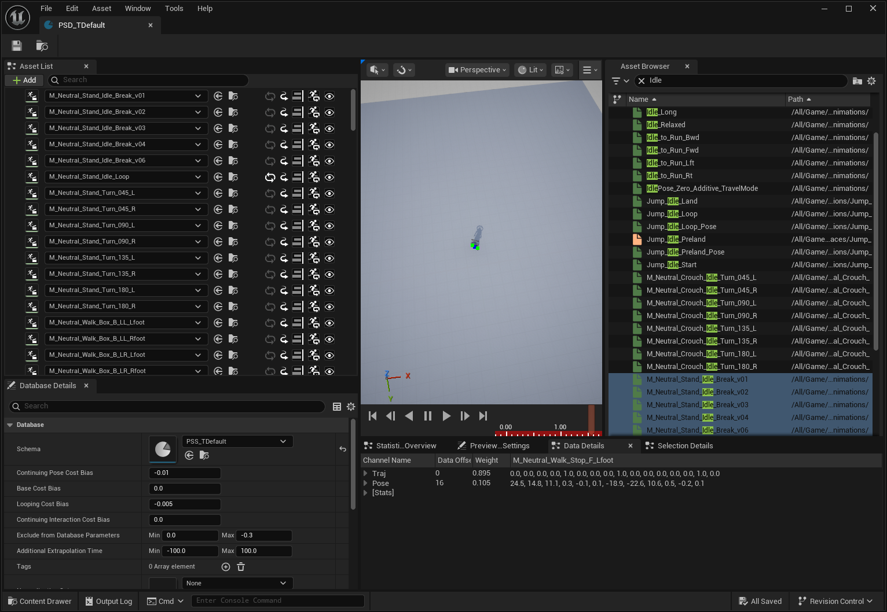
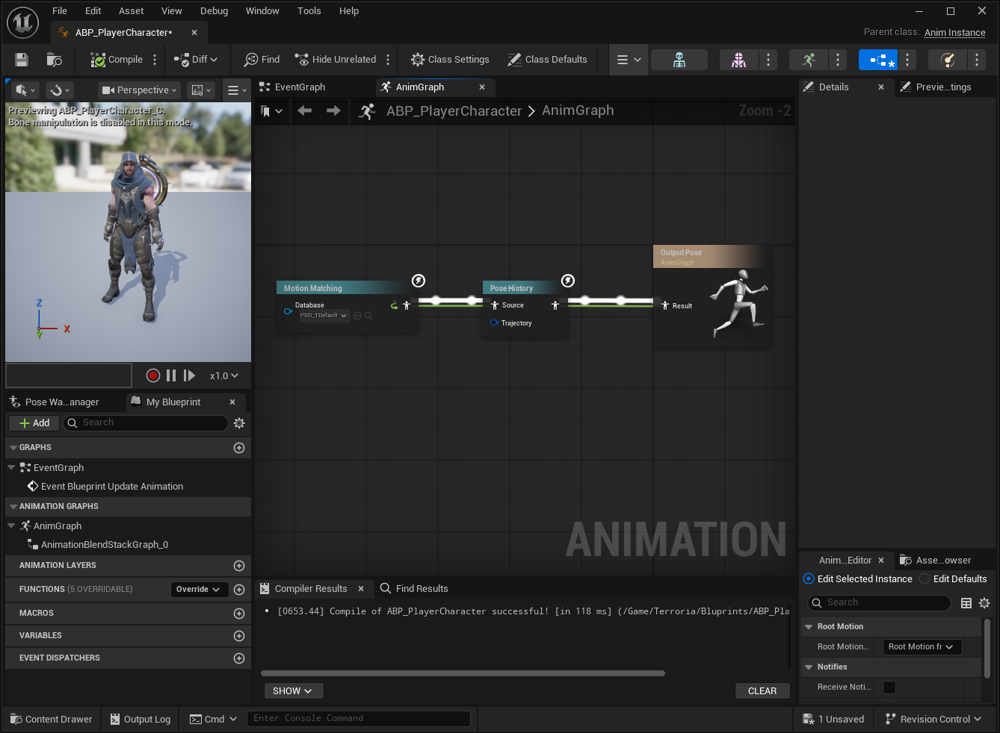
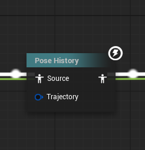
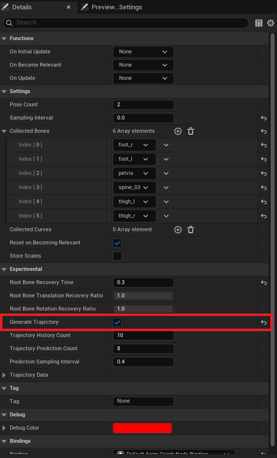
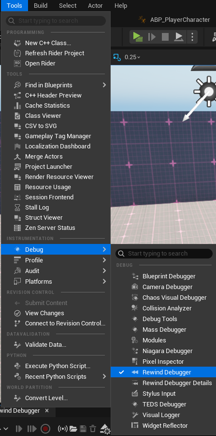

# 들어가며

[이전 게시글](https://xerlocked.com/blog/ue-motion-matching-01)에 이어서 언리얼이 기본으로 제공하는 Animation Sample을 가지고 모션매칭을 구현해보도록 하겠습니다.

## PSD Viewer

PoseSearchDatabase 에셋을 클릭하면 위와 같은 뷰어를 볼 수 있습니다. 만약 보이지 않는다면 Schema 설정을 해주면 따로 리스트업이 된 모션들이 불러와지는 것을 볼 수 있습니다.

이렇게 캐릭터에 애니메이션을 넣기 위한 사전 준비가 완료되었습니다.

1. Schema에 모션별로 리스트업
2. 데이터베이스에 Schema 셋업

두 단계만으로 간단하게 퀄리티 높은 애니메이션을 재생할 수 있습니다. 물론 모션 데이터가 많아야겠죠.

## Animation

캐릭터에 적용하기 위해서 AnimBlueprint를 생성합니다. 그리고 `Motion Matching` 노드와 `PoseHistory` 노드를 생성해 연결해줍니다.

Motion Matching 노드에서 우리가 만든 PSD(PoseSearchDatabase) 애셋을 연결합니다.

### PoseHistory

포즈 히스토리 노드는 현재 캐릭터의 궤적을 저장하여 다음 애니메이션 동작 계산시 사용하기 위한 노드입니다. 현재 5.6 버전 기준에서는 포즈 히스토리의 디테일 패널에서 `Generate Trajectory` 옵션을 체크하면 자동으로 생성하게 됩니다.

_Generate Trajectory 옵션 활성화_

:::tip 
UE 5.6 이전 버전은 캐릭터 블루프린트에서 CharacterTrajectoryComponent를 추가하고 해당 값을 넘겨주면 됩니다.
:::

## Chooser

모션 선택과정에서 Chooser 기능을 사용하여 해당하는 모션을 찾아 반환합니다. 이 게시글에서는 기존 샘플에서 제공하는 형태를 그대로 사용합니다. 따로 자세한 설명을 하지 않겠습니다. 공식문서를 참고해주세요.

## 디버깅

현재까지 진행상황으로 캐릭터를 움직여보았습니다. 위와 같이 움직임에서 어색한 부분을 찾을 수 있습니다.

### 리와인드 디버거

여기에 사용할 수 있는 것이 바로 `리와인드 디버거`입니다. Tools - Debug - Rewind Debug 를 통해 창을 활성화 할 수 있습니다.

이름에서 알 수 있듯이 애니메이션 동작을 되돌릴 수 있습니다.녹화를 시작한 지점부터 끝난 지점까지 애니메이션 과정을 재생하거나 되돌릴 수 있는 것이죠.

편리한 기능을 통해 어디서 어색한 애니메이션이 출력되는지 알 수 있습니다. 이를 통해 데이터베이스에서 제외한다던지, 값을 조정하여 정확한 애니메이션을 재생할 수 있습니다.

# 마무리

2개의 게시글을 통해 언리얼 엔진의 새로운 애니메이션 프레임워크인 모션매칭에 대해 알아보았습니다. 현재 개발 진행중인 기능이지만, 나온 기능만으로도 쉽고 편리하게 애니메이션을 구현할 수 있다는 장점이 있습니다. 아마 몇개의 기능이 실험적 기능에서 정식으로 추가된다면 레거시 애니메이션은 확실히 사용이 줄어들 것 같습니다.