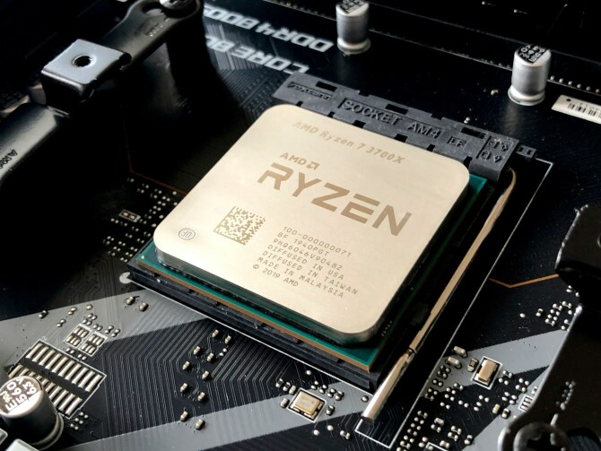

# 들어가며

오늘은 언리얼 엔진에서 사용할 수 있는 멀티스레딩 방법에 대해 알아보겠습니다.

---

# 1.멀티스레딩

## 멀티스레딩이 무엇인가요?



멀티스레딩이란, CPU 또는 단일 프로그램이 여러 실행 스레드를 동시에 실행할 수 있는 능력을 말합니다. 각 스레드는 다른 작업 또는 계산 세트를 처리할 수 있습니다. 이는 멀티코어 프로세서를 온전히 활용하여 프로그램 성능을 개선하며, 메인 스레드와 분리되어 처리할 수 있어 프로그램이 멈추는 현상없이 실행할 수 있도록 합니다.

## 왜 사용하나요?

게임에서는 성능이 핵심입니다. 유저가 필드를 이동할 때 오브젝트를 불러오면서 게임이 멈춘다면 유저는 부정적인 경험이 쌓이게 될 것입니다. 그렇기 때문에 무거운 계산, AI, 물리 시뮬레이션, 복잡한 데이터 처리, 대량의 애셋 로딩등 메인 스레드에서 수행하면 게임이 멈추거나 프레임이 떨어질 위험이 있습니다. 이때, 백그라운드(Background) 스레드에서 로딩함으로써, 유저의 응답성을 유지하고 더 부드러운 경험을 제공할 수 있습니다.

## 양날의 검

이렇게 설명만 들으면 무조건 써야할 것 같은데, 그렇지 않습니다. 일부 작업은 순차적으로 진행되어야 할 수 있습니다. 이를 분할하면 성능 향상 없이 복잡성만 증가합니다. 또한, 멀티스레딩은 기본적으로 데이터 경합(Data race), 동기화 오버헤드라는 자체적인 문제점도 있습니다. 디버깅이 어려운 점도 있구요.

---

# 2. 언리얼 엔진 멀티스레딩

## 게임 스레드

언리얼 엔진은 `게임 스레드`와 `렌더링 스레드`의 메인 스레드가 있습니다. 이 두 가지 스레드의 동기화 방식에 대해서도 할 이야기가 있지만, 오늘 이야기 할 것은 게임 스레드입니다.

게임 스레드는 게임 플레이 로직을 실행하고, 액터 업데이트, 입력 처리등 게임 시스템을 매 프레임 통신하는 메인 스레드입니다. 모든 게임 플레이 코드가 안전하고 결정론적인 순서로 실행되도록 보장하는 단일 스레드입니다.

멀티스레딩을 도입할 때 게임 스레드의 역할을 이해하는 것이 중요합니다. 게임 스레드에 남아 있어야 하는 것과 안전하게 이동할 수 있는 것을 확실히 구분해야합니다.

다음은 게임 스레드의 특징입니다.

- 중앙 실행 스레드
- 액터 틱 및 업데이트 실행
- 오브젝트 생성/수정
- 단일 및 결정론적 흐름
- thread-safe하지 않음

## 소수


멀티스레딩 개념을 설명하기 위해, 범위 내의 모든 소수를 찾는 간단한 계산 문제를 예제로 사용하겠습니다.

소수를 구하는 코드는 다음과 같아요.
```cpp
class FMathHelper
{
public:
    static bool IsPrimeNumber(int32 Number)
    {
        if (Number <= 1) return false;
        for (int32 i = 2; i <= FMath::Sqrt(static_cast<float>(Number)); ++i)
        {
            if (Number % i == 0) return false;
        }
        return true;
    }
};

```

## Async

```cpp
void UPrimeCalculator::CalculateUsingAsync(int32 Start, int32 Range)
{
    Async(EAsyncExecution::ThreadPool, [Start, Range]()
    {
        for (int32 Number = Start; Number < Start + Range; ++Number)
        {
            if (FMathHelper::IsPrimeNumber(Number))
            {
                UE_LOG(LogTemp, Display, TEXT("[Async] Prime: %i"), Number);
            }
        }
    });
}
```

`EAsyncExecution::ThreadPool` 의 ThreadPool은 언리얼 언진의 내장된 스레드풀로 엔진이 워커 스레드를 자동으로 관리합니다. 따라서 스레드를 따로 생성하거나 관리할 필요가 없습니다.

이는 간단하고 직관적으로 게임 스레드에서 벗어남으로 처음 멀티스레딩을 이용하는 초보자들에게 좋은 방법입니다. 메인 스레드에 접근이 필요한 경우 EAsyncExecution의 옵션을 변경하여 게임 스레드에서 실행하도록 변경할 수 있습니다.

## AsyncTask

```cpp
void UPrimeCalculator::CalculateUsingAsyncTask(int32 Start, int32 Range)
{
    AsyncTask(ENamedThreads::AnyBackgroundThreadNormalTask, [Start, Range]()
    {
        for (int32 Number = Start; Number < Start + Range; ++Number)
        {
            if (FMathHelper::IsPrimeNumber(Number))
            {
                UE_LOG(LogTemp, Display, TEXT("[AsyncTask] Prime: %i"), Number);
            }
        }
    });
}
```

간단한 경량 작업을 스레드 풀에서 스케쥴링할 때 사용합니다. 이 방식은 스레드풀에 실행을 예약하고 결과를 기다릴 필요없는 작업일 경우 유용합니다. 즉, 한 번 실행하고 잊어버리는 접근 방식입니다. 지정된 백그라운드 스레드에서 비동기적으로 실행됩니다.

## ParallelFor

```cpp
void UPrimeCalculator::CalculateUsingParallelFor(int32 Start, int32 Range)
{
    ParallelFor(Range, [Start](int32 Index)
    {
        int32 Number = Start + Index;
        if (FMathHelper::IsPrimeNumber(Number))
        {
            UE_LOG(LogTemp, Display, TEXT("[ParallelFor] Prime: %i"), Number);
        }
    });
}
```

데이터 병렬 작업에 특화된 방법입니다. 기존에는 수동으로 Loop를 만들고 여러 스레드에 작업을 분배가 필요했다면 현재는 ParallelFor가 모두 자동으로 처리합니다. 백그라운드에서 반복을 여러 스레드에 자동으로 분할하여 작업이 병렬로 수행될 수 있도록 합니다. 이는 대규모 데이터 세트 또는 계산 집약적인 반복에 효율적인 특성을 지닙니다.

## FNonAbandonableTask

```cpp
class FPrimeNonAbandonableTask : public FNonAbandonableTask
{
public:
    FPrimeNonAbandonableTask(int32 InStart, int32 InRange) : Start(InStart), Range(InRange) {}

    void DoWork()
    {
        for (int32 Number = Start; Number <= Start + Range; Number++)
        {
            if (FMathHelper::IsPrimeNumber(Number))
            {
                UE_LOG(LogTemp, Display, TEXT("[NonAbandonable] Prime: %i"), Number);
            }
        }
    }

    FORCEINLINE TStatId GetStatId() const
    {
        RETURN_QUICK_DECLARE_CYCLE_STAT(FPrimeNonAbandonableTask, STATGROUP_ThreadPoolAsyncTasks);
    }

private:
    int32 Start;
    int32 Range;
};
```

```cpp
void UPrimeCalculator::CalculateUsingNonAbandonable(int32 Start, int32 Range)
{
    (new FAutoDeleteAsyncTask<FPrimeNonAbandonableTask>(Start, Range))->StartBackgroundTask();
}
```

FNonAbandonableTask 는 하나의 클래스 형태로 DoWork 메서드 구현을 통해 작업이 이루어집니다. 이 작업은 항상 완료할 작업 단위로, 실행 도중에 취소되거나 포기하지 않습니다. 단순 Async 호출에 비해 독립적인 작업에 대해 더 명시적으로 기능을 제공합니다. 또한 GetStatId를 통해 프로파일링 통계를 제공하며 앞 선 스레딩처리보다 더 많은 제어권을 가집니다.

`FAutoDeleteAsyncTask` 는 작업을 래핑하고 언리얼 스레드 풀에 자동으로 넣은 다음 실행 후 정리되도록 보장합니다.

## Future-Promise

```cpp
class FPrimeFuturePromise
{
public:
    static TFuture<TArray<int32>> CalculationTask(int32 Start, int32 Range)
    {
        TSharedRef<TPromise<TArray<int32>>> Promise = MakeShared<TPromise<TArray<int32>>>();
        TFuture<TArray<int32>> Future = Promise->GetFuture();
    
        AsyncTask(ENamedThreads::AnyBackgroundThreadNormalTask, [Start, Range, Promise]() mutable
        {
            TArray<int32> Primes;
        
            for (int32 Number = Start; Number < Start + Range; ++Number)
            {
                if (FMathHelper::IsPrimeNumber(Number))
                {
                    Primes.Add(Number);
                }
            }
        
            Promise->SetValue(Primes);
        });
    
        return Future;	
    }
};
```

```cpp
void UPrimeCalculator::CalculateUsingFuturePromise(int32 Start, int32 Range)
{
    FPrimeFuturePromise::CalculationTask(Start,Range).Next([](const TArray<int32>& Primes)
    {
        AsyncTask(ENamedThreads::GameThread, [Primes]()
        {
            for (int32 Prime : Primes)
            {
                UE_LOG(LogTemp, Display, TEXT("[FuturePromise] Prime: %i"), Prime);
            }
        });
    });
}
```

Future-Promise 모델로 Javascript의 Promise 구문과 비슷합니다.

계산 결과를 담을 Promise를 생성하고, 이 Promise로 TFuture를 얻어옵니다. TFuture는 백그라운드 작업이 완료되면 결과를 검색하거나 결과에 대한 작업을 연결할 수 있습니다. 위 코드에서 TFuture를 반환하는데, 이는 후속 작업을 발생시키거나, 결과를 기다리거나, 메인 스레드로 다시 전달하는 등의 데이터로 활용할 수 있습니다. 현재 코드는 Next를 통해 TFuture에 대한 후속 작업을 연결하고 있습니다. 

이 작업은 무거운 계산은 백그라운드에서 이루어지도록 보장하며, 엔진 오브젝트와 상호작용하고 데이터를 Logging 하는 것은 안전한 게임 스레드에서 최종 결과가 전달되도록 합니다.

## TaskGraph

```cpp
void UPrimeCalculator::CalculateUsingTaskGraph(int32 Start, int32 Range)
{
    FGraphEventRef Task = FFunctionGraphTask::CreateAndDispatchWhenReady([Start, Range]()
    {
        for (int32 Number = Start; Number < Start + Range; ++Number)
        {
            if (FMathHelper::IsPrimeNumber(Number))
            {
                UE_LOG(LogTemp, Display, TEXT("[TaskGraph] Prime: %i"), Number);
            }
        }
    }, TStatId(), nullptr, ENamedThreads::AnyThread);
}
```

TaskGraph는 비동기적으로 병렬로 실행할 수 있는 세분화된 작업을 관리하기 위한 시스템입니다. 

각 Task의 균형을 잡고 실행하기 때문에 워커 스레드의 효율적인 사용을 보장합니다. 가볍고 고성능이며, Task가 세분화되어 있습니다. 작업을 병렬적으로 처리하는데 이상적입니다.

특징으로는 Task를 체이닝하여 올바른 순서로 실행되도록 보장할 수 있습니다.

## TaskSystem

```cpp
void UPrimeCalculator::CalculateUsingTaskSystem(int32 Start, int32 Range)
{
    UE::Tasks::Launch(UE_SOURCE_LOCATION, [Start, Range]()
    {
        for (int32 Number = Start; Number < Start + Range; ++Number)
        {
            if (FMathHelper::IsPrimeNumber(Number))
            {
                UE_LOG(LogTemp, Display, TEXT("[TaskSystem] Prime: %i"), Number);
            }
        }
    });
}
```

TaskGraph를 현대적으로 개선한 방법입니다. TaskGraph보다 더 유연하며, 스케쥴링이 자유로우며, 종속성 처리가 가능합니다. 람다형을 통해 비동기적으로 실행됩니다.

Task 종속성, TaskPipes, Nested Tasks 와 같은 고급 기능을 지원합니다. 복잡한 워크플로우 관리, CPU 바운드 작업에 대한 확장성을 개선할 수 있습니다.

## FRunnable

```cpp
class FPrimeRunnable : public FRunnable
{
public:
    FPrimeRunnable(int32 InStart, int32 InRange) : Start(InStart), Range(InRange) {}

    virtual bool Init() override
    {
        return true;
    }

    virtual uint32 Run() override
    {
        for (int32 Number = Start; Number <= Start + Range; Number++)
        {
            if (StopTaskCounter.GetValue() == 1)
            {
                break;
            }

            if (FMathHelper::IsPrimeNumber(Number))
            {
                UE_LOG(LogTemp, Display, TEXT("Prime: %i"), Number);
            }
        }

        return 0;
    }

    virtual void Stop() override
    {
        StopTaskCounter.Increment();
    }

    virtual void Exit() override
    {
        UE_LOG(LogTemp, Warning, TEXT("Runnable thread finished."));
    }
    
private:
    int32 Start;
    int32 Range;

    FThreadSafeCounter StopTaskCounter;
};
```


```cpp
void UPrimeCalculator::CalculateUsingRunnable(int32 Start, int32 Range)
{
    FRunnable* Runnable = new FPrimeRunnable(Start, Range);
    FRunnableThread::Create(Runnable, TEXT("PrimeRunnableThread"));
}
```

`FRunnable`은 저수준 스레딩 API입니다. 프로그래머에게 완전한 제어권을 제공하고 세밀하게 조정이 가능합니다. 오래 실행되거나 사용자 정의 작업에 이상적입니다. Task가 자체 스레드에서 독립적으로 실행됩니다. 그렇기 때문에 수명주기를 수동으로 관리해야합니다. 

강력하지만 주의 깊은 관리가 필요한데, 스레드 정지 조건이 없으면 에디터가 종료되어도 스레드 코드는 계속 실행될 수 있습니다. 상위 수준의 스레딩 솔루션이 필요한 제어 수준을 제공하지 않을 때 사용합니다.

`Run()` 함수 안을 구현하시면 됩니다. 추가적으로 `Stop()`를 통해 직접 스레드를 종료할 수도 있습니다. `Exit()` 은 스레드 실행이 종료되면 자동으로 호출되는데, 이때 남아 있는 메모리가 있다면 해제해주시면 됩니다.

# 3. 구현

<iframe width="560" height="315" src="https://www.youtube.com/embed/ABM6gSP3_AQ?si=B_7jJCl5RC5WBsAL" title="YouTube video player" frameborder="0" allow="accelerometer; autoplay; clipboard-write; encrypted-media; gyroscope; picture-in-picture; web-share" referrerpolicy="strict-origin-when-cross-origin" allowfullscreen></iframe>

동영상을 보시면 박스에 진입할 경우 소수 계산이 프레임 드랍없이 2부터 5000 범위의 계산이 진행됩니다.

---

# 마무리

언리얼 엔진의 멀티스레딩 방법에 대해 알아보았습니다. 되게 많은 방식을 제공하고 있기 때문에 여러분의 프로젝트에 맞게 사용할 수 있을 것 같습니다. 더 자세한 내용은 언리얼 엔진 코드를 직접 살펴보시는 것을 추천드립니다. 다음에는 더 좋은 내용으로 가져올게요.

### ref.
[Unreal Engine Multithreading Techniques](https://www.youtube.com/watch?v=sF89bNHErLo)

[Render Thread와 Animation Thread의 이해](https://daekyoulibrary.tistory.com/entry/UE5-Render-thread%EC%99%80-Animation-thread%EC%97%90-%EB%8C%80%ED%95%9C-%EC%9D%B4%ED%95%B4)

[스레디드 렌더링](https://dev.epicgames.com/documentation/ko-kr/unreal-engine/threaded-rendering-in-unreal-engine?application_version=5.2)
