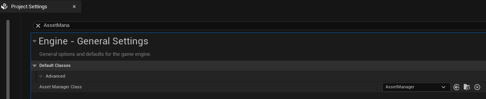

# 들어가며

언리얼 엔진에서 `GameplayTags`는 객체의 상태나 속성을 계층 구조로 관리할 수 있는 라벨입니다. 에디터에서도 설정할 수 있지만, C++(Native)에서 직접 정의해 사용하면 **오타로 인한 런타임 에러를 방지**하고 **코드 자동 완성**의 이점이 있습니다.

```cpp
#include "GameplayTagContainer.h" // Required header

// FName으로 호출되어 오타가 발생할 확률이 높음.
const FGameplayTag MyTag = FGameplayTag::RequestGameplayTag(FName("My.Gameplay.Tag.Name"));
```

오늘은 프로젝트 규모와 관리 스타일에 따라 선택할 수 있는 두 가지의 GameplayTags 구현 방식을 알아보겠습니다.

---

# 1. 중앙 집중형
첫 번째 방식은 구조체 내부에 태그들을 모아두고, `AssetManager`를 통해 엔진 초기화 시점에 한꺼번에 등록하는 방식입니다. 태그가 많아질 때 한눈에 관리하기 좋습니다.

## 태그 구조체 정의
먼저 태그를 저장할 구조체를 선언합니다. `AddNativeGameplayTag`를 통해 문자열을 실제 태그 데이터로 매핑합니다.

```cpp
// MyGameplayTags.h
#pragma once

#include "CoreMinimal.h"
#include "GameplayTagContainer.h"

struct FMyGameplayTags
{
public:
    static const FMyGameplayTags& Get() { return GameplayTags; }
    static void InitializeNativeGameplayTags();
    
    // 외부에 노출될 태그 변수
    FGameplayTag Attribute_Primary_Strength;
    
private:
    static FMyGameplayTags GameplayTags;
};
```

```cpp
// MyGameplayTags.cpp
#include "MyGameplayTags.h"
#include "GameplayTagsManager.h"

FMyGameplayTags FMyGameplayTags::GameplayTags;

void FMyGameplayTags::InitializeNativeGameplayTags()
{
    // 실제 태그 이름과 설명(Comment)을 매칭하여 등록합니다.
    GameplayTags.Attribute_Primary_Strength = UGameplayTagsManager::Get().AddNativeGameplayTag(
        FName("Attribute.Primary.Strength"),
        FString("Attack Power, Max Health"));
}
```

## AssetManager를 통한 초기화
Native 태그는 엔진이 시작될 때 등록되어야 합니다. 이를 위해 `UAssetManager`의 `StartInitialLoading`을 오버라이드하여 호출합니다.

```cpp
// MyAssetManager.cpp
#include "MyAssetManager.h"
#include "AbilitySystemGlobals.h"
#include "MyGameplayTags.h"

void UMyAssetManager::StartInitialLoading()
{
    Super::StartInitialLoading();

    // Native 태그 초기화 수행
    FMyGameplayTags::InitializeNativeGameplayTags();

    // GAS를 사용하는 경우 필수 호출
    UAbilitySystemGlobals::Get().InitGlobalData();
}
```
:::important

:::

## 사용 예시
```cpp
const FMyGameplayTags& GameplayTags = FMyGameplayTags::Get();
FGameplayTag MyTag = GameplayTags.Attribute_Primary_Strength;
```

---

# 2. 매크로를 활용한 모듈형
언리얼 엔진 내부에서 자주 사용되는 방식으로, 특정 클래스나 모듈에 종속된 태그를 선언할 때 매우 간편합니다. 별도의 관리 클래스 없이 헤더와 소스 파일 쌍만 있으면 사용할 수 있습니다.

## 매크로 정의 및 사용
언리얼에서 제공하는 매크로 정의를 사용합니다. `UE_DECLARE_GAMEPLAY_TAG_EXTERN` 와 `UE_DEFINE_GAMEPLAY_TAG`는 하나의 그룹으로 각각 헤더 파일과 소스파일에 선언하여 사용합니다.
```cpp
// NativeGameplayTags.h

/**
 * Declares a native gameplay tag that is defined in a cpp with UE_DEFINE_GAMEPLAY_TAG to allow other modules or code to use the created tag variable.
 */
#define UE_DECLARE_GAMEPLAY_TAG_EXTERN(TagName) extern FNativeGameplayTag TagName;

/**
 * Defines a native gameplay tag with a comment that is externally declared in a header to allow other modules or code to use the created tag variable.
 */
#define UE_DEFINE_GAMEPLAY_TAG_COMMENT(TagName, Tag, Comment) FNativeGameplayTag TagName(UE_PLUGIN_NAME, UE_MODULE_NAME, Tag, TEXT(Comment), ENativeGameplayTagToken::PRIVATE_USE_MACRO_INSTEAD); static_assert(UE::GameplayTags::Private::HasFileExtension(__FILE__), "UE_DEFINE_GAMEPLAY_TAG_COMMENT can only be used in .cpp files, if you're trying to share tags across modules, use UE_DECLARE_GAMEPLAY_TAG_EXTERN in the public header, and UE_DEFINE_GAMEPLAY_TAG_COMMENT in the private .cpp");

/**
 * Defines a native gameplay tag with no comment that is externally declared in a header to allow other modules or code to use the created tag variable.
 */
#define UE_DEFINE_GAMEPLAY_TAG(TagName, Tag) FNativeGameplayTag TagName(UE_PLUGIN_NAME, UE_MODULE_NAME, Tag, TEXT(""), ENativeGameplayTagToken::PRIVATE_USE_MACRO_INSTEAD); static_assert(UE::GameplayTags::Private::HasFileExtension(__FILE__), "UE_DEFINE_GAMEPLAY_TAG can only be used in .cpp files, if you're trying to share tags across modules, use UE_DECLARE_GAMEPLAY_TAG_EXTERN in the public header, and UE_DEFINE_GAMEPLAY_TAG in the private .cpp");
```

## 사용 예시
```cpp
// MyCharacter.h - 태그 선언 (Extern)
#include "NativeGameplayTags.h"
UE_DECLARE_GAMEPLAY_TAG_EXTERN(TAG_Gameplay_Ability_Jump);

// ---

// 소스(.cpp) - 태그 정의 및 이름 매핑
#include "MyCharacter.h"
UE_DEFINE_GAMEPLAY_TAG(TAG_Gameplay_Ability_Jump, "Gameplay.Ability.Jump");

// ---
void AMyCharacter::Jump()
{
    // 변수처럼 바로 사용 가능
    AbilitySystemComponent->TryActivateAbilitiesByTag(FGameplayTagContainer(TAG_Gameplay_Ability_Jump));
}
```

혹은 네임스페이스를 활용하여 관련 태그들을 그룹화할 수도 있습니다.

```cpp
namespace UE::GameplayTags
{
    UE_DEFINE_GAMEPLAY_TAG_COMMENT(GameplayCue_Test, "GameplayCue.Test", "테스트용 큐 태그");
}

// Use
FGameplayTag TestTag = UE::GameplayTags::GameplayCue_Test;
```

---

# 3. 어떤 기준으로 선택해야 할까?
특징 | 중앙 집중형 | 모듈형
--- | --- | --- |
관리 | Struct를 통한 한 곳에서 | 각 클래스 파일에 분산
초기화 | AssetManager를 통해 명시적으로 | 정의 시 자동 등록
추천 | 프로젝트 전체에서 공용으로 사용 | 특정 기능이나 모듈 내에서

---

# 마무리
Native GameplayTags를 사용하면 **FName** 기반의 프로그래밍에서 벗어나 **컴파일 타임 체크가 가능한 안정적인 코드**를 작성할 수 있게됩니다. 위 표를 기준으로 여러분의 프로젝트 상황에 맞춰 적절한 방식을 선택해보길 바랍니다. 감사합니다.

---
# Ref.

[Unreal Engine Gameplay Tags 공식 문서](https://dev.epicgames.com/documentation/ko-kr/unreal-engine/gameplay-tags?application_version=4.27)