# 들어가며

게임 화면에서 보여지는 모든 UI 역시 드로우 콜을 소모하게 됩니다. 보통 점 4개를 사용한 삼각형 2개로 이루어져 있습니다. 이에 따라 화면 상에 UI가 많을 경우 드로우 콜도 증가하게 됩니다. 만약 캐릭터에게 피해를 입히거나 받을 경우 데미지를 출력해야한다면 일반적인 UI 출력 방식으로는 드로우콜이 기하급수적으로 증가하게 됩니다.

Fig 1의 왼쪽과 같이 UMG를 이용해서 대량의 텍스트를 한 화면에 띄울 경우 FPS가 10이하로 떨어지는 모습을 볼 수 있습니다. 그렇다면 화면에 대량의 데미지 텍스트를 보여주고 싶을 경우는 어떻게 해야할까요? 바로 `파티클 시스템`을 이용하면 됩니다. 파티클 시스템은 기본적으로 GPU 인스턴싱을 통해 수많은 입자를 단 한 번의 드로우 콜로 처리하게 됩니다.

UMG는 각 글자나 숫자 위젯을 개별적인 요소로 다루는 반면, `파티클 시스템(이하 나이아가라)`는 모든 숫자가 포함된 하나의 Texture 이미지를 사용하게 됩니다. 최소한의 좌표와 인덱스 데이터만을 GPU에게 전달하고 GPU는 이 데이터를 병렬로 빠르게 처리하기 때문에 FPS가 낮아지지 않게 됩니다.

## 프로젝트 적용

앞선 내용을 통해, 왜 데미지 텍스트를 나이아가라로 사용할 것인지 설명했습니다. 이후 챕터에서는 구현과정을 설명드리도록 하겠습니다.

---

# 사전 준비

## 텍스처

데미지 나이아가라를 제작하기 위해서 먼저 숫자로 이루어진 텍스처 아틀라스(Texture Atlas)를 제작해야 합니다. 저는 1024x1024 크기의 텍스처 한 장을 준비하고 각 칸의 크기는 256x256 사이즈로 4x4 형식을 맞추었습니다.

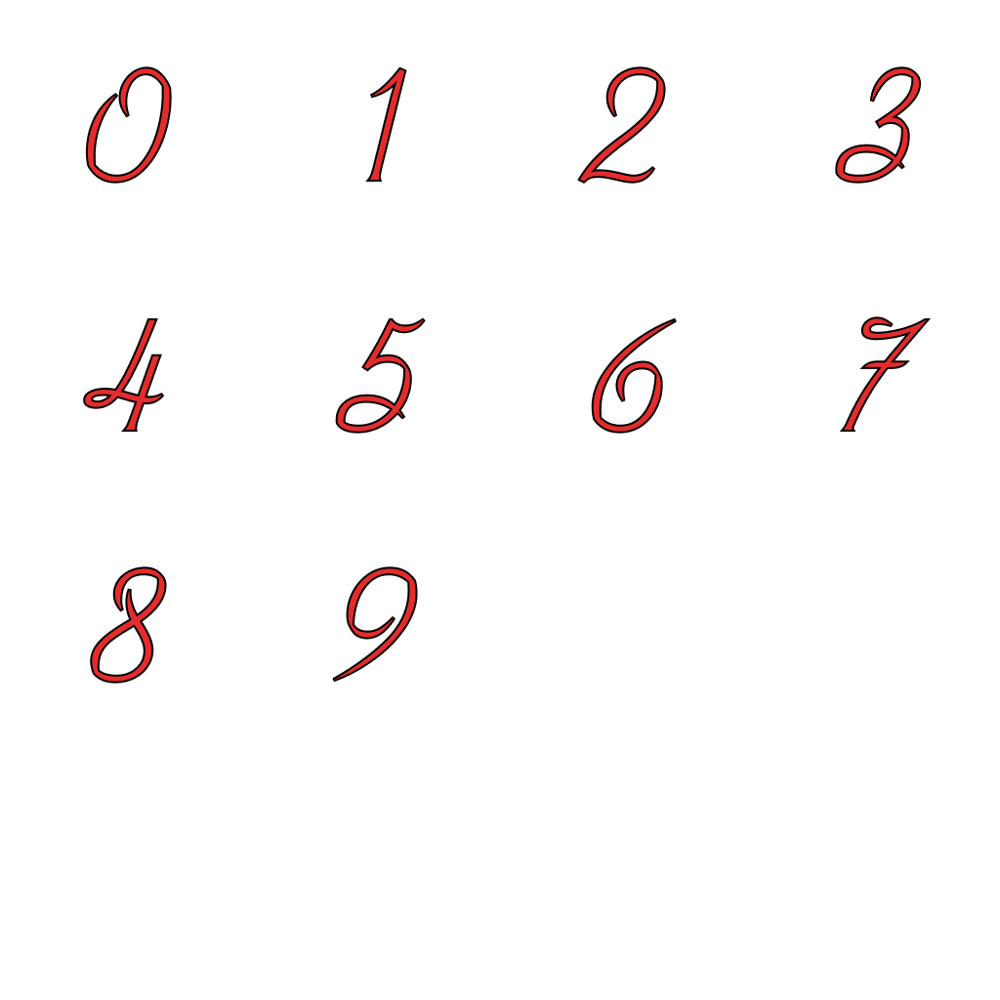

이를 언리얼 에디터에 임포트한 뒤, 텍스처 에셋에서 다음 설정을 확인합니다.
- sRGB: true
- TextureGroup: UI
- Compression Settgins: UserInterface2D

## 머티리얼

나이아가라에서 연결할 머티리얼을 제작합니다. 새로운 머티리얼을 하나 생성합니다. 그 다음 `ParticleColor`노드를 추가합니다.

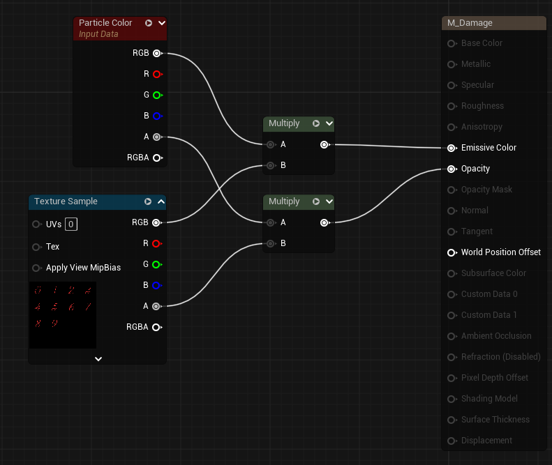

텍스처 아틀라스를 추가하고 Fig 3과 같이 노드를 연결합니다. 그리고 머티리얼 기본 설정을 다음과 같이 변경합니다.
- BlendMode: Translucent
- ShadingModel: Unlit

---

# 나이아가라

기본적인 데이터 구성은 끝났습니다. 이제 본격적인 나이아가라를 만들어보겠습니다. 새로운 나이아가라를 생성합니다.
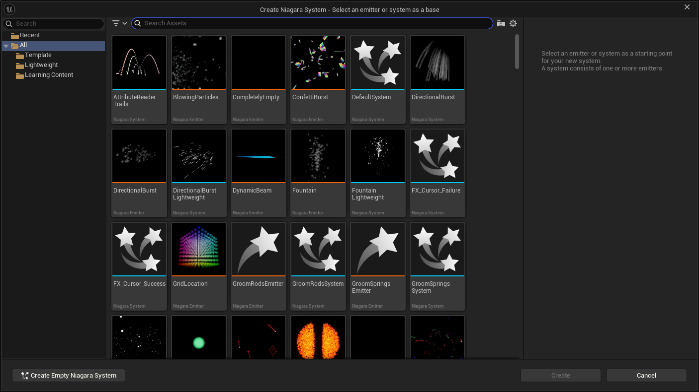

왼쪽 하단의 `Create Empty Niagara System`을 눌러 빈 나이아가라를 생성합니다. 그러면 다음과 같은 빈 나이아가라 시스템을 볼 수 있습니다.
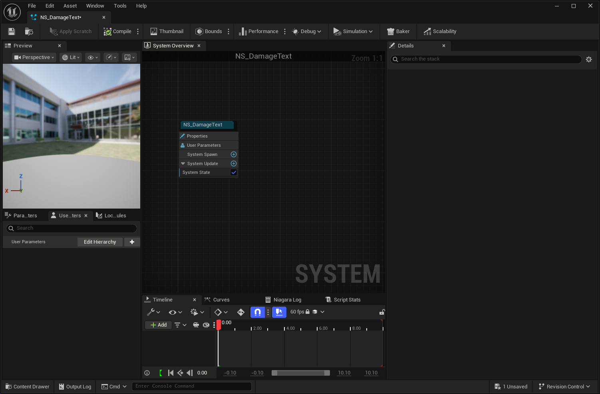

현재의 모습으로는 아무것도 할 수가 없습니다. 나이아가라 시스템은 `이미터(Emitter)`라는 하나 이상의 모듈 집합체를 가지게 됩니다. 이미터라는 녀석을 생성해야 비로소 파티클 시스템이 작동하게 됩니다.
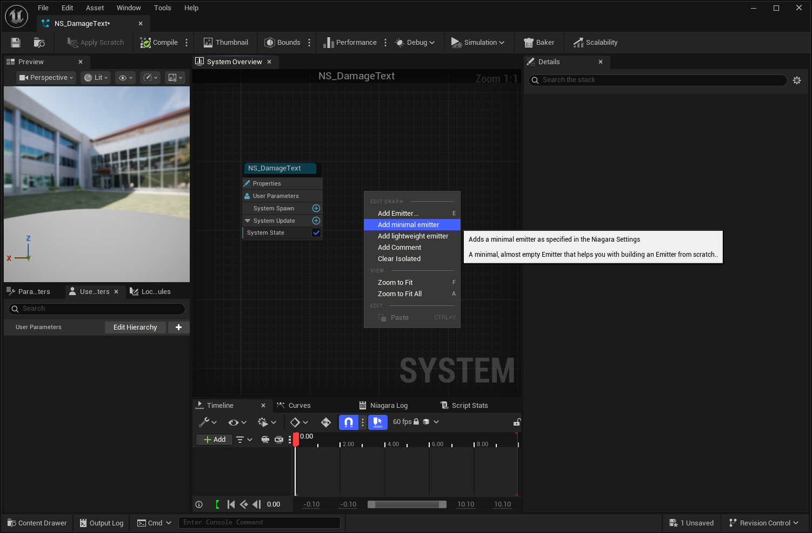

화면 빈 공간에서 마우스 오른쪽을 클릭한 뒤 새로운 미니멀 이미터를 생성합니다. 이는 최소한의 모듈로 구성된 이미터를 생성하는 명령입니다.

## 파라미터

나이아가라 시스템에는 사용자가 값을 동적으로 바꾸어 시스템에 영향을 줄 수 있도록 파라미터를 제공하고 있습니다. 즉, 하나의 변수라고 생각하면 됩니다. 우선 SpawnCount 라는 int형의 파라미터를 만들어봅시다. (+버튼을 눌러 생성하시면 됩니다.)
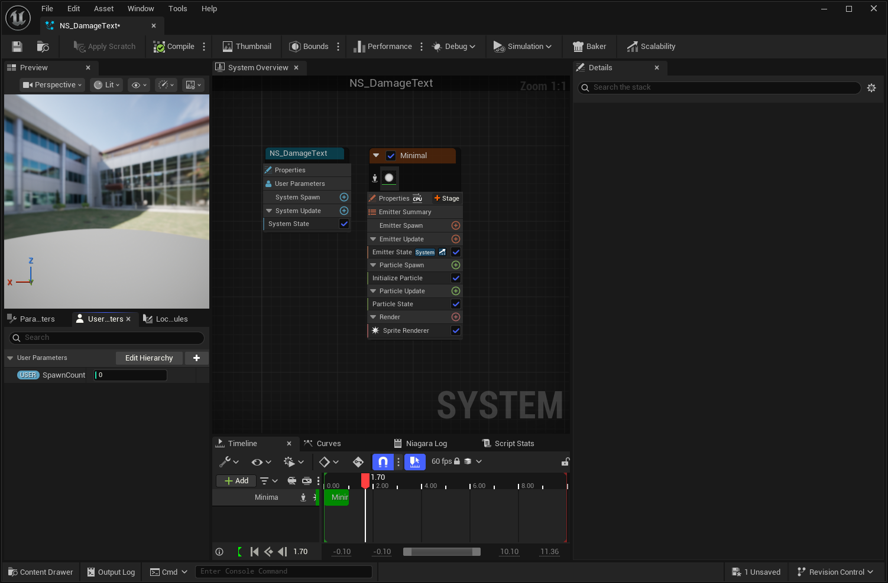

이미터에서 Emitter Update 항목을 찾아 `Spawn Burst Instantaneous`모듈을 추가합니다. 해당 모듈은 파티클을 생성할 때 다량의 파티클을 한 번에 생성하게 됩니다. 즉 데미지가 3자리일 경우 숫자 3개를 동시에 표시하게 됩니다. 만약 해당 모듈이 없다면 하나씩 생성될 것입니다.

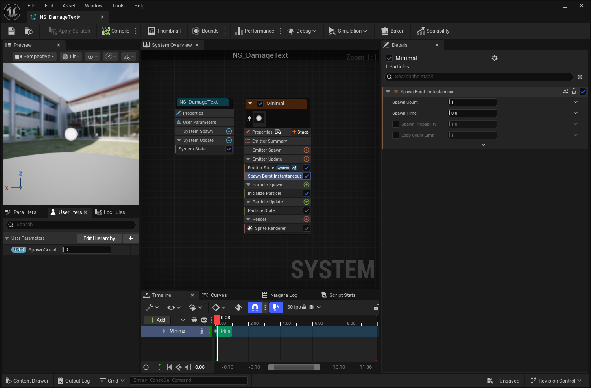

모듈을 생성했다면 이제 파라미터와 모듈의 값을 바인딩해 주어야 합니다. 데미지의 길이는 변하기 때문에 고정된 값이 아니잖아요? 그래서 파라미터를 통해 값을 받아오게 됩니다.

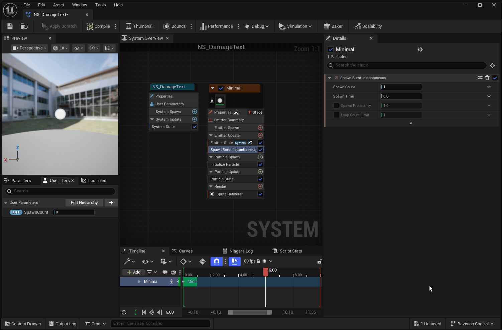

## 모듈

모듈은 하나의 이미터 안에서 파티클 혹은 이미터 자체에 능력이나 상태를 변경할 수 있게 합니다. 예를 들어, 파티클 하나(작은 입자 1개)를 소환할 때 어떤 크기로 소환될 지, 어떤 색상으로 소환될 지를 결정하는 것이 바로 모듈입니다.

먼저 `Initialize Particle` 모듈은 다음과 같습니다.
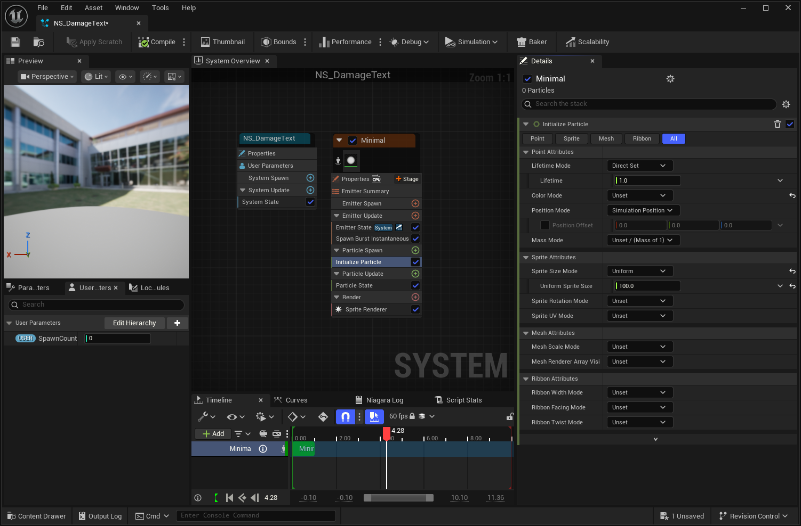

다음은 `Sprite Renderer` 모듈입니다. 이전에 생성한 머티리얼로 변경하고 SubUV를 설정하여 이미지 구역을 나누어줍니다. 텍스처 사이즈에 맞추어 자동으로 계산을 하기 때문에 몇 줄 몇 칸으로 나누었는지만 적어주시면 됩니다. 저는 4x4이니 다음과 같이 설정했습니다.
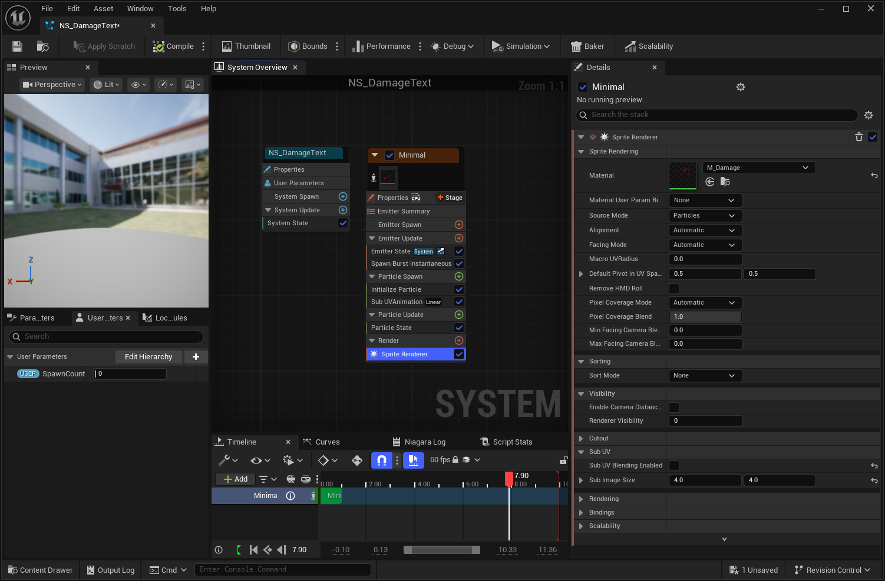

다음은 `Sub UVAnimation` 모듈입니다. 버스트 모듈을 추가했던 것과 마찬가지로 `Particle Spawn` 항목에서 모듈을 추가해주세요.
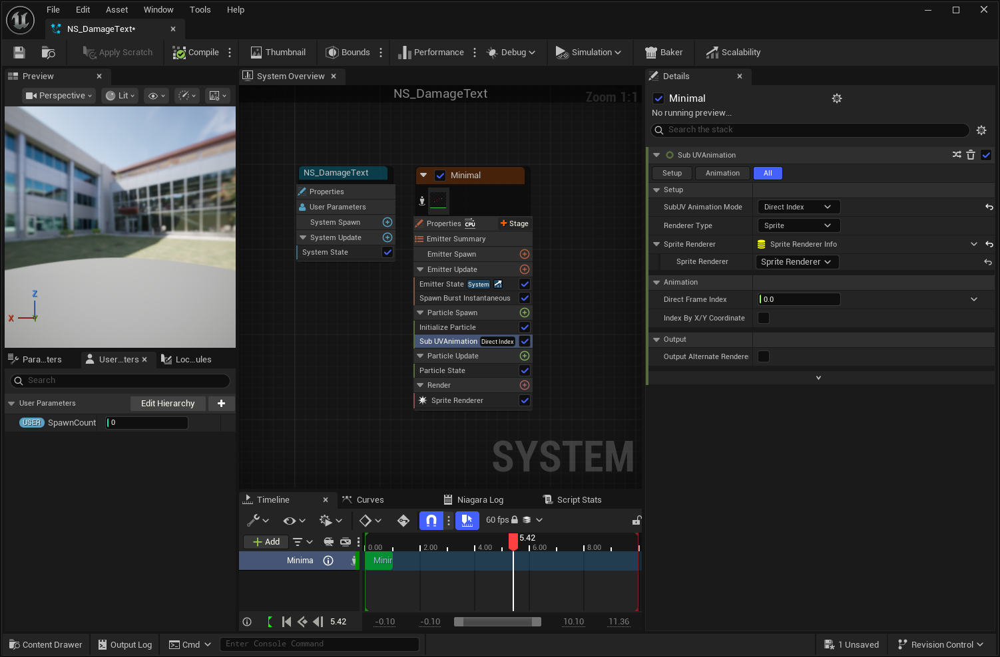

Sub UV는 하나의 텍스처에서 0~1의 사이의 값을 이용해서 구역을 나누는 방법입니다. 보통 한 장의 텍스처 아틀라스에서 시간의 흐름에 따라 순차적으로 재생하여 파티클 애니메이션을 구현하는 기술입니다.

## 스크래치

이쯤에서 로직을 다시 한 번 생각해보겠습니다. 데미지를 입력 받으면, 데미지 문자열의 길이가 SpawnCount가 되고, 각 데미지의 숫자가 인덱스에 맞게 출력되어야 합니다. 다행히도 우리는 0번 인덱스에 숫자 0이 들어가고, 1번 인덱스에 1이 들어가 있습니다. (SubUV는 왼쪽 상단을 기준으로 인덱싱이 됩니다.)

그렇다면 SubUV 모듈에서 `Direct Frame Index` 항목에 데미지에 맞는 인덱스 번호를 적어주면 되겠습니다. 이를 구현하기 위해서 나이아가라 시스템은 `스크래치`라는 작은 코딩 시스템을 제공하고 있습니다.

`Direct Frame Index` 항목의 오른쪽의 작은 화살표를 누르고 scratch라고 검색하고 추가하면 Fig14와 같이 항목이 보입니다. 선택해주세요. 그러면 다음과 같이 스크래치가 생성되었습니다.

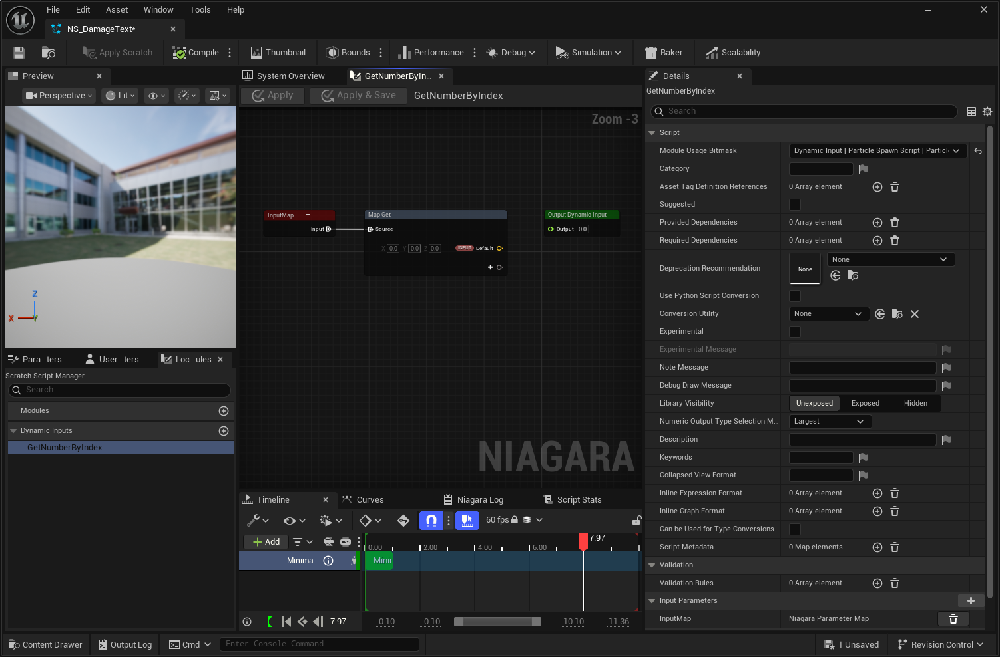

저는 이름을 `GetNumberByIndex`라고 고쳤습니다.

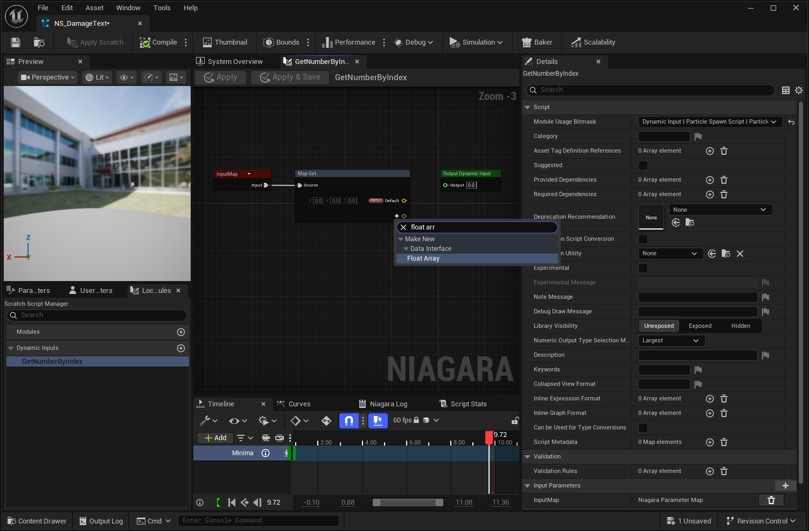
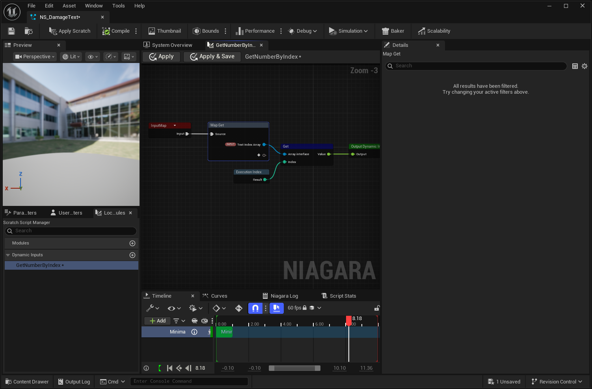

Input Data로 `Float Array`를 받고 `Execution Index` 통해 현재 인덱스의 값을 반환하게 됩니다. 적용 후 저장을 한 뒤 다시 이미터 창으로 돌아오면 다음과 같이 변경되어 있습니다.

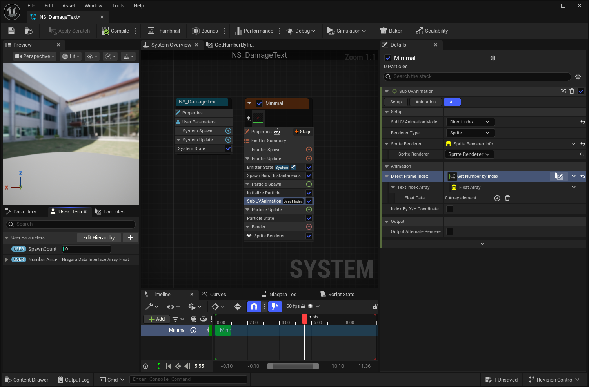

앞 선 SpawnCount와 마찬가지로 FloatArray 타입의 NumberArray라는 파라미터를 추가해줍니다. 그리고 똑같이 드래그 앤 드롭을 통해 바인딩을 해줍니다.

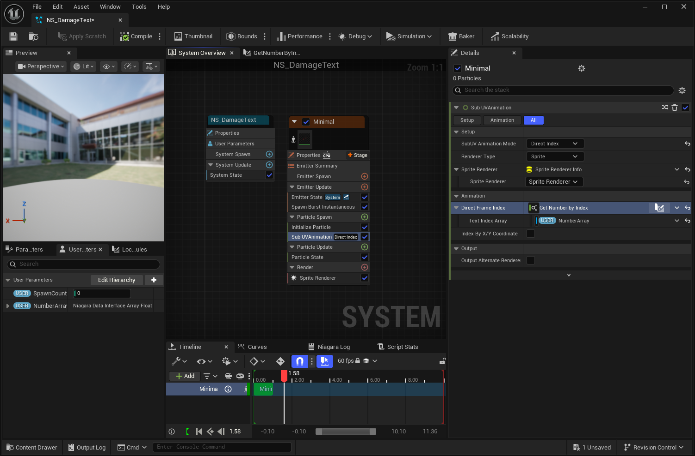

### 테스트

이제 한 번 테스트를 해볼까요?

숫자에 맞게 제대로 된 데미지가 출력되고 있습니다. 그러나 문제점이 있는데요. 현재 텍스트의 길이가 2이상일 경우 겹쳐서 나오게 됩니다.

## 스페이싱

그렇다면 각 숫자들 사이에 공간이 필요합니다. 다행히 파티클 포지션이라는 기본 제공 파라미터를 통해 각 파티클의 위치를 조정할 수 있습니다.

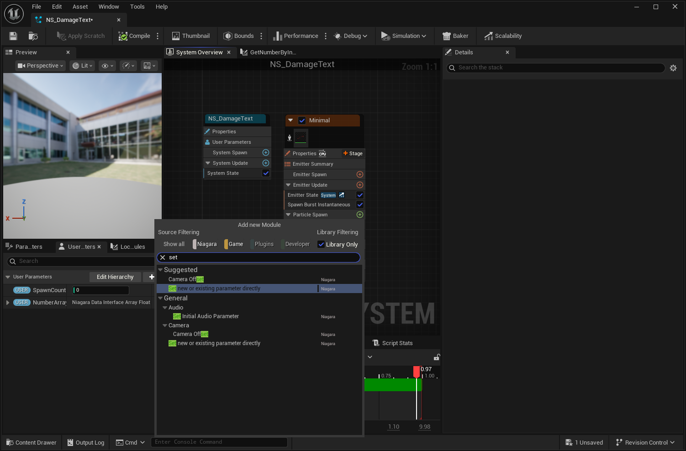

`Particle Spawn` 항목에 `Set` 모듈을 추가합니다. 추가하면 아무것도 없는 빈 공간입니다. 이제 여기에 Particle Position을 드래그합니다.

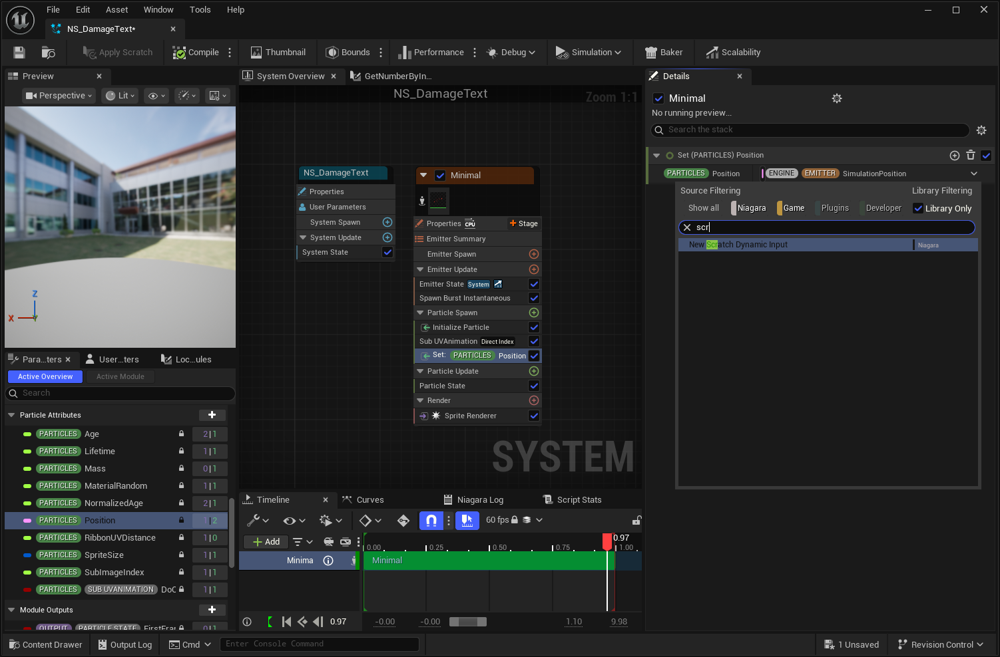

그리고 똑같이 스크래치를 생성합니다. 스크래치 이름은 `AdjustParticlePosition` 으로 적었습니다.

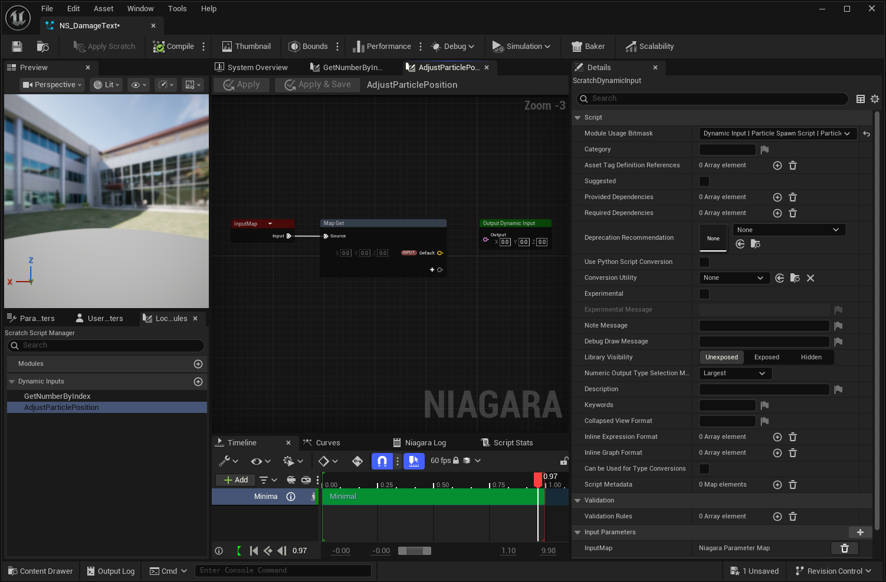
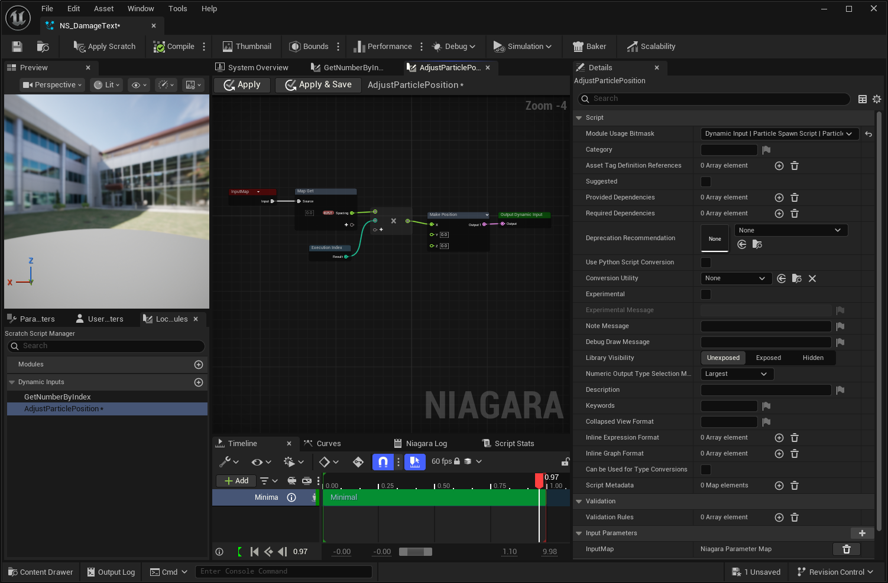

float 변수 하나를 인풋 데이터로 받고 그 값을 통해 파티클 포지션의 X값에 더해줍니다.

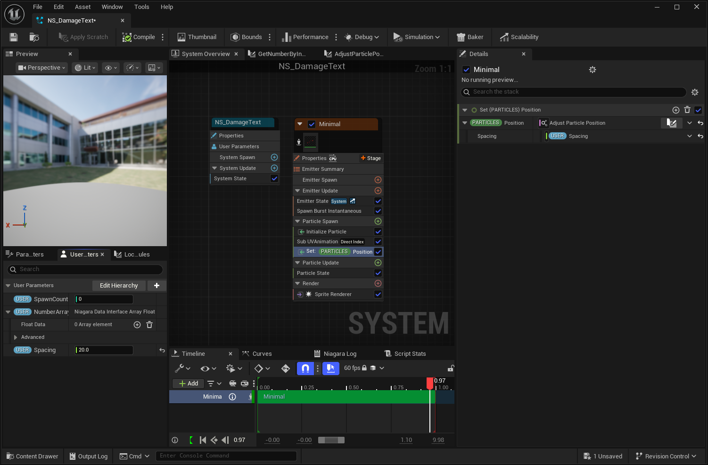

이후 과정은 똑같이 Spacing 파라미터를 생성하고 바인딩해줍니다. 그럼 테스트 해볼까요?

각 숫자가 떨어져서 출력되고 있습니다. 실제 게임 화면에서 어떻게 출력되는지 확인해볼 차례입니다.

## 실전 테스트

실전 테스트 전 설정해야할 모듈이 있습니다.
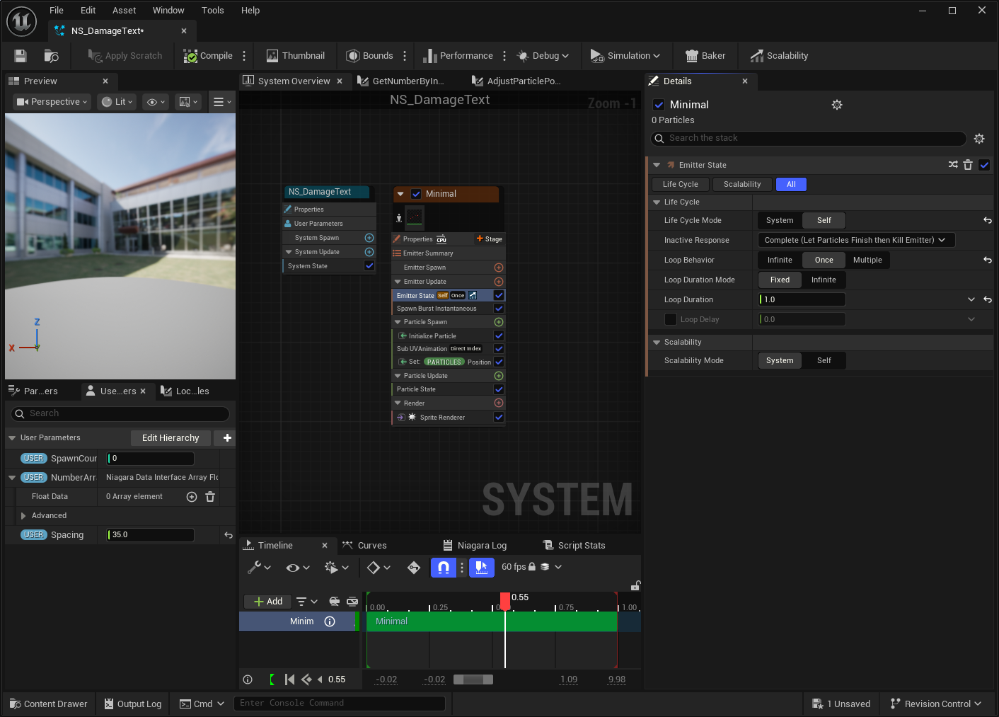
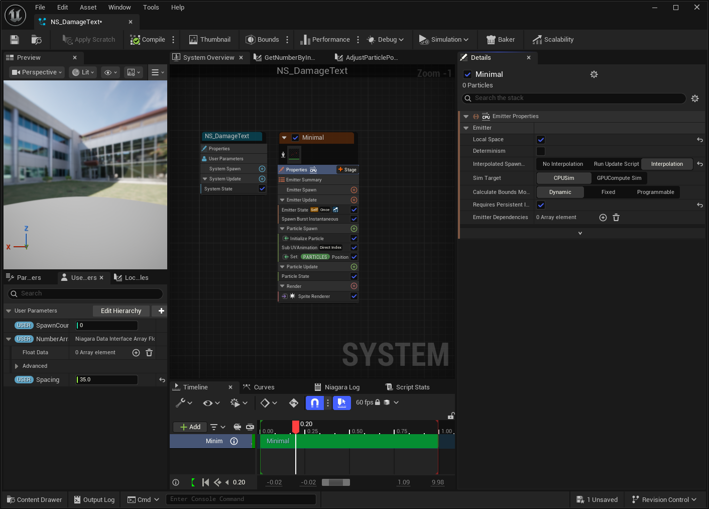

---

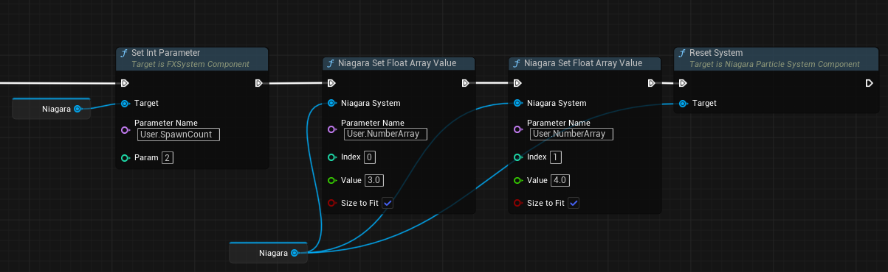
__

파라미터는 Fig26과 같이 수정을 할 수 있습니다. 임시로 플레이어 캐릭터가 몬스터 캐릭터에 붙으면 데미지 나이아가라를 출력하도록 했습니다.

gif로 만들면서 색감이 변해서 잘 안보이긴 하는데, 숫자가 살짝 삐뚤어져 있습니다. 이는 카메라의 방향을 고려하지 않고 그냥 파티클의 X좌표만 움직이기 때문에 이를 수정해주어야 합니다.

## 카메라

카메라를 기준으로 오른쪽으로 나열되어야 하므로, 카메라의 Right Vector를 가져와야 합니다. 다행히 나이아가라는 카메라 쿼리 데이터를 제공하고 있기 때문에 가져다 사용하면 됩니다.

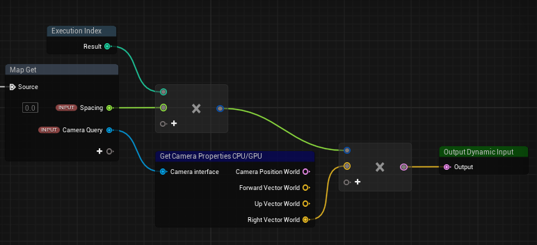

기존의 X좌표를 이동하는 방식에서 카메라의 Right Vector를 이용해서 위치를 조정하는 코드입니다.

## 실전 테스트 2

카메라에 대해 데미지가 제대로 출력되고 있는 것을 볼 수 있습니다. 

---

# 마무리

지금까지 나이아가라를 통해 데미지 출력하는 방법에 대해 알아보았습니다. 여기에 다양한 효과를 추가해서 좀 더 퀄리티있는 이펙트를 만들어보세요. 저는 데미지가 점점 올라가면서 페이드 아웃되는 효과를 추가했습니다. 또한 `GameplayCue`를 통해 데미지가 출력되도록 해보면 좋을 것 같습니다.

감사합니다.

# Ref.

[Displaying Text using Niagara Systems](https://www.youtube.com/watch?v=d4FTX0VgxTI)

[Niagara Text Toolkit (NTT)](https://github.com/LucianTranc/NiagaraTextToolkit)