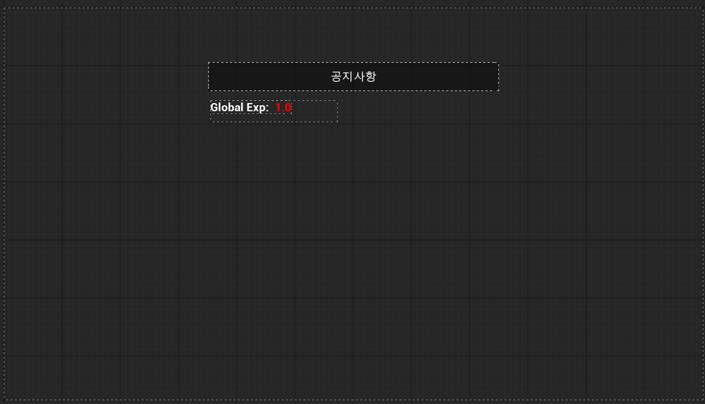

# 들어가며

현재 서비스 중인 게임의 유닛 등장 확률이나, 아이템 드롭율을 조정하고 싶다면 어떻게 해야할까요? 게임 수치 하나만을 바꾸기 위해서 클라이언트를 다시 빌드하고 배포하는 건 너무 비효율적입니다.

그래서 현재 서비스 중인 게임들은 무점검 패치라는 이름으로 게임의 수치를 재조정하기도 합니다.


물론 실제 게임들에서는 더 복잡하고 세분화된 관리 및 업데이트가 진행되고 있습니다.
저는 언리얼 엔진으로 간단한 무점검 패치 방식을 구현해보고자 합니다. 저의 목표는 다음과 같습니다.

1. 실시간 공지사항을 유저에게 알리기
2. 게임 내 글로벌 경험치 배율 조정

---

# 1. 계획

일단 생각해봅시다. 로컬이 아닌 서버에서 데이터를 가져와야 합니다. 서버와 통신하는 방법은 여러 가지가 있지만, 우리는 무거운 애셋(텍스처, 모델링 데이터)을 다운로드하는 것이 아닌 단순한 텍스트 정보만을 원합니다. 따라서 가장 가볍고 범용적으로 사용할 수 있는 `HTTP 통신(REST API)`를 사용하여 JSON 포맷의 데이터를 받아오는 방식을 채택하겠습니다.

## 데이터 가져오기

언리얼 엔진은 웹 서버와 통신할 수 있는 `HTTP` 모듈과, JSON 문자열을 다루는 `Json`, `JsonUtilities` 모듈을 기본적으로 제공하고 있습니다. 그래서 다음과 같은 순서로 데이터를 가져올 수 있습니다.

- __요청(Request)__: 클라이언트가 서버의 특정 URL로 GET 요청을 보냅니다.
- __응답(Response)__: 서버는 현재 설정된 게임 데이터를 JSON으로 반환합니다.
- __파싱(Parsing)__: 클라이언트는 받은 JSON 문자열을 C++ 구조체(UStruct)로 변환하여 메모리에 저장합니다.

## 데이터 관리

데이터를 성공적으로 받았다면, 이 데이터는 게임이 실행되는 동안 언제 어디서든 접근할 수 있어야 합니다. 캐릭터가 로비에 있든, 인게임 상황이든 데이터는 유지되고 있어야겠죠.

일반적인 `Actor`는 레벨이 바뀌면 파괴가됩니다. 또한 GameInstance라는 언리얼이 제공하는 싱글톤 로직이 있지만, 그러면 코드가 매우 커져버립니다. 그래서 이를 해결한 `UGameInstanceSubsystem`을 사용하겠습니다.

:::note
__서브시스템을 사용하는 이유__
> _언리얼 엔진 4 (UE4)의 서브시스템은 수명이 관리되는 자동 인스턴싱 클래스입니다. 이 클래스는 사용하기 쉬운 확장점을 제공하여, 프로그래머는 블루프린트 및 Python 을 바로 노출시킴과 동시에 복잡한 엔진 클래스 수정 또는 오버라이드를 피할 수 있습니다. (언리얼 공식문서)_

위 내용을 조금 더 풀어서 설명하자면, 싱글톤은 한 번 생성되면 게임이 종료될 때까지 절대 사리지지 않습니다. 이는 복잡한 언리얼 생명주기에서 어디에서 생성되고 제거되었는지 확인할 수 없으며, 불필요한 참조가 남을 수 있습니다. 그래서 서브시스템을 통해서 엔진의 생명 주기에 맞추어 관리가 됩니다. 위의 UGameInstanceSubsystem은 게임 인스턴스가 살아있는 동안 객체가 유지되며, 게임 인스턴스가 종료되면 같이 소멸됩니다.

더 자세한 내용은 [공식문서](https://dev.epicgames.com/documentation/ko-kr/unreal-engine/programming-subsystems-in-unreal-engine)를 참고해주세요.
:::

그래서 최종적으로 구현할 시스템의 흐름은 다음과 같습니다.

1. 서버: JSON 데이터를 호스팅합니다.
2. 서브시스템: HTTP 요청을 보내고 응답을 받아 C++ 구조체로 업데이트합니다.
3. 게임플레이(UI): 서브시스템의 Delegate를 구독하고 있다가, 데이터가 갱신되면 UI를 갱신합니다.

---

# 2. 구현

이제 본격적으로 코드를 작성해보겠습니다. 프로젝트를 생성하고 Build.cs에 다음 내용을 추가합니다.

## 기본 설정

```cpp
PublicDependencyModuleNames.AddRange(new string[] { 
    "Core", "CoreUObject", "Engine", "InputCore", 
    "HTTP", "Json", "JsonUtilities" // 이 3가지를 추가합니다. (필수)
});
```

또한 서버에 올릴 JSON 파일을 작성합니다. 내용은 다음과 같아요.

```txt
{
    "GlobalExpMultiplier" : 3.0,
    "EventMessage" : "14:00시부터 주말 핫타임 시작! 기본 경험치 배율 3배 !!"
}
```
숫자 데이터 하나와, 텍스트 데이터 하나씩 추가해주었습니다.


## UStruct

서버에서 내려줄 JSON 데이터와 1대1로 매칭되는 구조체를 정의합니다. 이때 `변수 이름을 JSON의 Key값과 정확히 일치`해야 합니다. 이는 나중에 `FJsonObjectConverter`를 사용하기 때문인데요, 이는 이후에 설명드리겠습니다.

```cpp
#pragma once

#include "CoreMinimal.h"

USTRUCT(BlueprintType)
struct FGameConfig
{
    GENERATED_BODY()

public:
    FGameConfig()
        : GlobalExpMultiplier(1.0)
        , EventMessage(TEXT("Hello World"))
    {}
    
    UPROPERTY(BlueprintReadOnly)
    float GlobalExpMultiplier; // 글로벌 경험치 배율

    UPROPERTY(BlueprintReadOnly)
    FString EventMessage; // 공지사항 메시지
};
```
:::tip
만약 서버의 JSON 키 값이 __exp_rate__ 처럼 스네이크 표기법이면, 언리얼 변수명도 똑같이 맞춰주세요.
:::

## 서브시스템

이제 HTTP 요청을 보내고 응답을 처리할 매니저 클래스인 UGameConfigSubsystem을 작성해보겠습니다. 이 클래스는 UGameInstanceSubsystem을 상속받아 게임 실행 중 항상 유지됩니다.

```cpp "HeaderFile"
#pragma once

#include "CoreMinimal.h"
#include "GameDataType.h"
#include "Interfaces/IHttpRequest.h"
#include "Subsystems/GameInstanceSubsystem.h"
#include "GameConfigSubsystem.generated.h"

DECLARE_DYNAMIC_MULTICAST_DELEGATE_OneParam(FOnGameConfigUpdated, const FGameConfig&, NewConfig);

UCLASS()
class TEST_API UGameConfigSubsystem : public UGameInstanceSubsystem
{
    GENERATED_BODY()

public:
    UFUNCTION(BlueprintCallable)
    void RequestGameConfig();

    UFUNCTION(BlueprintPure)
    const FGameConfig& GetGameConfig() const { return CurrentGameConfig; };

    UPROPERTY(BlueprintAssignable)
    FOnGameConfigUpdated OnGameConfigUpdated;

private:
    void OnResponseGameConfig(FHttpRequestPtr RequestPtr, FHttpResponsePtr ResponsePtr, bool bSucceeded);

    FGameConfig CurrentGameConfig;
};

```
- 옵저버 패턴을 구현하기 위해, 데이터 변경을 알리는 델리게이트를 선언합니다.

```cpp
#include "Subsystem/GameConfigSubsystem.h"

#include "HttpModule.h"
#include "JsonObjectConverter.h"
#include "Interfaces/IHttpResponse.h"

void UGameConfigSubsystem::RequestGameConfig()
{
    auto Request = FHttpModule::Get().CreateRequest();
    Request->SetURL(TEXT("실제 데이터 주소 URL"));
    Request->SetVerb(TEXT("GET"));
    Request->SetHeader(TEXT("Content-Type"), TEXT("application/json"));

    Request->OnProcessRequestComplete().BindUObject(this, &UGameConfigSubsystem::OnResponseGameConfig);
    Request->ProcessRequest();
}

void UGameConfigSubsystem::OnResponseGameConfig(FHttpRequestPtr RequestPtr, FHttpResponsePtr ResponsePtr, bool bSucceeded)
{
    if (bSucceeded && ResponsePtr.IsValid())
    {
        FString ResponseMessage = ResponsePtr->GetContentAsString();
        FGameConfig NewGameConfig;

        if (FJsonObjectConverter::JsonObjectStringToUStruct(ResponseMessage, &NewGameConfig, 0, NULL))
        {
            CurrentGameConfig = NewGameConfig;
            OnGameConfigUpdated.Broadcast(CurrentGameConfig);
        }
    }
}
```
- `RequestGameConfig()` 함수를 호출하면 `GET` 요청을 서버에 전송합니다. 그 후 비동기 처리를 통해 결과 값이 넘어올 경우 `OnResponseGameConfig()` 함수를 호출합니다.

```cpp
if (FJsonObjectConverter::JsonObjectStringToUStruct(ResponseMessage, &NewGameConfig, 0, NULL))
```
여기 언리얼 엔진의 Json 유틸리티의 좋은 점이 나옵니다. 이전에 1대1 매칭으로 만들어 놨던 구조체에 Json Key값을 통해 데이터가 자동으로 담기게 됩니다.

## UI



간단한 UI를 만들고 테스트를 해봅시다. 공지사항 부분에 텍스트 메시지가, 빨간 숫자 부분에 숫자 데이터가 출력됩니다.

---

# 3. 결과


저는 콘솔 명령어를 추가해서 Request 요청을 보내고 있습니다. 결과화면에서는 2번의 데이터 갱신을 통해 텍스트가 변경되는 것을 볼 수 있습니다. 이제 이 Request 요청을 특정 주기마다 보내면 항상 데이터 최신화가 됩니다. 응용 방식은 매우 다양합니다.

---

# 마무리

오늘은 HTTP통신을 통한 데이터 갱신에 대해 알아보았습니다. 이 구조를 응용하면 상점, 출석 체크등 다양한 라이브 기능으로 확장이 가능합니다. 서버에 GET 요청만 하면되니까요. 

저는 간단한 기능을 구현했는데 25년도 NDC에서 [퍼스트 디센던트](https://tfd.nexon.com/ko/main) 팀이 무점검 패치 시스템 구현 사례를 공유해주셨습니다. 게임 서버내용이지만 그런거 상관없이 매우 좋은 내용입니다. 링크를 첨부하면서 마무리하겠습니다. 

감사합니다.

[NDC25-퍼스트 디센던트 무점검 패치 시스템 구현 사례](https://www.youtube.com/watch?v=YliSUjrcwR0)