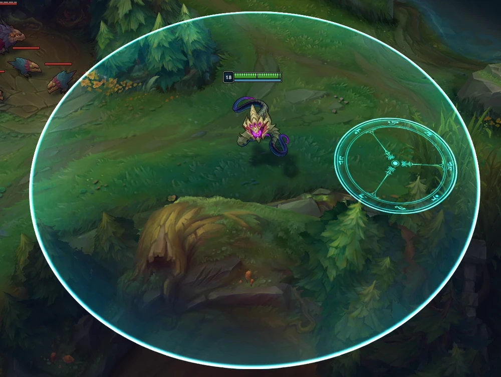
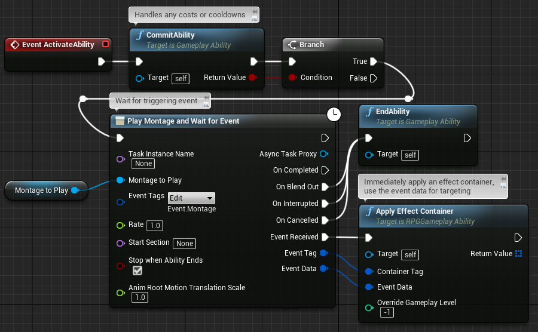
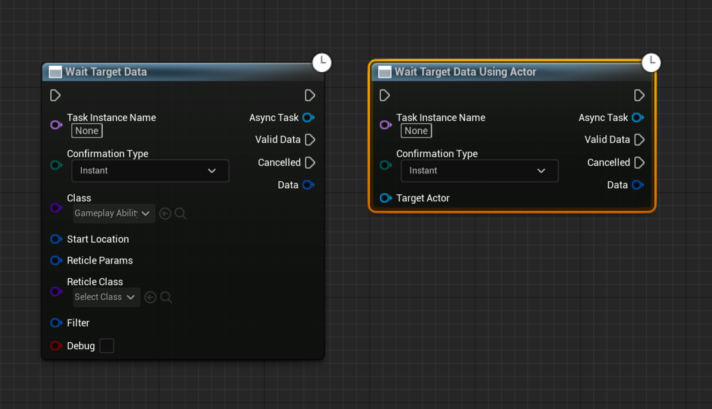
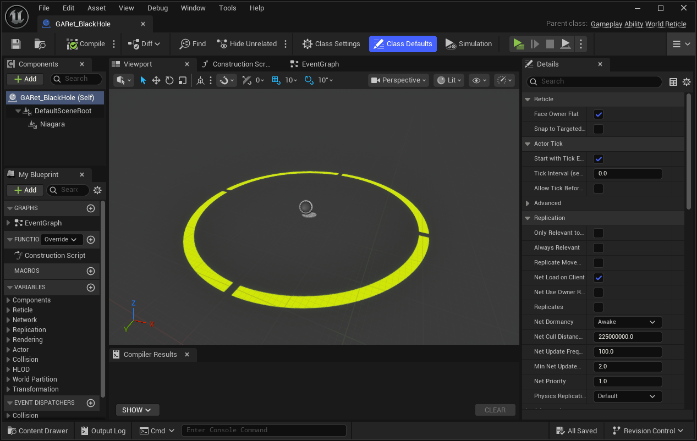
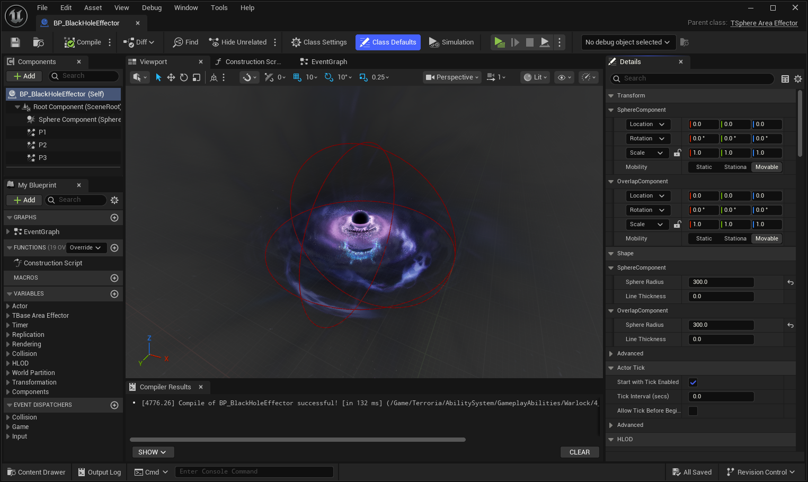

# 들어가며

오늘 구현해 볼 기능은 캐릭터의 궁극기인, 블랙홀 스킬입니다. 단순히 특정 위치에 이펙트를 소환하는 것을 넘어, 플레이어가 직접 위치를 조준하고 서버와 클라이언트 간에 정확한 위치 데이터를 동기화하는 과정을 구현해야 합니다.

주요 요구 사항은 다음과 같습니다.

1. 마우스 위치를 실시간으로 추적하는 인디케이터(Reticle) 표시.
2. 플레이어가 클릭한 지점에 블랙홀 액터 생성.
3. 생성된 블랙홀은 주기적으로 범위 내 적에게 GameplayEffect를 적용.



이번 포스팅에서는 그 첫 번째 단계인 **마우스 위치를 지정해 데이터를 전달하는 과정**을 집중적으로 살펴보겠습니다.

---

# AbilityTask

GAS에서  `AbilityTask`는 어빌리티 실행 도중 발생하는 독립적이고 비동기적인 작업을 관리합니다. 어빌리티 수명에 묶여 있어, 어빌리티가 종료되면 태스크도 안전하게 정리된다는 장점이 있습니다. 어빌리티에서 흔히 사용하는 `Play Montage and Wait for Event` 역시 어빌리티 태스크중 하나입니다.



위치 기반 스킬을 만들 때 핵심이 되는 태스크는 `WaitTargetData`입니다.

## WaitTargetData



WaitTargetData는 이름 그대로 **타겟팅 데이터가 들어올 때까지 기다리는 작업**입니다. 이 태스크는 직접 데이터를 계산하지 않고, `AGameplayAbilityTargetActor`라는 별도의 액터에게 그 역할을 위임합니다.

```cpp
//AbilityTask_WaitTargetData.h

/* 타겟 액터를 스폰하고 유효한 데이터가 반환될 때까지 대기합니다. */
static UE_API UAbilityTask_WaitTargetData* WaitTargetData(
    UGameplayAbility* OwningAbility, 
    FName TaskInstanceName, 
    TEnumAsByte<EGameplayTargetingConfirmation::Type> ConfirmationType, TSubclassOf<AGameplayAbilityTargetActor> Class);
```
- Task: 어빌리티의 흐름 제어 및 데이터 대기
- TargetActor: 실제 월드에서의 물리적 타겟팅 수행

이 구조를 통해 태스크는 어빌리티의 흐름을 제어하고, TargetActor는 물리적인 타겟팅을 수행하도록 역할이 명확히 나뉘게 됩니다.

## TargetActor와 Reticle 구현

[AGameplayAbilityTargetActor | 언리얼 엔진 공식문서](https://dev.epicgames.com/documentation/en-us/unreal-engine/API/Plugins/GameplayAbilities/Abilities/AGameplayAbilityTargetActor?application_version=4.27)

실제 마우스 위치를 계산하고 시각적인 가이드라인(Reticle)을 보여주는 로직은 TargetActor에서 이루어집니다.

다음은 제가 구현한 TargetActor입니다. 매 프레임 마우스 커서 아래의 지면을 추적하게 됩니다.
```cpp
// ATGameplayAbilityTargetActor.cpp
void ATGameplayAbilityTargetActor::Tick(float DeltaSeconds)
{
    Super::Tick(DeltaSeconds);

    if (!PrimaryPC)
    {
        return;
    }

    TraceUnderCursor(TraceHitResults);

    if (MyReticleActor && PrimaryPC->IsLocalController())
    {
        if (TraceHitResults.bBlockingHit)
        {
            MyReticleActor->SetActorLocation(TraceHitResults.ImpactPoint, false, nullptr, ETeleportType::None);
        }
        else
        {
            MyReticleActor->SetActorLocation(TraceHitResults.TraceEnd, false, nullptr, ETeleportType::None);
        }
    }
    else
    {
        MyReticleActor->SetActorHiddenInGame(true);
    }
}

void ATGameplayAbilityTargetActor::ConfirmTargetingAndContinue()
{
    FHitResult HitResult = TraceHitResults;

    FGameplayAbilityTargetDataHandle TargetData = StartLocation.MakeTargetDataHandleFromHitResult(
        OwningAbility, HitResult);
    if (TargetData != nullptr)
    {
        TargetDataReadyDelegate.Broadcast(TargetData);
    }
    else
    {
        TargetDataReadyDelegate.Broadcast(FGameplayAbilityTargetDataHandle());
    }

    DestroyReticleActors();
}
```
여기서 Reticle은 `AGameplayAbilityWorldReticle`을 상속받은 액터로, 플레이어에게만 보이는 **조준선**역할을 합니다. 이는 시각적 피드백을 로직과 분리하여 관리할 수 있게 해줍니다.



---
# BlackHole
타겟 데이터가 성공적으로 전달되면, 실제 블랙홀 역할을 할 액터를 스폰합니다. 개폐 원칙(OCP)를 고려하여 범용적인 BaseAreaEffector클래스 구조를 설계했습니다.

```cpp
// TBaseAreaEffector.h
UCLASS()
class TERRORIA_API ATBaseAreaEffector : public AActor
{
    GENERATED_BODY()

public:
    ATBaseAreaEffector();

protected:
    virtual void BeginPlay() override;

    UFUNCTION()
    virtual void ApplyEffectToTarget();

public:
    UPROPERTY(VisibleAnywhere, BlueprintReadOnly, Category = "Actor")
    TObjectPtr<UPrimitiveComponent> OverlapComponent;

    UPROPERTY(BlueprintReadWrite, Meta = (ExposeOnSpawn = true))
    FGameplayEffectSpecHandle EffectSpecHandle;

    UPROPERTY(EditAnywhere, BlueprintReadOnly, Category = "Timer")
    float TickInterval = 1.0f;

    UPROPERTY(EditAnywhere, BlueprintReadOnly, Category = "Timer")
    float Duration = 5.0f;
};
```
이 베이스 클래스를 상속받은 `ATSphereAreaEffector`가 실제 블랙홀의 물리적 충돌 영역과 비주얼을 담당하게 됩니다.



```cpp
// TSphereAreaEffector.h
UCLASS()
class TERRORIA_API ATSphereAreaEffector : public ATBaseAreaEffector
{
    GENERATED_BODY()

public:
    ATSphereAreaEffector();

protected:
    UPROPERTY(VisibleAnywhere, BlueprintReadOnly, Category = "Actor")
    TObjectPtr<USphereComponent> SphereComponent;
};
```
---
# 트러블 슈팅
이번 구현에서 가장 중요했던 포인트입니다. 블루프린트를 통해 WaitTargetData 노드를 사용하면 제대로 작동하던 로직이, C++에서는 실행되지 않는 점이었습니다. 이는 지연 생성(Deferred Spawn)과 관련있습니다.

## 왜 그냥 실행하면 안 될까?
`WaitTargetData`는 내부적으로 TargetActor가 생성된 후 설정이 완료되어야 동작합니다. 단순히 태스크를 생성하고 곧바로 `ReadyForActivation`을 호출하면, 타겟 액터가 월드에 존재하지 않거나 초기화되지 않아 태스크가 아무런 반응을 하지 못한 채 즉시 종료되어 버립니다.

이를 해결하기 위해 엔진이 블루프린트 노드를 실행할 때 수행하는 과정을 똑같이 코드로 구현해야 합니다.
```cpp
UAbilityTask_WaitTargetData* Task = ...;

// TargetActor 스폰 시작 (지연 스폰 방식)
AGameplayAbilityTargetActor* GenericActor = nullptr;

if (Task->BeginSpawningActor(this, TargetActorClass, GenericActor))
{
   // 스폰 완료 (여기서 내부적으로 StartTargeting이 호출됨!)
   Task->FinishSpawningActor(this, GenericActor);
}

// Task 활성화
Task->ReadyForActivation();
```
이 Begin과 Finish사이에서 데이터 주입을 할 수 있고 만약 이 과정을 생략하면 TargetActor가 월드에 존재하지 않기 때문에, `ReadyForActivation`을 호출해도 태스크는 대기할 대상이 없어 아무런 반응을 하지 않게 되었던 것이었습니다.

:::note
위와 관련된 내용은 언리얼 엔진의 `AbilityTask.h` 파일에 주석으로 설명되어 있습니다.
자세한 설명은 해당 파일을 읽어보시기를 추천드립니다.
:::

---

# 마무리


이제 마우스 클릭으로 블랙홀을 소환하고, 범위 내의 적들에게 지속적인 대미지를 입힐 수 있게 되었습니다.

`WaitTargetData`는 강력하지만, 언리얼 내부 주석에도 적혀 있듯이 매번 액터를 스폰하는 비용이 발생합니다. 빈번하게 사용하는 스킬이라면 **오브젝트 풀링**을 도입하거나, TargetActor를 재사용하는 방식으로 최적화하는 것을 고려해 보시기 바랍니다.

단순해 보이는 위치 지정 지능 뒤에 GAS의 비동기 처리와 복제 매커니즘이 조화롭게 작동하는 과정을 이해할 수 있는 유익한 작업이었습니다.

감사합니다.

# Ref.

[hatena.blog](https://you1dan.hatenablog.com/entry/2022/10/12/101911)

[UE4 Gameplay Ability System Practical Example](https://www.youtube.com/watch?v=3P0gaGkJ4L8)

[GASDocumentation#TargetActors](https://github.com/tranek/GASDocumentation?tab=readme-ov-file#4112-target-actors)