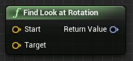
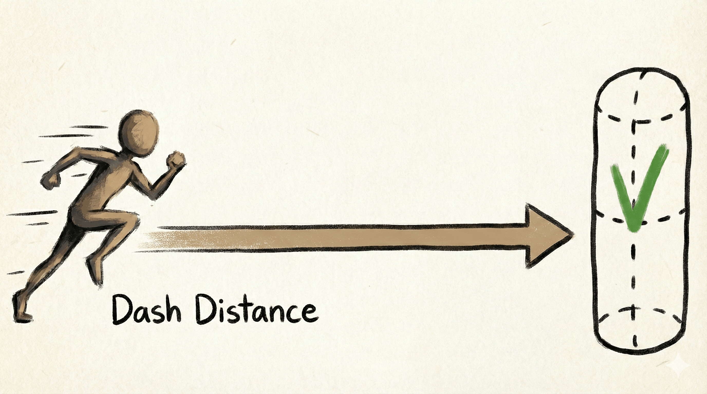
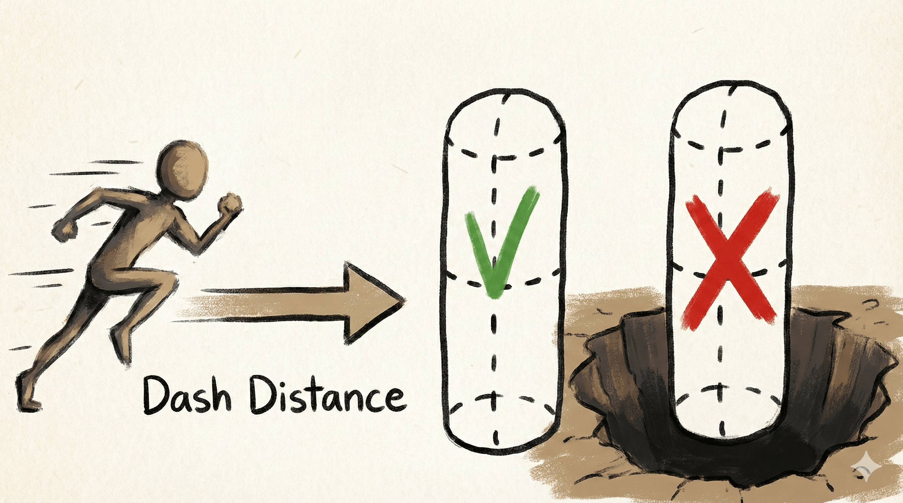
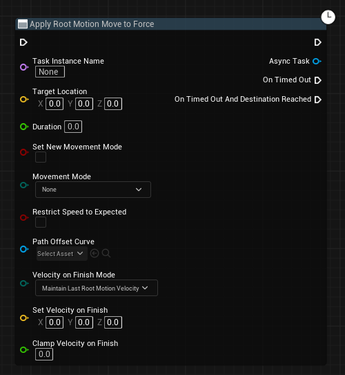
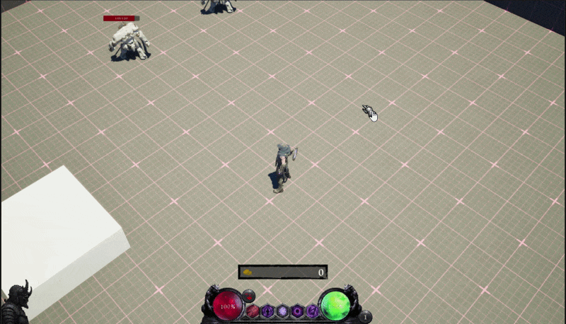
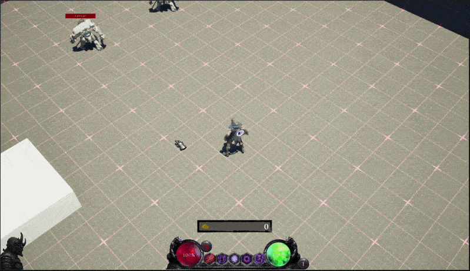

# 들어가며

오늘은 많은 액션 게임의 기본이자 핵심인 **공용 회피 스킬(Dash)** 을 구현해 보겠습니다. 단순히 위치를 옮기는 것이 아니라, 장애물을 지능적으로 판단하고 연출까지 챙긴 [하데스(Hades)](https://www.supergiantgames.com/games/hades/) 스타일을 따라해보겠습니다.

---

# Dash


제가 구현할 대쉬의 핵심 포인트는 두 가지입니다.
1. 지능적인 위치 선정: 도착 지점이 장애물 내부라면 그 직전의 안전한 위치로 이동.
2. 공간 통과: 이동 경로상의 얇은 장애물은 통과하되, 벽 너머가 낭떠러지라면 통과 금지.

이를 참고하여 구현을 진행해보도록 하겠습니다.

## Look At

대쉬의 시작은 캐릭터가 마우스 커서 방향을 바라보는 것입니다. 현재 저는 GA에서 마우스 커서의 위치를 가져오고 있기 때문에 마우스 위치 벡터를 가져올 수 있습니다. 수학적으로 본다면 `Normalize(마우스 위치 - 캐릭터 위치)`를 하면 방향 벡터가 나오겠죠? 그걸 도와주는 함수가 바로 `Find Look at Rotation` 입니다.



주의해야할 것이 반환된 회전 값은 Z값만 사용해서 캐릭터가 넘어지거나 눕지 않게 해주는 것이 중요합니다.

## Find Valid Position

다음은 가장 중요한 위치 고려입니다. 장애물 사이에 갇히거나 땅을 벗어나지 않게 해주는게 중요합니다. 



Fig3과 같이 대쉬 거리만큼에서 콜리전 검사를 진행합니다. 만약 아무것도 걸리는 것이 없다면 이동 가능한 공간으로 인식하고 대쉬를 진행하겠죠?



만약 대쉬 거리 끝지점에 구덩이가 있어서 플레이어가 갈 수 없다면? 그 이전 위치로 이동하게 됩니다. Fig 4와 같이 말이죠.
코드를 통해 좀 더 살펴보겠습니다.

```cpp
// Function.GetFurthestValidLocation
FVector UTerroriaBlueprintLibrary::GetFurthestValidLocation(
    const UObject* WorldContextObject,
    const FVector& StartLocation, const FVector& EndLocation,
    const UCapsuleComponent* CapsuleComponent,
    const TArray<TEnumAsByte<EObjectTypeQuery>>& ObjectTypes,
    const TArray<AActor*>& ActorsToIgnore,
    EDrawDebugTrace::Type DrawDebugType,
    bool bIgnoreSelf)
{
    FVector OutVector = StartLocation;
    const UWorld* World = WorldContextObject->GetWorld();

    FVector UnitDirection = (EndLocation - StartLocation).GetSafeNormal();
    const float CapsuleDiameter = CapsuleComponent->GetScaledCapsuleRadius() * 2.f;

    const float Dist = FVector::Dist(StartLocation, EndLocation);
    const int32 CapsuleSteps = FMath::FloorToInt32(Dist / CapsuleDiameter);

    for (int32 i = 0; i < CapsuleSteps; i++)
    {
        const int32 Step = CapsuleSteps - i;
        const FVector Location = UnitDirection * Step * CapsuleDiameter + StartLocation;

        // 캡슐이 이동 가능한 곳에 뭐가 있는지
        TArray<FHitResult> HitResults;
        UKismetSystemLibrary::CapsuleTraceMultiForObjects(
            World,
            Location,
            Location,
            CapsuleComponent->GetUnscaledCapsuleRadius(),
            CapsuleComponent->GetUnscaledCapsuleHalfHeight(),
            ObjectTypes,
            false,
            ActorsToIgnore,
            DrawDebugType,
            HitResults,
            bIgnoreSelf
        );

        if (IsValidLocation(WorldContextObject, Location, HitResults))
        {
            OutVector = Location;
            break;
        }
    }

    return OutVector;
}
```
- 이동해야할 방향과 콜리전을 설정합니다.
- `(최대 이동 거리)/(캡슐 지름)`을 통해 최대 지점까지 몇 개의 캡슐이 생성될 지 계산합니다.
- 최대 지점부터 캡슐 콜리전 검사를 통해 이동 가능한지 검산합니다.

```cpp
// Function.IsValidLocation
bool UTerroriaBlueprintLibrary::IsValidLocation(const UObject* WorldContextObject, const FVector& Location,
                                                const TArray<FHitResult>& HitResults)
{
    // IsGround?
    FHitResult HitResult;
    bool bBlocking = WorldContextObject->GetWorld()->LineTraceSingleByChannel(
        HitResult,
        Location,
        Location + FVector(0.f, 0.f, -500.f),
        ECC_Visibility
    );

    if (!bBlocking)
    {
        return false;
    }

    if (HitResults.IsEmpty())
    {
        return true;
    }

    for (const FHitResult& Hit : HitResults)
    {
        if (Hit.GetComponent()->GetCollisionResponseToChannel(ECC_Pawn) == ECR_Block)
        {
            return false;
        }
    }

    return true;
}
```
- 추가적인 그라운드 충돌 검사를 통해 해당 위치가 플레이어가 설 수 있는지 판단합니다.
- 이와 같이 단계별 검사 방식을 통해 안정적인 위치를 찾을 수 있습니다.

## Move Character



캐릭터를 이동시키기 위해 GAS에서 기본으로 제공하고 있는 `Apply Rootmotion Move to Force` 함수를 사용합니다. 이 함수 이외에도 5가지 정도 상황에 맞게 이동 시킬 수 있는 함수를 제공하고 있습니다.

---

# GameplayCue

다음으로는, 이펙트 출력입니다. 대쉬가 시작할 때 이펙트가 켜지고, 대쉬가 끝나면 이펙트가 사라지는 효과를 제작해보겠습니다.

## 문제상황 1



Fig 6를 보면 대쉬 종료 시 나이아가라 트레일 이펙트가 자연스럽게 사라지지 않고 즉시 삭제됩니다.

```cpp
// GameplayCueNotify_Actor.cpp

// HandleGameplayCue 함수의 일부분
// ...
case EGameplayCueEvent::Removed:
    bHasHandledOnRemoveEvent = true;
    OnRemove(MyTarget, Parameters);

    if (bAutoDestroyOnRemove)
    {
        if (AutoDestroyDelay > 0.f)
        {
            FTimerDelegate Delegate = FTimerDelegate::CreateUObject(this, &AGameplayCueNotify_Actor::GameplayCueFinishedCallback);
            GetWorld()->GetTimerManager().SetTimer(FinishTimerHandle, Delegate, AutoDestroyDelay, false);
        }
        else
        {
            GameplayCueFinishedCallback();
        }
    }
break;
```

GameplayCueNotify_Actor를 상속받는 블루프린트를 만들고 `HandleGameplayCue` 함수를 오버라이드해서 나이아가라를 활성화/비활성화를 하고 있습니다. (OnActive/Removed)

위 코드를 보면 `AutoDestroyOnRemove`가 활성화되어 있다면 Delay 시간이 경과 후 삭제되는 것을 알 수 있었습니다. 그래서 AutoDestroyOnRemove설정을 활성화하고 하고 확인한 결과, 똑같은 상황이 발생합니다.

```cpp
// GameplayCueNotify_Actor.cpp
bool AGameplayCueNotify_Actor::OnRemove_Implementation(AActor* MyTarget, const FGameplayCueParameters& Parameters)
{
    if (!IsHidden())
    {
        SetActorHiddenInGame(true);
    }

    return false;
}
```
이번에는 `OnRemove` 함수를 확인해보았습니다. 위와 같이 Actor를 게임에서 숨김처리를 진행하고 있었습니다. 수정을 위해 `GameplayCue_Trail`이라는 자식 클래스를 만들어 해당 부분을 오버라이딩했습니다.



## 문제상황 2

다음 문제 상황은 콜리전때문에 일어난 일입니다. 따로 이미지는 없어서 글로만 적겠습니다. 이동할 때 캐릭터의 캡슐 콜리전과 스켈레탈 메시의 콜리전을 `No Collision` 처리를 하고 OnRemove 호출 시 각 Type에 맞게 콜리전을 복원 시킵니다. 

이때 중요한 것이 Apply Rootmotion Move to Force의 `Movement Mode`입니다. **Walking**으로 설정 시 캐릭터 아래로 Raycast를 진행하여 땅인지 검사합니다.<br>그래서 No Collision 상태에서는 Walking을 통한 이동을 할 수 없어 제자리에 멈추게 됩니다. 그러므로 **Flying**을 선택해 검사를 하지 않는 방향으로 수정합니다.

---

# 최종 결과
<iframe src="https://player.vimeo.com/video/1166279911?badge=0&autopause=1&player_id=0&app_id=58479" width="800" height="600" frameborder="0" allow="autoplay; fullscreen; picture-in-picture; clipboard-write; encrypted-media; web-share" referrerpolicy="strict-origin-when-cross-origin" title="dash"></iframe>

---

# 마무리

이번 대쉬 구현을 통해 GAS의 Apply RootMotion 태스크와 GameplayCue의 내부 생명 주기를 이해할 수 있었습니다.

감사합니다.
