# 들어가며

오늘은 GAS를 이용해서 쇼크웨이브 스킬을 만들어 보겠습니다. 제가 원하는 스킬은 다음과 같습니다.

- 캐릭터 기준 마우스 방향 일직선으로 대량의 지진파를 발생시킨다.

그러면 시작해보겠습니다.

---

# GameplayAbility 구현

먼저 GameplayAbility를 상속받은 `GameplayAbility_ShockWave` 클래스를 생성합니다. 클래스의 프로퍼티는 다음과 같아요.

```cpp
protected:
    /** Effect to apply to targets hit by the wave */
    UPROPERTY(EditDefaultsOnly, BlueprintReadOnly, Category = "ShockWave")
    TSubclassOf<UGameplayEffect> DamageEffectClass;

    /** Total length of the shock wave */
    UPROPERTY(EditDefaultsOnly, BlueprintReadOnly, Category = "ShockWave")
    float WaveRange = 1000.0f;

    /** Width of the shock wave */
    UPROPERTY(EditDefaultsOnly, BlueprintReadOnly, Category = "ShockWave")
    float WaveWidth = 150.0f;

    /** Object Types to trace for */
    UPROPERTY(EditDefaultsOnly, BlueprintReadOnly, Category = "ShockWave")
    TArray<TEnumAsByte<EObjectTypeQuery>> HitObjectTypes;

    /** Debug draw duration */
    UPROPERTY(EditDefaultsOnly, BlueprintReadOnly, Category = "ShockWave")
    float DebugDrawDuration = 2.0f;
```

또, 실제 게임관련 로직을 수행하는 `UFUNCTION` 을 하나 만들어줍니다.

```cpp
UFUNCTION(BlueprintCallable, Category = "Ability|ShockWave")
void ExecuteShockWave(const FVector& TargetLocation);
```

## ShockWave Logic

```cpp
AActor* AvatarActor = GetAvatarActorFromActorInfo();
if (!AvatarActor)
{
    return;
}

const FVector StartLocation = AvatarActor->GetActorLocation();
FVector Direction = (TargetLocation - StartLocation);
Direction.Z = 0.f;
Direction.Normalize();

const FVector EndLocation = StartLocation + (Direction * WaveRange);
const FRotator Orientation = Direction.Rotation();
```
- Direction.Z 를 0으로 설정하여, 마우스 커서가 바닥이 아닌 벽이나 높은 곳을 가리키더라도, 스킬은 캐릭터의 높이에서 수평으로 나가야 합니다.
- 시작 지점과 마지막 지점을 설정하고 Rotation을 정렬합니다.


```cpp
FVector BoxHalfSize = FVector(0.f, WaveWidth * 0.5f, 50.0f);

bool bHit = UKismetSystemLibrary::BoxTraceMultiForObjects(
    GetWorld(), StartLocation, EndLocation, BoxHalfSize, Orientation,
    HitObjectTypes, false, /* bTraceComplex */
    ActorsToIgnore,
    DebugDrawDuration > 0.f
        ? EDrawDebugTrace::ForDuration
        : EDrawDebugTrace::None,
    OutHits, true, /* bIgnoreSelf */
    FLinearColor::Red, FLinearColor::Green, DebugDrawDuration);
```
- 일반적인 LineTrace는 판정이 너무 얇아 적을 맞추기 어렵습니다.
- `BoxTraceMultiForObjects`를 사용해 직사각형 형태의 넓은 판정 범위를 생성합니다.


```cpp
if (bHit)
{
    UAbilitySystemComponent* SourceASC =
        GetAbilitySystemComponentFromActorInfo();
    if (!SourceASC || !DamageEffectClass)
    {
        return;
    }

    FGameplayEffectContextHandle EffectContext = SourceASC->MakeEffectContext();
    EffectContext.AddSourceObject(AvatarActor);

    const FGameplayEffectSpecHandle SpecHandle = SourceASC->MakeOutgoingSpec(
        DamageEffectClass, GetAbilityLevel(), EffectContext);


    const FTGameplayTags& GameplayTags = FTGameplayTags::Get();
    UAbilitySystemBlueprintLibrary::AssignTagSetByCallerMagnitude(
        SpecHandle, GameplayTags.Damage, 100.f); // Base damage example

    TSet<AActor*> ProcessedActors;

    for (const FHitResult& Hit : OutHits)
    {
        AActor* HitActor = Hit.GetActor();
        if (HitActor && !ProcessedActors.Contains(HitActor))
        {
            ProcessedActors.Add(HitActor);

            UAbilitySystemComponent* TargetASC =
                UAbilitySystemBlueprintLibrary::GetAbilitySystemComponent(HitActor);
            if (TargetASC)
            {
                SourceASC->ApplyGameplayEffectSpecToTarget(*SpecHandle.Data.Get(),
                                                            TargetASC);
            }
        }
    }
}
```
- ProcessedActors를 만들어 이미 데미지를 입힌 액터는 다시 처리하지 않습니다.
- `AssignTagSetByCallerMagnitude`를 사용해 데미지 수치를 동적으로 할당합니다.


## 문제 발생


제대로 출력이 나오고 있습니다. 그런데 문제가 하나가 생겼는데요. 애니메이션을 쇼크웨이브에 맞게 바꾸고 실행하니 다음과 같은 문제가 발생했습니다.


애니메이션 길이가 매우 짧았을 때는 상관이 없었는데, 살짝 길어지니 미끄러지는 문제가 발생합니다. 이를 고치기 위해서는 다음과 같은 순서가 필요합니다.

- 캐릭터의 상태를 멈춘다.
- 사용자 입력을 멈춘다.

## GameplayEffect

해당 문제를 해결하기 위해 `GameplayEffect`를 생성합니다. 이 이펙트는 즉시 발동되며, 계속해서 지속됩니다.

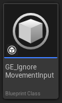

또한 `State.Cost.Rooted` 라는 태그를 부여하고, 캐릭터의 어트리뷰트 중 하나인 MovementSpeed에 0을 곱해서 0으로 만듭니다.

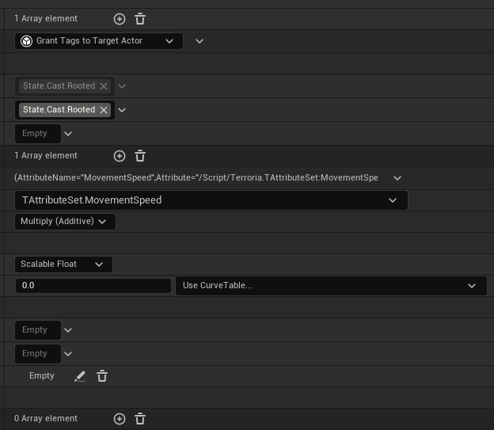

그 이후 GA(GameplayAbility)에서 애니메이션 재생 전에 위 이펙트를 적용합니다.

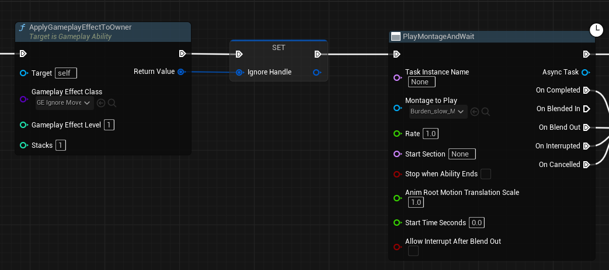

마지막으로, EndAbility를 발생하면 적용되었던 이펙트를 삭제시킵니다.

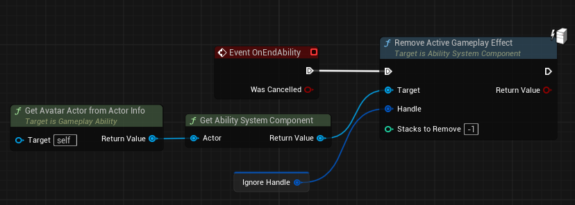

## 입력 초기화

``` cpp
void ATPlayerController::MovePlayerToDestination()
{
    if (!bMovingToDestination)
    {
        return;
    }

    // 입력 무시
    if (GetTASC())
    {
        FGameplayTag RootTag = FTGameplayTags::Get().State_Cast_Rooted;
        if (GetTASC()->HasMatchingGameplayTag(RootTag))
        {
            bMovingToDestination = false;
            return;
        }
    }

    if (PossessedCharacter)
    {
        const FVector LocationOnSpline = RouteSpline->FindLocationClosestToWorldLocation(
            PossessedCharacter->GetActorLocation(), ESplineCoordinateSpace::World);
        const FVector WorldDirection = RouteSpline->FindDirectionClosestToWorldLocation(
            LocationOnSpline, ESplineCoordinateSpace::World);

        PossessedCharacter->AddMovementInput(WorldDirection);

        const float DistanceToDestination = (LocationOnSpline - CachedDestination).Length();
        if (DistanceToDestination <= StopMovementRadius)
        {
            bMovingToDestination = false;
        }
    }
}


void ATPlayerController::HeldAbilityAction(const FInputActionValue& Value, const FGameplayTag Tag)
{
    ...

    if (bIsTargeting)
    {
        if (GetTASC())
        {
            GetTASC()->HeldAbilityInputTag(Tag);
        }
    }
    else
    {
        // 입력 무시
        if (GetTASC())
        {
            FGameplayTag RootTag = FTGameplayTags::Get().State_Cast_Rooted;
            if (GetTASC()->HasMatchingGameplayTag(RootTag))
            {
                return;
            }
        }

        MousePressTime += GetWorld()->GetDeltaSeconds();

        if (CursorTraceHit.bBlockingHit)
        {
            CachedDestination = CursorTraceHit.ImpactPoint;
        }

        if (PossessedCharacter)
        {
            const FVector WorldDirection = (CachedDestination - PossessedCharacter->GetActorLocation()).GetSafeNormal();
            PossessedCharacter->AddMovementInput(WorldDirection);
        }
    }
}
```

컨트롤러 코드에 다음과 같은 코드를 추가하여 `State.Cast.Rooted` 태그가 있으면 사용자의 입력을 무시하게 됩니다.

# 결과


---

2026.01.15 추가 작성

# 파티클 생성

시각적 효과를 추가하기 위해 파티클을 구성해보도록 하겠습니다. 먼저 스킬의 컨셉은 다음 그림과 같습니다.

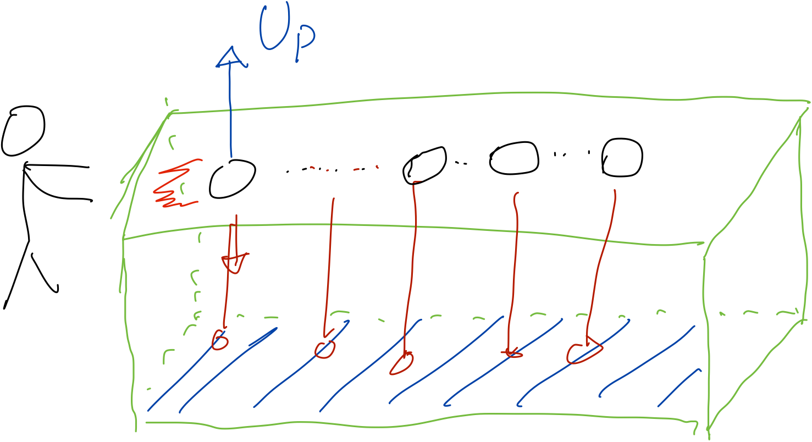

플레이어 캐릭터에서 총알이 발사 되고, 총알에서 지형까지 Ray를 쏴 해당 지형에 파티클을 생성합니다. (제가 직접 그렸는데 알아볼 수 있으신가요?😅)

구현 과정은 인터넷에 공개되어 있는 Projectile 로직이랑 똑같습니다. 그 외 개발하면서 오류가 났던 부분에 대해 말해보고 싶어요.

## UpVector

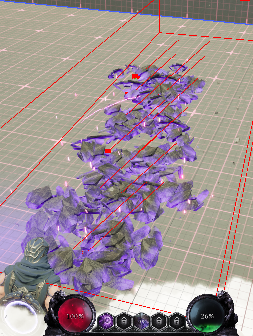

테스트에서 위 사진과 같은 모습이 출력됩니다. Ray가 한쪽으로 쏠려 일자로 파티클이 생성되질 않습니다. 그래서 Ray 생성 코드를 다시 살펴보았습니다.

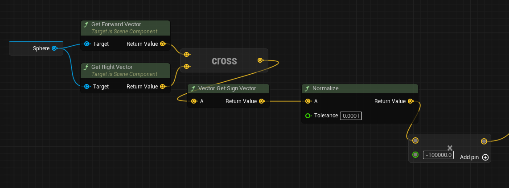

어떤 부분이 잘못된 건지 보이시나요? `Vector Get Sign Vector` 이 노드가 문제였습니다. 저는 이 노드가 외적의 결과를 항상 UpVector로 반환해주겠지 라는 생각으로 적었던 것이었는데, 코드를 살펴보니 x,y,z 의 성분이 0보다 크면 1을 반환, 0보다 작으면 -1, 0이면 0을 반환하는 노드였습니다.

그래서 값이 (0.1, 0.0, 0.99) 이런 식이면 (1, 0, 1)로 바뀌는 것이었죠. 때문에 UpVector 방향을 잃어버리고 8방향 중 하나로 고정되는 것이었습니다.

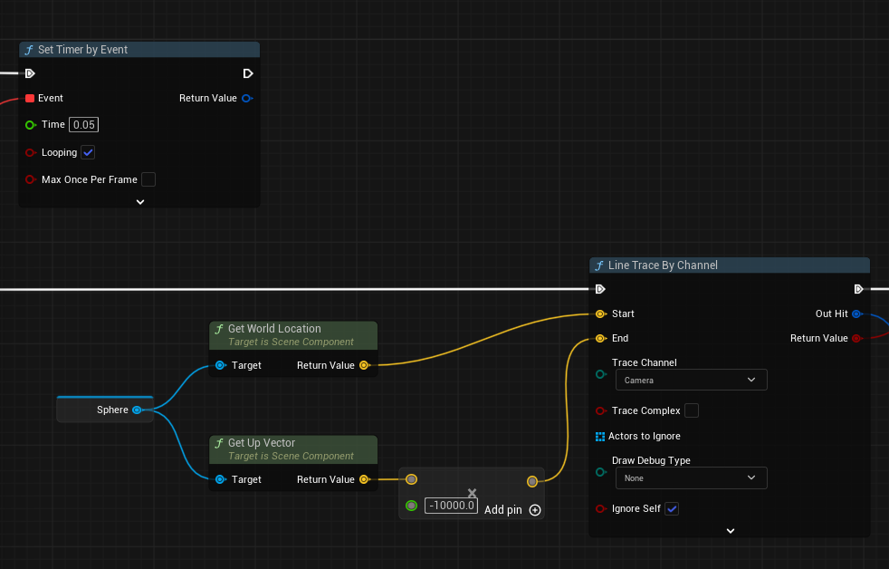

결과적으로 언리얼 엔진에서는 UpVector를 기본적으로 제공하고 있습니다. 왜 UpVector 노드를 검색해볼 생각을 안했을까요? 당연한건데 말이죠.

# CameraShake

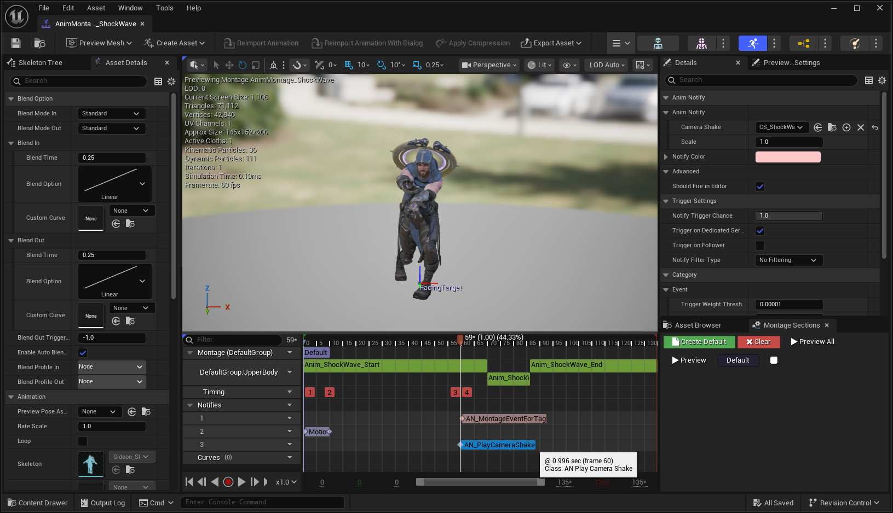

이제 스킬 사용 시 카메라를 살짝 흔들어서 사용자 반응성을 향상 시킵니다. `Start Camera Shake` 라는 노드를 통해서 카메라 효과를 호출할 수 있습니다. 애니메이션에 맞추어 발동이 되어야 하기 때문에 AnimNotify를 통해 효과를 연출합니다.

카메라 효과는 가장 기본적인 파동형 패턴을 생성합니다.

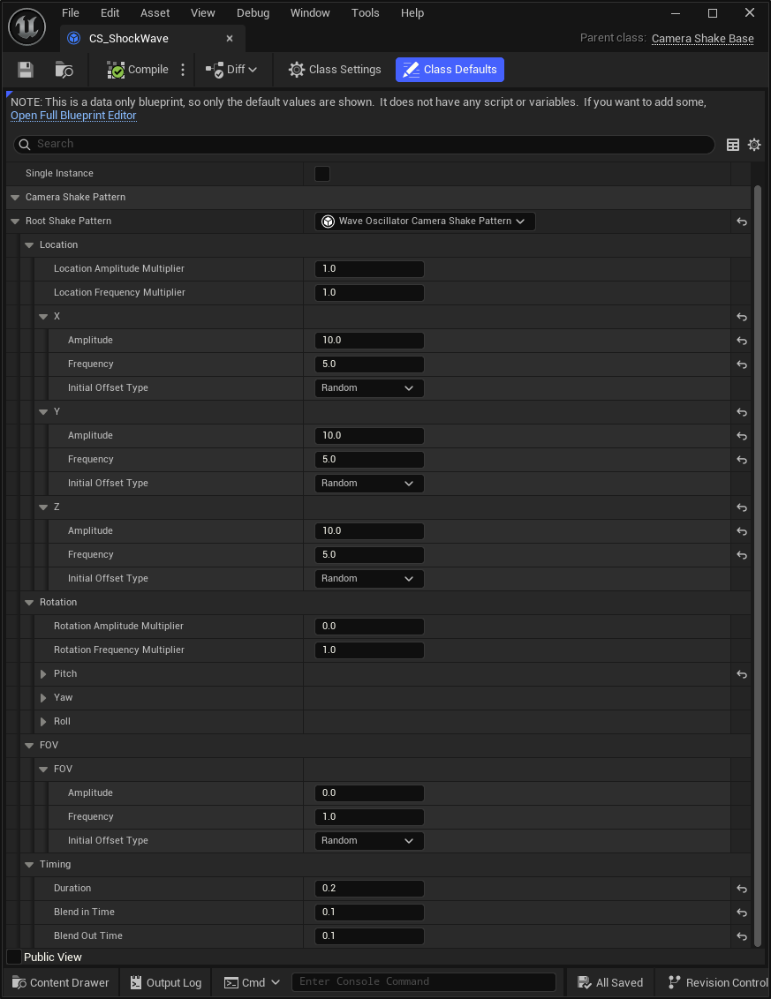

그 다음 AnimNotify에서 `Start Camera Shake` 노드를 호출하고 연결하면 끝입니다.

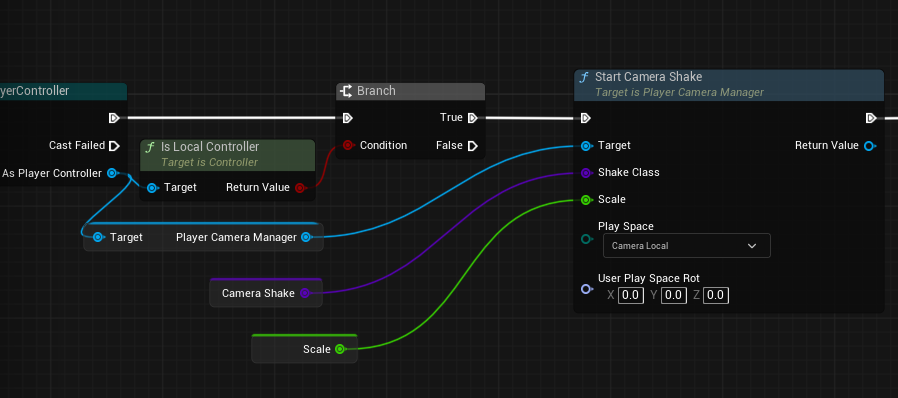

# 결과


---

# 마무리

이로써 GAS 기능을 통해 쇼크웨이브 스킬을 만들어 보았습니다. GameplayTag와 GameAbilitySystem을 통해 쉽고 빠르게 스킬을 제작할 수 있었습니다. 다음에는 더 좋은 게시글로 찾아뵙겠습니다. 감사합니다.