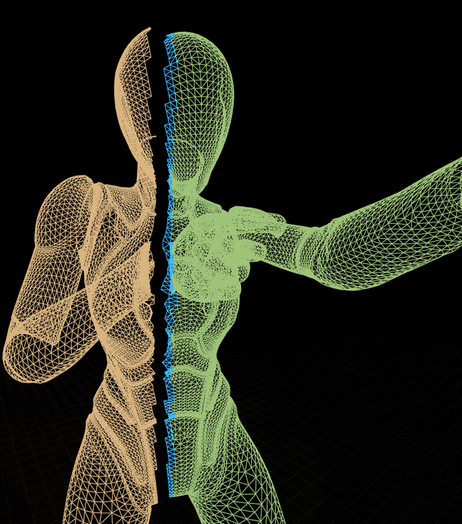

본 내용은 크래프톤 정글 게임 테크랩 과정에서 만들었던, Slice SkeletalMesh(이하 SliceMesh)의 제작 과정을 담고 있습니다.


결과물은 [Fab](https://www.fab.com/listings/9cd4f90f-f9be-40be-87cf-795b8f6033e5) 이곳에서 확인할 수 있습니다.

# 들어가며

게임 개발에서 동적인 스켈레탈 메시(Skeletal Mesh)를 런타임에 절단하는 것은 매우 복잡하고 도전적인 과제입니다. 정적인 메시와 달리, 스켈레탈 메시는 본(Bone)의 움직임에 따라 실시간으로 버텍스(Vertex)의 위치가 변형되는 '스키닝(Skinning)' 과정을 거치기 때문입니다. 
 
이러한 동적인 특성은 절단면을 계산하고, 절단된 두 부분의 메시를 자연스럽게 분리하며, 잘려나간 단면에 새로운 표면(Cap)을 생성하는 과정에서 상당한 성능 부하를 유발합니다. 
 
SliceMesh는 `버텍스 선별 과정의 병렬처리`, `런타임의 비동기 Skeletal Mesh 생성`, 그리고 절단면에 적용되는 `프로시저럴 메시의 CPU Skinning` 이라는 세 가지 핵심 기법을 통해, 성능 저하를 최소화하면서도 안정적인 런타임 메시 절단 기능을 구현방법을 소개하고자 합니다.

## 1. 버텍스 선별

SliceMesh 처리 과정은 크게 __'버텍스 선별'__, __'메시 재구성'__, __'절단면 처리'__ 의 세 단계로 나눌 수 있습니다.
 
메시 절단의 첫 단계는 절단 평면(Slicing Plane)을 기준으로 어떤 버텍스가 어느 쪽에 속하는지, 그리고 어떤 버텍스들이 절단면에 걸쳐 있는지 식별하는 것입니다. 
 
APSliceableSkeletalMeshComponent::SplitVerticesByPlane 함수는 이 과정을 효율적으로 처리하기 위해 병렬 처리 기법을 도입했습니다. 
 
먼저 GetCPUSkinnedVertices를 통해 현재 프레임의 애니메이션이 적용된 모든 버텍스의 최종 월드 위치를 가져온 후, 각 버텍스와 절단 평면 사이의 거리를 병렬로 처리합니다.

```cpp APSliceableSkeletalMeshComponent.cpp
void UAPSliceableSkeletalMeshComponent::SplitVerticesByPlane(...) const
{
    // ... SkinnedVertices 가져오기 ...

    TArray<float> Distances;
    Distances.SetNumUninitialized(NumVertices);

    // 각 버텍스와 평면 사이의 거리를 병렬로 계산
    ParallelFor(NumVertices, [&](int32 VertexIndex)
    {
        Distances[VertexIndex] = LocalSlicePlane.PlaneDot(FVector(SkinnedVertices[VertexIndex].Position));
    });

    // ... 삼각형 단위로 교차 여부 판단 및 병렬 처리 ...
    ParallelFor(NumTriangles, [&](int32 TriIndex)
    {
        // ...
        if (DMin < 0.0f && DMax > 0.0f)
        {
            FScopeLock Lock(&IntersectingSetLock);
            OutIntersectingVertexIndices.Add(I0);
            OutIntersectingVertexIndices.Add(I1);
            OutIntersectingVertexIndices.Add(I2);
        }
    });
}
```

이러한 병렬 처리는 수만 개의 버텍스를 순차적으로 계산할 때 발생할 수 있는 게임 스레드의 병목 현상을 효과적으로 방지하여, 절단 판정 과정에서의 프레임 드랍을 최소화합니다.



## 2. 런타임 비동기 Skeletal Mesh 생성

절단 평면에 의해 분리된 버텍스 그룹들은 각각 새로운 스켈레탈 메시 에셋으로 재구성되어야 합니다. 이는 런타임에 USkeletalMesh 오브젝트를 동적으로 생성하는 것을 의미하며, 상당한 연산 비용을 수반합니다.

만약 이 과정이 게임 스레드에서 동기적으로 처리된다면, 사용자는 심각한 멈춤 현상(hitch)을 경험하게 될 것입니다.

저희는 이 과정을 비동기 Task를 통해 처리하였습니다. BuildSkeletalMeshAsync 함수는 메시 생성에 필요한 데이터를 준비한 후, 실제 메시를 구성하는 복잡한 작업을 별도의 워커 스레드(Worker Thread)에서 비동기적으로 수행하도록 태스크를 생성합니다.

```cpp APSkeletalMeshBuilder.cpp
void APSkeletalMeshBuilder::BuildSkeletalMeshAsync(TFunction<void(bool bSuccess)> OnCompleteCallback)
{
    // ... 데이터 준비 ...
    
    (new FAutoDeleteAsyncTask<FAPSkeletalMeshBuilderTask>(
        SrcMesh,
        VertexIDs,
        MoveTemp(RawResult),
        MoveTemp(RawLODData),
        [this](...) { this->OnBuildFinished(...); }
    ))->StartBackgroundTask();
}
```

작업이 완료되면 콜백 함수를 통해 게임 스레드로 결과가 전달되어, 최종적으로 분리된 메시 컴포넌트가 생성됩니다. 이 비동기 아키텍처 덕분에 게임의 반응성은 유지되면서 백그라운드에서는 복잡한 메시 생성 작업이 원활하게 이루어질 수 있습니다.

## 3. 프로시저럴 메시의 CPU Skinning

절단된 메시의 잘려나간 단면은 UAPSkinnedProceduralMeshComponent를 사용하여 실시간으로 생성되는 '캡(Cap)' 메시로 채워집니다.

이 프로시저럴 메시는 일반적인 GPU 파이프라인을 타지 않기 때문에, 원본 메시와 함께 자연스럽게 움직이게 하려면 별도의 스키닝 처리가 필요합니다.

UAPSkinnedProceduralMeshComponent::UpdateCPUSkinnedMesh 함수가 이 역할을 담당합니다. 이 함수는 매 틱(tick)마다 부모 스켈레탈 메시 컴포넌트의 현재 본 트랜스폼(Bone Transform) 정보를 가져와, 프로시저럴 메시의 각 버텍스에 대한 스키닝을 CPU에서 직접 계산하여 위치를 갱신합니다.

```cpp APSkinnedProceduralMeshComponent.cpp
void UAPSkinnedProceduralMeshComponent::UpdateCPUSkinnedMesh()
{
    // ... 최종 본 트랜스폼 행렬 계산 ...

    ParallelFor(Count, [&](int32 i)
    {
        // ... 각 버텍스의 SkinWeightInfo를 기반으로 ...
        // ... SkinnedPos, SkinnedNorm, SkinnedTgt 계산 ...

        for (int32 InfluenceIdx = 0; InfluenceIdx < MaxInfluences; ++InfluenceIdx)
        {
            // ...
            SkinnedPos += FinalTransform.TransformPosition(LocalPos) * NormalizedWeight;
            // ...
        }

        // World Space -> Component Space 변환 후 버텍스 위치, 노멀, 탄젠트 업데이트
        Vertices[i] = GetComponentTransform().InverseTransformPosition(SkinnedPos);
        // ...
    });

    UpdateMeshSection(...);
}
```

이러한 CPU 기반 스키닝 방식은 절단면 캡이 마치 원래부터 몸체의 일부였던 것처럼 부드럽게 애니메이션되도록 보장하는 핵심적인 기술입니다.

는 움직이지 않는 모습(왼쪽) / 절단된 버텍스(파랑)가 움직이는 모습(오른쪽)")

---

# 마무리

SliceMesh는 __병렬 처리__ 를 통한 신속한 버텍스 선별, __비동기 방식__ 의 안전한 런타임 메시 생성, 그리고 __CPU 스키닝__ 을 이용한 동적인 절단면 처리과정을 통해 런타임 스켈레탈 메시 절단이라는 과제를 해결했습니다.