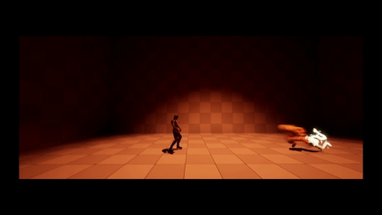

본 내용은 크래프톤 정글 게임 테크랩 과정에서 만들었던, Slice SkeletalMesh(이하 SliceMesh)의 제작 과정을 담고 있습니다.


결과물은 [Fab](https://www.fab.com/listings/9cd4f90f-f9be-40be-87cf-795b8f6033e5) 이곳에서 확인할 수 있습니다.

# 들어가며

지난 1부에서는 SliceMesh가 병렬처리, 비동기 메시 생성, CPU 스키닝을 통해 어떻게 효율적으로 스켈레탈 메시를 절단하는지에 대한 핵심 구조를 살펴보았습니다.

본 글에서는 절단 이후의 데이터 무결성을 어떻게 유지하고 기능을 확장하는지에 대해 초점을 맞추어, 절단면 폴리곤 생성 및 UV 좌표 계산, 절단된 메시의 SkinWeight 데이터 동기화, 그리고 절단면 소켓(Socket) 생성 및 동적 업데이트라는 세 가지 핵심 기술을 설명하고자 합니다.

## 1. 절단면 폴리곤 생성 및 UV좌표 계산

절단 후 메시의 안쪽은 텅 빈 공간입니다. 이 텅 빈 단면을 채우기 위해 절단 과정에서 생성된 새로운 경계선(Clip Edges)들을 활용하여 캡(Cap)을 생성합니다.

")

이 과정은 **SliceSkinnedProceduralMesh** 함수 내부에서 체계적으로 이루어집니다. 이 함수는 기존 언리얼 엔진의 **SliceProceduralMesh** 함수를 가져와 몇 가지 코드를 추가하였는데요.

먼저, `ProjectEdges` 함수를 통해 3D 공간의 경계선들을 2D 절단 평면으로 투영하여 2D 엣지 집합을 만듭니다.

그 후, `Build2DPolysFromEdges` 함수가 이 엣지들을 순회하며 서로 연결된 닫힌 폴리곤들을 찾아냅니다. 이때 닫힌 폴리곤 상태가 아닐 경우 Cap 생성은 실패하게 됩니다.

")

폴리곤이 완성되면, `GeneratePlanarTilingPolyUVs` 함수를 호출하여 생성된 폴리곤 표면에 타일링될 UV좌표를 자동으로 계산하게 됩니다.

마지막으로, `Transform2DPolygonTo3D` 와 `TriangulatePoly` 함수가 2D 폴리곤을 다시 3D 공간으로 변환하고, 이를 삼각형들로 분할하여 실제 렌더링 가능한 메시 섹션으로 만듭니다.

이 과정까지가 기존의 언리얼 엔진 코드에서 프로시저럴 메시를 만들기 위한 부분이었습니다.

## 2. 절단된 메시의 SkinWeight 데이터 동기화

절단면 캡을 포함한 프로시저럴 메시는 기본적으로 StaticMesh 입니다. 그렇게 때문에 절단 이후에 캐릭터를 따라 움직이기 위해선 버텍스들이 SkinWeight 값을 가져야 합니다. 이를 `SynchronizeSectionRenderData` 에서 복잡한 데이터 동기화 작업을 수행합니다.

이 함수는 절단 과정에서 생성된 `FVertexMappingInfo` 라는 사용자 정의 구조체 데이터를 활용합니다. 이 데이터는 새로 생성된 버텍스가 원본 메시의 어떤 버텍스들로부터 파생되었는지에 대한 정보를 담고 있습니다.

- __원본 버텍스가 그대로 유지된 경우:__ 해당 버텍스의 스킨 웨이트 정보를 그대로 복사합니다.
- __두 버텍스 사이의 경계선에서 새로 생성된 경우:__ 두 원본 버텍스 중 절단면에 더 큰 영향을 주는, 즉 가중치가 높은 버텍스의 스킨 웨이트 값을 복사합니다.
- __절단면 캡에 속한 버텍스의 경우:__ 위에서 처리된 버텍스 중 자신과 가장 가까운 위치에 있는 버텍스를 찾아 해당 버텍스의 스킨 웨이트 정보를 복사합니다.

```cpp APSkinnedDynamicMeshHelpers.cpp 
void UAPSkinnedDynamicMeshHelpers::SynchronizeSectionRenderData(...)
{
    // ... 몸통 부분의 스킨 웨이트 동기화 ...
    for (int32 Index = StartIndex; Index < MappingData.Num(); Index++)
    {
        // ...
        if (SourceIndices.Num() == 1) // 원본 버텍스 유지
        {
            NewSkinWeight = SourceRenderData.SkinWeights[SourceIndices[0]];
        }
        else // 보간된 버텍스
        {
            // 가중치에 따라 하나의 원본 버텍스를 선택하여 스킨 웨이트 상속
            if (Weight0 >= Weight1) NewSkinWeight = SourceRenderData.SkinWeights[SrcIndex0];
            else NewSkinWeight = SourceRenderData.SkinWeights[SrcIndex1];
        }
        // ...
    }

    // ... 캡 부분의 스킨 웨이트 동기화 ...
    for (const FProcMeshVertex& CapVertex : CapMeshSection->ProcVertexBuffer)
    {
        // ... 가장 가까운 몸통 버텍스를 찾아 스킨 웨이트 복사 ...
    }
}

```
이런 근사(Approximation)한 데이터 동기화 매커니즘을 통해, 절단된 이후에도 자연스럽게 모든 표면이 원본 애니메이션과 완벽하게 통합되어 움직이게 됩니다.


## 3. 절단면 소켓(Socket) 생성 및 동적 업데이트

> 이 부분은 저의 담당이 아니었지만, 팀원 코드 공유에서 들었던 내용을 바탕으로 제가 정리했습니다.

기존 언리얼의 `SliceProceduralMesh` 는 이펙트 관련 함수를 제공하지 않았습니다. 저희 Slice SkeletalMesh는 절단면에 동적으로 소켓을 생성하여 파티클 이펙트나 다른 컴포넌트를 부착할 수 있는 기능을 제공합니다. `CreateAndAttachCapSockets` 함수는 각 캡 폴리곤의 무게 중심(Centroid)을 계산하여 그 위치에 USceneComponent 소켓을 생성하고 부착합니다.

생성된 소켓은 UpdateCapSocket 함수를 통해 매 프레임 업데이트가 되고, CPU 스키닝에 의해 캡 폴리곤의 형태가 변형되어도, 소켓의 위치 역시 새로운 무게 중심점으로 계속 갱신됩니다.

```cpp APSkinnedProceduralMeshComponent.cpp
void UAPSkinnedProceduralMeshComponent::CreateAndAttachCapSockets(...)
{
    for (const FCapPolygonVertexMapping& Mapping : PolygonMappings)
    {
        // 폴리곤의 무게 중심 계산
        FVector Centroid = FVector::ZeroVector;
        // ...
        Centroid /= Mapping.NumVertices;

        // 소켓 생성 및 부착
        USceneComponent* OutSocket = NewObject<USceneComponent>(this, SocketName);
        // ...
        OutSocket->SetRelativeLocation(Centroid);
        CapSocketMap.Add(Mapping, OutSocket);
    }
}

void UAPSkinnedProceduralMeshComponent::UpdateCapSocket()
{
    // ... 매 프레임 변형된 폴리곤의 새로운 무게 중심을 계산하여 소켓 위치 업데이트 ...
}
```
이 기능을 통해 절단 부위에서 피가 뿜어져 나오는 효과나 잘린 단면에 전기 스파크가 튀는 등의 시각 효과를 구현하는데 유용해졌습니다.



# 마무리

SliceMesh는 단순히 메시를 자르는 것을 넘어, 절단 이후의 데이터 재구성과 기능확장에 대한 솔루션을 생각했습니다. SkinWeight 동기화, 동적 소켓 생성등 하나의 완성도 높은 런타임 메시 조작 시스템을 제공하고 있습니다.