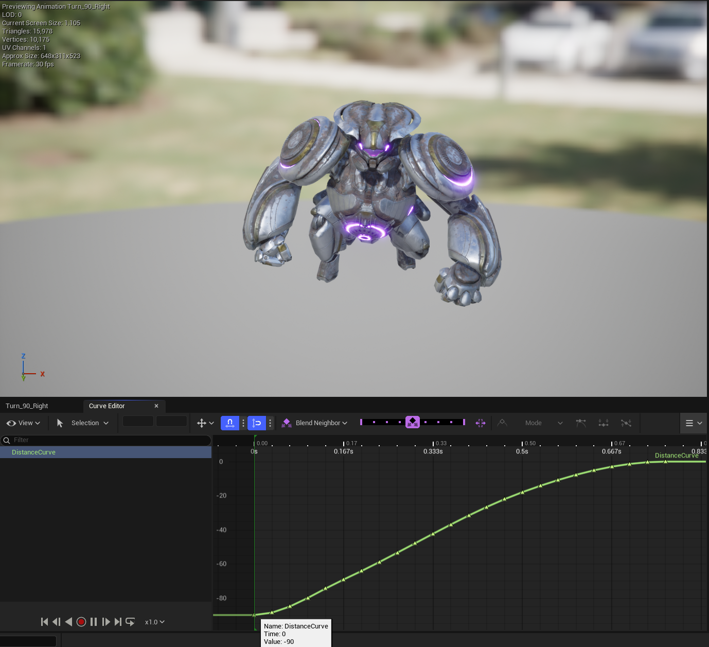
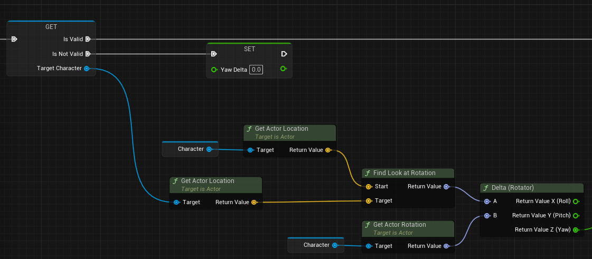
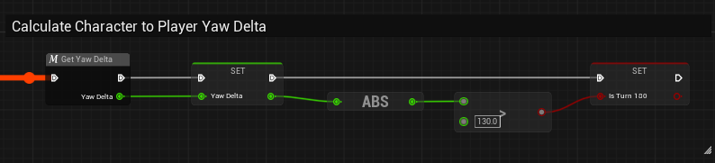
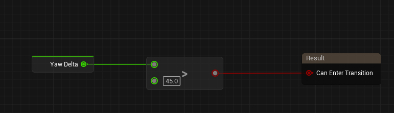
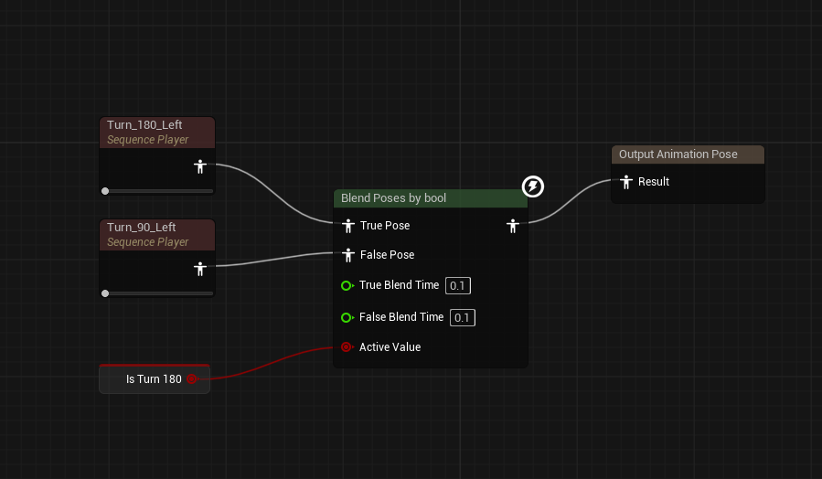
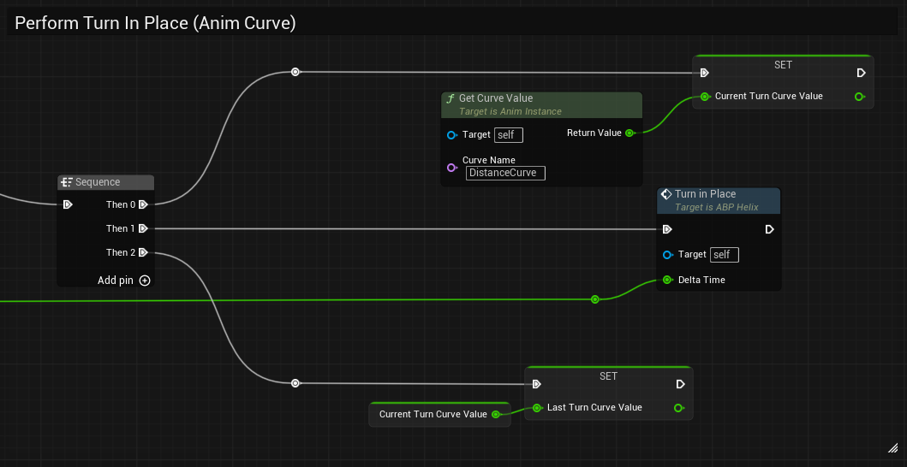
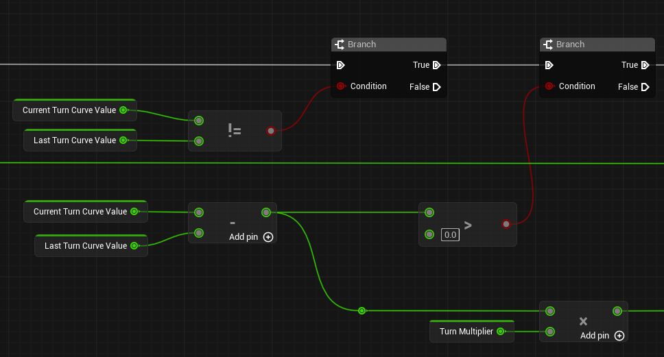
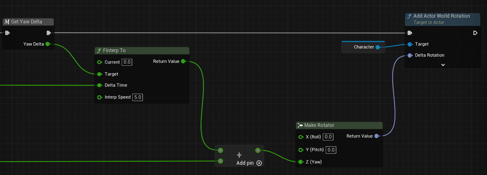

# 들어가며

캐릭터 애니메이션 작업을 하다보면 꼭 한 번은 마주치는 문제가 있습니다. 바로 **제자리 회전(Turn In Place)** 입니다. 캐릭터가 이동 없이 방향만 바꿀 때 발이 미끄러지거나, 회전 타이밍이 어긋나 애니메이션과 실제 몸통이 따로 노는 현상이죠.

`Set Actor Rotation`으로 뚝뚝 끊기게 돌리거나, `FInterp`만 걸어놓고 어림잡아 맞추는 방법은 대부분 어느 시점에서 한계를 드러냅니다.

이 글에서는 **애니메이션에 커브를 심어 그 값으로 캐릭터를 직접 회전**시키는 방식을 소개합니다. 애니메이션 재생 속도가 변하든, 블렌드가 되든 커브 값이 따라오기 때문에 훨씬 정확하고 자연스러운 결과를 얻을 수 있습니다.

완성하면 다음과 같은 모습을 확인할 수 있습니다.

<iframe width="560" height="315" src="https://www.youtube-nocookie.com/embed/aMbI7XtGIAo?si=SYviPEW4d2W2VmKY" title="YouTube video player" frameborder="0" allow="accelerometer; autoplay; clipboard-write; encrypted-media; gyroscope; picture-in-picture; web-share" referrerpolicy="strict-origin-when-cross-origin" allowfullscreen></iframe>

---

## Animation Curve란?

보통 Turn In Place는 "몇 초 동안 몇 도 돌아라"처럼 시간 기반으로 회전을 제어합니다. 그게 아니라면 루트 모션을 통해 직접 회전을 간섭하게 됩니다. 하지만 이 방식들은 애니메이션 재생 속도가 조금만 달라져도 틀어집니다.

**Animation Curve** 방식은 다릅니다. 애니메이션의 각 프레임에 "이 시점까지 총 몇 도 회전했는가"를 커브 값으로 직접 심어둡니다. 즉 재생 속도가 바뀌어도 현재 프레임에서 얼마나 돌아야 하는지를 커브에서 읽어오기 때문에 타이밍이 흔들리지 않습니다.

예를 들어 90도 회전 애니메이션이라면:
- 시작 프레임: `-90`
- 중간 프레임: `-45`
- 끝 프레임: `0`

매 프레임, **이전 프레임의 커브 값과 현재 커브 값의 차이(Delta)** 만큼 캐릭터를 회전시킵니다. 이렇게 하면 재생 속도와 무관하게 항상 정확한 회전이 보장됩니다.



---

# 구현

## Yaw Delta 계산

먼저 캐릭터가 바라봐야 할 방향(몬스터가 목표로 하고 있는 플레이어 캐릭터)과 현재 방향의 차이. 즉, `Yaw Delta`를 구합니다.



```cpp
// C++ 코드 예시
float UMyAnimInstance::GetYawDelta(AActor* Target, AActor* Self)
{
    if (!Target || !Self) return 0.f;

    FRotator LookAtRot = UKismetMathLibrary::FindLookAtRotation(
        Self->GetActorLocation(),
        Target->GetActorLocation()
    );

    FRotator Delta = UKismetMathLibrary::NormalizedDeltaRotator(
        LookAtRot,
        Self->GetActorRotation()
    );

    return Delta.Yaw; // Z축 회전 차이만 사용
}
```

계산한 YawDelta는 AnimBP 변수에 저장해두고, 절댓값이 130도 이상이면 `IsTurn180` 플래그를 세웁니다.



---

## State Machine 전환 조건 설정

Idle → Turn 상태 전환 조건은 단순합니다. YawDelta가 45도를 넘으면 Turn Right 애니메이션 스테이트로 진입합니다. -45도 보다 작으면 Turn Left 애니메이션 스테이트로 진입합니다.



---

## Turn 애니메이션 블렌딩

Turn 스테이트 안에서는 `IsTurn180` 값으로 90도 / 180도 애니메이션을 블렌딩합니다.



여기서 **두 애니메이션 모두 DistanceCurve를 동일한 규칙으로 설정**해야 합니다. 180도 애니메이션이라면 시작값 `-180`, 90도라면 `-90`으로 시작해 0으로 끝나도록 커브를 심어둡니다.

---

## 커브 값으로 캐릭터 회전

AnimBP의 `Event Blueprint Update Animation`에서 매 프레임 아래 로직을 실행합니다.



Turn in Place 함수 내부 로직은 두 파트로 나뉩니다.

**파트 A - 회전량(Delta) 계산:**



```cpp
// C++ 코드 예시
float Delta = CurrentCurveValue - LastCurveValue;

if (Delta != 0 && Delta > 0)
{
    // 양수 = 커브가 앞으로 진행 중 (정상 재생)
    float RotationAmount = Delta * TurnMultiplier;
    // 캐릭터에 RotationAmount 적용
}
```

**파트 B - 실제 회전 적용:**



`FInterpTo`로 약간의 부드러움을 추가한 뒤, `Add Actor World Rotation`으로 Yaw만 넘겨줍니다.

```cpp
// C++ 코드 예시
void AMyCharacter::TurnInPlace(float DeltaTime, float CurveDelta)
{
    float SmoothedYaw = FMath::FInterpTo(
        0.f,
        YawDelta,       // 목표 회전값
        DeltaTime,
        InterpSpeed     // 5.0 권장
    );

    FRotator DeltaRot(0.f, CurveDelta * TurnMultiplier, 0.f);
    AddActorWorldRotation(DeltaRot);
}
```

---

# 흔한 실수 & 주의사항

**1. DistanceCurve 부호 방향을 통일하지 않는 경우**: Left/Right 애니메이션의 커브 시작값 부호가 다르면 회전 방향이 반전됩니다. 항상 `-각도 → 0` 방향으로 통일하고, 방향 구분은 `TurnMultiplier`의 부호로 처리하세요.

**2. LastCurveValue 초기화를 놓치는 경우**: Turn 애니메이션이 시작될 때 `LastCurveValue`를 현재 커브 값으로 초기화하지 않으면 첫 프레임에 튀는 현상이 발생합니다. State 진입 시점에 반드시 초기화하세요.

**3. FInterp Speed를 너무 높게 잡는 경우**: `InterpSpeed`가 너무 높으면 커브 값이 무의미해지고 `Set Actor Rotation`과 다를 게 없어집니다. 5.0 전후에서 시작해 캐릭터 무게감에 맞게 조정하세요.

---

# 마무리

Animation Curve를 이용한 Turn In Place는 초기 세팅이 조금 번거롭지만, 한 번 잘 잡아두면 애니메이션 재생 속도나 블렌드 상황에도 흔들리지 않는 안정적인 결과물을 얻을 수 있습니다. 감사합니다.
