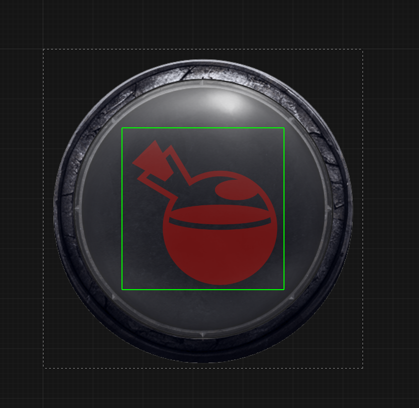
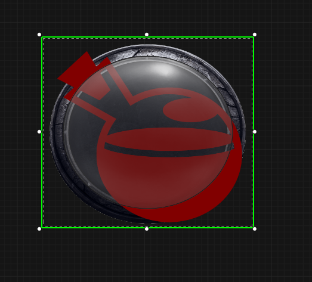
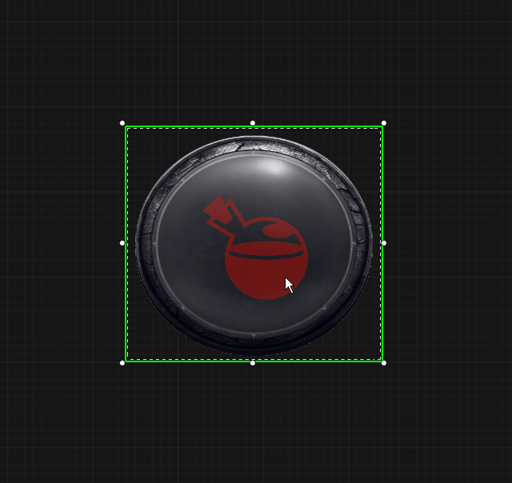
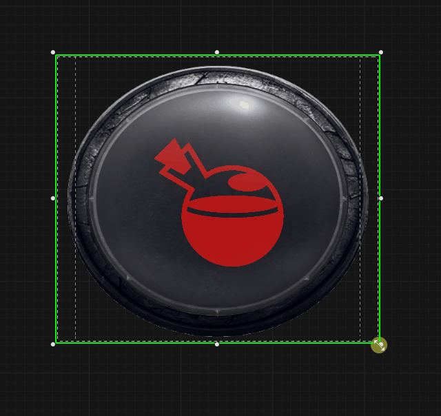

# 들어가며

UMG(Unreal Motion Graphics) 작업을 하다 보면 고정된 이미지 사이즈가 해상도 변화에 따라 찌그러지거나 의도치 않게 작아지는 상황을 자주 마주하게 됩니다. 특정 크기로 고정해버리면 모바일이나 울트라 와이드 모니터 등 다양한 환경에 대응하기 어렵습니다.

오늘은 `Size Box`와 `Scale Box`의 조합을 활용해, 위젯의 부모 크기가 어떻게 변하더라도 내부 요소들이 일정한 비율을 유지하며 반응형으로 리사이징되는 구조를 만드는 방법을 정리해 보겠습니다. 그리고 마지막에는 Size Box와 Scale Box 중첩 문제를 알아보고 `Spacer`를 활용한 방식으로 변경해보겠습니다.

---

# 문제 상황

예를 들어 위와 같은 슬롯 위젯을 만들었다고 가정해 봅시다. 배경 이미지 위에 포션 아이템이 놓인 형태입니다.

| 요소 | 원본 이미지 크기 | 위젯 내 설정 크기 | 정렬 방식 |
| --- | --- | --- | --- |
| Background Image | 512x512 | 512x512 | Fill |
| Potion Image | 512x512 | **256x256 (의도한 크기)** | Center |
| Glow Image | 512x512 | 512x512 | Fill |

이 위젯을 메인 UI에 배치하고 크기를 임의로 조절해 보면, 내부의 포션 이미지가 상대적으로 너무 커지거나 작아져 비율이 무너지는 현상이 발생합니다.

---

# 해결 방법

이 문제를 해결하기 위해 가장 널리 쓰이는 패턴은 **부모로부터 독립적인 가상 크기를 가지는 계층**을 만드는 것입니다.

## 1. 위젯 계층 구조
- Overlay (전체 컨테이너)
    - Background Image (배경이미지 - Fill)
    - Scale Box (비율 조절)
        - Size Box (가상의 기준 크기 정의)
            - Overlay (내부 콘텐츠 레이어)
                - Potion Image (실제 이미지 - Center)
    - Glow Image (강조 효과 - Fill)

## 2. 주요 위젯 설정

### Scale Box 설정
Scale Box는 자식 위젯을 어떻게 늘리거나 줄일지 결정합니다.

- Stretching -> Stretch: Scale to Fit (비율을 유지하며 부모 크기에 맞춰짐)
- Slot -> Horizontal/Vertical Alignment: Fill

### Size Box 설정
Size Box는 Scale Box에게 `내가 기준으로 잡을 크기`를 알려주는 역할을 합니다.

- Child Layout -> Width Override: 512 (배경 이미지의 실제 픽셀 크기 권장)
- Child Layout -> Height Override: 512

### Potion Image 설정
이제 포션 이미지는 전체 해상도가 아니라, 위에서 정의한 `512x512라는 가상의 공간`안에서만 위치를 잡으면 됩니다.

- Slot -> Alignment: Center
- Size: 256x256 (512 공간 내에서 절반 크기로 고정됨)

## 어떻게 작동하는 걸까?
1. 공간 확보: 전체 위젯 크기가 128x128로 작아졌다고 가정해 봅시다.
2. 기준 인식: Scale Box는 자식인 Size Box가 512x512 크기를 원한다는 것을 확인합니다.
3. 배율 계산: 512 공간을 128 안에 넣어야 하므로, Scale Box는 내부의 모든 요소를 0.25배로 축소합니다.
4. 비율 유지: Size Box 내부에서 256px였던 포션 이미지도 동일하게 0.25배 축소되어 결과적으로 부모 위젯 내에서 항상 일정한 비율(절반 크기)을 유지하게 됩니다.

---

# 결과

이 방식은 반응형 UI를 제작할 때 매우 강력하지만, 남용하면 성능에 영향을 줄 수 있습니다.

:::note
언리얼 엔진 공식 문서의 [최적화 가이드](https://dev.epicgames.com/documentation/ko-kr/unreal-engine/optimization-guidelines-for-umg-in-unreal-engine#%EC%8A%A4%EC%BC%80%EC%9D%BC%EB%B0%95%EC%8A%A4%EC%99%80%EC%82%AC%EC%9D%B4%EC%A6%88%EB%B0%95%EC%8A%A4%EA%B2%B0%ED%95%A9%ED%94%BC%ED%95%98%EA%B8%B0)에서는 `Scale Box와 Size Box의 중첩`을 주의하라고 경고하고 있습니다. 

Size Box는 자신의 크기를 유지하기 위해 상위/하위 위젯의 크기를 매 프레임 재계산할 수 있습니다. Scale Box 역시 같은 이유로 업데이트를 시도합니다. 그렇기 때문에 업데이트가 빈번히 일어나는 수백 개의 아이템이 있는 인벤토리 리스트의 개별 항목에 이 구조를 넣으면 UI 성능이 저하될 수 있습니다.

만약 단순히 아이템 크기만 조절하는 것이라면 이미지의 Padding이나 Margin을 활용하거나, 텍스처 자체의 여백을 조절하는 것이 더 가볍습니다.

그러므로 위젯 블루프린트 전체의 큰 틀을 잡을 때나, 복잡한 구성의 단일 위젯(미니맵, 특수 게이지 등)에 우선적으로 사용해야합니다.
:::

---

# SizeBox를 Spacer로 변경

기존에 사용되던 Size Box를 Spacer로 교체해봅시다.

## 1. 위젯 계층 구조
- Overlay (전체 컨테이너)
    - Background Image (배경이미지 - Fill)
    - Scale Box (비율 조절)
        - Overlay (내부 콘텐츠 레이어)
            - Spacer (가상의 기준 크기 정의)
            - Potion Image (실제 이미지 - Center)
    - Glow Image (강조 효과 - Fill)

## 2. 위젯 설정

### 내부 Overlay 설정
내부 Overlay를 중앙에 놓습니다. 
- Slot -> Horizontal/Vertical Alignment: Fill

### Spacer 설정
내부 콘텐츠 레이어 안에서 크기를 유지시킵니다.
- Size -> 512x512 (배경 이미지의 실제 픽셀 크기 권장)

결과적으로 Size Box를 사용할 때와 비주얼적인 차이는 전혀 없지만, Spacer는 복잡한 크기 오버라이드 로직이 없어 비용이 훨씬 낮아 렌더링 비용 측면에서 이점이 있습니다.

# 마무리
어떤 방식을 선택하든 `Scale Box`가 포함된 레이아웃은 일반 위젯보다 계산량이 많습니다. 그것을 주의하고 UI를 구현하면 좋을 것 같습니다. 감사합니다.

# Ref.

[UMG 최적화 가이드라인](https://dev.epicgames.com/documentation/ko-kr/unreal-engine/optimization-guidelines-for-umg-in-unreal-engine)

[USizeBox](https://dev.epicgames.com/documentation/en-us/unreal-engine/API/Runtime/UMG/USizeBox)

[UScaleBox](https://dev.epicgames.com/documentation/en-us/unreal-engine/API/Runtime/UMG/UScaleBox)
