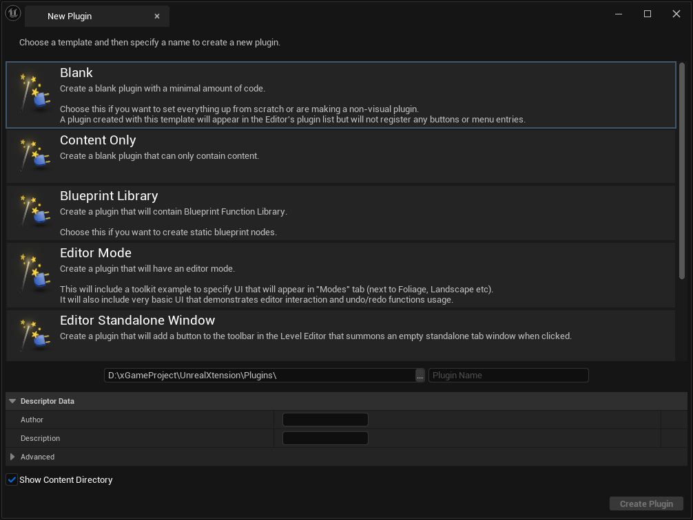
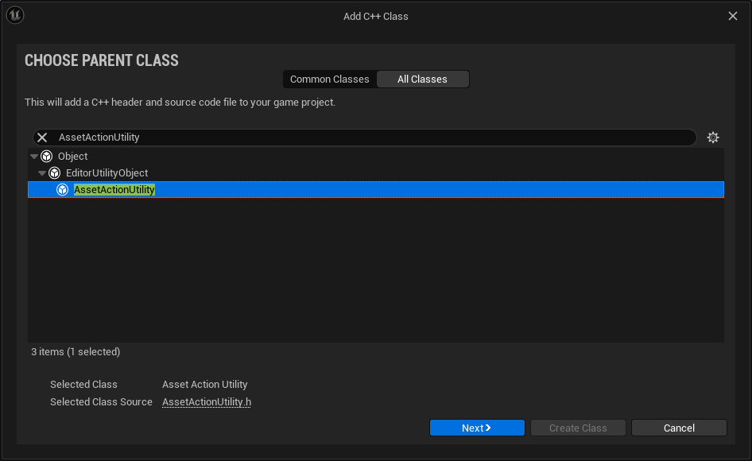
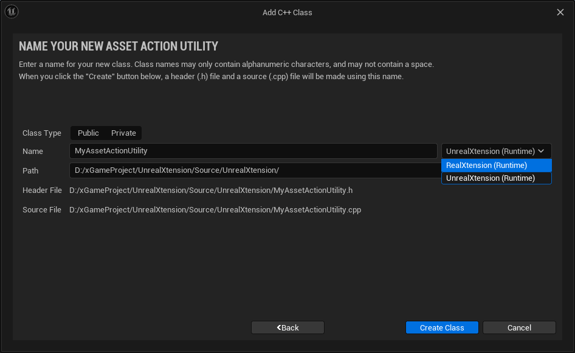
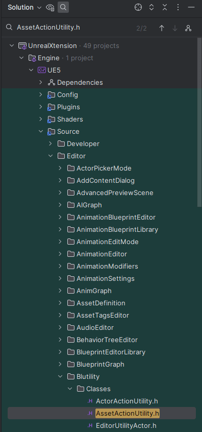
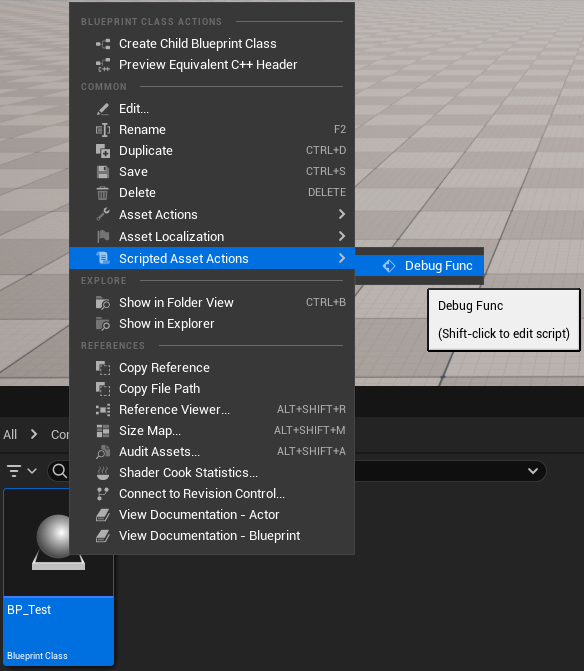
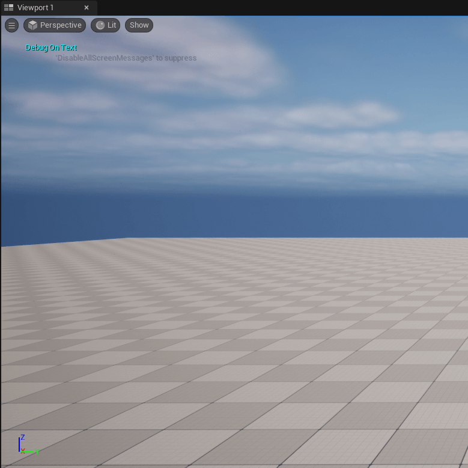
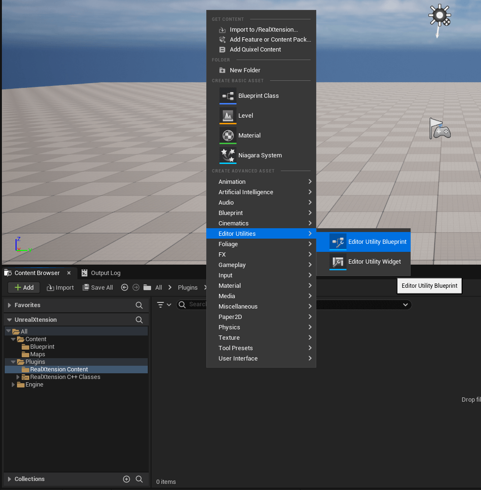
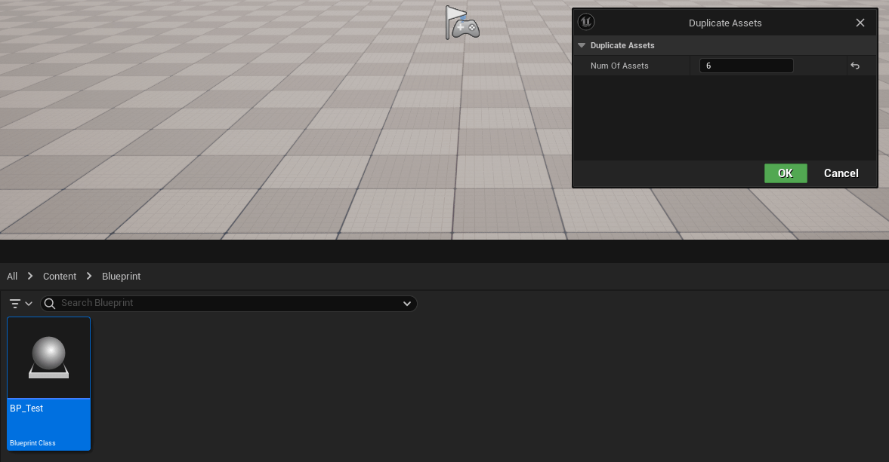
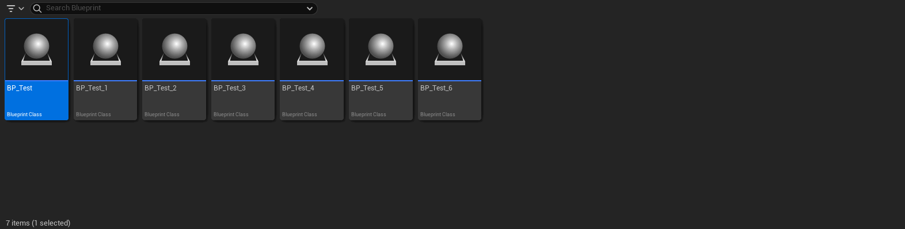

# 구현 목표

언리얼 에디터를 사용하다보면 ‘이러한 기능이 있으면 좋을 것 같다’ 혹은 ‘반복적인 작업을 좀 더 쉽게 하고 싶다’는 생각이 들었습니다. 그래서 언리얼 에디터를 확장해보는 것을 목표로 삼았습니다.

**엔진 버전은 5.3입니다.**

---

# 구현 과정

## 1. 정의

### 들어가며

아시다시피 언리얼 엔진은 여러 개의 모듈로 구성된 집합체입니다. 이 중에서 우리는 에디터 모듈을 사용할 거에요. 모듈과 에디터 확장에 대한 부분을 조금 설명해야 하지만 아래 링크로 대체하겠습니다. 저보다 이득우 교수님이 설명을 훨씬 더 잘해놓으셔서…👍

:::note
[[IGC2018] 청강대 이득우 - 언리얼에디터확장을위해알아야할것들](https://www.slideshare.net/ssuser052dd11/igc2018-120411230)
:::

### 사전 준비

- 플러그인을 하나 만들거에요. Blank로 선택하시고, 이름을 정해주세요. (저는 `RealXtension`으로 지었습니다.)



```cpp
{
    "FileVersion": 3,
    "Version": 1,
    "VersionName": "1.0",
    "FriendlyName": "RealXtension",
    "Description": "",
    "Category": "Other",
    "CreatedBy": "Xerlock",
    "CreatedByURL": "",
    "DocsURL": "",
    "MarketplaceURL": "",
    "SupportURL": "",
    "CanContainContent": true,
    "IsBetaVersion": false,
    "IsExperimentalVersion": false,
    "Installed": false,
    "Modules": 
    [
        {
            "Name": "RealXtension",
            "Type": "Editor",
            "LoadingPhase": "PreDefault"
        }
    ]
}
```

- 생성이 완료 되었다면 몇 가지 설정을 해주셔야 합니다.
- 생성하신 플러그인에서 `uplugin` 확장자를 찾아서 파일을 열어주세요.
- `Type` 과 `LoadingPhase` 를 바꿔주세요.
- 에디터에서 사용할 것이기 때문에 Editor로, 에디터가 로드되기 전에 로드되어야 하므로 PreDefault로 바꿔주는 작업입니다.

## 2. 분석

### Built-in Class

언리얼에서는 에디터 확장을 쉽게 할 수 있도록 미리 제공하는 유틸 클래스가 있어요.

- `AssetActionUtility` : Asset action에 관련된 유틸 클래스
- `ActorActionUtility` : Actor action에 관련된 유틸 클래스

여기서 Action 이란 생성, 삭제, 읽기, 쓰기와 같은 작업을 말해요.

제가 이번에 만들 기능은 Assest을 다루기 때문에 `AssetActionUtility` 를 사용해보도록 하겠습니다.





- 새 C++ 클래스 생성을 눌러 `AssetActionUtility`를 생성합니다.
- 기존의 프로젝트 위치가 아닌 플러그인 위치로 변경합니다.
- `..\RealXtension\Public\AsssetActions\QuickAssetAction.h`

### 모듈 추가

```cpp
// Fill out your copyright notice in the Description page of Project Settings.

#pragma once

#include "CoreMinimal.h"
#include "AssetActionUtility.h" // Error !
#include "QuickAssetAction.generated.h"

/**
 * 
 */
UCLASS()
class REALXTENSION_API UQuickAssetAction : public UAssetActionUtility
{
    GENERATED_BODY()
};
```

클래스를 생성하고 헤더 파일을 보시면 2번째 인크루드에서 오류가 발생합니다.

이 헤더를 프로젝트에서 찾아보면 옆의 그림과 같은 경로에 있는 것을 볼 수 있어요.

`Source/Editor/Blutility/Classes/AssetActionUtility.h`

이는 의존성 모듈에 의해 발생하는 것으로 해당 클래스의 의존성 모듈을 `Build.cs` 에 추가해주면 됩니다.

:::important
**Plugin의 Build.cs에 추가하셔야 합니다**
:::



```cpp
PublicDependencyModuleNames.AddRange(
    new string[]
    {
        "Core",
        "Blutility"
        // ... add other public dependencies that you statically link with here ...
    }
);
```

### Scripted Asset Action

  지금까지 제대로 따라왔다면 컴파일이 정상적으로 될 거에요. 그렇다면 이제 화면에 디버그 메시지를 띄워보도록 할게요.

1. 먼저 `DebugFunc` 라는 함수를 하나 만들어주겠습니다.
2. 함수에 `UFUNCTION(CallInEditor)` 라는 매크로를 선언해주세요.
    - CallInEditor는 에디터에서 이 함수를 호출할 수 있게 해줘요.
3. 함수 구현부에서 다음과 같은 코드를 입력해주세요.
    
    ```cpp
    if (GEngine)
    {
        GEngine->AddOnScreenDebugMessage(-1, 8.f, FColor::Cyan, TEXT("Debug On Text"));
    }
    ```
    


이제 에디터에서 블루프린트를 하나 생성하고 마우스 오른쪽 버튼을 눌러 `Scripted Asset Actions` 의 Debug Func를 눌러보세요. 아마 에디터의 뷰포트에 메시지가 출력되는 것을 볼 수 있을겁니다.



:::important 📌 만약 `Scripted Asset Actions` 이 보이지 않는다면 아래를 참고 해주세요. :::

### Scripted Asset Actions이 안보여요

5.0 버전은 확인을 했는데, 그 이후 버전에서는 따로 에디터 유틸리티 블루프린트를 생성해줘야합니다. 

그 내용은 다음과 같습니다.

1. 생성하신 플러그인의 Content 폴더에서 `Editor Utility Blueprint`를 생성해주세요.
    

    
2. 생성하신 블루프린트를 열고 `Parent Class`를 방금 만드신 클래스로 바꿔주세요.

3. 에디터를 다시 빌드하시거나, 라이브 코딩을 실행하시면 이제 보이실 겁니다.


### 블루프린트 복제하기

자 이제 기본적인 내용은 모두 살펴보았으니 제대로 된 기능을 만들어봅시다.

이번에 만들어볼 기능은 `블루프린트 복제하기` 입니다.

네? 이건 그냥 컨트롤 C+V 하면 되는거 아니냐구요? 맞아요. 하지만 만약 복사해야되는게 30개, 50개 100개이면 😅 또 이 기능을 베이스로 안의 내용물을 랜덤하게 바꿔서 복제하기 등 다양하게 활용할 수 있겠죠?

Asset에 대하여 어떠한 특정 작업을 하기 위해서 아래 두 라이브러리의 도움을 받을 수 있어요.

이 두 라이브러리는 앞으로도 많이 쓰일 예정이니 한번씩 살펴보는 걸 추천해요.

- `UEditorUtilityLibrary`    
- `UEditorAssetLibrary`

:::tip
[UEditorUtilityLibrary 공식 문서 바로가기](https://docs.unrealengine.com/5.3/en-US/API/Editor/Blutility/UEditorUtilityLibrary/)

[UEditorAssetLibrary 공식 문서 바로가기](https://docs.unrealengine.com/5.3/en-US/API/Plugins/EditorScriptingUtilities/UEditorAssetLibrary/)
:::
    

### 최종코드

```cpp
void UQuickAssetAction::DuplicateAssets(int32 NumOfAssets)
{
    if (NumOfAssets <= 0)
    {
        return;
    }

    TArray<FAssetData> SelectedAssetData = UEditorUtilityLibrary::GetSelectedAssetData();
    uint32 Counter = 0;

    for (const FAssetData& AssetData : SelectedAssetData)
    {
        for (int i = 0; i < NumOfAssets; ++i)
        {
            const FString SourceAssetPath = AssetData.GetObjectPathString();
            const FString NewDuplicateAssetName = AssetData.AssetName.ToString() + TEXT("_") + FString::FromInt(i + 1);
            const FString NewPathName = FPaths::Combine(AssetData.PackagePath.ToString(), NewDuplicateAssetName);

            if(UEditorAssetLibrary::DuplicateAsset(SourceAssetPath, NewPathName))
            {
                UEditorAssetLibrary::SaveAsset(NewPathName, false);
                ++Counter;
            }
        }
    }

    if (Counter > 0)
    {
        Print(FString::FromInt(Counter) + TEXT("개의 파일이 복제되었습니다."), FColor::Green);
    }
}
```
- 선택된 Asset의 데이터 배열을 가져옵니다.
- 각 Asset 데이터의 경로와 새롭게 생성될 Asset의 이름을 설정하고 최종 경로를 지정합니다.
- Asset 복제를 실행하고 새롭게 만든 Asset을 저장합니다.

## 3. 예시





---

# 마무리

매번 지루하고 반복적인 작업을 어떻게하면 줄일 수 있을까를 고민하면서 에디터에 나만의 기능을 추가하고 싶다는 생각을 하곤 했습니다.

그 첫번째로 블루프린트 복제하기를 해보았는데요, 첫 글로 설명이 부족하지 않았을까라는 생각도 하게 됩니다. 그래도 막상 구현하고 나니 뿌듯하네요.

다들 자신만의 언리얼 엔진을 커스텀 해 보시면 좋겠습니다. 그럼 다음 게시글에서 뵙겠습니다.