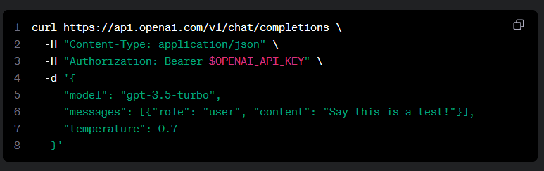
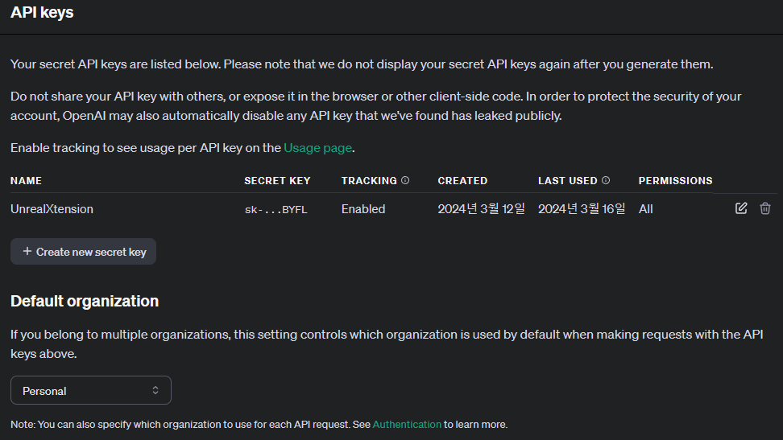
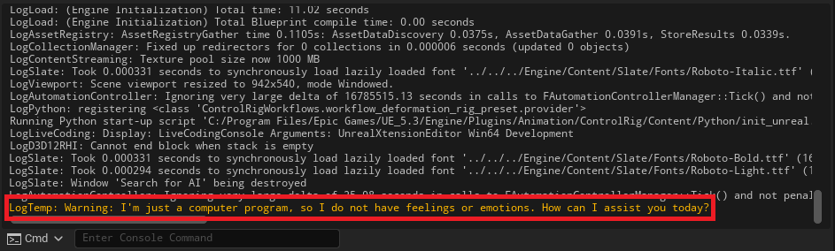

# 구현 목표

AI는 현시점에서 가장 뜨거운 주제인 만큼 그와 관련된 개발 역시 에픽 게임즈 내부에서도 `스마트NPC` 라는 이름으로 발표한 적도 있었습니다. 이러한 점을 볼 때 앞으로 관련 기능이 많이 추가되겠지만 그전에 먼저 `ChatGPT`를 이용해 간단한 대화 정도 주고 받는 AI 어시스턴트를 만들어 보겠습니다.

---

# 구현 과정

## 1. 정의

### 들어가며

> [OpenAI API](https://platform.openai.com/docs/overview)

일단 OPEN AI의 API를 사용할 것이기 때문에 OPEN AI 계정이 필요합니다.

OPEN AI에서 제공하는 공식 문서를 살펴보면 2가지의 언어와 1가지의 툴을 사용한 방법을 제공하고 있습니다.

- curl
- python
- node.js

이 중 우리가 오늘 사용할 것은 `curl` 입니다. curl은 네트워크 통신을 통해 데이터를 전송하는 명령툴이라고 생각하시면 됩니다. 이 게시글에서는 http 통신 이용해서 값을 받을 예정이에요.



> __샘플 코드__
```json
    curl https://api.openai.com/v1/chat/completions   -H "Content-Type: application/json"   -H "Authorization: Bearer $OPENAI_API_KEY" -d
    {
        "model": "gpt-3.5-turbo",
        "messages": [
            {
            "role": "system",
            "content": "You are a poetic assistant, skilled in explaining complex programming concepts with creative flair."
            },
            {
            "role": "user",
            "content": "Compose a poem that explains the concept of recursion in programming."
            }
        ]
    }
```

### API Key 발급 받기



`Create new secret key`를 눌러 새 API Key를 발급합니다.

## 2. 분석

### HTTP

언리얼에서 `HTTP` 통신을 할 수 있는 `FHttpModule`을 이용할 거예요. 해당 클래스를 통해 서버에 보낼 Requset를 생성하고 IHttpRequest를 이용해서 우리가 요청할 목록을 구성할 거예요.

> [FHttpModule 공식문서](https://docs.unrealengine.com/5.3/en-US/API/Runtime/HTTP/FHttpModule/)

> [IHttpRequest 공식문서](https://docs.unrealengine.com/4.27/en-US/API/Runtime/HTTP/Interfaces/IHttpRequest/)

### JSON

데이터를 요청하면 Json 형식으로 값이 제공됩니다. 그래서 `Json`을 이용해서 데이터를 주고받을 예정이에요. 언리얼에서는 JSON을 다룰 수 있는 클래스를 제공하고 있어요.

> [TJsonWriterFactory 공식문서](https://docs.unrealengine.com/4.26/en-US/API/Runtime/Json/Serialization/TJsonWriterFactory/)

> [TJsonReaderFactory 공식문서](https://docs.unrealengine.com/5.3/en-US/API/Runtime/Json/Serialization/TJsonReaderFactory/)

### 스마트 포인터

언리얼엔진에서 데이터 통신 변수는 스마트 포인터를 이용해서 구성합니다. 그러므로 해당 내용에 대해 조금이라도 알고 가셨으면 좋겠어요.

> [언리얼 스마트 포인터 라이브러리](https://docs.unrealengine.com/4.27/ko/ProgrammingAndScripting/ProgrammingWithCPP/UnrealArchitecture/SmartPointerLibrary/)

### 코드 분석

```cpp
const FString ApiKey = OPEN_AI_API_KEY; // your api key here
```

- API 키를 담을 변수를 선언해 주세요.

#### curl Header

```cpp
    TSharedRef<IHttpRequest> Request = FHttpModule::Get().CreateRequest();

    // Parameters
    const FString Header = "Bearer " + ApiKey;
    const FString URL = FString::Printf(TEXT("https://api.openai.com/v1/chat/completions"));

    // Headers
    Request->SetURL(URL);
    Request->SetHeader(TEXT("Content-Type"), TEXT("application/json"));
    Request->SetHeader(TEXT("Authorization"), Header);
```

- FHttpModule을 이용해서 Request를 생성해 주겠습니다.
- 생성하면 `IHttpRequest`를 반환합니다. 이를 이용해서 Request 목록을 구성할 수 있어요.
- `SetURL()`, `SetHeader()` 두 멤버 함수를 통해 주소와 헤더를 입력해 줄게요.
- OPEN AI가 요구하는 헤더는 2가지 종류가 있습니다.
    - `Content-Type` ,`Authorization`

#### Payload

```cpp
    // Build Payload
    const TSharedPtr<FJsonObject> PayloadObject = MakeShareable(new FJsonObject());
    PayloadObject->SetStringField(TEXT("model"), TEXT("gpt-3.5-turbo"));
    PayloadObject->SetNumberField(TEXT("max_tokens"), 300); // Free Tier: 40,000 TPM
```

- 우리가 보낼 데이터를 구성해 보도록 하겠습니다.
- OpenAI의 curl을 살펴보면 오브젝트 형태를 요구하고 있습니다.
    - JSON에서 `{ }` 은 오브젝트, `[ ]` 은 배열을 나타냅니다.
- 우리도 그에 맞게 JsonObject를 생성할게요.
- 그 이후, 필드를 구성해주면 되는데요. 간단한게 2개로 구성하겠습니다.
- 필수 구성 요소인 model 과 최대토큰의 개수를 300개로 제한하도록 할게요.

:::note
**MakeShareable을 사용하는 이유**

특정 상황에서 객체를 수동 생성하고 스마트 포인터로 감싸야 할 때 사용합니다. 즉, 이 상황에서는 FJsonObject를 수동으로 생성하고 사용해야 하기 때문에 MakeShared 대신 Makeshareable를 사용하고 있습니다. 그 외, public 과 private의 차이도 있습니다.
:::

#### Cond

```cpp
    // Create Message
    TArray<TSharedPtr<FJsonValue>> Messages;
    const TSharedPtr<FJsonObject> Message = MakeShareable(new FJsonObject());
    Message->SetStringField(TEXT("role"), TEXT("user"));
    Message->SetStringField(TEXT("content"), Prompt);
    Messages.Add(MakeShareable(new FJsonValueObject(Message)));

    PayloadObject->SetArrayField(TEXT("messages"), Messages);
```

- 그다음으로 메시지 구성을 해볼 차례입니다.
- 메시지는 [ { }, { }, { } ] 의 구성 형식이기 때문에 그에 맞게 구성해 보겠습니다.
- 배열 안에 Object가 들어가게 됩니다. 
Object는 하나의 값이기 때문에 JsonValue으로 담을 수 있어요.
- 메시지의 내용의 필드는 `role` 과 `content`가 있어요. 각각에 맞는 값을 입력해 주시면 됩니다.

#### Convert

```cpp
    // Convert payload to string
    FString Payload;
    const TSharedRef<TJsonWriter<>> JsonWriter = TJsonWriterFactory<>::Create(&Payload);
    FJsonSerializer::Serialize(PayloadObject.ToSharedRef(), JsonWriter);
```

- 이제 구성된 Json을 네트워크에 전송하기 위해 직렬화를 해줄게요.
- 직렬화 과정을 거치면 string 형태를 가지기 때문에 그 값을 담을 변수를 만들어주기만 하면 됩니다.
- FJsonSerializer를 통해 직렬화를 진행하면 됩니다.

#### Send Request

```cpp
    // Request
    Request->SetVerb(TEXT("POST"));
    Request->SetContentAsString(Payload);

    if (Request->ProcessRequest())
    {
        Request->OnProcessRequestComplete().BindUObject(this, &UQuickAssetAction::OnResponse);
    }
    else
    {
        ShowNotifyMessage(TEXT("전송 오류가 발생하였습니다."));
    }
```

- 값을 생성하거나 업데이트 시 POST, 리소스 정보만 요청 시 GET
- `ProcessRequest`를 통해 네트워크 요청을 보낼 수 있어요. 만약 성공하면 true를 반환합니다.
- 반환에 성공했다는 것은 요청이 완료되었다는 것이기 때문에 그것을 처리할 함수를 바인딩 해줄게요.

#### Response

```cpp
    TSharedPtr<FJsonObject> ResponseObject;
    const TSharedRef<TJsonReader<>> JsonReader = TJsonReaderFactory<>::Create(Response->GetContentAsString());

    if (FJsonSerializer::Deserialize(JsonReader, ResponseObject))
    {
        if (ResponseObject->HasField("error"))
        {
            ShowNotifyMessage(Response->GetContentAsString());
            return;
        }

        TArray<TSharedPtr<FJsonValue>> Choices = ResponseObject->GetArrayField("choices");

        const TSharedPtr<FJsonValue> Choice = Choices[0];
        const TSharedPtr<FJsonObject> MessageObject = Choice->AsObject()->GetObjectField("message");
        
        const FString ResponseMessage = MessageObject->GetStringField("content");
        // Something to you want
        Logging(ResponseMessage);
    }
```

- 요청하고 받은 값을 처리하기 위해서 `JsonReader`를 사용합니다.
- JsonReader 역직렬화를 통해 값을 다시 데이터화 시켜줍니다.
- 샘플 코드에 따르면 우리가 원하는 AI의 대답은 content에 들어있습니다.
- content는 choice[] → message {} → content “”  로 구성되어 있기 때문에
- 해당 과정을 다시 풀어주시면 됩니다.
- 저는 그냥 로그로 출력했는데 여러분은 원하시는 방식이 있다면 원하는 대로 처리해 주세요.

### 최종 코드

```cpp
void UQuickAssetAction::SearchForAI(FString Prompt)
{
    const FString ApiKey = OPEN_AI_API_KEY; // your api key here

    if (ApiKey.IsEmpty())
    {
        ShowDialogMessage(EAppMsgType::Ok, TEXT("API KEY를 확인해주세요."), true);
        return;
    }

    if (Prompt.IsEmpty())
    {
        ShowDialogMessage(EAppMsgType::Ok, TEXT("프롬프트가 비었습니다."), true);
        return;
    }

    TSharedRef<IHttpRequest> Request = FHttpModule::Get().CreateRequest();

    // Parameters
    const FString Header = "Bearer " + ApiKey;
    const FString URL = FString::Printf(TEXT("https://api.openai.com/v1/chat/completions"));

    // Headers
    Request->SetURL(URL);
    Request->SetHeader(TEXT("Content-Type"), TEXT("application/json"));
    Request->SetHeader(TEXT("Authorization"), Header);

    // Build Payload
    const TSharedPtr<FJsonObject> PayloadObject = MakeShareable(new FJsonObject());
    PayloadObject->SetStringField(TEXT("model"), TEXT("gpt-3.5-turbo"));
    PayloadObject->SetNumberField(TEXT("max_tokens"), 300); // Free Tier: 40,000 TPM

    // Create Message
    TArray<TSharedPtr<FJsonValue>> Messages;
    const TSharedPtr<FJsonObject> Message = MakeShareable(new FJsonObject());
    Message->SetStringField(TEXT("role"), TEXT("user"));
    Message->SetStringField(TEXT("content"), Prompt);
    Messages.Add(MakeShareable(new FJsonValueObject(Message)));

    PayloadObject->SetArrayField(TEXT("messages"), Messages);
    

    // Convert payload to string
    FString Payload;
    const TSharedRef<TJsonWriter<>> JsonWriter = TJsonWriterFactory<>::Create(&Payload);
    FJsonSerializer::Serialize(PayloadObject.ToSharedRef(), JsonWriter);

    // Request
    Request->SetVerb(TEXT("POST"));
    Request->SetContentAsString(Payload);

    if (Request->ProcessRequest())
    {
        Request->OnProcessRequestComplete().BindUObject(this, &UQuickAssetAction::OnResponse);
    }
    else
    {
        ShowNotifyMessage(TEXT("전송 오류가 발생하였습니다."));
    }
}

void UQuickAssetAction::OnResponse(FHttpRequestPtr Request, FHttpResponsePtr Response, bool bWasSuccessful)
{
    if (!bWasSuccessful)
    {
        ShowDialogMessage(EAppMsgType::Ok,  TEXT("전송 실패: ") + Response->GetContentAsString() + Response->GetURL(), true);
        return;
    }

    TSharedPtr<FJsonObject> ResponseObject;
    const TSharedRef<TJsonReader<>> JsonReader = TJsonReaderFactory<>::Create(Response->GetContentAsString());

    if (FJsonSerializer::Deserialize(JsonReader, ResponseObject))
    {
        if (ResponseObject->HasField("error"))
        {
            ShowNotifyMessage(Response->GetContentAsString());
            return;
        }

        TArray<TSharedPtr<FJsonValue>> Choices = ResponseObject->GetArrayField("choices");

        const TSharedPtr<FJsonValue> Choice = Choices[0];
        const TSharedPtr<FJsonObject> MessageObject = Choice->AsObject()->GetObjectField("message");
        
        const FString ResponseMessage = MessageObject->GetStringField("content");
        // Something to you want
        Logging(ResponseMessage);
    }
}
```

## 3. 결과




---

# 마무리

이번 편을 준비하면서 기존의 알고 있던 지식을 다시 한번 리마인드와 새로운 지식을 습득하는 시간이었습니다. 가령 HTTP 통신은 언리얼을 통해서는 처음이었는데요. 생각보다 쉽게 구성할 수 있다는 점에서 놀랐습니다. 