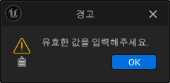
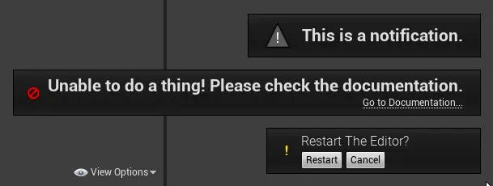
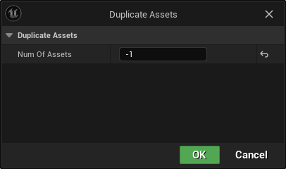
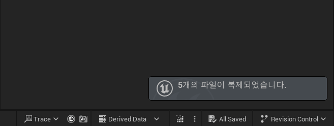

# 구현 목표

이전 편들에서 아쉬운 점이 하나 있었습니다. 바로 결과를 출력하는 방식이 아쉬웠는데요. 에디터 화면에 메시지를 띄우거나 로그 콘솔에 남기는 방식을 사용했습니다. 이는 사용자에게 알려주는 정보가 적을 수 밖에 없습니다. 그래서 제대로 된 알림창을 만들어보도록 하겠습니다.

---

# 구현 과정

## 1. 정의

### 들어가며

오늘은 최종적으로 2가지 형태의 알림 창을 만들 예정입니다. 두 내용다 어렵지 않아서 쉽게 구현할 수 있을거에요.

### FMessageDialog

> [FMessageDialog 공식문서](https://docs.unrealengine.com/5.3/en-US/API/Runtime/Core/Misc/FMessageDialog/)

이 클래스를 통해 사용자는 에디터에서 다이얼로그 창을 생성할 수 있습니다.




다이얼로그는 사진과 같이 기본 형이 있고 사용자의 입력을 받을 수 있는 입력형 다이얼로그가 있습니다.

다이얼로그를 자유롭게 구현할 수 있기때문에 원하는 형태로 출력해보도록 하겠습니다.


### Notification



:::note
__언리얼에서 제공하는 여러 형태의 노티피케이션__

노티피케이션(이하 노티) 기능은 위 사진과 같이 에디터의 우측 하단에 출력되며, 다이얼로그와 마찬가지로 여러 형태를 지원하기 때문에 자신이 원하는 노티를 생성할 수 있어요. 노티는 리스트를 작성하고 노티 매니저를 통해 출력하는 형태라는 점을 기억해주세요.

> [FSlateNotificationManager 공식문서](https://docs.unrealengine.com/5.3/en-US/API/Runtime/Slate/Framework/Notifications/FSlateNotificationManager/)

> [Notifications 공식문서](https://docs.unrealengine.com/4.26/en-US/API/Runtime/Slate/Widgets/Notifications/)
:::

## 2. 분석

### MessageDialog

```cpp
if (NumOfAssets <= 0)
{
    const FText MessageTitle = FText::FromString(TEXT("경고"));
    FMessageDialog::Open(EAppMsgType::Ok, FText::FromString(TEXT("유효한 값을 입력해주세요.")), MessageTitle);
    return;
}
```

- FMessageDialog는 Open() 메서드를 통해 생성할 수 있습니다.
- 총 3가지의 파라미터를 가지며 앞에서 부터 `타입`, `내용`, `타이틀` 순입니다.
- 메시지 타입에는 여러가지가 있으면 한번 살펴보는 것을 추천드려요.

### Notify

```cpp
if (Counter > 0)
{
    FNotificationInfo NotifyInfo(FText::FromString(FString::FromInt(Counter) + TEXT("개의 파일이 복제되었습니다.")));
    NotifyInfo.FadeOutDuration = 7.f;

    FSlateNotificationManager::Get().AddNotification(NotifyInfo);
}
```

- FNotificationInfo 형태의 노티를 생성합니다.
- 노티의 형태 역시 여러가지가 있으므로 하나씩 살펴 보시는 것을 추천드려요.
- 이후 노티매니저에 노티를 추가하면됩니다.
- 노티 매니저는 싱글톤으로 구현되어 있어며, 가지고 있는 노티를 윈도우에 플로팅 해줍니다.

### 최종코드

```cpp
void UQuickAssetAction::DuplicateAssets(int32 NumOfAssets)
{
    if (NumOfAssets <= 0)
    {
        const FText MessageTitle = FText::FromString(TEXT("경고"));
        FMessageDialog::Open(EAppMsgType::Ok, FText::FromString(TEXT("유효한 값을 입력해주세요.")), MessageTitle);
        return;
    }

    TArray<FAssetData> SelectedAssetData = UEditorUtilityLibrary::GetSelectedAssetData();
    uint32 Counter = 0;

    for (const FAssetData& AssetData : SelectedAssetData)
    {
        for (int i = 0; i < NumOfAssets; ++i)
        {
            const FString SourceAssetPath = AssetData.GetObjectPathString();
            const FString NewDuplicateAssetName = AssetData.AssetName.ToString() + TEXT("_") + FString::FromInt(i + 1);
            const FString NewPathName = FPaths::Combine(AssetData.PackagePath.ToString(), NewDuplicateAssetName);

            if(UEditorAssetLibrary::DuplicateAsset(SourceAssetPath, NewPathName))
            {
                UEditorAssetLibrary::SaveAsset(NewPathName, false);
                ++Counter;
            }
        }
    }

    if (Counter > 0)
    {
        FNotificationInfo NotifyInfo(FText::FromString(FString::FromInt(Counter) + TEXT("개의 파일이 복제되었습니다.")));
        NotifyInfo.FadeOutDuration = 7.f;

        FSlateNotificationManager::Get().AddNotification(NotifyInfo);
    }
}
```

## 3. 결과





---

# 마무리

각각의 출력 방식 마다 장단점이 있겠지만, 다이얼로그와 노티는 간단하면서 멋지게 알림 내역을 보여줄 수 있었던 것 같아요. 각자 편리하고 원하는 방식을 이용해서 출력해보도록 합시다. 감사합니다.