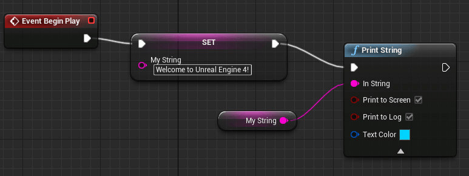
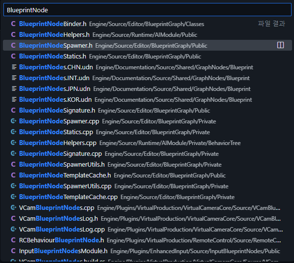
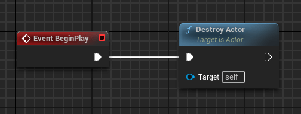

# 구현 목표

언리얼 엔진에서 빼놓을 수 없는 부분이 블루프린트 작업입니다. 많든 적든 결국 사용하게 되는 기능이죠. 저는 블루프린트 노드들을 볼 때마다 너무 못생겼다고 생각했습니다. (저만 그런가요?) 그래서 이 못생긴 노드들을 꾸며보기로 했습니다.



---

# 구현 과정

## 1. 정의

### 들어가며

오늘은 노드를 꾸미는 기능을 찾기 위한 저의 언리얼 코드 탐색 방식을 토대로 소개해드리겠습니다. 

## 2. 분석

### ISlateStyle 를 찾아라!

먼저 블루프린트 노드가 어떻게 구성되어 있는지 살펴볼 필요가 있었습니다.



제가 찾은 파일은 노드 Spawner 헤더 파일입니다. 이름부터 노드를 생성해 준다고 하는데 안 볼 수 없겠죠? 파일을 열어보시면 헤더 파일 선언이 끝나고 전방 선언된 클래스가 보입니다.

```cpp
class UEdGraph;
class UEdGraphNode;
```

노드들은 그래프 형태이기 때문에 이름만 보더라도 해당 클래스를 사용했다는 걸 알 수 있습니다.

그러면 저 클래스에서 찾아보도록 하겠습니다. 

```cpp
/** Create a visual widget to represent this node in a graph editor or graph panel.  If not implemented, the default node factory will be used. */
virtual TSharedPtr<SGraphNode> CreateVisualWidget() { return TSharedPtr<SGraphNode>(); }

/** Create the background image for the widget representing this node */
virtual TSharedPtr<SWidget> CreateNodeImage() const { return TSharedPtr<SWidget>(); }
```

해당 해더 파일에서 찾을 키워드는 **Create** 입니다. 결국 비주얼적으로 보여주기 위해서는 Slate를 사용하게 될 텐데 그것을 만드는 함수를 찾는 게 중요합니다. 제가 보통 찾아보는 키워드는 `Create` , `Begin` , `Make` , `Add` 등이 있습니다. 그래도 안 보이면 처음부터 끝까지 보는 수 밖에 없죠.

그래서 위 헤더 파일에서 두 함수를 찾았습니다. 보기 좋게 주석도 달려있어서 위젯을 그려준다는 것을 알 수 있습니다. 그렇다면 저기 반환하고 있는 `SGraphNode` 가 핵심이겠네요.

```cpp
class GRAPHEDITOR_API SNodeTitle : public SCompoundWidget
{
public:
    SLATE_BEGIN_ARGS(SNodeTitle)
        : _StyleSet(&**FAppStyle::Get()**)
        , _Style(TEXT("Graph.Node.NodeTitle"))
        , _ExtraLineStyle(TEXT("Graph.Node.NodeTitleExtraLines"))
        {}

        SLATE_ARGUMENT(const ISlateStyle*, StyleSet)

        // The style of the text block, which dictates the font, color, and shadow options. Style overrides all other properties!
        SLATE_ARGUMENT(FName, Style)

        // The style of any additional lines in the the text block
        SLATE_ARGUMENT(FName, ExtraLineStyle)

        // Title text to display, auto-binds to get the title if not set externally
        SLATE_ATTRIBUTE(FText, Text)
    SLATE_END_ARGS()
}
```

SGraphNode 헤더 파일을 열어보시면 해당 코드가  작성되어 있습니다. SNodeTitle에 관한 것입니다.  여기서 제 눈에 들어온 것이 바로 

> 📌 SLATE_ARGUMENT(const ISlateStyle*, StyleSet)

이 줄입니다. 이름부터 스타일을 설정하고 있다고 존재감을 표현하네요. 기특합니다. 제 시간을 줄여줬습니다.

### Static

ISlateStyle은 인터페이스이기 때문에 그대로 사용할 수 없습니다. 그렇게 때문에 직접 구현되어 있는 FSlateStyleSet을 사용합니다.

StyleSet을 구현하는 방식에는 여러 가지가 있지만 대표적으로 한 가지 방식이 있습니다.

정적 클래스를 통해 설정을 해주는 것입니다. 아래는 제가 작성한 정적 클래스입니다.

```cpp
#pragma once

#include "CoreMinimal.h"
#include "Styling/SlateStyle.h"

/**
 * BlueprintNode를 바꾸고 싶어서 만든 스타일 셋 클래스입니다.
 */
class REALXTENSION_API XGraphStyleSheet
{
public:
    static void Initialize();
    static void Shutdown();
    static TSharedPtr<ISlateStyle> Get();

private:
    static TSharedPtr<FSlateStyleSet> StyleSet;
};
```

```cpp
#include "XStyle/XGraphStyleSheet.h"
#include "Styling/SlateStyleRegistry.h"

TSharedPtr<FSlateStyleSet> XGraphStyleSheet::StyleSet = nullptr;

void XGraphStyleSheet::Initialize()
{
    if (!StyleSet.IsValid())
    {
        StyleSet = MakeShareable(new FSlateStyleSet(TEXT("XStyleSet")));

        StyleSet->SetParentStyleName(FAppStyle::GetAppStyleSetName());
        
        StyleSet->Set("Graph.Node.Body", new FSlateRoundedBoxBrush(FStyleColors::Panel, 1, FStyleColors::Transparent, 2.0));

        FSlateStyleRegistry::RegisterSlateStyle(*StyleSet.Get());
        
        FAppStyle::SetAppStyleSet(*StyleSet.Get());
    }
}

void XGraphStyleSheet::Shutdown()
{
    if (StyleSet.IsValid())
    {
        FSlateStyleRegistry::UnRegisterSlateStyle(*StyleSet.Get());
        ensure(StyleSet.IsUnique());
        StyleSet.Reset();
    }
}

TSharedPtr<ISlateStyle> XGraphStyleSheet::Get()
{
    return StyleSet;
}
```

1. 기존에 활성화되어있는 테마의 StyleSet을 새로 생성된 StyleSet의 부모로 설정합니다.
2. 프로퍼티 이름을 통해 해당 프로퍼티의 브러시 값을 변경합니다.
3. 생성된 StyleSet을 등록합니다.
4. 등록된 StyleSet을 현재 활성화된 테마의 StyleSet으로 설정합니다.

## 3. 결과



> 스타일 프로퍼티 이름에 관한 공식 문서를 아직 찾지 못했습니다. 혹시 알고 계신다면 알려주세요. 🙏

### 여담

많은 코드에서 StyleSet을 사용하는 이유가 자신이 만든 노드 혹은 레이아웃의 스타일을 직접 설정하기 위해서 만들어 사용합니다. 그래서 여기서 끝난다면 제가 지금 보여드린 코드는 굳이 따지면 쓸데없는 코드를 끼워 넣은 것이죠.

```cpp
void FRealXtensionModule::StartupModule()
{
    FSlateStyleSet* StyleSet = static_cast<FSlateStyleSet*>(const_cast<ISlateStyle*>(&FAppStyle::Get()));
    StyleSet->Set("Graph.Node.Body", new FSlateRoundedBoxBrush(FStyleColors::Panel, 1, FStyleColors::Transparent, 2.0));
}
```

위와 같이 그냥 플러그인 시작 모듈 부분에 코드를 넣어도 작동이 됩니다. 하지만 조금 뒤에 나올 게시글에서 커스텀 노드도 만들고 다양한 걸 하기 위한 초석이라고 생각해 주세요.

---

# 마무리

에디터를 하나씩 탐색하면서 작업하는 것은 매우 흥미로운 경험인 것 같습니다. 물론, 시간이 많이 걸리는 반면에 결과물이나 코드는 크게 대단하지 않을 수 있습니다. 하지만 이는 그만큼 언리얼 엔진이 방대한 양의 코드로 이루어져 있다는 증거겠지요.

요즘 해당 작업을 하면 수리공이 된 느낌입니다. 제가 고치고 싶은 부분을 고칠 수 있다는 게 정말 만족스러워요. 여러분도 그러한 매력에 빠져보시면 좋겠습니다.