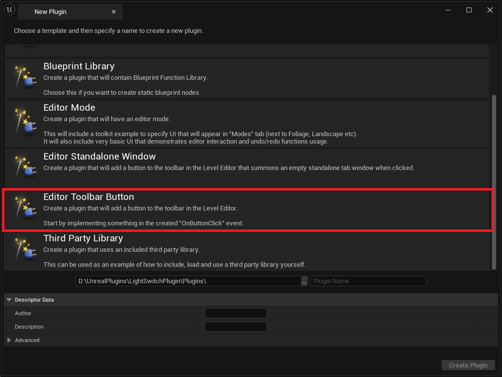
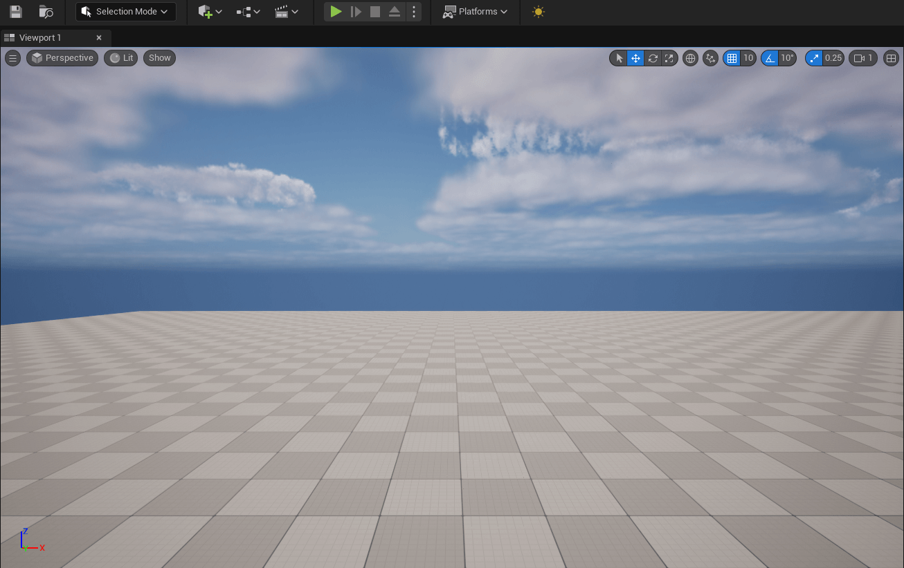
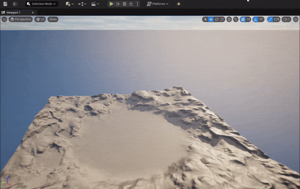
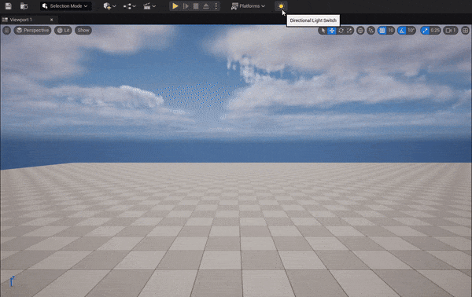

# 구현 주제

이번 게시글은 단순한 귀찮음에서 시작되었습니다. 포인트 라이트 효과를 확인하기 위해 잠시 다이렉셔널 라이트를 꺼야 했습니다. 

처음 몇 번은 그럭저럭 아무 생각 없이 했지만 이게 반복되면서 은근히 신경 쓰였습니다. 또한 아웃 라이너에 쌓이는 다른 오브젝트들 때문에 항상 찾으러 다니기도 귀찮았습니다. 

그래서 이러한 반복을 줄이고 방의 불을 켜고 끄는 것처럼 다이렉셔널 라이트를 스위치 하나로 컨트롤하기로 했습니다.


# 구현 과정

## 1. 툴바 버튼

이 프로젝트는 언리얼에서 기본 제공하고 있는 템플릿을 바탕으로 제작되었습니다. 제공하는 템플릿은 총 세 가지 부분으로 나눌 수 있습니다.

- 모듈
- 스타일
- 커맨드

하나씩 설명드릴게요. 스타일 부분부터 변경해 보겠습니다.



## 2. 스타일

스타일 부분에서는 SlateStyleSet을 설정합니다.

```cpp
TSharedRef< FSlateStyleSet > FXLightSwitchStyle::Create()
{
    TSharedRef< FSlateStyleSet > Style = MakeShareable(new FSlateStyleSet("XLightSwitchStyle"));
    Style->SetContentRoot(IPluginManager::Get().FindPlugin("XLightSwitch")->GetBaseDir() / TEXT("Resources"));

    Style->Set("XLightSwitch.LightAction", new IMAGE_BRUSH(TEXT("sun"), CoreStyleConstants::Icon24x24));
    return Style;
}
```

- `IPluginManager`를 통해 플러그인의 디렉터리 경로를 가져올 수 있습니다.
- 플러그인의 `Resources` 폴더에서 리소스를 가져옵니다.
- SlateStyleSet을 통해 `LightAction` 프로퍼티의 이미지 브러시를 설정합니다.
- `CoreStyleConstant`의 인라인 함수가 설정되어 있기 때문에 설정하고자 하는 아이콘 크기를 불러오기만 하면 됩니다.



이렇게만 하고 이벤트를 연결해도 되지만, 토글 버튼이기 때문에 이미지의 변화를 주고 싶어요.

결과적으로 2개의 이미지 브러시가 필요합니다. 각각 On과 Off 상태에서의 브러시 이미지 변수를 만들어 줬습니다.

```cpp
private:
    static TSharedPtr<FSlateImageBrush> LightOnBrush;
    static TSharedPtr<FSlateImageBrush> LightOffBrush;
```

또한 기존 코드를 수정해서 이미지 브러시를 캐싱 해 놓을게요. 

`Get` 함수를 통해 언제든지 불러올 수 있습니다.

```cpp
TSharedPtr<FSlateImageBrush> FXLightSwitchStyle::LightOnBrush = nullptr;
TSharedPtr<FSlateImageBrush> FXLightSwitchStyle::LightOffBrush = nullptr;

TSharedRef< FSlateStyleSet > FXLightSwitchStyle::Create()
{
    TSharedRef< FSlateStyleSet > Style = MakeShareable(new FSlateStyleSet("XLightSwitchStyle"));
    Style->SetContentRoot(IPluginManager::Get().FindPlugin("XLightSwitch")->GetBaseDir() / TEXT("Resources"));

    LightOnBrush = MakeShareable(new IMAGE_BRUSH(TEXT("sun"), CoreStyleConstants::Icon24x24));
    LightOffBrush = MakeShareable(new IMAGE_BRUSH(TEXT("moon"), CoreStyleConstants::Icon24x24));

    Style->Set("XLightSwitch.LightAction", LightOnBrush.Get());
    return Style;
}
```

그리고 새 함수를 하나 만들어줍니다. 이 함수는 입력받은 값에 따라서 아이콘의 이미지 브러시를 교체합니다. 또한 StyleSet의 이미지를 바꿨기 때문에 다시 텍스처를 리로드 해줍니다.

```cpp
/**
 * Toolbar 아이콘을 상태에 맞게 업데이트 합니다.
 * 
 * @param bNewState 새롭게 설정할 아이콘의 상태값 
 */
void FXLightSwitchStyle::UpdateIcons(bool bNewState)
{
    if (StyleInstance.IsValid())
    {
        StyleInstance->Set("XLightSwitch.LightAction", bNewState ? LightOnBrush.Get() : LightOffBrush.Get());
    } 

    ReloadTextures();
}
```

마지막으로 클릭했을 때, 이벤트를 발생시켜야 합니다. 이는 모듈과 커맨드 부분에서 설명드리겠습니다.

## 3. 커맨드

데이터를 읽고 쓸 때 델리게이트를 사용하는 것은 엄청 편리합니다. 특히, UI 부분에서는 빠질 수가 없어요. 

이 플러그인 버튼 역시 델리게이트 방식으로 구현되었습니다.

### 커맨드 정의

```cpp
class FXLightSwitchCommands : public TCommands<FXLightSwitchCommands>
{
public:

    FXLightSwitchCommands()
        : TCommands<FXLightSwitchCommands>(TEXT("XLightSwitch"), NSLOCTEXT("Contexts", "XLightSwitch", "XLightSwitch Plugin"), NAME_None, FXLightSwitchStyle::GetStyleSetName())
    {}

    // TCommands<> interface
    virtual void RegisterCommands() override;

public:
    TSharedPtr< FUICommandInfo > LightAction;
};

void FXLightSwitchCommands::RegisterCommands()
{
    UI_COMMAND(LightAction, "XLightSwitch", "Directional Light Switch", EUserInterfaceActionType::Button, FInputChord());
}
```

먼저 커맨드를 정의해야 합니다. TCommand는 UI에서 발생하는 액션(버튼 클릭, 메뉴 선택 등)을 처리하기 위해 사용되는 템플릿 클래스입니다. 

`RegisterCommands` 메서드를 통해 자신이 설정한 UI 커맨드를 등록하게 됩니다. 

이때 등록하는 정보는 `FUICommandInfo`라는 클래스로, 이는 명령에 대한 정보를 저장하고 관리하게 됩니다.

이제 커맨드 정의는 끝이 났습니다. 쉽죠? 다음은 이 커맨드를 바인딩 할 차례입니다.

### 커맨드 바인딩

```cpp
void FXLightSwitchModule::StartupModule()
{
    // This code will execute after your module is loaded into memory; the exact timing is specified in the .uplugin file per-module
    
    FXLightSwitchStyle::Initialize();
    FXLightSwitchStyle::ReloadTextures();

    FXLightSwitchCommands::Register();

    LightCommands = MakeShareable(new FUICommandList);

    LightCommands->MapAction(
        FXLightSwitchCommands::Get().LightAction,
        FExecuteAction::CreateRaw(this, &FXLightSwitchModule::PluginButtonClicked),
        FCanExecuteAction());

    UToolMenus::RegisterStartupCallback(FSimpleMulticastDelegate::FDelegate::CreateRaw(this, &FXLightSwitchModule::RegisterMenus));
}
```

커맨드의 바인딩은 `FUICommandList` 클래스를 통해 진행됩니다.

`FUICommandList`는 여러 명령을 하나의 리스트로 관리할 수 있게 만든 클래스입니다.

여러 명령을 하나의 리스트에 등록하며, 이는 명령의 그룹화가 가능하게 합니다.   또한 UI 요소 간의 명령 처리를 일관성 있게 유지하기 위한 가장 좋은 방법입니다.

`MapAction` 메서드를 통해 커맨드를 바인딩 할 수 있습니다. 이때 바인딩 할 것은 위의 `FUICommandInfo` 변수입니다. 바인딩 정보를 넘겨주는 것이죠.

### 커맨드 명령

```cpp
void FXLightSwitchModule::PluginButtonClicked()
{
    static bool bLightState = true;
    bLightState = !bLightState;
    FXLightSwitchStyle::UpdateIcons(bLightState);
}
```

마지막으로 커맨드 명령을 작성하는 것입니다.

일단 먼저 버튼의 이미지가 바뀌는 것이 목표였으니, Style에서 만들었던 함수를 호출합니다.



> 그렇다면 이제 불을 끌 차례입니다.

## 4. 불 끄기

불을 끄기 위해서는 다음의 과정을 거쳐야 합니다.

1. 월드상의 `DirectionalLight`를 찾는다.
2. 찾은 DL의 `Visibility` 속성을 변경한다.

단 2개의 과정만 거치면 불을 끌 수 있습니다. 먼저 DirectionalLight를 찾는 방법입니다.

```cpp
TObjectPtr<ADirectionalLight> FXLightSwitchModule::GetDirectionalLight()
{
    if (GEditor)
    {
        UWorld* World = GEditor->GetEditorWorldContext().World();
        if (World)
        {
            for (TActorIterator<ADirectionalLight> It(World); It; ++It)
            {
                if (*It)
                {
                    return *It;
                }
            }
        }
    }
    return nullptr;
}
```

일단 활성화된 World를 가져옵니다.

런타임 상태냐 에디터 상태냐에 따라 방식이 다른데, 저는 에디터에서만 가능한 `GetEditorWorldContext`를 사용했습니다.

월드를 찾은 다음 이터레이터를 통해 월드의 DL을 탐색합니다. 만약 있다면 해당 DL을 반환합니다.

다음은 속성을 변경합니다.

```cpp
void FXLightSwitchModule::ExecuteLight()
{
    if(HasDirectionalLight())
    {
        bLightSwitch = !bLightSwitch;
        
        TObjectPtr<ADirectionalLight> DirectionalLight = GetDirectionalLight();

        DirectionalLight->GetLightComponent()->SetVisibility(bLightSwitch);
        
        FXLightSwitchStyle::UpdateIcons(bLightSwitch);
    }
}
```

찾아온 DL의 하위 컴포넌트인 LightComponent의 속성 값을 변경합니다. 

## 5. 결과



> 다음을 변경하거나 추가할 수 있습니다.
> 
> - 런타임에서 가능하게 만들 수 있습니다.
> - 월드 상의 모든 라이트를 제어할 수 있습니다.
> - 다른 오브젝트를 제어할 수 있습니다.

Github에서 해당 플러그인의 전체 코드를 보실 수 있습니다.
:::github{repo="Xerlocked/LightSwitchPlugin"}

---

# 마무리

이번 게시글을 통해 UI 커맨드 관련 내용을 알아가셨나요?

`TCommand` 와 `FUICommandList`를 통해 커맨드를 선언하고 바인딩 하는 일련의 과정은 언리얼의 모든 UI 커맨드에서 통용되는 방법이라 꼭 소개하고 싶었습니다. 또한, 툴바 템플릿이 되게 쉽고 직관적으로 배울 수 있기 때문에 이것 역시 소개하고 싶었습니다.