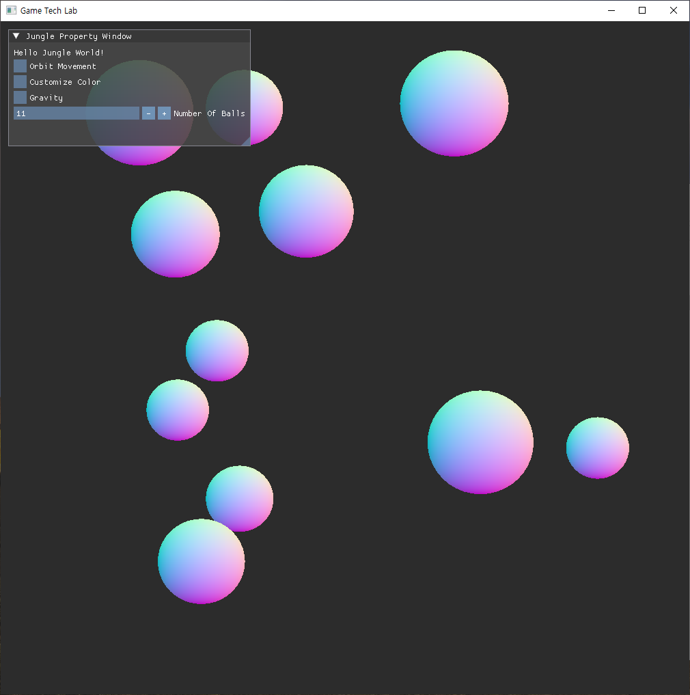
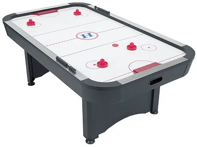

# 1주차를 돌아보며

그동안 블로그에 글을 쓰는게 없었습니다. 마지막 게시글이 1월달이었는데요.

개인 작업물이 없기도 했고, 외주만 하고 있다 보니 그렇게 좋은 게시글을 쓸 자신이 없더라구요.

마침 크래프톤 정글에서 주관하는 언리얼 엔진 개발자 양성을 위한 프로그램이 열리는 것을 보고 지원하게 되었습니다.

그리고 합격하여 지금 막 1주차 과제가 끝났습니다.

이번 게시글을 짧은 2박 3일간의 게임잼 내용입니다.

# 새로운 도전

먼저, 용인에 새롭게 크래프톤 정글 캠퍼스가 오픈하였습니다. 되게 크고 이쁘게 지어졌어요.

새 마음 새 뜻으로 교육을 시작하게 되었습니다. 따로 이런 부트캠프 프로그램이 처음이라 들뜬 기분으로 입소하였습니다.

# 훈련은 강하게

입소 후 오후부터 일정이 시작되었는데 바로 팀을 짜고 과제를 시작하였습니다.

첫 과제는 면접 과제로 제출했던 직접 만든 물리엔진을 가지고 게임을 만드는 것이었습니다.

# 재밌는 게임?

팀원들간 짧은 회의를 통해 에어 하키를 만들어보기로 결정했습니다.

각자 파트를 나누어 작업을 시작하고 그렇게 1일차를 시작하게 됩니다.

만난 지 반나절도 안되는 사람과 코드를 함께 짜는 느낌이란 톱니바퀴를 억지로 돌리고 있는 느낌?

그래도 각자 자신있는 작업을 분배하였습니다. 제가 맡은 파트는 UI 부분이었습니다.

# UI는 I'm GUI

기본적으로 UI를 많이 다루기도 했고 있으면 태가 나는 그런 부분이기 때문에 제가 먼저 지원하게 되었습니다.

DirectX에서 UI를 표현하기 위해서 여러가지가 있는데 그 중에서 DirectX2D 가 공식적으로 지원하고 DirectXTex를 통한 그래픽 처리가 있습니다. 또, 사용하기 쉽고 빠른 IMGUI가 있습니다.

저는 IMGUI를 HUD 느낌으로 화면에 렌더링하면 될 것 같았기 때문에 IMGUI를 선택했습니다.

쉽기도 했고, 다른 방식에는 버튼 이벤트 처리에 대한 코드를 작성하기가 힘들었어요.

아마 본격적인 언리얼 엔진 과제가 나오기 전에 다렉에 대한 UI는 ImGUI를 계속 쓸 것 같아요.

# 고난은 마지막에 온다

사실 저희 조는 프로젝트 구조를 중점적으로 잡고 들어가지 않았기 때문에 로직은 되도록 main.cpp 안에 처리하도록 하고 외부 클래스 작성 시 싱글톤으로 처리하였습니다.

이러한 방식이 타이니한 프로젝트에는 더 맞다고 생각하기도 했고 그런 점에서 클래스 간의 간섭은 최소화 되었어요. 코드가 중복해서 작성된 경향은 없지않았지만...

그런데 문제는 마지막에 최종 코드를 합치고 빌드하면서 발생했습니다.

릴리즈 버전으로 빌드 시 FMOD 혹은 FXC 오류가 번갈아가며 에러를 뿜어내고 있었습니다. _제출 30분전_

결국 제출은 프로젝트 솔루션을 통째로 냈습니다.

# 아쉬운 결과

발표 시간이 되고 각 조마다 자신들의 결과물을 발표하였습니다.

코치님들과 원장님이 같이 발표는 지켜보았습니다. 각 조의 발표가 끝나고 저희 차례가 되었을 때 발표용 노트북에서 빌드해서 실행하려니 저번 게시글이기도 한 그래픽도구를 설정하지 않아서 빌드오류가 발생합니다.

이에 원장님이 그냥 넘어가자, 보여준게 없어서 그냥 넘어가라고 해서 너무 아쉬웠습니다.

발표가 제대로 되었다면 만족하셨을텐데...ㅠ

이에 마무리 발언으로 원장님께서 언제나 `Due`가 중요하다 결국 결과를 보여줘야하고 약속을 지키기 위해 우리는 좀 더 보수적일 수 밖에 없다고 하셨습니다.

그래서 다음 프로젝트에서 좀 더 보수적으로 접근하고 예행 연습을 통해 빌드를 성공하겠습니다.

마지막으로 저희가 제작한 게임 영상 주소를 드리며 마무리하겠습니다. 감사합니다.

[Air Hockey 보러가기](https://youtu.be/nK3IHSWiyuA)