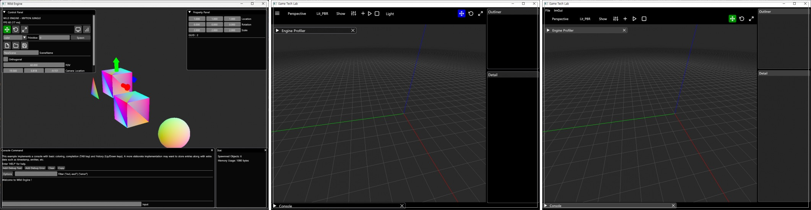
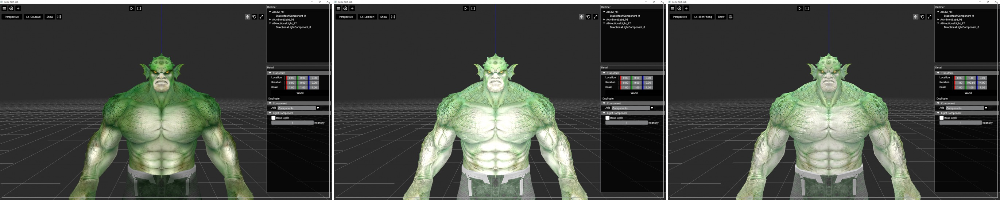
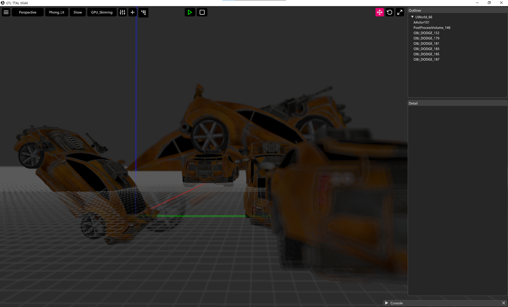
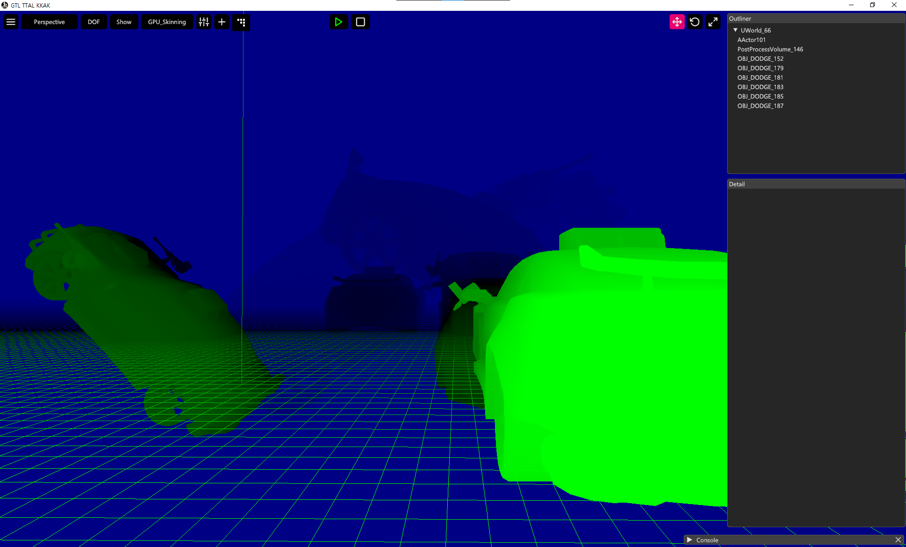

# 들어가며

이 글에서 크래프톤 정글 게임 테크랩 1기 과정에서 제작한 DirectX 엔진 구현 경험을 공유하고자 합니다.

14주간의 자체 엔진 구현 과정 중 재밌게 했고, 또 스스로 설명할 수 있을 정도의 챕터를 기술적 고민과 해결 과정을 소개해드리겠습니다.

## 1. ImGUI

모든 개발 툴의 시작은 '눈으로 보고 조작할 수 있는' 인터페이스입니다. 엔진 개발 과정에서 각종 변수를 실시간으로 확인하고 로그를 기록하기 위해 디버그 UI는 필수적입니다. 이를 위해 ImGUI 방식을 선택했습니다.

ImGUI는 모든 UI를 매 프레임 새로 그리는 개념입니다. 코드가 직관적이며 상태 관리가 필요 없어 디버깅용 UI를 빠르게 만들고 테스트하기 아주 효율적입니다.

```cpp Sample.cpp
ImGui::Text("FPS: %.1f", io.Framerate);
```

와 같이 간단한 코드를 게임 루프 로직안에 넣으면, 엔진이 매 프레임 이 텍스트를 그리기 위한 정점 데이터를 생성하고 렌더링 파이프라인에 전달합니다.



이 과정을 통해 복잡한 UI 시스템 설계 없이 팩토리 패턴 하나만으로 즉각적인 피드백을 얻는 환경을 구축할 수 있었습니다.

## 2. 조명 모델 구현

3D 공간에 놓인 물체가 입체감과 생동감을 얻으려면 `빛` 이 필요합니다. 저는 가장 기본적이면서도 핵심적인 조명 모델들을 구현하며 빛의 원리에 대해 공부했습니다.

- __고러드(Gouraud)__ : 삼각형의 각 정점 사이의 픽셀들이 받는 조명을 선형적으로 계산하는 조명 모델입니다. 버텍스 셰이더에서 계산을 하기 때문에 색상 강도는 정점에서 계산된 색상 값들을 보간해서 사용합니다.

- __퐁(Phong)__ : 현실의 빛을 주변광(Ambient), 난반사(Diffuse), 정반사(Specular) 세 가지 요소로 단순화한 모델입니다.
    - 주변광: 물체에 직접 비치지 않아도 환경에 기본적으로 존재하는 빛
    - 난반사: 빛이 물체 표면에 부딪혀 여러 방향으로 흩어지는 현상. 물체의 고유한 색상을 결정하는 가장 중요한 요소
    - 정반사: 광원과 시점의 각도에 따라 표면에 반짝이는 하이라이트를 만듬. 매끄러운 재질을 표현하는데 중요한 요소

- __빌린-퐁(Blinn-Phong)__ : 기존 퐁 모델을 개선한 버전입니다. 퐁 모델이 View Vector 와 Reflection Vector를 비교하는 것과 달리, 빌린-퐁은 Half Vector를 사용합니다. 이는 View Vector 와 Light Vector의 중간 벡터로, 연산량이 더 적고 특정 각도에서 발생하는 시각적 오류가 적어 현재도 널리 쓰이는 효율적인 모델입니다.

이 모델들을 셰이더 코드로 직접 구현하여 벡터 연산이 어떻게 픽셀의 최종 색상을 결정하고 물체의 재질감을 만들어내는지 깊이 이해할 수 있었습니다.



## 3. 그림자 구현

빛이 있다면 그림자도 있어야 합니다. 그림자는 물체와 다른 물체, 그리고 바닥면 사이의 공간적 관계를 명확히 알려주는 씬(Scene) 전체에 깊이감과 현실감을 부여합니다. 저는 섀도우 맵핑(Shadow Mapping) 기법을 기반으로 동적 그림자를 구현했습니다.

섀도우 맵핑의 원리는 생각보다 간단합니다.

1. __광원 시점에서 씬 렌더링__: 카메라가 아닌, `광원` 위치에서 씬을 바라봅니다. 이때 색상 정보는 필요 없고, 각 픽셀이 광원으로부터 얼마나 떨어져 있는지 `깊이(Depth)` 정보만 텍스처에 저장합니다. 이게 `섀도우 맵`입니다.

2. __카메라 시점에서 씬 렌더링__: 이제 원래 카메라의 시점에서 씬을 정상적으로 렌더링 합니다.

3. __그림자 판정__: 렌더링 중인 특정 픽셀의 월드 공간 위치를 광원의 시점으로 변환한 뒤, 만들어 둔 섀도우 맵의 깊이 값과 비교합니다. 만약 현재 픽셀의 깊이 값이 섀도우 맵에 기록된 값보다 크다면, 그 픽셀은 다른 물체에 가려져 있으므로 '그림자' 상태인 것입니다.

하지만 기본적인 섀도우 맵핑은 계단 현상(Aliasing)이 심해 그림자 경계가 톱니처럼 보입니다. 이를 해결하기 위해 PCF(Percentage-Closer Filtering) 기술을 사용했습니다. PCF는 그림자 경계를 판정할 때 섀도우 맵의 한 지점만 샘플링하는 대신, 주변 여러 지점을 함께 샘플링하여 그 결과의 평균을 냅니다. 이 과정을 통해 훨씬 부드럽고 자연스러운 그림자 경계를 만들 수 있습니다.

<iframe width="560" height="315" src="https://www.youtube.com/embed/HNcMc5W2kpI?si=iPSDGUMlTBUPJAfR" title="YouTube video player" frameborder="0" allow="accelerometer; autoplay; clipboard-write; encrypted-media; gyroscope; picture-in-picture; web-share" referrerpolicy="strict-origin-when-cross-origin" allowfullscreen></iframe>

## 4. Depth of Field

마지막으로, 실제 카메라 렌즈의 효과를 횽내 내 그래픽의 심미성을 높이는 피사계 심도(Depth of Field) 효과를 구현했습니다. DoF는 초점이 맞은 영역은 선명하게, 초점 앞뒤의 영역은 흐릿하게 만드는 후처리 기술입니다.



구현 과정은 다음과 같습니다.

1. 먼저 씬 전체를 선명하게 렌더링하고, 그 결과물(색상 버퍼)와 함께 각 픽셀의 깊이 정보를 저장합니다.
2. 후처리 단계에서, 화면의 각 픽셀을 순회하며 깊이 버퍼 값을 읽습니다.
3. 미리 설정된 '초점 거리'와 픽셀의 깊이 값을 비교하여, 그 차이가 클수록 '흐림 강도'를 강하게 적용합니다.
4. 이 흐림 강도에 따라 주변 픽셀들의 색상을 섞어 최종적으로 흐릿한 이미지를 만들어냅니다.

이 효과를 통해 사용자의 시선을 특정 오브젝트로 자연스럽게 유도하거나, 게임 세계에 더 몰입하게 만드는 영화 같은 연출을 구현할 수 있었습니다.



---

# 마무리
수 많은 학습에서 제가 가장 재밌게 했던 4가지를 소개해드렸습니다. 