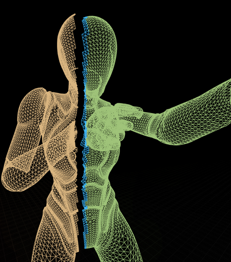
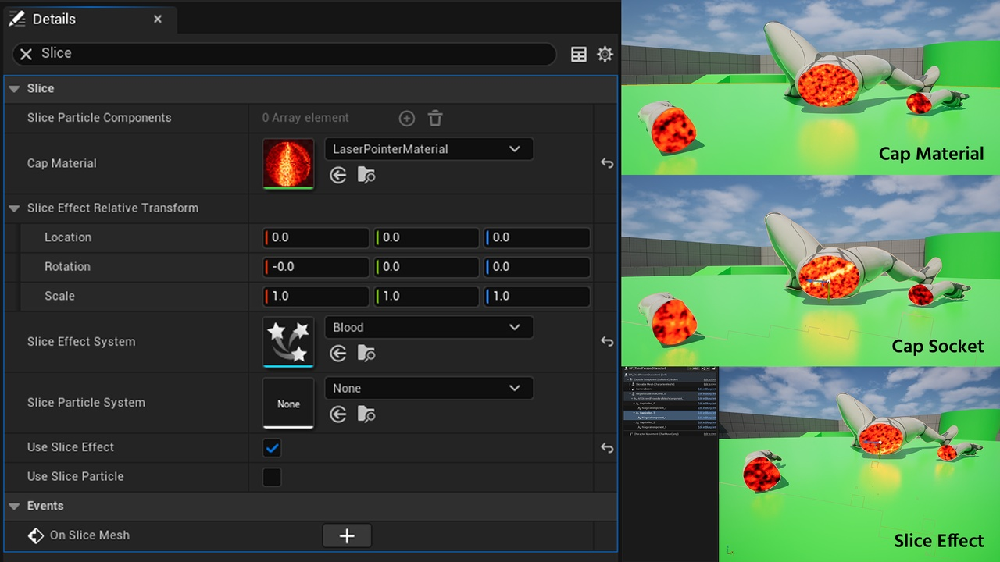
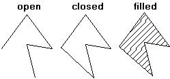
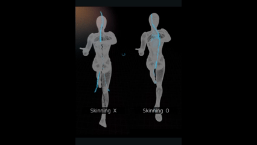
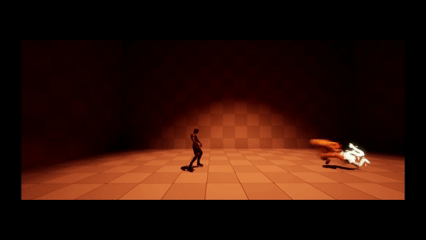

# 들어가며

게임에서 캐릭터를 멋지게 베어 버리는 장면, 한 번쯤 구현해보고 싶지 않으셨나요?

크래프톤 정글 게임 테크랩 과정 중, 팀원들과 함께 바로 그 문제를 정면으로 다뤄봤습니다. 목표는 단순했습니다. **언리얼 엔진에서 런타임에 SkeletalMesh를 절단하고, 결과물을 Fab에 플러그인으로 출시하는 것.** 그런데 막상 시작하니 생각보다 훨씬 복잡한 문제들이 기다리고 있었습니다.

StaticMesh 절단은 기존 레퍼런스가 있지만, SkeletalMesh는 다릅니다. 본(Bone)의 움직임에 따라 버텍스 위치가 매 프레임 바뀌는 '스키닝(Skinning)' 과정이 있기 때문에, 절단면 계산부터 새 메시 생성, 단면 처리까지 모든 과정이 한 단계씩 더 복잡해집니다. 그리고 이 모든 걸 **프레임 드랍 없이** 처리해야 합니다.

이 글에서는 저희가 만든 **Slice SkeletalMesh(SliceMesh)** 플러그인의 핵심 구조 여섯 가지를 코드와 함께 소개합니다.

---

## 1. 버텍스 선별 — 병렬로 빠르게

절단의 첫 단계는 어떤 버텍스가 절단 평면의 위쪽에 있고 아래쪽에 있는지 분류하는 것입니다. 캐릭터 메시는 수만 개의 버텍스를 가질 수 있는데, 이걸 순차적으로 처리하면 게임 스레드가 막혀 프레임이 튀게 됩니다.

해결책은 `ParallelFor`를 활용한 병렬 처리입니다.

```cpp
// APSliceableSkeletalMeshComponent.cpp
void UAPSliceableSkeletalMeshComponent::SplitVerticesByPlane(...) const
{
    // 현재 프레임의 스키닝된 버텍스 위치를 가져옴
    // GetCPUSkinnedVertices()는 애니메이션이 적용된 월드 위치를 반환
    TArray<float> Distances;
    Distances.SetNumUninitialized(NumVertices);

    // 각 버텍스와 절단 평면 사이의 거리를 병렬로 계산
    ParallelFor(NumVertices, [&](int32 VertexIndex)
    {
        Distances[VertexIndex] = LocalSlicePlane.PlaneDot(
            FVector(SkinnedVertices[VertexIndex].Position)
        );
    });

    // 삼각형 단위로 절단면 교차 여부를 병렬 판단
    ParallelFor(NumTriangles, [&](int32 TriIndex)
    {
        float DMin = /* 세 버텍스 거리 중 최솟값 */;
        float DMax = /* 세 버텍스 거리 중 최댓값 */;

        // 평면에 걸쳐 있는 삼각형만 IntersectingSet에 추가
        if (DMin < 0.0f && DMax > 0.0f)
        {
            FScopeLock Lock(&IntersectingSetLock);
            OutIntersectingVertexIndices.Add(I0);
            OutIntersectingVertexIndices.Add(I1);
            OutIntersectingVertexIndices.Add(I2);
        }
    });
}
```

`FScopeLock`으로 공유 컨테이너 접근을 보호하면서, 나머지 거리 계산은 완전히 병렬화했습니다. 이 덕분에 버텍스 선별 과정에서의 프레임 드랍을 효과적으로 방지할 수 있었습니다.



---

## 2. 런타임 비동기 Skeletal Mesh 생성

버텍스 선별이 끝나면, 분리된 두 그룹 각각을 새로운 `USkeletalMesh` 에셋으로 재구성해야 합니다. 문제는 이 과정이 굉장히 무겁다는 점입니다. 게임 스레드에서 동기적으로 실행하면 눈에 띄는 멈춤(hitch)이 발생합니다.

저희는 `FAutoDeleteAsyncTask`를 사용해 메시 빌드 전체를 워커 스레드로 넘겼습니다.

```cpp
// APSkeletalMeshBuilder.cpp
void APSkeletalMeshBuilder::BuildSkeletalMeshAsync(
    TFunction<void(bool bSuccess)> OnCompleteCallback)
{
    // 메시 생성에 필요한 데이터를 미리 준비 (게임 스레드에서)
    // ...

    // 실제 빌드 작업은 백그라운드 워커 스레드에서 비동기 처리
    (new FAutoDeleteAsyncTask<FAPSkeletalMeshBuilderTask>(
        SrcMesh,
        VertexIDs,
        MoveTemp(RawResult),
        MoveTemp(RawLODData),
        // 완료 시 게임 스레드로 콜백을 전달
        [this](...) { this->OnBuildFinished(...); }
    ))->StartBackgroundTask();
}
```

데이터 준비는 게임 스레드에서, 무거운 메시 빌드는 워커 스레드에서, 결과 반영은 다시 게임 스레드 콜백으로 — 이 구조 덕분에 게임 반응성을 유지하면서도 복잡한 작업을 처리할 수 있었습니다.

---

## 3. 절단면 캡(Cap) 생성 및 UV 계산

절단 직후 메시 내부는 텅 빈 공간입니다. 이 단면을 채우는 '캡' 생성은 기존 언리얼의 `SliceProceduralMesh` 로직을 기반으로 하되, 몇 가지를 추가했습니다.

핵심 흐름은 다음과 같습니다.

1. `ProjectEdges` — 3D 경계선을 2D 절단 평면으로 투영
2. `Build2DPolysFromEdges` — 투영된 엣지로 닫힌 폴리곤 구성 (끊긴 경계가 있으면 캡 생성 실패)
3. `GeneratePlanarTilingPolyUVs` — 폴리곤 표면에 타일링 UV 자동 계산
4. `Transform2DPolygonTo3D` + `TriangulatePoly` — 2D → 3D 변환 후 삼각분할하여 렌더링 가능한 메시 섹션으로 완성





---

## 4. SkinWeight 데이터 동기화

캡 메시는 기본적으로 StaticMesh 구조입니다. 원본 스켈레탈 메시의 애니메이션을 따라 움직이려면 SkinWeight 정보를 직접 채워줘야 합니다.

`SynchronizeSectionRenderData` 함수가 세 가지 케이스를 처리합니다.

```cpp
// APSkinnedDynamicMeshHelpers.cpp
void UAPSkinnedDynamicMeshHelpers::SynchronizeSectionRenderData(...)
{
    // --- 몸통 버텍스 SkinWeight 동기화 ---
    for (int32 Index = StartIndex; Index < MappingData.Num(); Index++)
    {
        if (SourceIndices.Num() == 1)
        {
            // 케이스 1: 원본 버텍스가 그대로 유지된 경우 → 스킨 웨이트 직접 복사
            NewSkinWeight = SourceRenderData.SkinWeights[SourceIndices[0]];
        }
        else
        {
            // 케이스 2: 경계선에서 새로 생성된 버텍스 → 가중치가 더 높은 원본 버텍스의 값을 상속
            if (Weight0 >= Weight1)
                NewSkinWeight = SourceRenderData.SkinWeights[SrcIndex0];
            else
                NewSkinWeight = SourceRenderData.SkinWeights[SrcIndex1];
        }
    }

    // --- 캡 버텍스 SkinWeight 동기화 ---
    for (const FProcMeshVertex& CapVertex : CapMeshSection->ProcVertexBuffer)
    {
        // 케이스 3: 캡에 속한 버텍스 → 가장 가까운 몸통 버텍스의 스킨 웨이트를 복사
    }
}
```

정확한 보간 대신 '가장 영향력 있는 버텍스의 값을 그대로 물려받는' 근사(Approximation) 방식을 채택했습니다. 게임 플레이 중 육안으로 구분하기 어려운 수준이면서, 계산 비용을 크게 줄일 수 있었습니다.

---

## 5. CPU 스키닝으로 캡 애니메이션

SkinWeight를 채웠다고 끝이 아닙니다. 프로시저럴 메시는 GPU 파이프라인을 타지 않기 때문에, 매 프레임 CPU에서 직접 스키닝을 계산해 버텍스 위치를 업데이트해야 합니다.

```cpp
// APSkinnedProceduralMeshComponent.cpp
void UAPSkinnedProceduralMeshComponent::UpdateCPUSkinnedMesh()
{
    // 부모 스켈레탈 메시의 현재 본 트랜스폼 행렬을 가져옴
    // ...

    ParallelFor(Count, [&](int32 i)
    {
        FVector SkinnedPos = FVector::ZeroVector;

        // 각 버텍스의 인플루언스(최대 4개 본)를 순회하며 최종 위치 계산
        for (int32 InfluenceIdx = 0; InfluenceIdx < MaxInfluences; ++InfluenceIdx)
        {
            float NormalizedWeight = /* 정규화된 본 가중치 */;
            SkinnedPos += FinalTransform.TransformPosition(LocalPos) * NormalizedWeight;
        }

        // 월드 스페이스 → 컴포넌트 스페이스로 변환 후 최종 위치, 노멀, 탄젠트 갱신
        Vertices[i] = GetComponentTransform().InverseTransformPosition(SkinnedPos);
    });

    UpdateMeshSection(...);
}
```



_*하늘색으로 표시되는 것이 버텍스입니다._

---

## 6. 절단면 소켓(Socket) 생성 및 동적 업데이트

> 이 부분은 팀원이 구현하고 코드 리뷰 중 공유해 준 내용을 정리했습니다.

기존 `SliceProceduralMesh`에는 절단면을 활용할 수 있는 이펙트 훅이 없었습니다. 저희는 각 캡 폴리곤의 **무게 중심(Centroid)** 위치에 동적으로 소켓을 생성하는 기능을 추가했습니다.

```cpp
// APSkinnedProceduralMeshComponent.cpp

// 절단 직후 한 번 호출 — 소켓 초기 생성
void UAPSkinnedProceduralMeshComponent::CreateAndAttachCapSockets(...)
{
    for (const FCapPolygonVertexMapping& Mapping : PolygonMappings)
    {
        // 폴리곤 무게 중심 계산
        FVector Centroid = FVector::ZeroVector;
        for (/* 폴리곤 내 모든 버텍스 */) { Centroid += VertexPos; }
        Centroid /= Mapping.NumVertices;

        // 무게 중심 위치에 USceneComponent 소켓 생성 및 부착
        USceneComponent* OutSocket = NewObject<USceneComponent>(this, SocketName);
        OutSocket->SetRelativeLocation(Centroid);
        CapSocketMap.Add(Mapping, OutSocket);
    }
}

// 매 프레임 호출 — CPU 스키닝으로 캡이 변형되면 소켓 위치도 갱신
void UAPSkinnedProceduralMeshComponent::UpdateCapSocket()
{
    // 변형된 폴리곤의 새로운 무게 중심을 계산하여 소켓 위치 업데이트
}
```

이 소켓에 파티클 시스템을 붙이면 절단 부위에서 피가 뿜어져 나오거나 전기 스파크가 튀는 효과를 손쉽게 구현할 수 있습니다.



---

# 마무리

| 단계 | 기술 | 목적 |
|---|---|---|
| 버텍스 선별 | ParallelFor 병렬 처리 | 프레임 드랍 방지 |
| 메시 재구성 | 비동기 워커 스레드 | 게임 스레드 블로킹 방지 |
| 절단면 생성 | 2D 폴리곤 + UV 계산 | 자연스러운 단면 표현 |
| 스킨 동기화 | FVertexMappingInfo 기반 근사 | 애니메이션 연속성 유지 |
| 캡 애니메이션 | CPU 스키닝 (매 틱) | 단면이 몸체와 함께 움직임 |
| 이펙트 연동 | 동적 소켓 생성 | 파티클 등 부착 지원 |

단순히 메시를 자르는 것을 넘어, 절단 이후의 데이터 무결성과 활용성까지 고려한 시스템입니다. 완성된 플러그인은 상단의 **See Demo** 버튼을 통해 확인하실 수 있습니다.